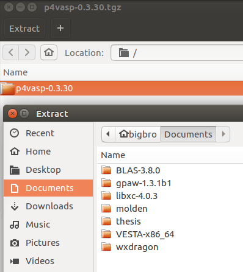
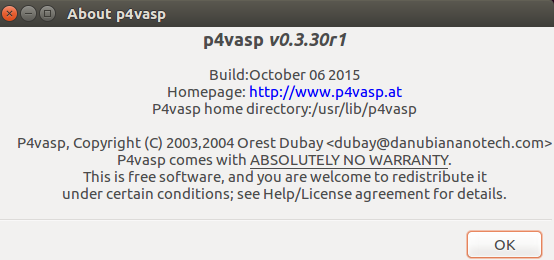

使用vasp计算，后处理的小程序、小脚本有很多。其中最为出名的非p4vasp莫属了。从搭建模型，调整结构，DOS、能带计算，功函数等等，都可以使用它来完成。举个例子，本人博士四年，一直用它来查看和处理结果，再结合一些其他辅助的小程序和脚本，可以说是极大地提高了自己的工作效率。今天因写脚本需要，浏览了一下p4vasp官网，发现官网对p4vasp的安装解释非常简单。于是便测试了一下。本节主要包含3部分:

* 第一部分：p4vasp官方的安装流程，相信大家按照这一步都可以完成安装；
*  第二部分：本人亲自安装的具体流程；
*  第三部分：傻瓜化安装流程。


### 第一部分

p4vasp官网： http://www.p4vasp.at/。点击下方的链接，根据操作进行： 

http://www.p4vasp.at/#/doc/getstarted


### 第二部分：动手安装流程：

这一部分内容，是根据前面的官方介绍，亲自操刀实践的部分。

1） 首先说明下，本人的操作系统是：Ubuntu 16.04.3 LTS


2) 下载p4vasp：

目前，对Linux系统来说，最新的貌似只有source版本的了，binary的已经成为了历史。

对Windows用户来说，更可怜，p4vasp都没有更新，版本还是老样子，Windows的获取方法：

* 通过这个链接下载：https://pan.baidu.com/s/1eT3MGvC 密码：g9fn 。
* 也可以在QQ群文件中下载： 217821116 

Linux用户则可以通过p4vasp官网下载：


3) 解压：




这里将p4vasp软件包解压到Documents目录下，当然，也可以使用官网介绍的解压命令进行。


4) 进入解压的目录，然后按照官网说的，Ubuntu用户，使用 `install-ubuntu-dependencies.sh` 这个脚本安装一些一些必须的dependencies. 如下图：运行命令后，会提示你是不是下载，输入`Y` 或者 `y` ，然后回车。屏幕此时开始疯狂地颤抖，说明正在下载安装。


注意： 

* 解压到什么地方不用要，可以放到桌面上，也可以直接解压在Download里面，本人习惯解压到Documents这个文件下。

* 这里大师兄先进入的 install 这个目录， 然后运行的脚本。安装完记得再返回去。


5) 安装完成后，返回上一级目录，然后正式安装p4vasp。


等待屏幕颤抖完毕。


看到这里，基本上99.99% 成功安装了。

6) 测试一下： 终端直接输入： `p4v` ，效果如下：


打开p4vap了，说明安装成功。


7）检查下版本：（点击右上角的help）




最新版的p4vasp已经顺利安装成功。欢呼吧，少年！！


### 傻瓜化安装


在进行第二部分操作的前4年，本人一直用的这个办法：


1） 终端一个命令搞定：

```
 sudo apt-get install p4vasp
```

效果如下：


输入Y，等待屏幕颤抖结束


2） 运行p4vasp：


3） 检查下版本：该版本为v0.3.29r1，比官网的最新版稍微旧一点。但不影响使用。


### 小结

对于Ubuntu用户：

* 建议大家使用官网介绍的办法。安装最新版的p4vasp。
* 如果遇到自己解决不了的问题，可以使用 sudo apt-get install p4vasp 这个命令一键搞定。
* 其他linux系统的用户，本人没有尝试过。

Windows用户，目前只能使用本文中链接下载旧版本的了。

Mac 用户：浏览p4vasp的github网站，根据Readme文件自己尝试着安装吧。

https://github.com/orest-d/p4vasp
