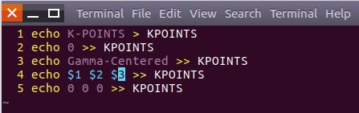
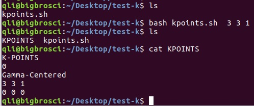
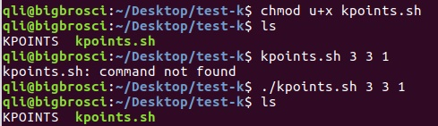
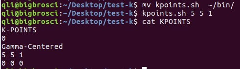
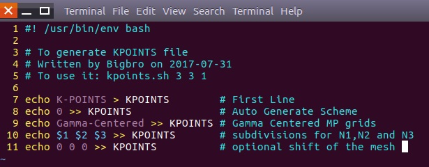

前面学习了cd的一些用法，本节我们简单介绍下如何写自动生成KPOINTS文件的脚本。提到脚本，对于做计算的我们并不陌生，提交命令，分析数据，处理结果都会用到，脚本的存在使得一些繁重的工作极大地得到简化，节约了我们的时间和精力。但脚本怎么写出来的？怎么写脚本？很多人就望而却步了。


**1** **什么是脚本？** 

对于脚本的解释，大家可以浏览一下网上的解释，这里大师兄主要说一下自己的理解：

1）  脚本是一个文本文件；我们可以用文本编辑器打开，查看，和修改。知道了这一点，当你从某处获得一个脚本时，就可以阅读里面的内容了，进而知道该脚本是怎么运行的，有哪些地方值得注意，为了实现另一个结果我们需要修改什么参数等；

2）  脚本中的内容为程序语言；脚本中我们需要把我们期望的工作分解并转化为程序语言；所以你的选择有很多，bash， perl， python， java….， C++ 等等；

4）  脚本可以执行；通过执行脚本，实现我们的目的，这里主要是给大家强调一下，在今后的学习中，仔细观察脚本的执行流程！

**2 生成KPOINTS的脚本**

这里说的KPOINTS文件指的是自动生成网格的KPOINTS文件，能带计算由于比较特殊，最好手动输入。编辑器用的是vim，还可以使用 notepad++或者其他文本编辑器进行练习。

2.1  `kpoints.sh`版本1 

A）终端里面输入： `vi kpoints.sh`

B）在vi 界面里面输入下面几行内容：



输入完毕后保存 。

C）脚本讲解：图中的除了第4行，所有命令都可以复制到 Terminal里面自己运行，然后查看结果。

C.1）前面我们学习了如何手动制作KPOINTS文件， 并知道KPOINTS文件每一行所代表的内容。因此该脚本就是帮助我们自动生成每一行的内容。忘记的同学请复习Ex01的内容。 

C.2）第一行： `echo  K-POINTS  >  KPOINTS` （注意空格）

`echo` 在bash语言中，代表输出打印的意思，`>` 代表把前面的内容保存到后面的`KPOINTS`文件中； 如果目录下不存在`KPOINTS`文件，那么会自动创建；

如果存在，`KPOINTS`文件之前的内容会被 当前命令中 `>` 前面的内容替换。也就是`KPOINTS`文件以前的内容被清理掉，并换成了最新的内容。

因此，运行这一行命令，我们会创建一个`KPOINTS`文件，里面只有一行文字： `K-POINTS`

我们知道第一行的内容为说明，对计算不会产生影响，你也可以把 K-POINTS换成男朋友或者女朋友的名字….

C.3）第二行：

继续使用`echo`命令，将数字 `0` 保存到`KPOINTS`文件中。

这里 `>>` 两个箭头代表：将 `>>` 前面的内容保存到`KPOINTS`文件的最后一行。因此， 使用 `>>` 不会将`KPOINTS`之前的内容替换掉。如果目录下没有`KPOINTS`文件，使用`>>`也会和`>`一样，创建一个。

这里的 `0` 代表自动生成网格：automatic generation scheme 

C.4) 第三行：将 Gamma-centered 输出到`KPOINTS`的第三行里面，你需要知道G代表的是什么意思。如果你想用Monkhorst-Pack Grids，echo后面怎么写你要知道。建议一直用Gamma-centered。

C.5) 第4行：将`$1 $2 $3`输出到`KPOINTS`的第四行里面。

在这里，`$1 $2 $3`称为：arguments

代表的是我们运行脚本命令的时候，加入的三个方向上KPOINTS的数目。通过`$1 $2 $3`传递给 echo 命令。

如果不理解的话，跳过，等运行命令的时候就明白了。

C.6）第5行：Kpoints网格在三个方向的移动。一般来说0 0 0 即可。

**2.2 脚本运行：** 

A)     调用bash运行脚本：



图中我们运行脚本的时候命令为：
```
bash kpoints.sh 3 3 1
```
bash 意思是我们调用bash来执行该脚本；

kpoints.sh 为脚本的名称, 当然啦，名字可以任意换， .sh也可以不用加；

3 3 1 为脚本后面的参数，第一个3 对应脚本里面的`$1`, 第二个3 为`$2`,  1 为脚本里面的`$3`

B）赋予脚本可执行权限： 



赋予权限：`chmod  u+x  kpoint.sh`

取消权限：`chmod u-x kpoint.sh`

你会发现之前白色的脚本变成绿色的了，这说明本脚本可以执行了。不同电脑可能显示的颜色不容，有些甚至都不显示，大家不要纠结。但图中直接输入`kpoints.sh  3 3 1` 的时候失败了，我们必须用`./ kpoints.sh 3 3 1` 来执行。原因是系统不知道我们把脚本放在这里了。


怎么样才可以直接使用这个命令呢？ 将脚本转移到`~/bin` 文件夹中即可，如果你的系统中没有`~/bin` 这个文件夹，`mkdir ~/bin` 创建一下就完事。



OK，现在大功告成。我们可以根据之前的经验规则设置`KPOINTS`文件了。 


**2.3 脚本升级： 版本2** 

前面的脚本实现了我们所期望的功能，这里我们所说的升级，无非就是在前面的基础上再增添点东西，使得脚本看起来更加高大上，具有可读性或者更加智能化。这里我们主要介绍一下使用# 注释自己的脚本，使其可以被广大吃瓜群众所理解和接受。 



a）加入第一行，`#!`称为shebang （就是拼音，没错！）表示执行该脚本时会调用后面的程序；自行百度shebang的用途；

b）   3-5行中用 `#` 注释下，简单介绍本脚本的功能， 作者，使用方法；

c）   7-11 行用 `#` 注释下每一行命令中的作用。

d）由于每个人写脚本的方式和风格不同，脚本的注释对于方便大家理解非常有用。有时候即使自己写的脚本，一年半载之后也会忘记里面的内容，加上注释，会让我们快速掌握脚本里面的内容，在后期的维护或者升级中也发挥着重大的作用。

**2.4 其他升级：**

除了注释外，可以将脚本写的更加智能化，通过调控 `$1 $2 $3` 等脚本后面的参数, 加入一些`if`语句等，来实现`KPOINTS`文件中所有行均可以通过命令进行修改。比如：`kpoints.sh G 3 3 1` 和 `kpoints.sh M 3 3 1` 分别生成Gamma centered 和正常的MP 网格。

Linux下面还可以使用其他的方式来生成脚本，总之选择的方法很多。

**3  扩展练习：** 

3.1）重复本节所有操作，写人生中的第一个脚本；

3.2）网上搜索bash资料，认真练习。

3.3）`bash`在linux下处理日常工作非常有用，但数据分析的时候能力就有所欠缺了，建议大家学习`python`。Python有2.X和3.X的版本，2.X开始逐渐被抛弃，建议大家直接学习3.X的。


**4** **总结：**

看完本节，你会初步了解脚本是怎么写出来的，它是怎么执行的以及对战胜了对写脚本的恐慌心理。当你获得一个脚本的时候，尝试着打开它，将其中的语言分解成若干命令执行，查看该脚本的工作流程。勤学苦练，就可以流利地写属于自己的脚本了。在这方面多花一分钟，以后节省的就不是一分钟的事情了，当然也有可能会多花几分钟。但多学习点东西总归是好的。
