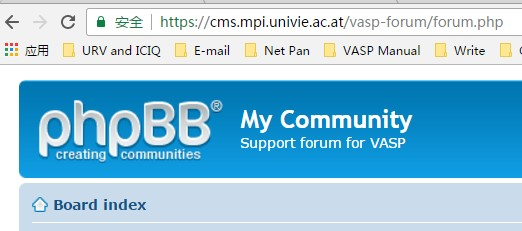
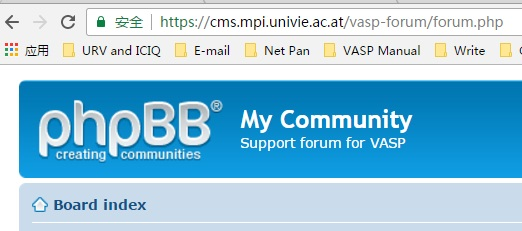

搞科研，总会遇到各种各样的问题需要解决，同样VASP计算也不例外，本文大师兄列举了一些解决问题的步骤和方法，只提供大体的方向，没有具体事例，大家结合自己的计算研究亲自去实践体会，写本文的目的是告诉大家：自己亲自解决问题才是你快速成长的加速器。 

###  第1阶段：

 靠自己（最重要的！） 

1.1 凭自己的经验解决；

1.2 按照VASP的输出错误，进行修改解决；

1.3 查找VASP官网的相关参数；

1.4 平时多阅读VASP手册；

1.5 不懂的参数不要往INCAR里面放。

### 第2阶段： 

**主动搜索（也是靠自己）** 

2.1 将错误信息复制到百度里面搜索，一般会得到一堆论坛或者博客的相关指导说明，按照里面的内容修改自己的输入文件，然后解决问题。

2.2  将错误信息复制到Google里面搜索，一般会得到VASP官网的论坛一节其他国外网址的相关错误示例，这时候，就要耐着性子把其中的内容读完，然后修改输入文件进行解决；一般来说，进行到这一步，至少60% 左右的问题可以解决!!! 

### 第3阶段：

**靠师兄师姐，师弟师妹，老板**

如果时间过去2天，还没有解决。可以将自己的错误信息以及尝试的方法总结。

分享给组里的师兄弟，师姐妹们，寻求求助办法。如果还未解决，就要报告给自己的老师，求助指导！！！此时，解决的成功率应该能达到70-100% 

**大师兄的建议**：自己主动去解决是关键，这需要培养主动解决问题的能力。老板是辅助的策略，除了指导课题的方向，在学生遇到问题时能出马解决，这也是他或者她为什么是老板的原因之一。

 ###  

### 第4阶段（I） 

**论坛求助**

如果老板不给力（很多做实验的老板要求学生去做计算，大师兄本人极度鄙视这样的老板，完全就是对学生的不负责任！），可以去尝试论坛求助：这里大师兄推荐：

将问题复制到百度里面，你就会发现这个问题会在很多论坛里面出现。不过论坛求助有一点需要注意：发帖的人水平参差不齐，要抱着怀疑的态度去接受所有人的答复（**记住，是所有人！！！**），别人的回复只能当作参考。

**第4阶段（II）QQ群求助：**

这里大师兄列举了三个管理员认真负责的QQ群：

​                                                                               **遇见大师兄**

​                                                                             **第一性原理之家**

​                                                                                         **物理化学材料互助群**

进行到这一步，基本上95%的问题可以解决了。 

**第5阶段：VASP官方论坛发帖**

以上都解决不了的话（极少的情况了），可以去VASP官网发帖求助，等待VASP的其他用户或者管理员解决。不过需要注册！

 

### 第 6 阶段  

**QQ群求助：**

**6.1 尊重别人的时间**

A）QQ群求助的时候，提供的信息要全面：

1）  算的什么体系

2） 算的什么内容

3）INCAR长什么样子

4）错误信息

5）KPOINTS以及POSCAR 很多人把图片一截，或者拿手机拍张照片就直接在群里求助了，这是对大家时间的极度不尊重。而且被应助的概率很低！！！你不尊重大家的时间，大家也不会浪费时间在你身上。 

B）可以将计算结果压缩，上传到QQ群文件进行求助（但不要把CHG，CHGCAR和WAVECAR等压缩到里面，因为它们太大，大家都懒得去下载！如果你上传了一个100M的求助文件，基本没人帮你！）

C）不要多群求助 有很多人加了很多群，把遇到的问题在所有的群里面都发了一遍！这样的行为简直就是在浪费大家的宝贵时间，本人见到这种情况，一般都不会去帮助。

**6.2** **把你得小心眼收起来！！！** 

A) 除了涉密的一些计算，其他情况没有必要给大家隐瞒什么，大家也不会坏到去抢你的课题去算！心胸狭隘的人也不配得到帮助！

B) 要虚心接受别人的批评，也就是心眼要大。大师兄也遇到很多奇葩，在群里求助，没人回答，就直接退群了。被别人批评了几句，也退群了。只能说这些没心胸的人也不值得去帮助。

**6.3** **互相帮助**

别人遇到的问题，如果你知道怎么解决，不要有所隐瞒。请认真帮助解决，用俺奶奶经常挂在嘴边的那句话：将心比心。这样大家的计算水平才可以得以普遍地提高。 请认真按照这个流程来解决问题，不要一出现问题，脑子不假思索就去论坛或者QQ群求助!!! 请记住，你的问题也代表了你的老板的水平。一般来说，不负责任的老板带出来的学生总会有各种各样的低级问题。 以上仅代表本人观点，不喜勿喷！祝大家踏踏实实做计算，多发实实在在的文章！

最后，新手的话，请认真学习Learn Vasp The Hard Way 这本书(www.bigbrosci.com) 按照大师兄写的内容，从头认真学习VASP（本书只作为参考，关键是去浏览官网！！！）；如果在学习中遇到问题，也可以把问题准备好，发送邮件给大师兄解决：lqcata@gmaill.com 最好不要直接QQ找我（拜托！）
