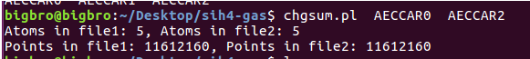
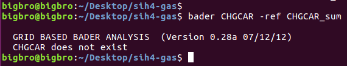
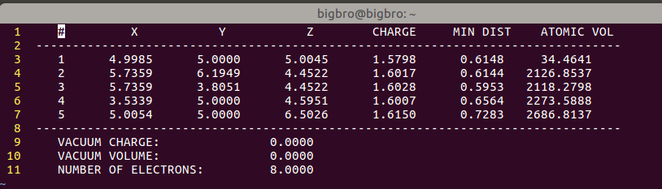
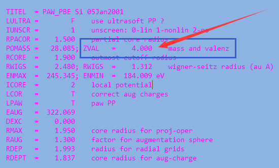
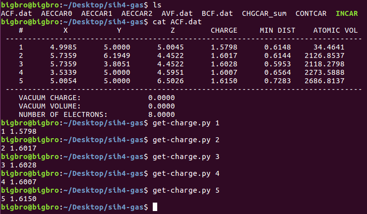
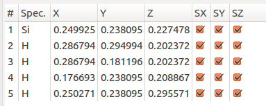

最近，群里有人在问Bader电荷分析的问题，在这里，将Bader分析的基本流程，以及本人写的一个后处理的脚本分享一下，希望大家不要再纠缠这个问题了。大家务必认真浏览参考网址的内容。http://theory.cm.utexas.edu/henkelman/code/bader/ 


# 计算流程

## 优化自己的体系结构:

使用VASP计算，获得稳定的结构，过程略过。

## Bader电荷分析的计算部分: 

1) 将前面优化完的`CONTCAR` 重命名为`POSCAR`

2) 设置INCAR:

```
  LAECHG=.TRUE. 
  LCHARG = .TRUE.
  NSW = 0
  IBRION = -1 ## 前面有了NSW = 0， 这个也可以不设置 
```

3) `KPOINTS`可以用之前优化计算的，也可设置的稍微大些。

4) `WAVECAR`，`CHGCAR`等有的话就读一下(在第二步加上读它们的相关参数)。没有的话就不读了，这个无关紧要，不要纠结。**但是**，如果你的体系很难收敛的时候，建议保留上一步的WAVECAR以便节省计算时间，如果没有的话电子步数适当增加(NELM=200) 。 

## 获取VTST的脚本

1)下载网址:

*  http://theory.cm.utexas.edu/vasp/scripts.html  (用到里面的chgsum.pl这个脚本)

* http://theory.cm.utexas.edu/henkelman/code/bader/  (下载bader处理的脚本)

2)将前面下载的内容解压，然后复制到`~/bin` 文件夹中。

3)如果后面运行的时候遇到权限问题:执行:

`chmod u+x  ~/bin/chgsum.pl`

`chmod u+x  ~/bin/bader`


## 使用VTST的脚本处理结果

1) 进入计算的目录下面

2) `chgsum.pl AECCAR0 AECCAR2`

注意: `AECCAR0`和`AECCAR2` 是由`LAECHG=.TRUE.`这个参数控制输出的。如果你计算没有得到这两个文件，仔细检查一下这个参数。

运行这个命令:你会得到类似这样的输出结果:



结束后，你会得到 `CHGCAR_sum` 这个文件。

3) `bader CHGCAR -ref CHGCAR_sum`




注意:

i) 图中大师兄不小心把`CHGCAR`删掉了…所以没办法呈现完整的流程。放图上去只是想告诉大家，命令是正确的。ii) 如果你在服务器上运行，得到了这样的错误。

```
FATAL:kernel too old
Segmentationfault
```

那么，你需要将计算复制到本地电脑上(由于`CHGCAR`等文件很大，该过程比较蛋疼，需要忍一会儿)，然后用自己的电脑运行这个命令。(前提是电脑有`Linux`系统，没有的话，我也没办法。)

iii) 命令结束后，你会得到一些相应输出的文件：ACF.dat， BCF.dat， AVF.dat…

iv) 本人一般查看的是`ACF.dat`文件：（以SiH$_4$为例）

如下图:



ACF.dat文件中，第一列的数字对应的是POSCAR中的原子顺序。

每个原子的电荷对应的是`CHARGE`那一列。注意，该列中的电荷是该原子价层电子中的电子总数。如果你想要知道这个原子是带正电或者负电荷，需要减去`POTCAR`中的电子数目。



图中Si为第一个原子:有1.58个电子 ，减去POTCAR中的4，为 -2.42。

这表明Si失去了电子。2.42个电子分别转移到了4个H上面。

每个H有$$1+2.42/4 = 1.6$$ 个电子。(对比下4个H中的电子)


## 得到任意原子的电荷信息

如果你对自己体系中的某一个或者某些特定的原子感兴趣，又不想每次打开`ACF.dat`文件或者已经导出来的excel文件。那么可以通过使用下面这个脚本提取相关的电荷信息。

1) 脚本运行命令如下图：`get-charge.py  Natom` Natom 是你感兴趣的原子序数




注意:

A) 目前只支持一个，如果想查看多个，可以运行该命令若干次，或者使用一个for 循环即可: 

```
for i in 1 2 3 4 5 ; do get-charge.py $i ; done 
```

B) 使用该命令前，请务必确认自己所关注的原子在POSCAR中的序数，如果不知道，可以通过p4vasp查看。



2) 脚本内容如下:

```python
#!/usr/bin/env python
import sys
 
script, Natom = sys.argv
 
# Natom is the atom number when run ths script 
# Convert Natom into integer 
 
Natom = int(Natom)
 
# Creat an empty list 
charge_list = []
 
# read ACF.dat file and add all lines with charges into the charge_list 
# These lines are started with atom numbers: line.rstrip().split()[0]
# line.rstrip() : '    19     -1.2426      6.3529      5.9723      9.9947      1.0601     10.4547'
# line.rstrip().split(): '19', '-1.2426', '6.3529', '5.9723', '9.9947', '1.0601', '10.4547'
 
with open ('ACF.dat', 'r') as infile:
    lines = infile.readlines()
    for line in lines:
        if line.rstrip().split()[0].isdigit(): # == True: # escape the first 2 and last 4 lines  
            charge_list.append(line.rstrip())    
 
# Print the charge information of Natom
for i in  charge_list:
# i.split() is used to split the whole line into different columns 
    if Natom == int(i.split()[0]):
# The 5th data in each line is the charge value, so we print i.split()[4]   
        print Natom, i.split()[4]

```

原理:

将`ACF.dat`中的信息以行的形式保存到一个列表里面。

然后根据用户输入的原子序数，调出来对应行中的电荷信息。


# 扩展练习

1) 浏览VTST官网Bader电荷分析的有关内容。

2) 找几个简单的气相分子或者自己的体系练练手。

# 总结

本节简单介绍了一下Bader电荷分析的计算流程，电荷分析的过程，以及本人自己写的一个小脚本。大家如果还有其他遇到的问题，可以在本文后面留言。我会持续更新相关的问题解答。
