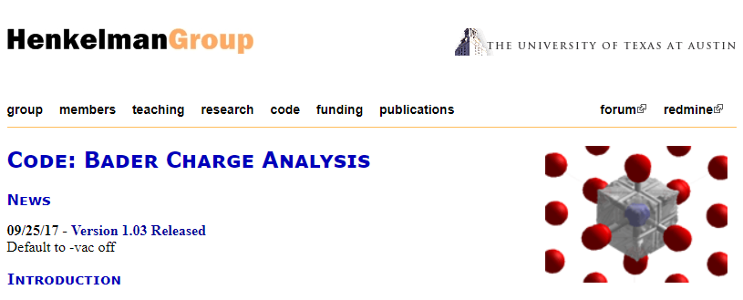

本节我们Bader电荷分析的常见问题做个总结。

# VTST的网站

Henkelman 课题组主页：

http://theory.cm.utexas.edu/henkelman/

Bader计算的链接： 

http://theory.cm.utexas.edu/henkelman/code/bader/

VTST脚本链接：

http://theory.cm.utexas.edu/vtsttools/ 

# 常见问题：

**电荷数字保留位数：**

Bader电荷分析只是定性的辅助工具，得到的结果肯定也是定性的。大致分析原子上的带电情况即可，不要去较真小数点后多少位，一般来说小数点后两位就足够了。

**ACF.dat 文件怎么看？**

`ACF.dat` 中的`CHARGE`那一列，对应的是每个原子上**总的**价电子数目。

划重点： 1）总的 2）价电子数目

**如何判断原子的带电情况？**

你需要用`CHARGE`那列的数值去减去该原子对应的`POTCAR `中的价电子数目。

**怎么才能得到POTCAR中原子的价电子数目呢？**

打开`POTCAR`，查找关键词：`ZVAL`，后面对应的就是价电子数目，更方便点：

`grep ZVAL POTCAR`

**划重点：**不要以为自己元素周期表倒背如流就可以随便设定原子的价电子数目。

`POTCAR`中原子的价电子数目有些和周期表是一样的，比如H。

有些差别是很大的。比如：`Europium [Xe]4f76s2`,  Lanshipunvboshan**you**gatedihuoerdiuyilu 中的you。

You有9个价电子，但`POTCAR`中有17个。

**减完之后怎么分析？**

如果一个原子`POTCAR`中的电子数为5.

1） `ACF.dat`中该原子对应的CHARGE为6.2，6.2 - 5 = 1.2， 这说明该原子得到了1.2个电子。虽然是+1.2，但它的化合价是-1.2价。

2） `ACF.dat`中该原子对应的CHARGE 为 4.3， 4.3 – 5 = -0.7, 说明该原子失去了0.7个电子，虽然是负值，但它的化合价是 + 0.7 价。

注意：这里我们说的化合价，是基于Bader电荷分析得到的。由于Bader电荷分析是一个经验性的定性分析工具，这些化合价的值只能用来参考判断体系中电子的转移情况。

大家千万不要把这里的化合价跟我们中学所学到的化合价的概念混淆了。因为大部分的情况下，Bader电荷分析出来的化合价与我们在教科书里面所学到的化合价还是有区别的。

---

师兄，前面扯了那多么，直接用`POTCAR`中的价电子数减去`CHARGE`对应的不就更直接了？

是的，你很聪明：对应前面的例子：

* 1） 5 –6.2 = -1.2 说明该原子是-1.2价，得到了1.2个电子，

* 2） 5 - 4.3 = 0.7 说明该原子是 +0.7 价，失去了0.7个电子。

所以得失电子和化学价是反着的。这点你能把握住，就会分析了。

# 总结：

Bader电荷分析并不神秘，你需要做的有两点：

1） 去看VTST的官网，知道怎么去算；
2） 怎么通过得失电子判断原子的带电情况。`ACF.dat`中的`CHARGE`列，以及`POTCAR`中的价电子数。
