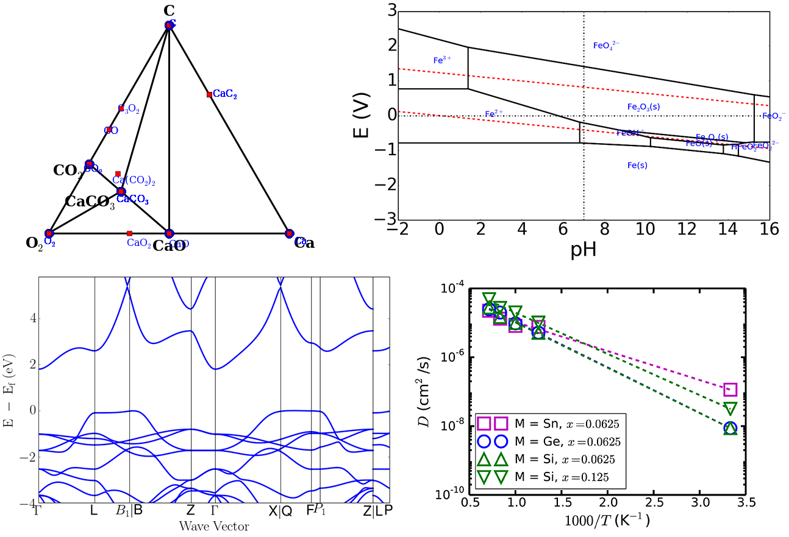

ASE 在 DFT 计算中的骚操作令人印象深刻。类似 ASE 的科研工具还有很多，比如 VASPKIT 和 QVASP。熟练使用这些科研工具肯定会助力大家快速完成科研任务，发出更好更高质量的文章。

此次，本文向大家隆重介绍另一款出色的科研工具：Pymatgen。

Pymatgen 是 python materials genomics 的缩写，它是一款基于 python 的、开源的、强大的材料分析软件（https://pymatgen.org/）。

Pymatgen 包含一系列能够表示元素（Element）、位点（Site）、分子（Molecule）、和结构（Structure）的类（Class）。它具有为很多计算软件提供前处理和后处理的能力。这些计算软件包括VASP，ABINIT，exciting，FEFF，QCHEM，LAMMPS，ADF，AIIDA，ASE，Gaussian，Lobster，Phonopy，Shengbte，Pwscf，和Zeo++等等。它能实现科研狗的众多后处理需求，包括生成相图（Phase diagram）和布拜图（Pourbaix diagrams），分析态密度和能带等等。

Pymatgen 还提供了很多数据库（Materials Project REST API，Crystallography Open Database，and other external data sources）的接口，方便大家从数据库中查询结构和其他数据。

真是科研狗快乐科研之利器呀！

> 以下是Pymatgen官网提供的后处理的例子：



*Top: (left) Phase and (right) Pourbaix diagram from the Materials API. Bottom left: Calculated bandstructure plot using pymatgen’s parsing and plotting utilities. Bottom right: Arrhenius plot using pymatgen’s DiffusionAnalyzer.*


**此次，本文就介绍一下如何使用 Pymatgen 的 DiffusionAnalyzer 类去计算锂离子固态电解质中锂离子电导率。**


## 计算离子电导率的理论与公式

目前，比较准确的计算离子电导率的方法是先用NVT系综第一性原理分子动力学（**AIMD**，*ab initio* molecular dynamics）模拟材料中离子在不同温度下的运动，然后计算出离子的平均（average）均方位移（**MSD**，mean square displacement），再计算出自扩散系数（D$_s$，self-diffusion coefficient），最后求得离子在某温度下的电导率（$\sigma$，conductivity）。

### 如何进行AIMD计算

AIMD计算通常非常耗时，所以，为了减少计算成本，我们可以适当放宽计算精度。如果用 VASP 进行计算，具体的，大家可以

- 采用较小的截断能。氧化物用 400 eV，硫化物用 280 eV，硒化物用 270 eV
- 采用Gamma点作为K点设置，并使用gam版本的 VASP 进行计算
- 采用单胞计算，如果材料的单胞包含比较多的原子
- 采用合适的步长，比如2 fs，即 POTIM = 2

### 后处理的基本公式

一旦AIMD计算完成，大家就可以着手计算离子电导率了。本文首先先介绍以下计算过程中使用的公式，方便有兴趣的同学自己开发脚本。

> 平均均方位移（average MSD）可以通过以下公式计算：
> $$
> averageMSD=\langle[\, \mathbf r(t)]^2\,\rangle=\frac{1}{N}\sum_{i}^{N}\langle[\,  \mathbf r_i(t+t_0)]\,^2 - [\,  \mathbf r_i(t_0)]\,^2\rangle
> $$
> $\mathbf r_i(t)$ 是第 $i$ 个离子在 $t$ 时刻的位移。
>
> 
>
> 自扩散系数（$D_s$）可以通过以下公式计算：
> $$
> D_s=\frac{averageMSD}{2dt}
> $$
> $d$ 是离子在材料中的扩散维度（一般地，$d=3$），$t$ 是离子扩散的时间。
>
> 
>
> 最后，离子电导率（$\sigma$）可以这样计算：
> $$
> \sigma=\frac{ne^2Z^2}{k_BT}D_s
> $$
> $n$ 是材料中的离子密度，$e$ 是元电荷，$Z$ 是离子的价态，$k_B$ 是玻尔兹曼常数，$T$ 是温度。

## 电导率计算的例子

现在我们通过一个 Li_Sn_S 材料的例子来详细了解一下整个计算和处理的过程。该材料的结构显示如下：


本例中采用单胞做计算，INCAR 设置如下：

```python
[test@ln0%tianhe2 li_sn_s]$ vi INCAR

ISTART = 0
ICHARG = 2
IBRION = 0
ISIF = 2
NPAR = 8
NSW = 30000
TEBEG = 900 #还要设置成 1500K 等等
PREC = N
POTIM = 2
SMASS = 0.0
NELMIN = 4
LWAVE = F
LCHARG = F
IALGO = 48
LREAL = A
```

AIMD 计算结束之后会得到 XDATCAR 文件。很多时候，由于超算的时间限制，一个完整的AIMD计算需要提交两三次，从而产生两三个 XDATCAR 文件，这时，我们只要把它们按顺序通过 cat 命令合并在一起就行。例如我们有三个 XDATCAR 文件，分别命名成 XDATCAR01，XDATCAR02，和 XDATCAR03。

```
[test@ln0%tianhe2 li_sn_s]$ cat XDATCAR01 XDATCAR02 XDATCAR03 > XDATCAR 
```

**新得到的XDATCAR文件，注意删掉重复的与晶格信息相关的行**，一般续算的次数也不多，在使用上面命令的时候，手动把`XDATCAR02`, `XDATCAR03` 中的删除即可。


### Pymatgen 大显身手

#### 安装pymatgen

首先让我们安装 pyamtgen，推荐大家参考官网，使用 anaconda 安装，否则会出现问题。安装好了anaconda之后，不管是 linux 还是 windows, 安装 pyamtgen 的指令是一样的。下面以吕梁天河超算为例：

```shell
[test@ln0%tianhe2 li_sn_s]$ conda install --channel conda-forge pymatgen
```

安装完成后，我们可以试着运行 python，导入 Pyamtgen 模块，如果像下面一样没有出错，就是安装成功了。

```python
[test@ln0%tianhe2 li_sn_s]$ python
Python 3.7.3 (default, Mar 27 2019, 22:11:17) 
[GCC 7.3.0] :: Anaconda, Inc. on linux
Type "help", "copyright", "credits" or "license" for more information.
>>> import pymatgen
>>> 
```

#### 查看 DiffusionAnalyzer 的类

大家可以通过官方文档（https://pymatgen.org/pymatgen.analysis.diffusion_analyzer.html）查看接下来要使用的类，熟悉一下代码的用法。

```python
class DiffusionAnalyzer(MSONable):
    def __init__(self, structure, displacements, specie, temperature,
                 time_step, step_skip, smoothed="max", min_obs=30,
                 avg_nsteps=1000, lattices=None):
```

这段代码显示，运行这个类需要一系列的输入信息，包括材料结构（structure），位移（displacements），要研究的离子（specie），温度（temperature）等等。

但是这个类提供了很多方法让大家可以通过读取 XDATCAR 或者 vasprun 文件的方式来实例化，例如

```python
    @classmethod
        def from_structures(cls, structures, specie, temperature,
                            time_step, step_skip, initial_disp=None,
                            initial_structure=None, **kwargs):
            """
            Convenient constructor that takes in a list of Structure objects to
            perform diffusion analysis.
            Args:
                structures ([Structure]): list of Structure objects (must be
                    ordered in sequence of run). E.g., you may have performed
                    sequential VASP runs to obtain sufficient statistics.
            ... ...
            """
```

好了，废话不多说，直接上代码，开始进行后处理。


#### 代码示例

新建一个文件，名字为`li_conductivity.py`

```python
'''
分析AIMD结果，计算MSD 和 conductivity
'''
import os
from pymatgen.core.trajectory import Trajectory
from pymatgen.io.vasp.outputs import Xdatcar
from pymatgen import Structure
from pymatgen.analysis.diffusion_analyzer import DiffusionAnalyzer
import numpy as np
import pickle

# 这一步是读取 XDATCAR，得到一系列结构信息
traj = Trajectory.from_file('XDATCAR')

# 这一步是实例化 DiffusionAnalyzer 的类
# 并用 from_structures 方法初始化这个类； 900 是温度，2 是POTIM 的值，1是间隔步数
# 间隔步数（step_skip）不太容易理解，但是根据官方教程:
# dt = timesteps * self.time_step * self.step_skip

diff = DiffusionAnalyzer.from_structures(traj,'Li',900,2,1)

# 可以用内置的 plot_msd 方法画出 MSD 图像
# 有些终端不能显示图像，这时候可以调用 export_msdt() 方法，得到数据后再自己作图
diff.plot_msd()

# 接下来直接得到 离子迁移率， 单位是 mS/cm
C = diff.conductivity

with open('result.dat','w') as f:
    f.write('# AIMD result for Li-ion\n')
    f.write('temp\tconductivity\n')
    f.write('%d\t%.2f\n' %(900,C))
```

在终端运行该文件

```
[test@ln0%tianhe2 li_sn_s]$ python li_conductivity.py
```

一段时间后就会得到MSD图像和离子电导率


```
[test@ln0%tianhe2 li_sn_s]$ vi result.dat

# AIMD result for Li-ion
temp	conductivity
900	884.05
```

可见，该材料在 900K 时的锂离子电导率为 884.05 mS/cm。


#### 思考

- 简短几行代码就可以计算出离子电导率，那么如何得出材料在300K下的电导率呢？
- 如何计算离子在材料中的迁移势垒？
- 如何可视化离子在材料中的扩散路径？

本文只是浅谈离子电导率的计算，欢迎大家指出计算过程中的不足之处。


#### 打赏

如果感觉本文对你的相关研究有帮助，欢迎打赏，支持作者的热心付出。如果你也有自己的骚操作，热烈欢迎无私分享，可以通过QQ联系（122103465）

