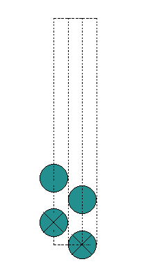
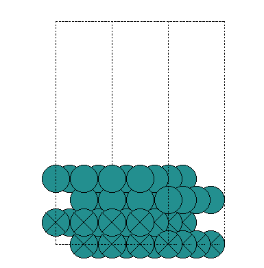

本节介绍一下ASE的另一个骚操作---扩胞。说到扩胞，这个大家都不陌生，可以有很多种方式来实现，本教程中就介绍了p4vasp的一种操作，今天就看一下ASE的骚操作吧。废话不多说，直接上例子和脚本。


#### 例子：

本例子中，主要把优化好的一个(1x1)-Ru(0001)的slab 扩胞为（4x4）的slab。为什么这样做呢？因为直接优化刚刚切好的（4x4)slab会有些费时间。先优化（1x1)的，在CONTCAR的基础上扩展为（4x4）的，再优化会相对来说快一些。但现在大家服务器一般都很给力，从刚切好的（1x1) slab直接扩展到（4x4），然后再优化也可以的。不管怎么样，扩胞这个操作都是必须的。如果你硬要抬扛说，我可以直接从bulk切出来（4x4)的，不用扩胞这么麻烦。OK，这也是可以的。但等你需要扩胞操作的时候，记得回来看这个骚操作就行。


先展示一下效果吧： 

```bash
qli@bigbro:~/Desktop/A19$ ls
CONTCAR  expand.py 
qli@bigbro:~/Desktop/A19$ python3 expand.py  CONTCAR  4 4 1 
qli@bigbro:~/Desktop/A19$ ls
CONTCAR  expand.py  POSCAR
qli@bigbro:~/Desktop/A19$ ase gui "-R -90x" CONTCAR 
qli@bigbro:~/Desktop/A19$ ase gui "-R -90x" POSCAR 
```

扩胞前：（CONTCAR）



扩胞后：（POSCAR）



#### 脚本：

脚本可以通过git-hub下载，链接：

https://github.com/BigBroSci-LVTHW/LVTHW/tree/master/source/_posts/A19

```python
#!/usr/bin/env python3
# -*- coding: utf-8 -*-
"""
Created on Wed Oct  2 10:54:36 2019

@author: qli
"""
import sys, os
import ase.io.vasp

file_read = sys.argv[1]
x,y,z     = [int(i) for i in sys.argv[2:5]]
try:
    cell = ase.io.vasp.read_vasp("CONTCAR")
    ase.io.vasp.write_vasp("POSCAR",cell*(x, y, z), direct=True,sort=True)
except:
    print(os.getcwd())
```

前面的扩胞命令：`expand.py  CONTCAR  4 4 1 `

`CONTCAR` 对应的为 `sys.argv[1]`

`4 4 1` 分别为在`x,y,z` 三个方向扩胞的倍数。


#### 打赏

如果感觉本文对你的相关研究有帮助，欢迎打赏，支持作者的热心付出。如果你也有自己的骚操作，热烈欢迎无私分享，可以通过QQ（122103465）或者邮件（lqcata@gmail.com）联系。

