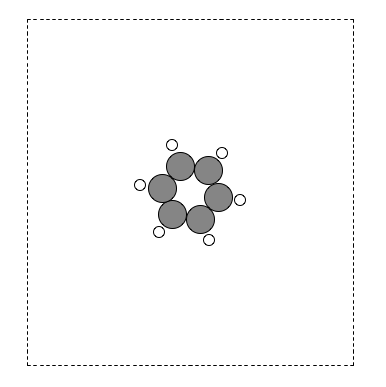
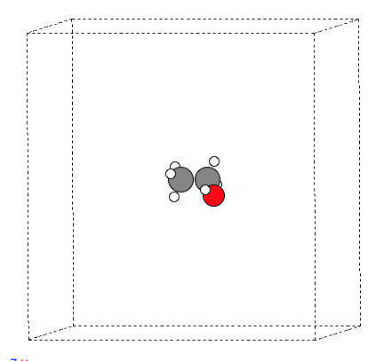
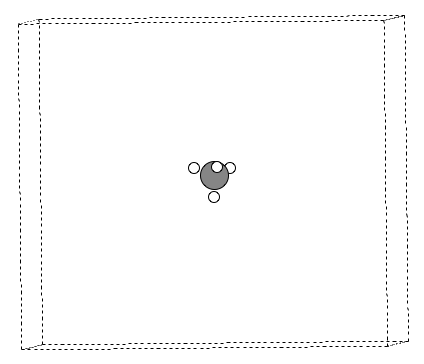
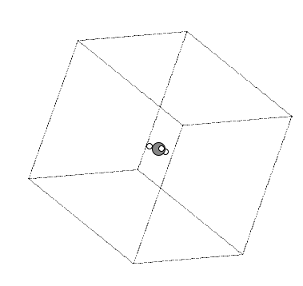

今天我们介绍ASE的另一个骚操作：结合Openbabel自动搭分子结构。与其说是ASE的骚操作，不如把这个骚字放在Openbabel头上。Openbabel是一款功能极其强大的结构转化工具。如图你在用它，我就不在这里啰嗦了。如果你没听过，可以通过这个链接来初步了解一下。（http://openbabel.org/wiki/Main_Page）

鉴于Openbabel的安装比较蛋疼，先送一波福利（Mac，Linux用户）。下面是本人通过Anaconda（已经路转粉）创建虚拟环境，并且安装这些软件的一些命令。

```bash
conda create --name qrobot
conda activate qrobot
conda install -c conda-forge openbabel
conda install -c conda-forge rdkit
conda install -c conda-forge ase
conda install --channel conda-forge pymatgen
```

通过这些命令，可以让你安全顺利，麻溜滴地安装Openbabel, RDkit, Ase，和pymatgen。

Rdkit也是一款功能及其强大地软件，尤其是化学信息学，生物化学相关的领域。如果不了解，点击这个官网学习。（https://www.rdkit.org/）顺便吐槽一下，百度里面你搜索一堆RDkit的使用，大部分都是把官网例子复制过来，然后贴个二维码要钱的。交不交智商税决定权在你手上，如果手痒，请跳到文末最后，把钱打赏给我。


废话不多说，转到我们今天的主题： SMILES to XYZ。

又是一个新知识，什么是SMILES？ 

SMILES是**simplified molecular-input line-entry system** 的缩写，旨在用ASCII字符串来标识，描述分子的结构。如果你不了解，可以通过下面两个链接初步了解一下：

https://en.wikipedia.org/wiki/Simplified_molecular-input_line-entry_system

https://www.daylight.com/dayhtml/doc/theory/theory.smiles.html


通过SMILES我们可以将一个分子用字符串来标识出来，比如我们后面练习中的：

乙醇（CCO），甲烷（C），甲基（[CH3]）, 苯（c1ccccc1）。

所以，在操作之前，你要知道所搭结构的SMILES字符串。通过上面两个链接，耐心钻研一下，应该不到1天就可以搞定大部分的分子。将SMILES转化为3D的结构，可以通过Openbabel，也可以通过RDkit。今天我们就介绍前者。下面是脚本内容（smiles_to_xyz.py）以及使用的效果。最后，我们再详细解释这个脚本是怎么工作的。


##### 脚本内容

下载链接：https://github.com/BigBroSci-LVTHW/LVTHW/tree/master/source/_posts/A20 

```python
#!/usr/bin/env python3 
# -*- coding: utf-8 -*-
"""
convert SMILES to xyz
"""
import sys
from openbabel import pybel
import numpy as np
import ase
import ase.io
from ase import Atoms
from ase.constraints import FixAtoms
 
smiles, out_name = sys.argv[1:3]

'''
Introduction to SMILES:
https://en.wikipedia.org/wiki/Simplified_molecular-input_line-entry_system
https://www.daylight.com/dayhtml/doc/theory/theory.smiles.html
'''

## Use openbabel to convert SMILES to xyz. 
mol = pybel.readstring("smi", smiles)
mol.make3D(forcefield='mmff94', steps=100)
# mol.write("xyz", filename=out_name+'_pybel.xyz', overwrite=True)

# USE ase to make POSCAR
''' https://wiki.fysik.dtu.dk/ase/ase/atoms.html'''
geo = Atoms()
geo.set_cell(np.array([[16.0, 0.0, 0.0],[0.0, 17.0, 0.0],[0.0, 0.0, 18.0]]))
geo.set_pbc(((True,True,True)))
for atom in mol:
    atom_type = atom.atomicnum
    atom_position = np.array([float(i) for i in atom.coords])
    geo.append(atom_type)
    geo.positions[-1] = atom_position
geo.center()

'''https://wiki.fysik.dtu.dk/ase/ase/constraints.html'''
c = FixAtoms(indices=[atom.index for atom in geo if atom.symbol == 'XX'])
geo.set_constraint(c)

ase.io.write(out_name + '_ase.xyz', geo, format='xyz')
ase.io.write(out_name + '_POSCAR', geo, format='vasp', vasp5='True')

```


##### 脚本运行

```bash
 (qrobot) qli@MacBook-Pro test_openbabel % python3 smiles_to_xyz.py '[CH3]' Methyl
 (qrobot) qli@MacBook-Pro test_openbabel % python3 smiles_to_xyz.py 'CCO' ET
 (qrobot) qli@MacBook-Pro test_openbabel % python3 smiles_to_xyz.py 'C' Methane
 (qrobot) qli@MacBook-Pro test_openbabel % python3 smiles_to_xyz.py 'c1ccccc1' BZ
 (qrobot) qli@MacBook-Pro test_openbabel % ls
BZ_POSCAR         BZ_ase.xyz        ET_POSCAR         ET_ase.xyz        Methane_POSCAR    Methane_ase.xyz   Methyl_POSCAR     Methyl_ase.xyz    smiles_to_xyz.py
```


##### 结果展示









##### 内容详解

1.  Openbabel部分其实就三行代码，非常简单。

```python
1 mol = pybel.readstring("smi", smiles)
2 mol.make3D(forcefield='mmff94', steps=100)
3 # mol.write("xyz", filename=out_name+'_pybel.xyz', overwrite=True)
```

1) 读取SMILES，并创建一个mol的对象（object）。

2) `make3D` 通过MMFF94力场对生成的3D结构优化了100步。 

3) 保存结构，这里我把它注释掉了，因为后面我们要通过ASE来生成xyz和POSCAR。


2. ASE部分，代码多一些，可能本人水平有限吧。不管怎么样，这里主要告诉大家的一点就是：我们可以将Openbabel和ASE无缝连接起来。同样，你也可以把ASE与你自己写的一些东西关联，这样就可以调用ASE的功能来快速实现一些小目标了。

```python
1 geo = Atoms()
2 geo.set_cell(np.array([[16.0, 0.0, 0.0],[0.0, 17.0, 0.0],[0.0, 0.0, 18.0]]))
3 geo.set_pbc(((True,True,True)))
4 for atom in mol:
5    atom_type = atom.atomicnum
6    atom_position = np.array([float(i) for i in atom.coords])
7    geo.append(atom_type)
8    geo.positions[-1] = atom_position
9 geo.center()

'''https://wiki.fysik.dtu.dk/ase/ase/constraints.html'''
10 c = FixAtoms(indices=[atom.index for atom in geo if atom.symbol == 'XX'])
11 geo.set_constraint(c)

12 ase.io.write(out_name + '_ase.xyz', geo, format='xyz')
13 ase.io.write(out_name + '_POSCAR', geo, format='vasp', vasp5='True')
```

1）创建一个ASE的Atom空对象；

2）设置放分子的格子大小，这里我们用的是16x17x18 $\AA^3$的。如果嫌小，自己改改就可以了。

3）设置周期性；

4-8）将`Openbabel`的`mol`对象中的原子添加到`ASE`的`Atom`对象里面。

9）将分子放到格子的中心。

10-11）固定或者放开原子，这里我们打算放开所有的原子，所以用到了一个`XX` 。如果原子符号是`XX`，那么就固定住。其实世界上根本就没有`XX`原子，因此所有的原子就会被放开了。

12-13） 保存xyz和VASP的POSCAR。


##### 小结

通过SMILES来搭建结构非常方便，当然也可以通过数据库下载，可视化程序例如GaussianView等自己手动搭建。

值得注意的是，不管通过什么方式搭建的结构，提交任务之前，都要尽可能保证结构的合理性。所以不要搭建完结构就立刻提交任务，先认真检查一遍，没有任何问题之后再提交。


##### 打赏

如果感觉本文对你的相关研究有帮助，欢迎打赏，支持作者的热心付出。如果你也有自己的骚操作，热烈欢迎无私分享，可以通过QQ（122103465）或者邮件（lqcata@gmail.com）联系。

