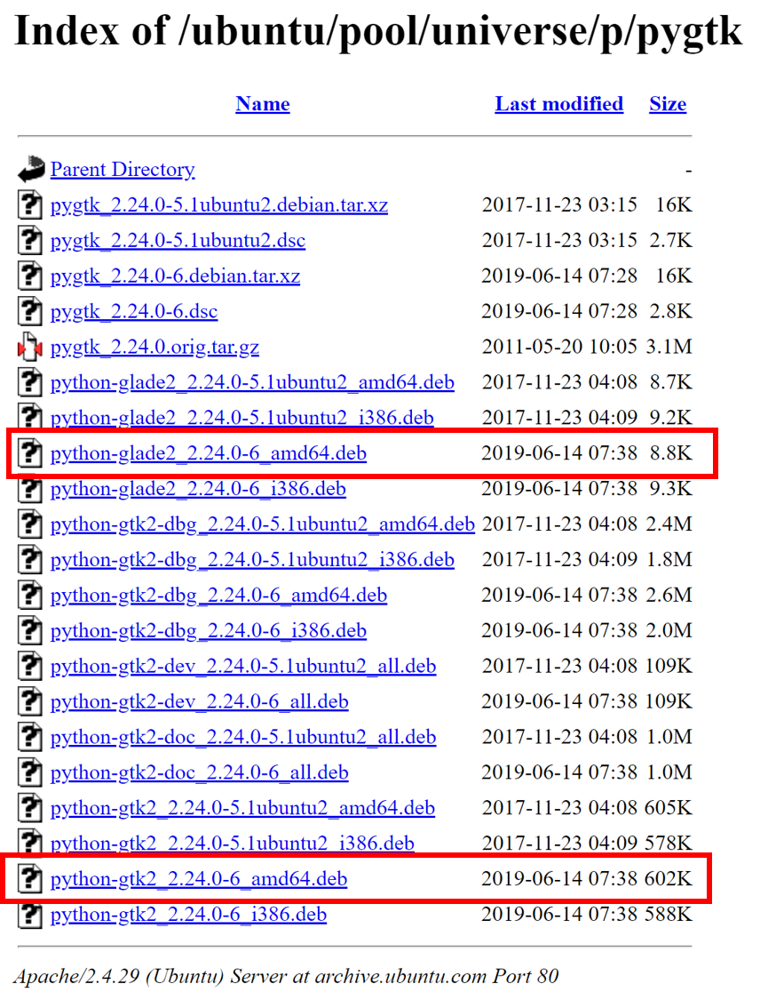

P4vasp是一款基于Python2的，用于可视化，搭建结构的软件。由于Python2已经被时代所淘汰，p4vasp官网也不见任何的针对python3的更新改进，这个软件估计要凉，跟我们再见了。但Ubuntu20安装也不是很难，能撑到博士毕业应该问题不大。经过多次的测试，下面是p4vasp的安装过程，非常简单。

##### 下载并解压

下载链接：http://www.p4vasp.at/#/download 

这里本人把安装包解压缩到了`~/Documents/` 目录下。

##### 安装步骤-1

```bash
qli@bigbrosci:~/Documents/p4vasp-0.3.30$ ls
BUGS           install           odpdom                setenvironment.sh
ChangeLog      install-local.sh  p4v                   src
data           install.sh        p4vasp-0.3.30-1.spec  test
diagnostic.py  lib               p4vasp.log            uninstall.sh
doc            LICENSE           p4v.py                utils
ext            Makefile          README                vinfo.py
FAQS           Makefile.MacOS    README.MacOS          vinfo.pyc
qli@bigbrosci:~/Documents/p4vasp-0.3.30$ sudo apt-get install gcc make
qli@bigbrosci:~/Documents/p4vasp-0.3.30$ sudo apt-get install make
qli@bigbrosci:~/Documents/p4vasp-0.3.30$ sudo apt-get install python2-dev
```


##### 安装步骤-2：

http://archive.ubuntu.com/ubuntu/pool/universe/p/pygtk/

从这个网站下载：python-gtk2 和 python-glade2的deb文件，下载后，双击即可安装。

**注意：**先安装gtk2，再安装glade2。




##### 安装步骤-3：

```
qli@bigbrosci:~/Documents/p4vasp-0.3.30$ sudo apt-get install libxft-dev
qli@bigbrosci:~/Documents/p4vasp-0.3.30$ sudo apt-get install libglfw3-dev libgl1-mesa-dev libglu1-mesa-dev
qli@bigbrosci:~/Documents/p4vasp-0.3.30$ bash install/install-ubuntu-dependencies.sh
qli@bigbrosci:~/Documents/p4vasp-0.3.30$ bash install.sh
```

##### 注意：

`bash install/install-ubuntu-dependencies.sh` 这一步最后可能会出`python-epydoc`的报错，可以忽略。


##### 反馈：

上面的命令是Ubuntu20里面安装用的，如果安装过程出现问题，或者有更好的安装方法，欢迎交流讨论：

QQ：122103465

E-mail：lqcata@gmail.com

至于其他的Linux系统，本人没有测试，如果你有比较好的安装方法，也欢迎分享讨论。

##### 打赏

如果感觉本文对你的相关研究有帮助，欢迎打赏，支持作者的热心付出。如果你也有自己的骚操作，热烈欢迎无私分享，可以通过QQ（122103465）或者邮件（lqcata@gmail.com）联系。

