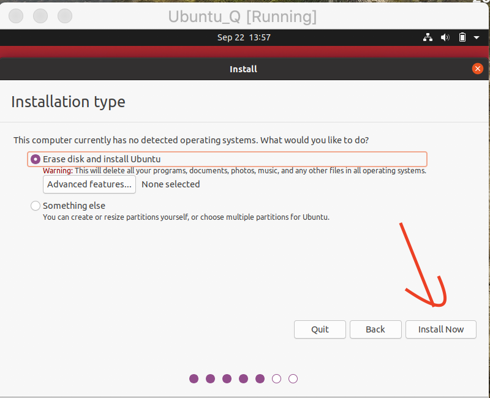
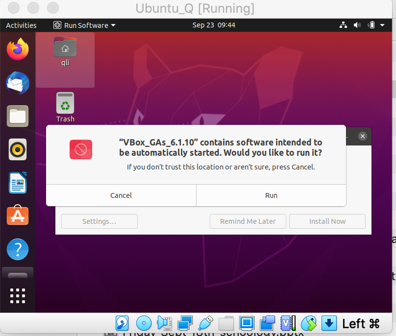

为方便新手入坑，这里我们先介绍一下Ubuntu虚拟机的安装细节。VMWARE和VirtualBox是两个主要的选择，前者收费，后者免费。当然介绍免费的喽。 本节主要把安装的过程展示一遍，然后把需要注意的细节强调一下。安装虚拟机要量力而行，优先在台式机上安装虚拟机。如果你的电脑配置很普通的话，运行起来可能不会很流畅。

##### 第一步： 准备工作

1 下载Ubuntu的安装包

https://ubuntu.com/download/desktop

2 下载Virtual Box，并安装

https://www.virtualbox.org/wiki/Downloads

3 下载Virtual Box的扩展包并安装（Extension Pack）


##### 第二步：安装虚拟机(初始化)

2.1） 创建新的虚拟机


2.2）设置虚拟机的名字，名字里面只要你输入`Ubuntu`字样，后面的Type和Version会自动更新，`Machine Folder` 最好选择一个硬盘比较大的盘。 


2.3） 设置虚拟机的内存，本人喜欢设置为host的一半。


2.4）创建虚拟机，按照图片选择即可。


2.5） 设置虚拟机的`vdi`文件的目录，如果前面选择好了，这个采用默认即可。虚拟机的大小：如果使用Ubuntu比较频繁，安装的软件、数据处理等比较多的话，根据自己的情况酌情增加下。但是尽量别太小，到时候存储不够容易导致死机崩溃。

另外一个需要注意的是：Ubuntu的系统以及后面你安装的软件，下载的东西，写的脚本等都会存在这个vdi文件里面，如果你换了一台电脑，还想继续使用虚拟机，大可不用再重复本教程的操作，直接导入vdi即可（前面2.4步骤的第一个图片）。


2.6） 经过前面步骤，虚拟机初始化基本完成了（界面上可以看到），按照箭头，点`Settings`。


2.7) `System`设置处理器的数目，同样也是host的一半。太小Ubuntu容易卡死，太大host容易卡死。


2.8）指定Ubuntu安装iso文件的目录，点`Storage` --> `光盘 Empty` --> `右侧光盘图标` 


2.9） 在弹出的对话框，选择前面下载好的Ubuntu安装文件。


##### 3 安装虚拟机 （Ubuntu的安装）

3.1） 点击下方图片的`Start`绿色图表，开始启动安装


3.2） 选择Install Ubuntu，后面的一路`Continue`


3.3） 设置键盘类型


3.4）按照下面的选择，`Continue`




3.5) 设置用户名，计算机名，以及密码。


3.6） Ubuntu 终于开始安装了，电脑配置好的别走开，配置不好的一边凉快等着去。（PS：配置不好不建议虚拟机，卡的你怀疑人生）


3.7） 安装完成后，会提示让你先移除安装的ISO文件，然后再点`ENTER`


3.8） 这里本人把安装包改了下名字，然后点`ENTER`。


3.9) Ubuntu 初步安装完成。


##### 4 后续设置

前面只是顺利安装成功，但距离真正可以使用，还有几个设置需要继续操作下。

4.1）安装增强扩展包。（前面准备工作中，我们在host中安装了扩展包，Ubuntu里面也需要安装一下）





最明显的效果：

安装增强包前，不管你怎么拖放VirtualBox的界面，Ubuntu的界面总是那么一点。


安装后：Ubuntu的界面可以随意调整。（重启后才会更新效果）


4.2）设置虚拟机的网络。

`Setting` --> `Network`，然后按照下面的设置即可。


4.2) 设置剪切板共享：host复制的文字可以直接粘贴在Ubuntu里，反之亦然。(重启后生效)


4.3） 设置共享文件夹。

共享文件夹可以让你在host和Ubuntu之间及其方便地进行数据分享。

4.3.1 Virtual Box界面，点`Settings` --> `Shared Folders`，然后按照下面图中设置即可。


`Folder Path`为host的文件夹目录

`Mount Point` 为虚拟机中所挂在的位置。

点OK， 然后我们进入到虚拟机中，会发现一个类似硬盘的图标，名为：`Shared`，点一下，发现没有权限。


`解决办法`

在Ubuntu中，打开终端`Terminal`，输入命令。

```bash
qli@bigbro:~/Desktop$ sudo adduser $USER vboxsf 
[sudo] password for qli: 
Adding user 'qli' to group 'vboxsf' ...
Adding user qli to group vboxsf
Done.
```

完事后，重启虚拟机。如果不能启动，显示USB相关的报错信息。取消USB的选项，再次启动即可。


到这里，虚拟机的安装，设置基本就完成了，剩下的就是在Ubuntu里面安装一些常用的软件程序了。这个会在后续教程里面简单介绍。


##### 打赏

如果感觉本文对你的相关研究有帮助，欢迎打赏，支持作者的热心付出。如果你遇到相关的问题，或者也有自己擅长的操作，热烈欢迎无私分享，可以通过QQ（122103465）或者邮件（lqcata@gmail.com）联系。

