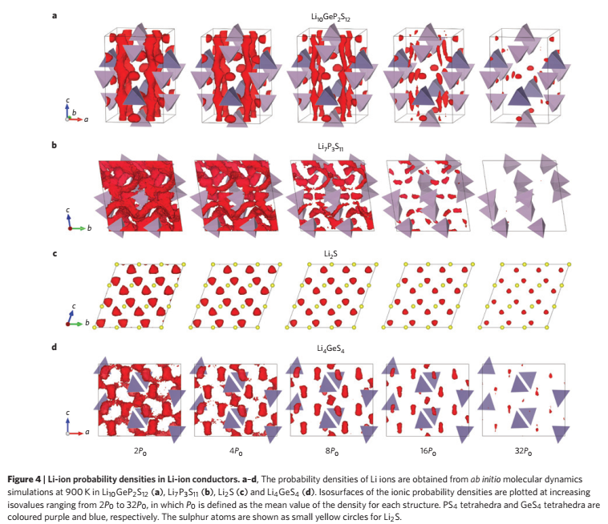
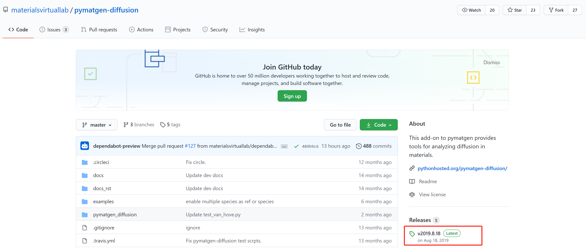
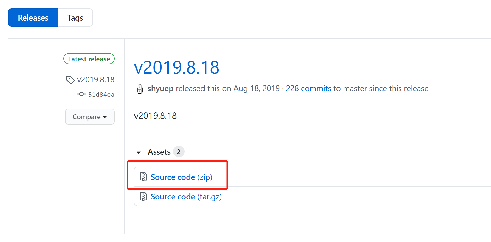
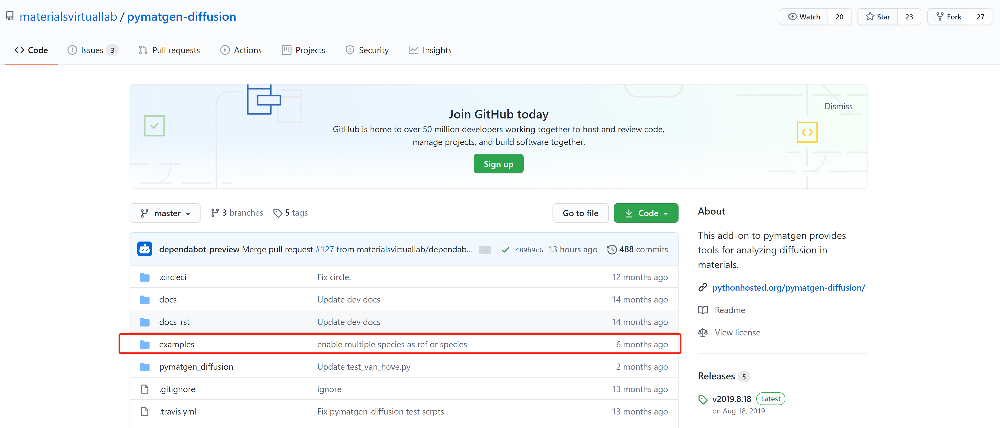
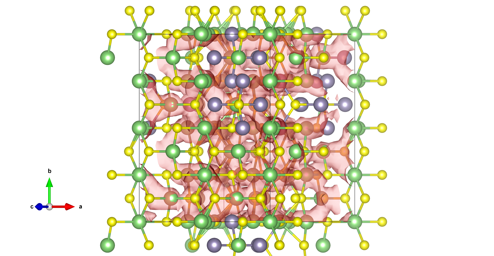

大师兄在9月8日的文章中讲了如何用 Pymatgen 计算离子的电导率（该方法可以用来研究固态电解质等问题），**本次，大师兄介绍一下如何使用 Pymatgen 可视化离子的迁移概率密度。**

先举个例子，

> 在“Design principles for solid-state lithium superionic conductors”一文中（Wang et al., Nature Materials **2015**, *14* , 1026–1031. ），作者用Ab Initio Molecular Dynamic （AIMD）计算了Li 离子在Li$\mathrm{_1}$$\mathrm{_0}$GeP$\mathrm{_2}$S$\mathrm{_1}$$\mathrm{_2}$， Li$\mathrm{_7}$P$\mathrm{_3}$S$\mathrm{_1}$$\mathrm{_1}$，Li$\mathrm{_2}$S，和 Li$\mathrm{_4}$GeS$\mathrm{_4}$ 四种材料中的迁移概率密度（Probability Density），结果如下图所示：



> - 从图中可以看出Li离子在图a所示材料中主要沿c轴方向的通道迁移，而且由于这个通道连通得比较好，Li离子的迁移势垒会比较低（0.22~0.25 eV）。
> - Li离子在图b所示的材料的迁移路径形成了一个三维网格，而且由于这个概率密度比图b中的概率密度分布得更加均匀，Li离子的迁移势垒更低（0.18~0.19 eV）。
> - 图b所示的材料就完全不行了，因为Li离子的概率密度仅分布在特定的位点附近，说明离子不能有效地移动。
> - Li离子在图d所示材料中也存在迁移局域化的行为。
> - 作者总结说 “A general principle for the design of Li-ion conductors with low activation energy can be distilled from the above findings: all of the sites within the diffusion network should be energetically close to equivalent, with large channels connecting them.”

**那么我们如何在自己的计算中画出这样的图呢？**Pymatgen 举手说，它可以帮忙！

但是在开始之前，我们要安装Pymatgen的插件：**Pymatgen-diffusion**（https://github.com/materialsvirtuallab/pymatgen-diffusion）。


## 安装 Pymatgen-diffusion

**推荐大家使用最新版的Anaconda安装Pymatgen及其插件。**点击上面的链接，进入官网后，点击最新版本链接，



我们可以下载.zip文件，



下载完成后，大家可以解压这个文件，得到 pymatgen-diffusion-2019.8.18文件夹。

我们把其中的 pymatgen_diffusion 文件夹放到 Anaconda的site-packages文件夹下，路径是 Windows 系统：......\Anaconda\Lib\site-packages；Linux系统：....../anaconda3/lib/pythonx.x/site-packages，就算安装好了。

接下来我们可以启动python，导入这个模块，如果不报错就没有问题了。

```
[test@ln0%tianhe2 li_sn_s]$ python
Python 3.8.3 (default, Jul  2 2020, 16:21:59) 
[GCC 7.3.0] :: Anaconda, Inc. on linux
Type "help", "copyright", "credits" or "license" for more information.
>>> import pymatgen_diffusion
>>> 
```


## 学习用法

我们可以在其github网站上通过例子学习这个模块的用法。



点击打开 probbility_analysis.ipynb 文件。


其内容如下（有所删减）：如果不想看的话可直接查看 **开始作图** 部分

```python
from pymatgen.analysis.diffusion_analyzer import DiffusionAnalyzer
from pymatgen_diffusion.aimd.pathway import ProbabilityDensityAnalysis
import json

#ProbabilityDensityAnalysis object
filename="/Users/iekhengchu/repos/pymatgen-diffusion/pymatgen_diffusion/aimd/tests/cNa3PS4_pda.json"

data = json.load(open("../pymatgen_diffusion/aimd/tests/cNa3PS4_pda.json", "r"))
diff_analyzer = DiffusionAnalyzer.from_dict(data) # 初始化DiffusionAnalyzer类

pda = ProbabilityDensityAnalysis.from_diffusion_analyzer(diff_analyzer, interval=0.5, 
                                                         species=("Na", "Li")) #可以指定离子
#Save probability distribution to a CHGCAR-like file
pda.to_chgcar(filename="CHGCAR_new2.vasp") #保存概率密度文件
```


## 开始作图

代码（test.py）如下：

```python
from pymatgen_diffusion.aimd.pathway import ProbabilityDensityAnalysis
from pymatgen.core.trajectory import Trajectory
from pymatgen.io.vasp.outputs import Xdatcar
from pymatgen.analysis.diffusion_analyzer import DiffusionAnalyzer

traj = Trajectory.from_file('XDATCAR')
diff = DiffusionAnalyzer.from_structures(traj,'Li',900,2,1)
pda = ProbabilityDensityAnalysis.from_diffusion_analyzer(diff,interval=0.5,species=("Li"))
pda.to_chgcar(filename="pda.vasp") #保存概率密度文件
```

此处理过程大概耗时8分钟，因机器而异。

在VESTA中可视化如下：




