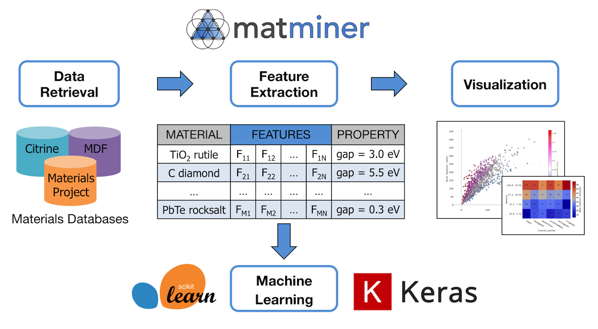

今天向大家隆重介绍一款材料类的机器学习开源软件：Matminer！机器学习预测材料性质，乃至逆向设计材料是材料领域的热门研究话题。很多同学有心做机器学习方面的研究，奈何不知道有哪些实用的代码，从而使项目一拖再拖。材料类的机器学习软件有很多，我比较喜欢Matminer这一款，因为它是由Pymatgen开发者开发的，非常易于使用。现在就向大家介绍一下这款软件（本教程根据Matminer官网https://hackingmaterials.lbl.gov/matminer/#installing-matminer撰写）

## 简介

Matminer是用于材料数据挖掘的基于Python的开源软件。它可以从各种数据库获取材料属性数据，将复杂材料属性(如成分、晶体结构、能带结构)表征为与物理相关的特征量，训练机器学习模型，并分析数据挖掘的结果。

Matminer使用pandas数据格式。它还有一个进阶的自动化版本叫Automatminer，可以自动化的训练机器学习模型并得到结果。

Matminer 可以生产可交互的图像。下面的流程图生动展示了matminer的工作内容。Matminer 可以访问Citrine，Materials Project，MDF等数据库，获得材料结构、能带、力学性能等多种性质。这些性质可以被转换成数值化的、可视化的特征量，该特征量可以被用于训练机器学习模型。



## 安装

Matminer的安装过程非常简单，大家只要安装好Anaconda3 (Python 3.6) 后，在终端输入 pip install matminer 就行了。建议大家一并安装Pymatgen。

下面以天河超算为例，展示matminer的安装过程：

```python
# 创建基于python 3.6 的虚拟环境，名字叫 py36
(base) [test@ln0%tianhe2 ~]$ conda create -n py36 python=3.6
```

安装好环境后，激活该环境，并安装pymatgen 和 matminer

```python
# 激活环境用conda activate 命令
(base) [test@ln0%tianhe2 ~]$ conda activate py36

# 括号里的 base 就会变成 py36
(py36) [test@ln0%tianhe2 ~]$ conda install -c conda-forge pymatgen

# 下面这个命令为安装 matminer
(py36) [test@ln0%tianhe2 ~]$ pip install matminer

```

下面测试安装结果，输入下列命令，如果不出错，就是安装成功了。

```python
(py36) [test@ln0%tianhe2 ~]$ python
Python 3.6.12 |Anaconda, Inc.| (default, Sep  8 2020, 23:10:56) 
[GCC 7.3.0] on linux
Type "help", "copyright", "credits" or "license" for more information.
>>> import pymatgen
>>> import matminer
>>> 
```

现在可以尽情地去测试啦！后续教程将陆续分享。

