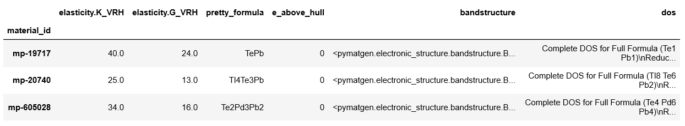

https://nbviewer.jupyter.org/github/hackingmaterials/matminer_examples/blob/master/matminer_examples/data_retrieval-nb/data_retrieval_basics.ipynb

## 从Materials Project 数据库获取

从Materials Project数据库获取数据得用到 matminer.data_retrieval.retrieve_MP.MPDataRetrieval 功能。

```python
# 首先导入模块
from matminer.data_retrieval.retrieve_MP import MPDataRetrieval
# 实例化 MPDataRetrieval 这个类
mpdr = MPDataRetrieval(api_key='your_own_api_key') 
# 在实例化 MPDataRetrieval 时需要输入用户在 Material Project 网站的 API Key.
```


## 示例1：获取所有单元素材料的密度

上一次的介绍说到，matminer 处理的数据跟 pandas 库一样，是 dataframe，所以我们要用 get_dataframe 方法获取数据; dataframe 看起来就像excel 表格一样。

```python
df = mpdr.get_dataframe(criteria={"nelements": 1}, properties=['density', 'pretty_formula'])
print("There are {} entries on MP with 1 element".format(df['density'].count())) # 计算有多少材料
#请自行关注 df['density'].count() 语句
```

criteria 是搜索条件，它是一个字典，字典里面可以有多个键值对; properties 是想要获取的材料性质，它是个列表，里面可以有多个性质。其实criteria 也是材料的性质。想知道所有可用的性质，请参考 https://github.com/materialsproject/pymatgen/blob/master/pymatgen/ext/matproj.py

上述代码意味着 我们想在数据库中搜索材料，这些材料元素种类为1，对于这些材料，我们想得到它们的密度和化学式信息。

结果如下：


让我们看一下这个 dataframe 表格长什么样

```python
df.head()  # 这个语句会显示 df 这个表格的前几行，可以看到，我们获得了 716 个单元素材料。
           # 表格里记录了我们需要的密度 和 化学式的性质，以及它们的ID
```

结果如下：


### 示例2：获取所有带隙大于 4.0 eV的材料

方法挺简单的，就是在上个例子的 get_dataframe 方法中设置新的搜索条件: 带隙大于4.0 eV.

```python
# 带隙是 band_gap，大于4怎么写呢？ 是 greater than, 缩写成 gt. 在 matminer中要写成 $gt 
# 大家注意体会 criteria 的字典形式。criteria=, properties= 可以省略不写。
df = mpdr.get_dataframe({"band_gap": {"$gt": 4.0}}, ['pretty_formula', 'band_gap'])

print("There are {} entries on MP with a band gap larger than 4.0".format(df['band_gap'].count()))
```

结果如下：


再看一下表格长什么样子

```python
df.head()
```

结果如下：


如果想把表格保存成excel可读写的格式，可以用下面的语句：

```python
df.to_csv('materials_bg_gt_4.csv')
```


### 示例3：获取 VRH 剪切模量和体积模量[¶](http://localhost:8888/notebooks/get_data_from_pymatgen.ipynb#示例3：获取-VRH-剪切模量和体积模量)

首先得要求这些材料存在弹性的性质，其次，我们还想要求这些弹性数据没有警告信息

```python
# 存在弹性常数信息用 "elasticity": {"$exists": True} 表示，没有警告信息用 一个空列表表示："elasticity.warnings": []

df = mpdr.get_dataframe({"elasticity": {"$exists": True}, "elasticity.warnings": []},
                        ['pretty_formula', 'elasticity.K_VRH', 'elasticity.G_VRH'])

print("There are {} elastic entries on MP with no warnings".format(df['elasticity.K_VRH'].count()))
```

搜索结果如下：


我们想统计一下这些数据

```python
df.describe() # 该语句可以很方便地对表格中的每一列数据进行统计，给出数量，平均数，方差，最小、最大值等信息
```

得到：


**接下来看一个更复杂的例子**

```python
'''
除了上次的搜索条件外，我们想搜索包含 Pb 和 Te 的材料："elements": {"$all": ["Pb", "Te"]} 
材料的稳定性也在考虑之中，energy above hull 必须在1e-6以下："e_above_hull": {"$lt": 1e-6}
'''
df = mpdr.get_dataframe(criteria={"elasticity": {"$exists": True}, 
                         "elasticity.warnings": [],
                         "elements": {"$all": ["Pb", "Te"]},
                         "e_above_hull": {"$lt": 1e-6}}, # to limit the number of hits for the sake of time
                        properties = ["elasticity.K_VRH", "elasticity.G_VRH", "pretty_formula", 
                                      "e_above_hull", "bandstructure", "dos"])

print("There are {} elastic entries on MP with no warnings that contain "
      "Pb and Te with energy above hull ~ 0.0 eV".format(df['elasticity.K_VRH'].count()))
```

结果是：

There are 3 elastic entries on MP with no warnings that contain Pb and Te with energy above hull ~ 0.0 eV

```python
df.head()
```



下面来查看一下其中一个材料的能带和DOS图

```python
from pymatgen.electronic_structure.plotter import BSDOSPlotter # 调用 Pymatgen 作图

mpid = 'mp-20740'
idx = df.index[df.index==mpid][0]  # 获取 mp-20740 这个材料所在的行数
plt = BSDOSPlotter().get_plot(bs=df.loc[idx, 'bandstructure'], dos=df.loc[idx, 'dos']);
plt.show()
```


## 结尾

- matminer获得的数据(本教程保存在 df 变量中)可以可视化，也可以直接用来做机器学习。有兴趣的同学请自学 pandas 这个 python 库，学习 dataframe 数据的处理方法。

- Pymatgen 做的能带和DOS图不够美观。大家可以留言，我有机会可以跟大家分享修改pymatgen代码来美化这些图。

- 官网的教程是基于 jupyter notebook的。jupyter notebook 的好处是既能运行代码，又能自由地给代码加注释，公式，图片。所得到的文档便于阅读和理解。希望大家也能学会这个python 库。

- 如果想调用 jupyter notebook来运行上述代码，建议大家在具有图形界面的终端上试验。以windows 系统为例，再按照上篇教程创建好 py36 虚拟环境后，需要

  ```python
  pip install jupyter # 具体的使用方法请参考其它网络教程
  ```

- 本文还附带jupyter notebook 版本的文档供大家阅读和使用 【链接：https://pan.baidu.com/s/153PcfiM3vaAG71MCCTFuCQ 
  提取码：w4us 】

本次的教程到这就结束了。