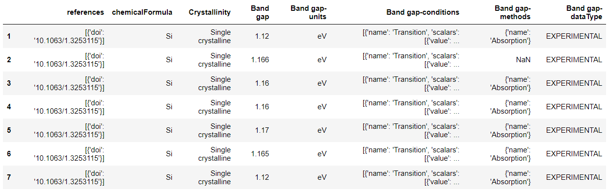
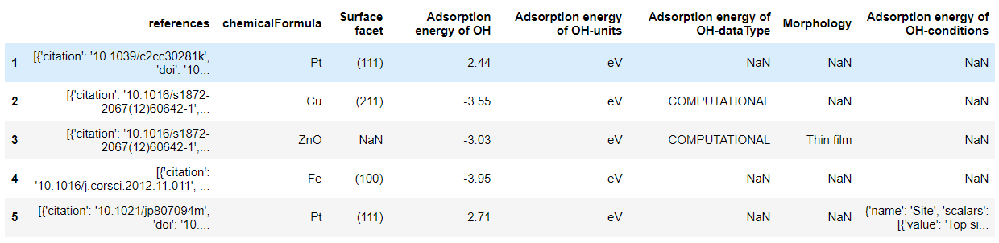
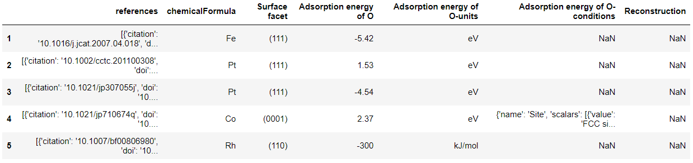

Citrine 也是一个材料学数据库，自带了机器学习工具，大家也可以研究琢磨一下。官网是 https://citrination.com/search/simple?searchMatchOption=fuzzyMatch。这里，我们将通过几个例子了解如何在这个数据库中获取数据。在Citrine中获取数据需要用到 matminer.data_retrieval.retrieve_Citrine.CitrineDataRetrieval 这个工具，其跟materials project类似，也学要一个API_key。大家可以在官网注册，并记录下API_Key。


```python
#请先在终端中输入： pip install citrination_client ； 否则会报错
#然后我们回到代码，导入 CitrineDataRetrieval 这个模块
from matminer.data_retrieval.retrieve_Citrine import CitrineDataRetrieval
```

#### 示例1：获取化学式为 Si 的所有材料的实验测得的能带


```python
# 先实例化这个工具，需要提供你的API_Key
cdr = CitrineDataRetrieval(api_key='')
```


```python
# 接下来，类似从materials project获取数据，我们需要用get_dataframe函数
df = cdr.get_dataframe(criteria={'formula':'Si', 'data_type': 'EXPERIMENTAL'}, 
                       properties=['Band gap'],
                       secondary_fields=True)
```

```bash
  0%|                                                                                            | 0/7 [00:00<?, ?it/s]d:\programs\anaconda3\envs\py36\lib\site-packages\matminer\data_retrieval\retrieve_Citrine.py:103: FutureWarning:

pandas.io.json.json_normalize is deprecated, use pandas.json_normalize instead

100%|████████████████████████████████████████████████████████████████████████████████████| 7/7 [00:00<00:00, 87.33it/s]

all available fields:
['Band gap', 'uid', 'Band gap-units', 'category', 'references', 'chemicalFormula', 'Crystallinity', 'Band gap-conditions', 'Band gap-methods', 'Band gap-dataType']

suggested common fields:
['references', 'chemicalFormula', 'Crystallinity', 'Band gap', 'Band gap-units', 'Band gap-conditions', 'Band gap-methods', 'Band gap-dataType']
```


```python
df #查看表格
```



从上面结果可以看出，数据库里有化学式为Si的材料共7中实验测得的能带数据。这些数据来源的文献，带隙的值，实验方法都被记录了下来。


#### 示例2：获取材料对 *OH 和 *O物种的吸附能
想不到citrine数据库还有各种材料对*OH 和 *O 物种的吸附能，一起来看看怎么获取把。要查询更多的数据库，请探索官网https://citrination.com/datasets 


```python
# 我们发现这里不需要指定筛选条件，只需要返回所需要的性质即可。
df_OH = cdr.get_dataframe(criteria={}, properties=['adsorption energy of OH'], secondary_fields=True)
df_O = cdr.get_dataframe(criteria={}, properties=['adsorption energy of O'], secondary_fields=True)
```

      0%|                                                                                            | 0/9 [00:00<?, ?it/s]d:\programs\anaconda3\envs\py36\lib\site-packages\matminer\data_retrieval\retrieve_Citrine.py:103: FutureWarning:
    
    pandas.io.json.json_normalize is deprecated, use pandas.json_normalize instead
    
    100%|███████████████████████████████████████████████████████████████████████████████████| 9/9 [00:00<00:00, 128.63it/s]


    all available fields:
    ['uid', 'Adsorption energy of OH', 'Adsorption energy of OH-units', 'Morphology', 'Surface facet', 'category', 'references', 'chemicalFormula', 'Adsorption energy of OH-conditions', 'Adsorption energy of OH-dataType']
    
    suggested common fields:
    ['references', 'chemicalFormula', 'Surface facet', 'Adsorption energy of OH', 'Adsorption energy of OH-units', 'Adsorption energy of OH-dataType', 'Morphology', 'Adsorption energy of OH-conditions']


    100%|█████████████████████████████████████████████████████████████████████████████████| 21/21 [00:00<00:00, 140.70it/s]
    
    all available fields:
    ['uid', 'Surface facet', 'Adsorption energy of O', 'category', 'references', 'chemicalFormula', 'Reconstruction', 'Adsorption energy of O-units', 'Adsorption energy of O-conditions']
    
    suggested common fields:
    ['references', 'chemicalFormula', 'Surface facet', 'Adsorption energy of O', 'Adsorption energy of O-units', 'Adsorption energy of O-conditions', 'Reconstruction']

```python
df_OH.head()
```




```python
df_O.head()
```



大家可以看到，这些数据库里面的数据还不够丰富。大家也可以把自己计算得到的数据上传到citrine数据库中，促进科学知识的开放获取。

- 实际上 citrine 数据库包含了很多实验数据，下次的分享中，我们会把citrine数据库中的实验数据和materials project中的计算数据做个对比。
- 强烈推荐大家在学习的时候使用jupyter notebook。
- 附上jupyter notebook文件共大家参考：【链接：https://pan.baidu.com/s/1W1XKj-Fnjmx1yIe2QB7_MQ 提取码：jvoi 】


本次分享到此结束。
