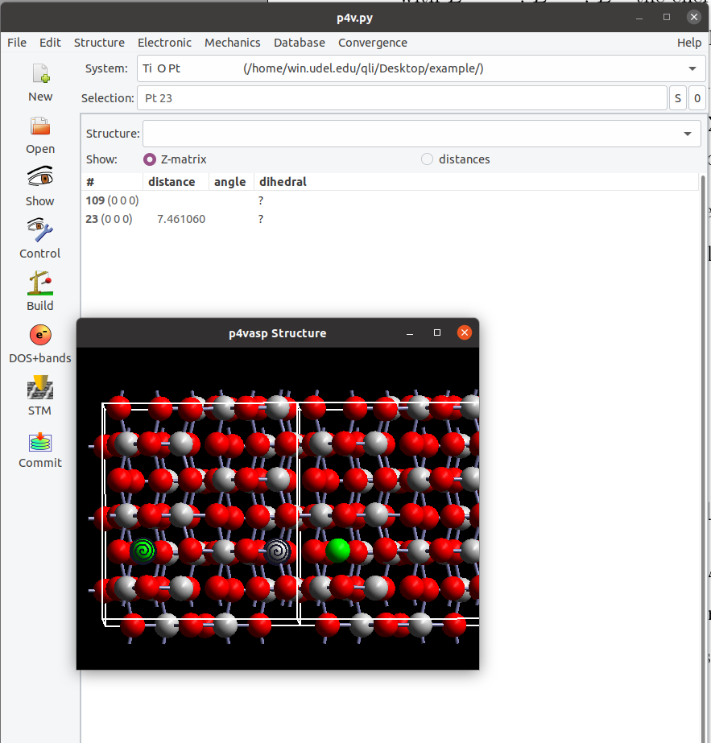
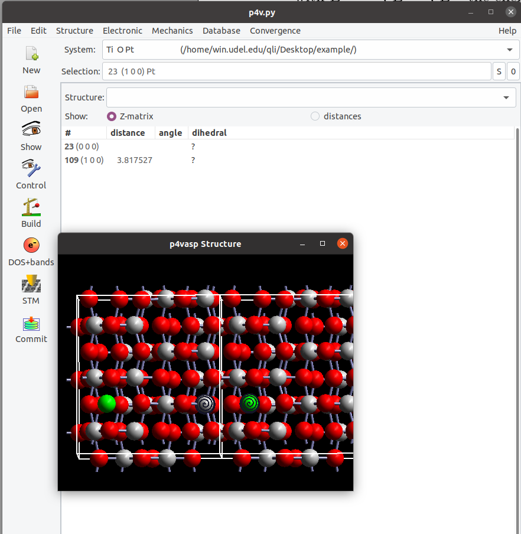
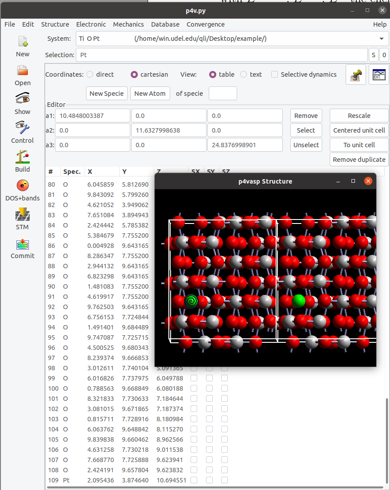

## 通过ASE获取原子之间的距离

原子之间的距离是计算化学中模型搭建，结果分析中经常需要分析的部分。而计算原子的之间的距离也非常简单，通过可视化软件直接点两个原子就可以直接显示出来，可以通过自写的一些小脚本来实现。跟均相的体系不同，周期性体系由于周期性边界的存在，有时候模型中两个原子之间的距离需要将周期性边界条件考虑进去才能正确得到。今天简单介绍一个通过ASE获取原子之间的距离，并且考虑周期性边界条件的影响的小脚本。

#### 具体例子展示一下：

图里面是$TiO{_2}(101)$表面上吸附的一个Pt单原子模型，如果直接计算Pt和Ti之间距离的话（图1），测量一下为 7.461 $\AA$。实际上我们把slab模型沿着y轴重复下就会发现，还有一个更短的Pt-Ti距离。



图1： Pt-Ti原子之间的距离


测量下，距离为：3.818 $\AA$。在周期性计算中，如果刚开始模型搭建的时候没有考虑到这一点，或者分子比较大，亦或者AIMD过程中分子到处跑，都会出现类似这样的情形。所以在测量距离时候，要注意周期性边界对数值的影响。当然最理想的情况就是模型搭建的时候将这一情况考虑进来，尽可能将分子放在slab的中间部分。如果出现这种情况，测量的时候加上周期性边界条件的校正即可，这也是本节要介绍的内容。



图2：考虑周期性边界条件后Pt-Ti之间的距离

首先我们看下体系的坐标，在`p4vasp`的界面中，`POSCAR`中每个原子对应着不同的序号（序号是从`1`开始的），比如：Pt在POSCAR中是第109号原子，前面测量的Pt-Ti距离就是109号和23号原子之间的距离。计算两点之间的距离公式相信大家初高中的时候已经学过了。过程很简单（参考下面脚本中注释掉的部分。）：1）获取两个原子之间的坐标； 2）套公式得到距离。本节介绍通过ASE写个小脚本获取两个原子之间的距离。



图3：p4vasp中原子的序号


#### 脚本内容

```python
#!/usr/bin/env python3
# -*- coding: utf-8 -*-
"""
Created on Fri Apr 22 10:06:51 2022
@author: qli
Command: python3 get_dis_AB.py  atom_A_index atom_B_index
"""

import numpy as np
from ase.io import read, write
import os, sys

'''
Important Note: Atoms are indexed from 0.
'''
atom_A, atom_B = [int(i) for i in sys.argv[1:3]]
model = read('POSCAR')
positions = model.get_positions()
dis_AB_1 = model.get_distance(atom_A, atom_B, mic=True)
dis_AB_2 = model.get_distance(atom_A, atom_B, mic=False)

print(round(dis_AB_1, 4), '\t',round(dis_AB_2,4))

## Not Used 
#coord_A = positions[atom_A]
#coord_B = positions[atom_B]
#dis_AB = np.linalg.norm(coord_A-coord_B)
#print(round(dis_AB,4))                     
```

1.  atom_A，和 atom_B 是要测量的2个原子，`注意：ASE中原子的序号是从0开始的`，所以上面的例子中，Ti和Pt在ASE中则是22和108号原子。
2. 脚本里面读的是`POSCAR`，根据自己的需求改成`CONTCAR`或者其他的带有坐标的文件。
3. `mic=True` 考虑周期性边界的影响。`mic=False` 则是直接测量两个原子的距离。
4. 最后面注释的几行是获取原子坐标，通过`numpy`计算距离的例子，效果等于前面`mic=False`.
4. 脚本使用的命令：`python3 get_dis_AB.py  22 108 `

#### 脚本效果：

```bash
qli@bigbro:~/Desktop/example$ python3 get_dis_AB.py  22 108
3.8175 	 7.4611
```

#### 改进下输出格式 

将前面脚本中`print`的一行删掉，换成下面的即可，反正数值已经在这里了，怎么输出根据自己爱好，把print对应的效果改改即可。

```python
print('Atom_A\tAtom_B\tdis_A-B')
print('%s\t%s\t%.4f' %(atom_A, atom_B, dis_AB_1))
```

```bash
qli@bigbro:~/Desktop/example$ python3 get_dis_AB.py  22 108
Atom_A Atom_B	dis_A-B
22	108	3.8175
```

#### 放到`~/bin`目录下，随时可以使用：

```bash
qli@bigbro:~/Desktop/example$ chmod u+x get_dis_AB.py 
qli@bigbro:~/Desktop/example$ mv get_dis_AB.py  ~/bin/
qli@bigbro:~/Desktop/example$ ls
POSCAR
qli@bigbro:~/Desktop/example$ get_dis_AB.py  22 108 
Atom_A	Atom_B	dis_A-B
22	108	3.8175
```

没有`~/bin`的话，自己创建一个即可：`mkdir ~/bin`


有兴趣的也可以自己尝试着解决周期性边界条件对计算两原子之间距离的影响，GitHub上也有很多类似的代码。也欢迎大家分享自己的代码或者链接；可以发送到我的邮箱：`lqcata@gmail.com`或者直接Q:`122103465`，微信：`BigBroSci` 联系。


