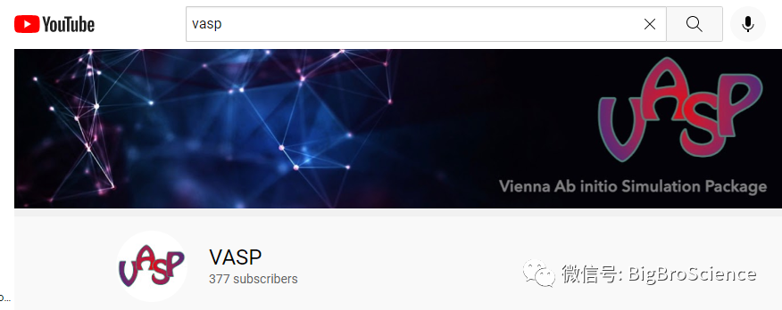
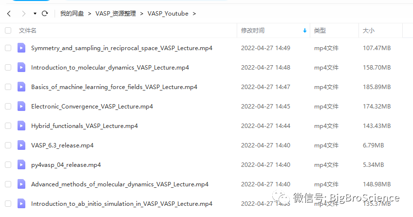
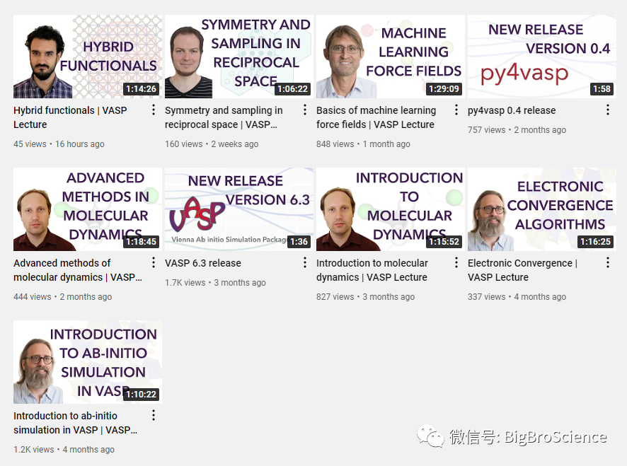

VASP官方在Youtube上开了自己的channel，虽然只有寥寥300多人关注，但也分析了9个视频。下载下来后大约是1G左右。1G只是个嚼头而已。主要内容如下：

1 Advanced_methods_of_molecular_dynamics_VASP_Lecture

2 Basics_of_machine_learning_force_fields_VASP_Lecture

3 Electronic_Convergence_VASP_Lecture

4 Hybrid_functionals_VASP_Lecture

5 Introduction_to_ab_initio_simulation_in_VASP_VASP_Lecture

6 Introduction_to_molecular_dynamics_VASP_Lecture

7 py4vasp_04_release

8 Symmetry_and_sampling_in_reciprocal_space_VASP_Lecture

9 VASP_6.3_release

从图1里面文件大小可以看出来，除了7和9介绍新的后处理工具py4vasp和vasp6.3新版本之外，其他的7个视频都干货满满。不信的话再看看视频的时间，都在1个小时以上，相信对大家学习VASP肯定有帮助。

建议大家关注下VASP的Youtube频道，这么牛逼的软件，才300多号人关注。哈哈。不过得科学上网，没有条件可以通过大师兄分享的网盘链接下载，

下载方式：关注公众号：大师兄科研网，后台回复： youtube   即可。

