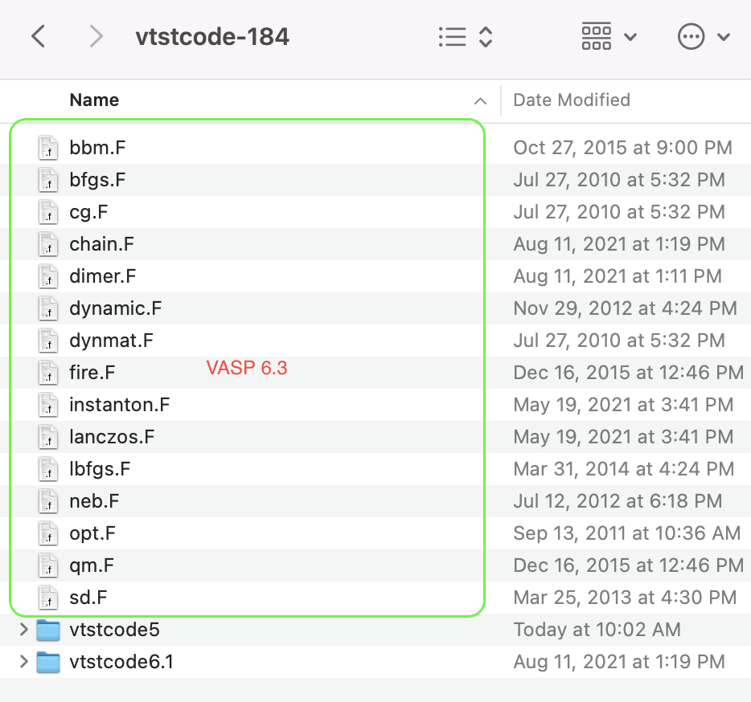

VTST的编译并不难，关键主要有2点：

1）VASP能顺利编译

2）VTST编译的时候，严格按照官网的说明一步一步来即可。


为什么要编译VTST，说白了还是VASP自带的功能不强大，没法解决我们的实际计算问题，主要是过渡态结构的搜索。因此，我们需要把VTST的一些功能添加到VASP中。网上可以搜到很多相关的编译教程，这里主要简单介绍下编译的几点注意事项，理清编译的思路，增加成功率。

首先，在编译VTST之前，要确定你顺利编译了VASP。如果这一步你还没搞定，就打算直接编译VTST，会导致你不知道问题从哪里来？是VASP编译的原因呢？还是VTST的原因？另外，VTST编译命令跟VASP是一样的，都是make，只要按照VTST官网的说明，复制文件到指定目录， 修改特定的文件内容，其他的和VASP编译设置一致即可。

其次，一定要看官网。记住，官网永远是学习的第一手资料，很多人喜欢看各种各样的教程，大部分教程都是官网的阉割版。或多或少会丢失些重要的信息，导致出错了不知道怎么解决。

最后，我们介绍下官网的编译说明 (https://theory.cm.utexas.edu/vtsttools/installation.html)，大家编译好VASP之后，按照说明一步一步走，基本都能顺利编译VTST到VASP中：

1. 第一步当然是下载并解压VTST的程序包喽：(https://theory.cm.utexas.edu/vtsttools/download.html)

解压后，发现压缩包里的文件有些令人犯迷糊，简单说明下： VTST提供了对应三种VASP版本编译的文件。

i)  vtstcode5 文件夹里面对应的是VASP5 版本的

ii) vtstcode6.1 文件夹里面对应的是VASP6.1和6.2版本的

iii) vtstcode5 和 vtstcode6.1两个文件夹外面的文件对应的是VASP6.3版本的。

iv) VASP5升级到VASP6不管是6.1还是6.3）要额外花钱，如果你有VASP5的版权，那么就用vtstcode5的文件，VASP5也有很多的子版本，尽量用最新的5.4.4。

v)  VASP6.1/2升级到VASP6.3不花钱，6.3还支持机器学习，所以vtst6.1这个文件夹，直接删掉就OK了，暂不用它，直接搞6.3。




2) 编译前的准备：

   i) cp 5.4.4   5.4.4_vtst   && cd  5.4.4_vtst  

   这样的话，我们可以用原生的VASP,亦可以用VTST强化过的。另外，这也是对VASP的一个备份；

   ii) 将下载的文件复制到 src文件中： 

   ii) 编辑src文件中的main.F 文件

   按照官网的说明，VIM打开src/main.F 文件，找到对应的部分，直接替换即可。 

   

   ```
   In VTST v2.04 and later, a modification is required in main.F for the solid-state NEB.
   
   Find and replace:
   
   CALL CHAIN_FORCE(T_INFO%NIONS,DYN%POSION,TOTEN,TIFOR, &
        LATT_CUR%A,LATT_CUR%B,IO%IU6)
   with
   
   CALL CHAIN_FORCE(T_INFO%NIONS,DYN%POSION,TOTEN,TIFOR, &
        TSIF,LATT_CUR%A,LATT_CUR%B,IO%IU6)
   For vasp.6.2 also find and replace:
   
   IF (LCHAIN) CALL chain_init( T_INFO, IO)
   with
   
   CALL chain_init( T_INFO, IO)
   For vasp.6.2.1 you will need vtstcode 4.1 (revision 182). A version of the vtstcode that will work with vasp.6.1.x - vasp.6.2.0 has been saved in the vtstcode6.1 directory.
   ```

   **注意**：VASP6.2还需要额外替换一行，至于6.3是不是跟6.2一样？ 可以编译2个版本,一个替换，一个不替换，然后对比下。本人测试的结果是，如果不替换，编译会失败。

   
   iii) 编辑 src/.objects文件

   先看下官网的说明：

   ```
   To build the code, the VASP makefile needs to be changed. Find the variable SOURCE, which defines which objects will be built, and add the following objects before chain.o:
   
   bfgs.o dynmat.o  instanton.o  lbfgs.o sd.o   cg.o dimer.o bbm.o \
   fire.o lanczos.o neb.o  qm.o opt.o
   The objects dynmat.o, neb.o, dimer.o, lanczos.o, and instanton.o must be in the SOURCE list before chain.o appears. The optimizer objects, sd.o, cg.o, qm.o, lbfgs.o, bfgs.o, and fire.o must appear before the optimizer driver opt.o. Nothing else needs to be done. 
   ```

   官网里面有句话：Find the variable SOURCE, which defines which objects will be built, and add the following objects before chain.o。

   这里的`variable SOURCE`指的就是src目录里面的`.objects`文件，这个文件前面带`.`，是隐藏的。用VIM或者其他文本编辑软件直接打开编辑就行。

   主要有2点，加粗的`Before`告诉你怎么改`.objects`文件：

   1： The objects dynmat.o, neb.o, dimer.o, lanczos.o, and instanton.o must be in the SOURCE list **before** chain.o appears. 

   2： The optimizer objects, sd.o, cg.o, qm.o, lbfgs.o, bfgs.o, and fire.o must appear **before** the optimizer driver opt.o. 

   ```
    70         tetweight.o \
    71         hamil_rot.o \
    72         bfgs.o dynmat.o  instanton.o  lbfgs.o sd.o   cg.o dimer.o bbm.o \
    73         fire.o lanczos.o neb.o  qm.o opt.o \
    74         chain.o \
   ```

   直接复制官网的文本，将72,73行内容放到指定的位置即可(chain.o前面)，不要随便改顺序。

3) 回顾下，1）将VTST的文件复制到src目录里面，2） 修改main.F，3） 修改 .object文件。没有遗漏的话，就可以直接编译了。直接make命令，喝杯咖啡等着即可，下面是本人编译的一些具体命令：`5.4.4` 是已经编译好的VASP5的目录，VTST（`5.4.4_vtst`）编译时环境变量的设置跟`5.4.4`完全一样。

```
cp 5.4.4   5.4.4_vtst  
cd  5.4.4_vtst  
cp ~/Downloads/vtstcode-184/vtstcode5/*  src/
vi src/main.F
vi src/.objects
make 
```

4. 确认是否顺利编译，直接运行个例子看看就知道了。

```bash
grep VTST -A 10 02/OUTCAR
```

没问题的话则会出现下面的内容：

```
VTST: version 3.2, (02/03/18)

 CHAIN: initializing optimizer
 
 OPT: Using Conjugate-Gradient optimizer
 OPT: CG, Init
 OPT: CG, FDSTEP      0.005000
 OPT: CG, MAXMOVE      0.200000
 
 CHAIN: Read ICHAIN            0
 CHAIN: Running the NEB
```


5. 简单总结下：编译VTST主要有以下4个小细节：

   i) 前提是顺利编译完成了VASP，这也是最关键的地方。

   ii) 下载VTST的code，找到对应VASP版本的文件，并复制到src目录中

   iii) 修改src/main.F 文件

   iv) 修改src/.objects 文件

6. 欢迎大家分享自己的经验，放到自己的网站，公众号等平台，帮助更多的人解决VTST编译的问题，也可以添加到本文章中 （lqcata@gmail.com）。此外，VTST的Code怎么下载？有没有具体运行的案例？提交任务的命令怎么写？按照这个说明编译失败了，怎么办？这些问题就不要找我了。我相当圣母，可俺是男的。实在没办法，放弃也是个很好的选择。


