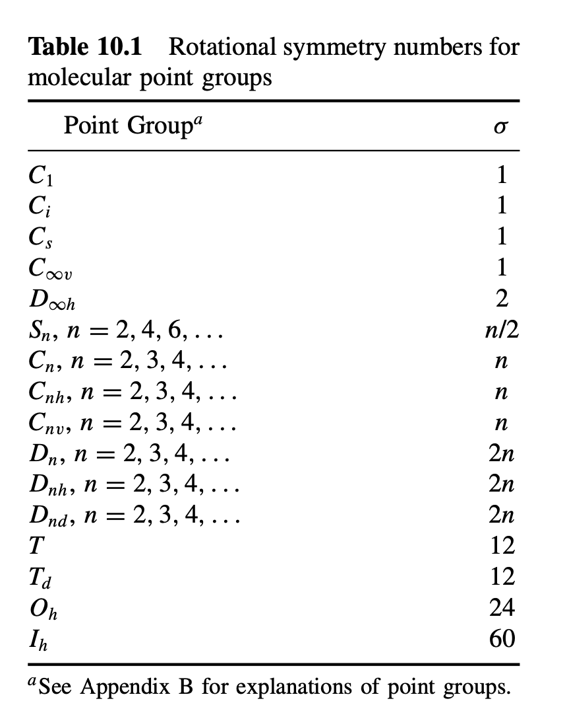

### 简单说明：

ASE提供的热力学模块可以很方便地获取气体分子的热力学数据比如吉布斯自由能，熵等。具体参见：https://wiki.fysik.dtu.dk/ase/ase/thermochemistry/thermochemistry.html。本节介绍下气体分子熵的计算，用到的是**IdealGasThermo**这一个模块，例子为氨气分子（NH3）。**IdealGasThermo**计算气体分子的热力学自由能，除了VASP计算之外，要注意的有4点注意的，这些都要输入到对应的参数之中。

1） 分子的对称数；

2）分子的结构：线性或者非线性；

3）分子中未成对的电子数目，或者多重度。

4）温度，压强

这些具体的输入，网站上都有相应的说明，自己根据分子的特性改下即可。比如对称数不会算的话，可以参考下面的这个表格。



### 脚本部分：

```python
#!/usr/bin/env python3
# -*- coding: utf-8 -*-
"""
Created on Tue Jul 12 18:38:35 2022
https://janaf.nist.gov/tables/H-083.html #Database
Symmetry Number: Table 10.1 and Appendix B of C. Cramer “Essentials of Computational Chemistry”, 2nd Ed.
spin:  0 for molecules in which all electrons are paired, 0.5 for a free radical with a single unpaired electron, 1.0 for a triplet with two unpaired electrons, such as O_2.
@author: qli
"""
import numpy as np
from ase.io import read, write
from ase.thermochemistry import IdealGasThermo
from scipy import constants as con

atoms = read('./freq/POSCAR')
sym = 3 # symmetry number of NH3 
spin = 0 # spin of NH3. 
tem = 298.15 # Temperature
out = read('./OUTCAR',  format='vasp-out')
potentialenergy = out.get_potential_energy()

model = read('./freq/POSCAR')
# model_positions = model.get_positions()

vib_energies = []
with open('./freq/OUTCAR') as f_in:
    lines = f_in.readlines()
    for num, line in enumerate(lines):
        if 'cm-1' in line:
            vib_e = float(line.rstrip().split()[-2])
            vib_energies.append(vib_e)

vib_energies = np.array(vib_energies[:-6])/1000 # For Gas, the last six are translation and rotation
# zpe = sum(vib_energies)/2

thermo = IdealGasThermo(vib_energies=vib_energies,
                        potentialenergy=potentialenergy,
                        atoms=atoms,
                        geometry='nonlinear',
                        symmetrynumber=3, spin=spin)

zpe = thermo.get_ZPE_correction()
entropy = thermo.get_entropy(temperature=tem, pressure=101325,verbose=True)  # Unit eV/K
TS = tem * entropy   
G = potentialenergy + zpe - TS

print('G', G)
print('S', con.Avogadro * con.electron_volt * entropy, 'J/K/mol')  

```


### 运行实例：

```bash
qli@bigbro test_nh3 % ls
CONTCAR             INCAR               OUTCAR              freq/
H-083.txt           KPOINTS             POSCAR              get_gas_entropy.py*
qli@bigbro test_nh3 % python3 get_gas_entropy.py 
Entropy components at T = 298.15 K and P = 101325.0 Pa:
=================================================
                           S               T*S
S_trans (1 bar)    0.0014947 eV/K        0.446 eV
S_rot              0.0004981 eV/K        0.149 eV
S_elec             0.0000000 eV/K        0.000 eV
S_vib              0.0000047 eV/K        0.001 eV
S (1 bar -> P)    -0.0000011 eV/K       -0.000 eV
-------------------------------------------------
S                  0.0019964 eV/K        0.595 eV
=================================================
G -19.220631915628093
S 192.6230402411749 J/K/mol
```

#### 简单说明：

1）目录里面H-083.txt是NIST-*JANAF*的热力学数据库的值。自己可以测试对比下。

2）脚本所在目录是NH3分子优化的计算，脚本读取当前的OUTCAR获取能量，

3）目录里面还有个`freq/`，对应的是NH3分子的频率计算，读取其中的POSCAR和OUTCAR获取分子结构和频率信息。对分子来说，VASP频率计算结果中的后面6个对应的是平动和转动部分，不能作为振动计算熵。平动和转动的熵是通过IdealGasThermo模块和分子结构来计算的，具体计算公式参考统计热力学、物理化学等。

4）计算表面吸附物种的可以使用`Harmonic limit `这个模块。


### 示例下载：

关注公众号：大师兄科研网， 后台回复关键词： NH3 


