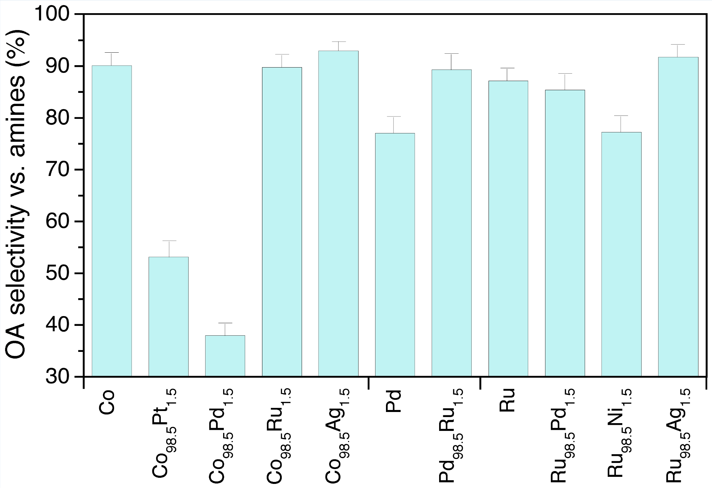

理论模拟导向的催化剂理性高效设计策略用于醇的选择性胺化

第一作者：王涛

通讯作者：Philippe Sautet

 

**研究背景**

胺是工业上生产药物、农用化学品、生物活性剂、聚合物和染料的重要中间体化合物，其中伯胺是衍生化反应的关键试剂。传统合成胺的方法包括氨与烷基卤的直接反应，或通过还原硝基络合物和腈，但是这些工艺的缺陷在于产生有害的副产物、废弃物并消耗大量氢气。而利用氨气通过借氢反应机理直接胺化脂肪类醇用于合成胺被认为是一种有潜力的绿色合成路线并且已经有数千吨规模的工业化应用。然而，合成胺工业仍然面临诸多挑战，尤其是选择性合成伯胺。在此背景下，探索催化剂的本征性质与合成胺活性和选择性的依赖关系变得尤为重要。近年来，理论模拟的飞速发展使得揭示催化过程中的构效关系成为可能。本文结合第一性原理微观动力学模拟和实验，揭示了决定醇的胺化活性和选择性的关键因素并构建了其与碳和氧原子吸附能的依赖关系，实现了该反应金属合金催化剂的理性高效筛选，为实验上醇胺化催化剂的设计和升级提供了重要理论参考。

**内容和讨论**

**A.** **醇的胺化反应机理:** 首先甲醇的胺化被作为模型反应进行研究，该反应机理主要包括三部分(如图1)：醇的脱氢生成醛；醛与NH3迅速反应生成亚胺；亚胺的加氢生成胺。基于上述反应机理，DFT计算在九种过渡金属的密堆积表面系统展开。由于实际反应气氛中具有大量的NH3，因此催化剂的表面会覆盖一定浓度的NH3，早期的研究发现表面覆盖1/9 ML的NH3有助于准确描述胺化反应催化剂的活性顺序。其中，第二步醛与NH3反应生成亚胺被认为是气相里的快速平衡反应而且是理论模拟上的难点，该工作通过详细的反应器动力学模拟证明采用Eley–Rideal 反应机理能够准确描述该关键步骤。最终为微观动力学模拟提供了可靠的反应机理。

**图1**: 甲醇与氨气的胺化反应机理

**B.** **线性降维:** 基于Norskov课题组提出的d带中心理论和scaling关系，反应过程中表面物种的吸附能并非相互独立的而是受制于scaling关系，并且基元反应的能垒也可以通过BEP关系与反应热关联，因此通过详细的描述符的筛选以及线性拟合可以实现降维和最优描述符的确认。由于该反应涉及含C、N、O的三类中间体，scaling关系可以最终将该反应中涉及的中间体的能量与C、N和O原子的吸附能进行关联。然而，包含三种不同描述符导致无法利用典型的二维火山曲线进行活性描述。深入研究发现：N原子的吸附能同样依赖于C和O原子的吸附能并且具有完美的线性关系（如图2）。而该依赖关系的物理化学根源一方面为N(3.0)原子的电负性恰好介于C(2.5)和O(3.5)原子之间，另一方面N原子的最高占据轨道能量(HOMO)可以线性分解为C和O原子的相应能量。基于上述分析，甲醇胺化反应的能量维度被降低为二(C和O原子的吸附能)。

**

**图2**: N原子的吸附能与C和O原子吸附能的线性关系

**C.** **醇的胺化活性和选择性与简单描述符的依赖关系:** 基于图1的反应机理和图2的线性降维，通过构建微观动力学模型，最终建立了醇胺化的反应速率(TOF)与C和O原子吸附能的依赖关系。如图3a所示，由于对C和O原子吸附能力的区别，九种金属分布于火山图的不同位置而呈现出不同的反应活性。然而，针对醇的胺化反应，人们更加关心且关键的问题是选择性。因此，该工作进一步系统考察了导致伯胺选择性降低的不同可能性，最终发现CH3NH和CH2NH物种的耦合是导致选择性丢失的关键因素之一，并巧妙的将其与简单描述符进行了关联，最终构建了醇胺化生成伯胺的选择性与C和O原子吸附能的依赖关系如图3b。随着CH3NH/CH2NH耦合能垒(*E*a)的增加，副反应变得困难，进而催化剂的选择性增加。至此，通过计算催化剂表面C和O原子的吸附能，结合图3中的火山图便可定性预测相应催化剂的醇胺化反应的活性和选择性，从而大大提高催化剂的筛选效率。

**图3:** 醇的胺化活性(a)和选择性(b)与C和O原子吸附能的依赖关系

**D.** **实验室论证预测:** 基于上述活性和选择性图，通过对元素周期表中不同过渡金属进行两两排列组合，最终计算了三百余种双金属合金的C和O原子吸附能，并预测出系列有潜力的醇选择性胺化催化剂。基于上述理论预测，索尔维公司研发中心对不同合金进行了详细的实验室测试以论证图3的可靠性。具体的：本文合成了系列Co基合金催化剂，一方面由于Co金属的相对廉价，另一方面Co具有较高的活性和伯胺选择性。根据图3a的理论预测，提高Co的活性需要设法降低其O原子的吸附能，由于Pt和Pd具有弱的O吸附能力，因此将Co与Pt和Pd形成合金将可以实现反应活性提高的，然而基于图3b的信息，这将同时伴随着伯胺选择性的降低。事实上，图4和图5的实验结果也证实了CoPt和CoPd合金相比Co金属的高活性和低伯胺选择性。此外，图3表明：将Co与Ag和Ru组合将会维持甚至提高活性且提高选择性。该预测结果同样与图4和图5中的实验结果一致，并且成功设计出活性选择性都大大提高的CoAg合金催化剂。本文预测的其他有潜力的合金催化剂也将进一步推动实验上对醇胺化反应研究。

**图4:** 实验上不同催化剂醇的胺化生成伯胺的TOF

**图5:** 实验上不同催化剂醇的胺化生成伯胺的选择性

 

**总结和展望**

通过精确的第一性原理计算和微观动力学方法，准确的模拟了醇的胺化这一复杂反应的详细机理，揭示了决定金属合金催化剂醇的胺化活性和选择性的关键因素，并与简单易得的C和O原子吸附能进行关联，系统的实验测试论证了理论预测的可靠性。最终大大提高了醇胺化反应金属合金催化剂的筛选效率，为工业上醇胺化催化剂的设计和升级提供了参考。此外，该工作采用的改进的动力学模拟方法能够引入反应器环境对复杂反应机理的影响，一方面实现对实验条件更加精准的描述，另一方面能够准确定性预测金属合金催化剂的活性和选择性的变化趋势，为后续高通量催化剂筛选提供了基础。

**作者简介**

文章第一作者王涛博士目前为美国斯坦福大学SUNCAT中心博士后研究员，通讯作者Philippe Sautet为美国加州大学洛杉矶分校教授、ACS Catalysis副主编、法国科学院院士、美国能源局IMASC能源前沿研究中心副主任，长期致力于理论催化方向的基础研究。此外，法国里昂高等师范学院、法国里尔大学、比利时根特大学以及跨国公司索尔维研发中心E2P2实验室也为该工作提供了支持。本文经大师兄涛本人授权发布。

文章链接：<https://www.nature.com/articles/s41929-019-0327-2>

 

关注公众号：大师兄科研网，回复：**胺化**，可以获取下载链接。

