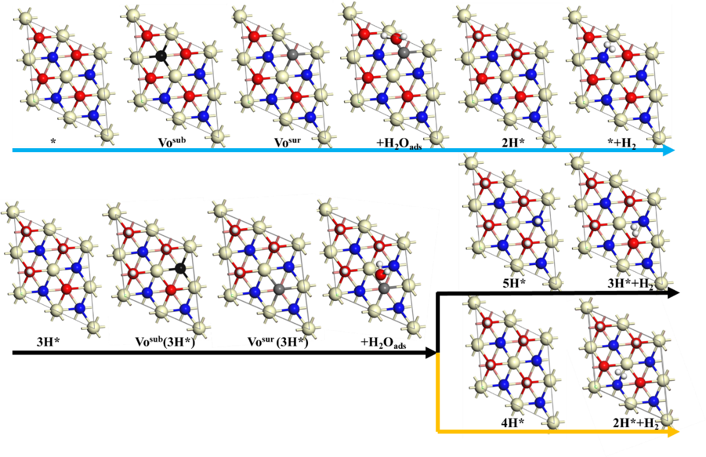
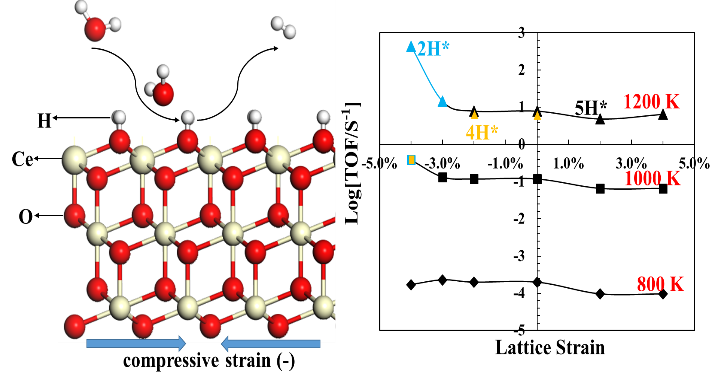

**基于DFT+*U*研究应力调控CeO2(111)催化分解水制氢的活性**

`研究背景`

氢能清洁无污染，是最具潜力的能量载体。使用太阳能、风能和水能转换得到的清洁电能电解水制氢是人来未来最具发展潜力的、可持续的、绿色环保的制氢技术。传统低温碱性电解水制氢技术的效率受限于液体电解质较低的传质过程和氧电极较慢的反应动力。相比于液体传质技术，新兴发展的高温固体燃料电池 (SOEC)技术以固体作为传质媒介，充分利用工业废热提供反应所需的热能，具有极高的传质效率和水电解效率。然而人们对SOEC制氢反应机理尚缺乏深刻认识。计算模拟技术是揭示能源材料领域中多相催化反应过程及机理的重要手段，可以辅助了解SOEC电解水的关键反应步骤，以开发、低廉且稳定的催化剂用于增强氢电极的稳定性以及提高制氢反应在燃料电池中的效率。兼具优异的电子和离子传质能力的氧化铈（CeO2）是SOEC水分解重要的催化剂和稳定剂。CeO2优越的催化活性归因于Ce3+与Ce4+的氧化还原循环。基于密度泛函理论，该工作使用Hubbard-*U**（**U*eff=4.5 eV）修正的方法来描述Ce 4*f*轨道电子的强关联作用，研究表面应力对CeO2(111)催化制氢的影响。

 

`研究内容`

水在CeO2表面分解制氢包括三个基本反应步骤：（1）CeO2(111)表面生成一个氧空位；（2）H2O吸附于氧空位附近最终形成表面OH-；（3）表面OH-分解形成H2并留下一个晶格氧，如Figure 1所示水分解过程中形成的反应中间体以及最终生成H2的反应过程。该工作主要研究了三种可能的反应路径，即不同OH- 覆盖率下形成H2的过程如Figure 1所示。通过研究应力对三种不同反应路径中反应中间体形成的影响，以及应力对各反应步骤反应能垒的调控，来探究应力如何增强CeO2催化制氢的性能。

 

首先，研究发现拉伸应变有效增强了氧空位和OH-等中间体的稳定性，随之增加了各反应步骤的反应能垒。与之相反的是压缩应变可以通过减弱OH-与表面的结合能，从而降低生成H2的能垒。通过计算不同反应温度下中间体的自由能可以获得沿着2H，4H和5H的反应路径能量图。研究发现不管处于何种应力条件下生成氧空位和氧空位的扩散，以及OH-的形成不需要很高的能量势垒，而OH-分解形成H2是水分解制氢反应路径中能垒最高的一个步骤。然后，通过对比不同反应温度下，研究发现在温度低于1000 K时，沿着5H路径可以最快速地水分解生成H2 如图2所示，且最佳反应路径不受应力的影响。然而，当温度升高到1200 K时，应力有效地调控了制氢的反应路径，即拉伸应力下最优路径沿着5H，而在压缩应力下最优反应路径沿着2H或者4H。此外，研究还发现反应速度随着压缩应力的增大而增快，且当压缩应力大于3%时，反应速度获得显著提升。因此，计算模拟理论研究显示压缩应力（>3%）有利于增强CeO2(111)催化水分解制氢的反应活性。

图1. 2H，4H和5H覆盖的CeO2(111)表面生成H2的反应路径示意图。黄色, 红色，蓝色，白色，黑色和灰色原子球分别代表Ce，表面O，次表面O，H，次表面氧空位和表面氧空位。

 

图2不同反应温度与应力条件下最优反应路径生成H2的反应速度对比图。

`作者简介`

本文第一作者，武甜甜为丹麦科技大学能源转化与储存系博士后研究员。

Google Scholar： 

https://scholar.google.com/citations?user=rm84jfsAAAAJ&hl=en

指导老师为：Tejs Vegge教授。

课题组主页：https://www.dtu.dk/english/service/phonebook/person?id=5334&tab=1。

本文经作者授权发布，版权属于第一作者。