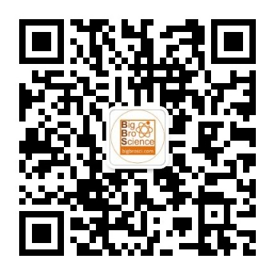

Python现在越来越流行，连微信朋友圈都开始推广一些python培训课程广告了：俩美女一起上班，一个瞬间完成工作，另一个一脸懵逼地问道你咋这么快就干完活啦？另一个回答道：因为我学习了Python啊。是的，Python确实有这些神奇的功效，但在网络这么发达的时代，想学习python的途径有很多，参加什么割韭菜的培训班啦，找个计算机学院的男女朋友啦，向师兄师姐学习啦，自己学习琢磨啦等等。

学习Python的一个好处就是，很多懂python的都会github上分享一些自己的脚本，但这些脚本很多时候不是为你的课题量身定制的。稍微懂点可以加以修改就变成自己科研的一个利器了。更重要的好处就是广告里面所凸显的，由于计算中很多操作都是可以重复的，写个小脚本可以快速完成自己的工作任务，提高效率，省出时间该干嘛干嘛去。此外，很多复杂的任务，手动计算量很大，也得需要写点脚本来帮忙。那种瞬间完成任务的感觉，不会点程序语言的人是不会体验到的。而且，现在小学生，初中生都开始学习python了，我们也没有理由不跟上时代的潮流。

看到这里，应该能明白本文的目的。不要你交99元，也不给你优惠99元。大师兄推荐一本武林秘籍，专门针对科研人员的一本科学计算相关的Python书。里面大量例子简单易懂，解释详细，带你缓缓走入Python的程序世界，平日闲的没事加以练习，犹如武林高手给你灌输真气一般，达到计算的另一个境界，轻而易举超越那些培训班被割过的韭菜们。

获取方式，扫描右侧或者下方二维码关注公众号：大师兄科研网，回复：**武林秘籍** 就可以获取下载链接了。为了避免别人学会了python跟你抢男女朋友，课题组争宠，大家下载后私下练习就OK啦，有对象的，一起练习讨论效果更佳。

