感谢吕梁超算中心的支持，以后VASP的学习系列练习，都将在天河二号上面进行展示操作。一方面帮助大家继续学习VASP知识，另一方面也帮助大家快速掌握使用超算中心计算的技巧，进而避免一些焦头烂额的琐事。今天我们先讲解一下怎么在Ubuntu系统上，1）安装VPN, 2）连接天河二号超算中心，3）以及将超算中心挂载到本地电脑上，进行文件互传。

如果你是Windows用户，管理员在发送账号的时候，已经将使用说明一起发给你了。相信大家都可以顺利链接。那么请跳过本节内容。

但是Linux系统在计算具有的独特优势是Windows所不能比的，建议Windows用户继续看下去，对以后使用Linux系统做计算会有帮助。下一节，我们介绍如何使用脚本运行VASP软件，由于本人还在摸索，需要和管理沟通学习，大家再耐心等待一天。如果你想要试用或者申请超算中心的机时，请加QQ群：国防科大吕梁超算中心（204521798）了解更多的信息。

* * *

## 1 下载Linux版的VPN软件：

链接：[https://www.hillstonenet.com/our-products/next-gen-firewalls-e-series/](https://www.hillstonenet.com/our-products/next-gen-firewalls-e-series/)

直接跳到网页最底部，右侧点击 Linux OS 下载。**注意**：这个VPN不支持Ubuntu17 和 18的版本。

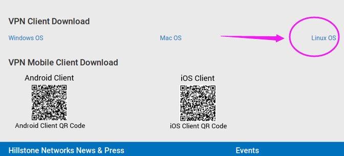

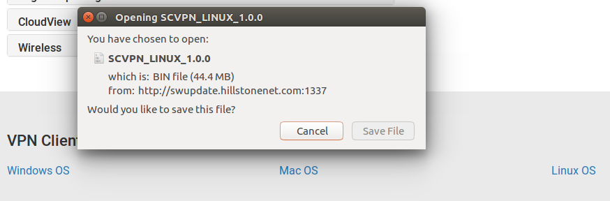

* * *

## 2 安装Linux 版VPN

Hillstone 官网已经给出了详细的安装说明， 链接如下：

[http://docs.hillstonenet.com/en/Content/7_VPN/SSL_VPN_Client_L.htm#Starting](http://docs.hillstonenet.com/en/Content/7_VPN/SSL_VPN_Client_L.htm#Starting)

大家可以参考链接，也可以根据下面的步骤进行。本人直接将官网的照片复制过来了。

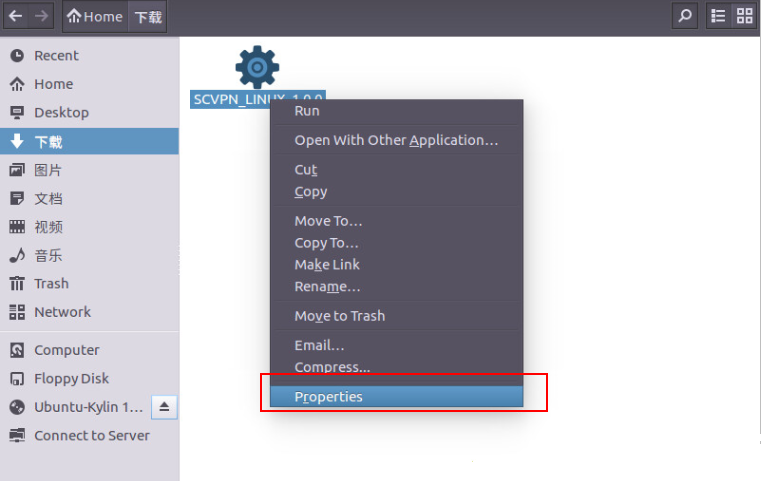

找到刚才下载的vpn软件： 右击 --> 点击最底部的Properties

* * *

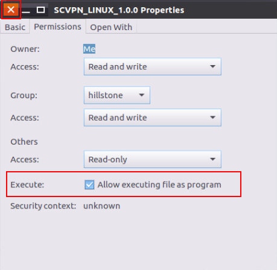

在弹出的窗口中，将Execute的那个框选中，然后点击左上角的叉号直接关闭。、

双击这个软件的图标，一步一步点下去，这样就完成安装啦，同时桌面上会生成VPN的快捷方式图标。

* * *

## 3 连接VPN

1） 打开VPN：双击桌面的VPN图标，会弹出让你输入电脑密码的对话框，输入密码，点击Authenticate按钮。

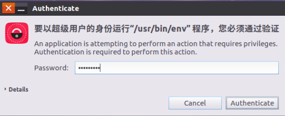

2） 点击下图中的New 对应的加号，会弹出对话框，让你输入IP，账号密码

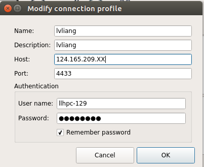

注意：

* Name, Description 这两项随便填。

* Host的IP超算中心给了三个，大家根据自己的网进行选择，如果一个不行，换另一个试试即可。

* Port 就是 4433

* User name和Password是VPN的账号和密码！！！
* 一定要选中Remember Password. 因为管理员给的密码实在是太安全了，Linux的VPN不能修改密码。如果嫌密码麻烦，可以在Windows连接成功后，修改VPN的密码。

4） 点击OK就开始连接了

5） vpn的官网的填写说明，大家把网页中的第三条展开就可以看到了

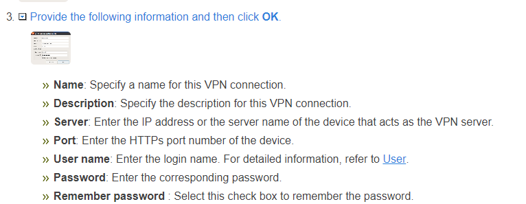

6） 连接过程以及成功是这个样子：

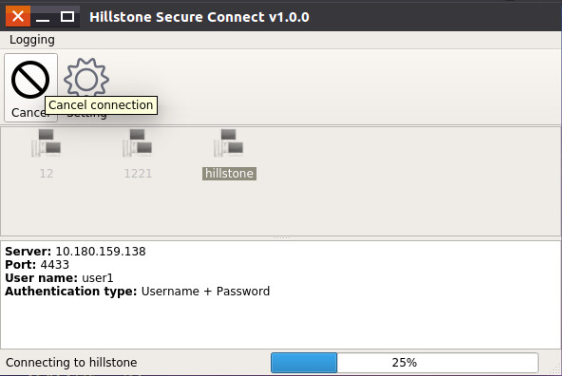

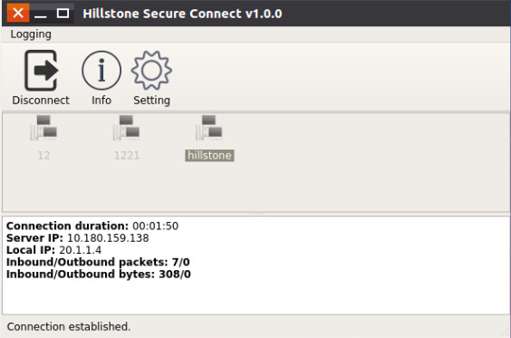

* * *

## 4 通过ssh连接超算中心服务器：

VPN登录成功后，后面我们就可以通过Terminal连接超算中心了。为了方便，提高效率，强烈建议大家按照下面的步骤进行：

1） 安装sshfs 

这个用于把超算中心挂载到你的本地电脑上，后面再细说，先安装好。可以命令行一键搞定。

```
sudo apt-get install sshfs
```

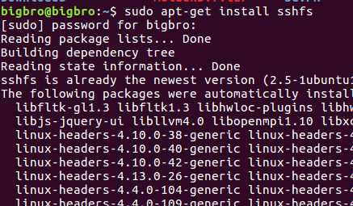

2） 在home目录下建一个文件夹，名字为： lvliang

```
mkdir ~/lvliang
```

3） 将下面的内容加入到 .bashrc 文件中，将下面代码中的`172.16.20.XX` 换成超算管理员发给你的IP地址。

```
####lvliang###
alias lvliang='ssh iciq-lq@172.16.20.XX'
alias mlvliang='sshfs iciq-lq@172.16.20.XX: ~/lvliang/'
alias ulvliang="sudo umount ~/lvliang  -l"
```

* lvliang 这个命令用来连接超算中心，提交任务，运行命令处理任务等
* mlvliang 用来挂载超算中心到你的电脑上，相当于把超算中心看作成一个移动硬盘
* ulvliang 用来卸载超算中心。

4） 保存后，更新下 .bashrc 文件，然后直接敲命令： lvliang 即可连接超算中心。

第一次连接，可能会出来一堆提示东西，输入Yes ，回车即可。

输入自己的超算中心账号密码，就可以登录啦。

```
qli@bigbro:~$ . .bashrc 
qli@bigbro:~$ lvliang 
iciq-lq@172.16.20.10's password: 
Last login: Tue Dec  4 18:22:59 2018 from 172.16.31.135
```

5）新用户刚开始的时候主目录下面什么都没有，强烈建议大家建一个 bin 文件夹，用来存放脚本。直接 `mkdir ~/bin` 即可。

* * *

## 5 上传或者下载数据（sshfs的使用）

1） 挂载超算中心到自己的本地电脑。

打开一个新的终端，

* 输入前面我们写进.bashrc文件中的命令： mlvliang (m是mount的缩写)。
* 输入超算中心的密码：

```
qli@bigbro:~$ mlvliang 
iciq-lq@172.16.20.10's password: 
qli@bigbro:~$ cd lvliang/
qli@bigbro:~/lvliang$ ls
bin  LVASPTHW  POTCAR  test_jobs
qli@bigbro:~/lvliang$ 
```

现在超算中心就成功被挂载到我们电脑上了，我们可以随时进入并访问超算中的文件夹，通过`cp、mv、rsync`等命令往里面传数据，或者下载数据到本地的电脑。

* * *

2） 例子1 ：

挂载超算中心登录后，我们将Ex01的文件下载（通过`cp`命令）到本地电脑桌面上。

```
qli@bigbro:~/lvliang$ ls
bin  LVASPTHW  POTCAR  test_jobs
qli@bigbro:~/lvliang$ cd LVASPTHW/
qli@bigbro:~/lvliang/LVASPTHW$ ls
ex01  ex02  ex03  ex04  ex05  ex06  ex07  ex08  ex09  ex10  ex11  ex12  ex13  ex14  ex15  ex74  ex77  ex78  potcar
qli@bigbro:~/lvliang/LVASPTHW$ cp ex01 ~/Desktop/
qli@bigbro:~/lvliang/LVASPTHW$ ls ~/Desktop/ex01/
INCAR  KPOINTS  POSCAR  POTCAR
```

3） 例子2 ：

我们将电脑桌面的ex16文件夹上传（通过`cp`命令）到超算中。

```
qli@bigbro:~/lvliang/LVASPTHW$ ls
ex01  ex02  ex03  ex04  ex05  ex06  ex07  ex08  ex09  ex10  ex11  ex12  ex13  ex14  ex15  ex74  ex77  ex78  potcar
qli@bigbro:~/lvliang/LVASPTHW$ cp ~/Desktop/ex16 .
qli@bigbro:~/lvliang/LVASPTHW$ ls
ex01  ex02  ex03  ex04  ex05  ex06  ex07  ex08  ex09  ex10  ex11  ex12  ex13  ex14  ex15  ex16  ex74  ex77  ex78  potcar
qli@bigbro:~/lvliang/LVASPTHW$ 
```


4） 注意事项：

1） 必须通过mlvliang这个命令将超算中心挂载到本地电脑上之后，我们才可以互传文件。

2） 如果还没有挂载，就将电脑的内容复制到lvliang这个文件夹中，那么挂载之后，服务器中不会显示刚刚复制的内容

3） 不要用鼠标点击电脑里面的文件夹查看文件，这样会很慢，只能使用命令！！！切记！！

4） 卸载的时候，使用mlvliang 这个命令，然后输入自己的电脑密码（不是超算中心的了。）

5） 我们这样做，相当于把超算中心当做一个移动硬盘来使用，非常方便。


## 6 异常问题的处理

1）挂载超算中心到本地电脑上的时候，有时候因为网络连接，会出现下图中的错误。这时候我们先使用`ulvliang `命令把超算中心卸载掉，然后再重新挂载就可以了。

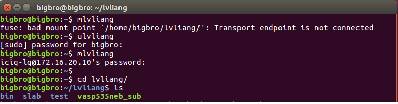

2） 如果上面还解决不了的话，可以尝试着先关机，出去溜达一会儿，然后回来再弄。或者找超算管理员解决。他们一般都很上心，服务响应很快。


## 小结

本节就先介绍到这里，大家可以通过这样的方式，安装VPN，连接以及挂载超算中心，并将自己的文件上传到超算中心（比如VASP的那一堆POTCAR文件，自己的脚本，任务文件等等）。先把准备工作做好，下一节我们就可以提交任务进行计算了。