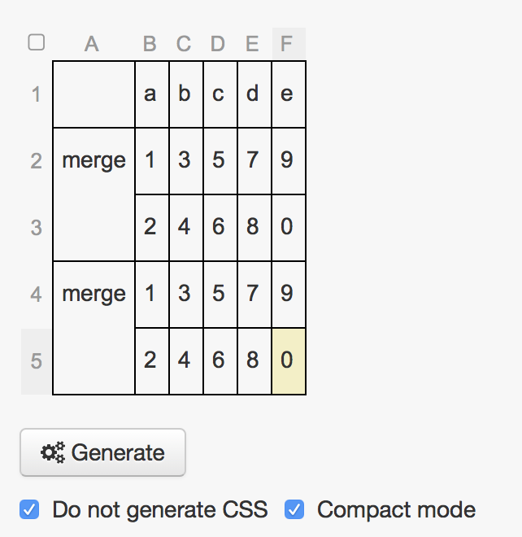
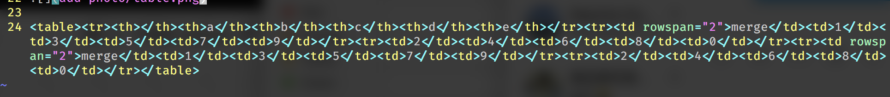

# 如何在不使用外部图床的情况下插入图片等资源文件?

1. 在hexo根目录执行 `hexo new 'article-name'` ;
2. `cd source/_posts` 就可以看到生成了 `article-name.md` 和 `article-name` 文件夹
3. 将资源文件放入 `article-name` 文件夹内,然后在 md 文件中使用相对路径引用即可,如
``

# 如何插入复杂表格

只需要使用[这个网站](http://www.tablesgenerator.com/html_tables)绘制出自己想要的
表格样式，注意去掉生成 CSS 的选项和选择兼容模式（让代码显示在一行）,如图所示

然后就大功告成

<table><tr><th></th><th>a</th><th>b</th><th>c</th><th>d</th><th>e</th></tr><tr><td rowspan="2">merge</td><td>1</td><td>3</td><td>5</td><td>7</td><td>9</td></tr><tr><td>2</td><td>4</td><td>6</td><td>8</td><td>0</td></tr><tr><td rowspan="2">merge</td><td>1</td><td>3</td><td>5</td><td>7</td><td>9</td></tr><tr><td>2</td><td>4</td><td>6</td><td>8</td><td>0</td></tr></table>
