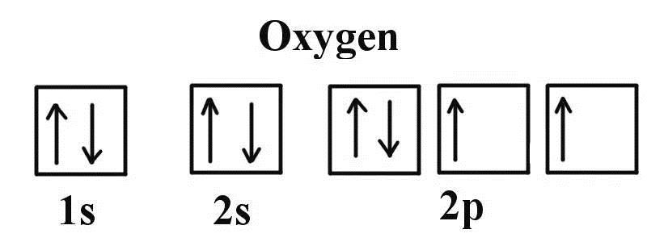
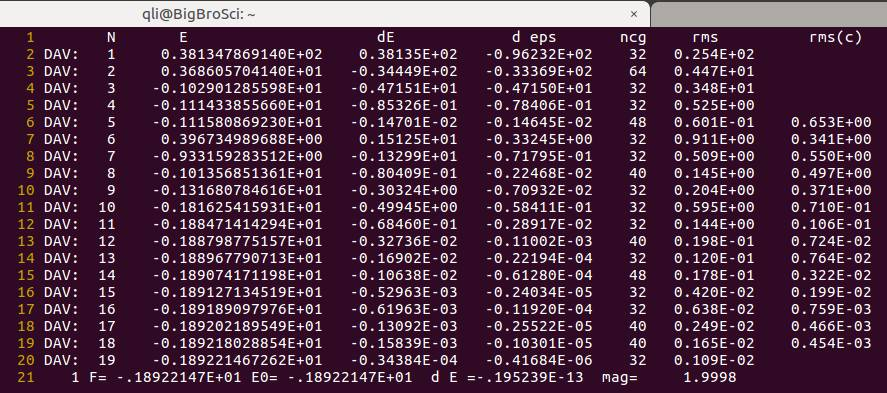
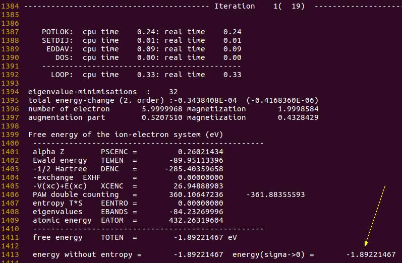
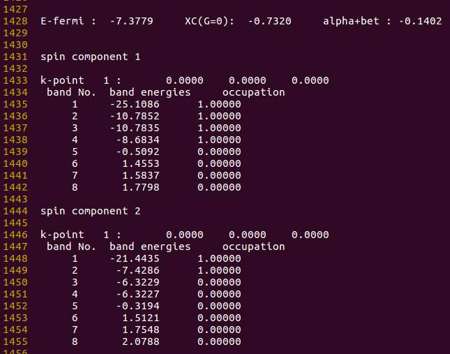

# 本节提要

前面的扩展练习中,要求大家结合自己的化学知识,判断计算结果是否正确。相比很多同学已经知道了氧原子含有磁性,我们在计算用需要考虑进去。在本节练习中,大师兄教给你如何分子氧原子在轨道中的占据情况,判断计算是否合理,并正确进行氧原子能量的计算。

# 氧原子轨道

氧原子的电子构型是 $1s^2 2s^2 2p^4$ ,轨道占据情况如图:



所以氧原子含有两个单电子,具有磁性,且磁矩为2 $μ_B$。

# 计算结果

我们看一下前面的计算结果:

## OSZICAR


## 能量信息:


## 电子占据情况: (OUTCAR 中查看)


- Band1 含有两个电子, 对应的 $2s^2$ ;
- Band 2-4 为三个简并态,每个能带上有 1.33 个电子, 对应的 $2p^4$ 。

但在这里,电子的占据是不正确的:

- 因为 $2p_x$ 轨道上含有两个电子, 而不是把 $2p_x$ 上的一个电子平均分配到 3 个 p 轨道上;
- 此外,通过这个电子的占据情况,我们不能正确得到氧原子的磁矩信息。

那么怎么解决这个问题呢?

# 分两步解决问题

## 第一步: 
由于氧原子具有磁性, 自旋极化计算要进行考虑, 在 VASP 计算中, 需要在 `INCAR` 中添加一项: `ISPIN = 2`

`ISPIN` 的取值为 `1` 或 `2`: 
​	1. 代表不考虑自旋极化,是VASP的默认值;
​	2. 代表打开自旋极化该选项,计算中考虑。

## 自旋极化什么时候该加呢?

需要考虑自旋极化一般来说有以下几种：（新手记住前面4个即可。）

* 单原子的计算,
* O$_2$ 分子(基态为三重态)
* 自由基相关的计算
* 含Fe,Co, Ni 的体系
* 要计算的体系具有磁性：顺磁，铁磁，反铁磁等，要打开自旋极化。
* 当关注体系的电子性质时，且自己不知道加或者不加的时候，建议加上。

如果你不知道自己的体系是否要考虑自旋极化，可以简单做这样的一个测试：

* 测试1：不加自旋极化，正常算，得到结果1；
* 测试2：加上自旋极化，并在INCAR中添加： `LORBIT = .TRUE.` 
* 测试2中OUTCAR的末尾会输出各个原子的磁矩信息：
  * 如果体系中原子的磁矩不为0，那么需要考虑自旋极化，
  * 如果体系所有原子的磁矩都为0，那么就不需要考虑自旋极化，而且此时，你会发现测试1 和 2的结果中：结构和能量是一样的。


添加该选项后,重新计算,结果如下:

### INCAR

[//]: !INCAR(ex08-calculate-oxygen-atom-energy/INCAR_2.jpg)

```fortran
SYSTEM = O
ISMEAR = 0
SIGMA = 0.01
ISPIN = 2
```

### OSZICAR


可以看出, 加了自旋极化后, **电子迭代步数增加了**, 这是因为体系中的电子被强制分成了 $\alpha$ 和 $\beta$ 两种, 并分别进行计算, 因此增加了计算量。

体系的磁矩大小在 $OSZICAR$ 中查看, 对应右下角的 `mag=`  该项, 从这里我们可以看到, 磁矩信息与我们已知的 2 $\mu_B$ 吻合, 这一点是合理的, 正确的。

### OUITCAR 中的能量信息:


 考虑自旋极化后,体系的能量降低了。

-----------

 我们重点通过查看体系的电子占据情况, 判断该计算是否合理: 


从图中可以看出,结果由两个 `spin` 组成: spin component 1 和 2: 
spin component 1 中含有 4 个电子, 另一个中含有 2 个电子:


参考该图,可以看出 spin component 1 为自旋向上的 $\alpha$ 电子, 另一个是自旋向下的 $\beta$ 电子。

但是:

	1. Spincomponent 1中,能带2-4中3个alpha 电子的能量是一样的。这不正确，因为其中一个2px轨道中的alpha电子已经成对,能量要比py 和 pz 低;描述失败!
	2. spincomponent 2 中,另一个beta电子还是平均分配在了三个能带上面。

电子占据依然不合理。


上面的结果是由于体系的高对称性导致的简并所造成的。 $8 \times 8 \times 8$ 的立方体格子, 在这里具有高阶的点群对称性: $O_h$, 见 `OUTCAR`


在 GGA 泛函中, 为了获得体系更低的能量,对于原子来说,通常会采用一种 `symmetry broken solution` 的处理方法。 但是在 VASP 计算中, 体系的对称性则是通过晶胞来获得, 即把这个晶胞当成一个原子来处理, 因此我们需要手动改变晶胞的形状来消除对称性造成的简并结果。 (此处的解释可能有些牵强, 有兴趣的可以查找与 symmetry broken solution 相关的文献)

---------

INCAR, KPOINTS, POTCAR等均保持不变。修改POSCAR, 如下:

### POSCAR

```fortran
O
1.0
7.5 0.0 0.0
0.0 8.0 0.0
0.0 0.0 8.9
O
1
Cartesian
0.0 0.0 0.0
```

通过改变格子在三个方向的大小, 降低对称性。 大师兄还尝试了三斜的格子, 结果和这个是一致的。 (有兴趣的可以尝试下)

### POSCAR
```python
O
1.0
	7.5		7.6		0.0
	0.0		8.2564		8.2
	8.5		0.0		8.9
O
	1
Cartesian
	0.0		0.0		0.0
```

----------

下面我们看一下改变晶胞为7.5 x 8.0 x 8.9后的计算结果:

### OSZICAR



`OSZICAR` 中电子迭代步数又增加了, 这是因为对称性的降低增加了计算量。

磁矩为 $2\mu_B$ ,这一点跟前面一样,正确!

----------

体系的对称性: 从 $O_h$ 降低到了 $D_{2h}$
### OSZICAR


----------

能量信息:

### TOTEN


跟前面能量相比, 可以看出, 对称性降低后, **体系的能量进一步降低了**。

----------

电子占据情况:

### OUTCAR


----------

# 分析

1. 在 $\alpha$ 电子(spin component 1)中, 能带1 是 $2s$ 中的 $\alpha$ 电子; 能带2-3为两个简并轨道, 对应 $p_y$ 和 $p_z$ 电子, 能带 4 位于 $p_x$ 中的 $\alpha$ 电子。 这里能带 4 的能量应该比 2 和 3 要低, 但结果恰恰相反, 描述不合理;
2. 在 $\beta$ 电子(spin component 2)中, 能带 1 是 $2s$ 的 $\beta$ 电子, 能带 2 为 $p_x$ 中的 $\beta$ 电子, 此时该 $\beta$ 电子占据了一个轨道, 而不是分布在三个 $p$ 轨道上, 结果是合理的。

- 计算到这里, 已经是 VASP 官网对于单原子能量最为完整和准确的计算了。 虽然上面 $p_x$ 的 $\alpha$ 电子比 $p_y$ 和 $p_z$能量高, 至少电子的轨道电子占据情况是正确的, 且磁矩和简并的错误已经消除。 由此可见, VASP对于单原子的电子占据情况(至少对于 O 原子来说), 虽然取得了部分理想结果, 但还是有不足的地方。

- 此外,体系的对称性可以通过 `ISYM` 来控制( 扩展阅读 [ISYM](http://cms.mpi.univie.ac.at/vasp/guide/node115.html) ), `ISYM = 0` 的时候, 不考虑对称性进行计算.

- 大师兄也尝试过了将 `ISYM = 0` 应用在 $8 \times 8 \times 8$ (test3)以及 $7.5 \times 8.0 \times 8.9$ (test4) 的格子里进行计算。 对于电子占据情况来说, 均得到了与前面 $7.5 \times 8.0 \times 8.9$ 一致的结果。 但是使用 $7.5 \times 8.0 \times 8.9$ 所得到的能量更低(test4 的能量比 test3 低)。

- 使用 $7.5 \times 8.0 \times 8.9$ 格子时, `ISYM = 0` (test4) 和采用默认值, 得到的能量结果是相同的, 因此, 改变晶胞的对称性在计算单原子能量的时候是必须的, 单独通过 `ISYM` 这一项不考虑对称性是远远不够的。

# 扩展阅读

1. `ISYM`: http://cms.mpi.univie.ac.at/vasp/guide/node115.html
2. 重现本节所有练习, 并自己认真分析结果, 查看电子占据情况, 体系的磁性, 以及能量信息。

# 总结

1. 知道什么时候使用自旋极化计算,怎么进行自旋极化计算;
2. 知道为什么自旋极化后计算量增加了;
3. 知道在哪里查看体系的磁性信息;
4. 知道为什么对称性降低后计算量增加了;
5. 会分析单原子中电子轨道的占据情况;判断结果是否合理;
6. 知道通过改变晶格大小调节体系的对称性从而消除简并对能量的影响;
7. 知道ISYM这一个参数,在计算单原子能量中,ISYM的作用远远不及改变晶格大小;
8. 知道vasp也存在自己局限性,不要完全相信。
