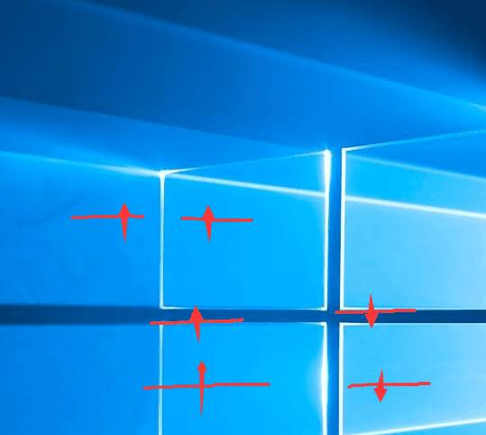
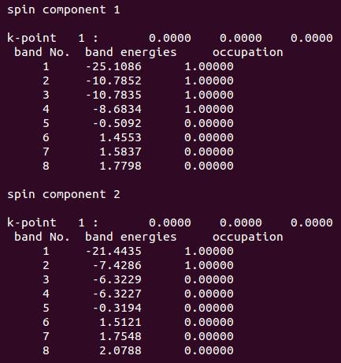
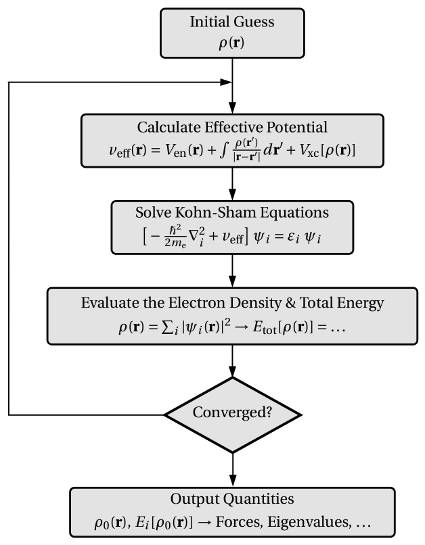
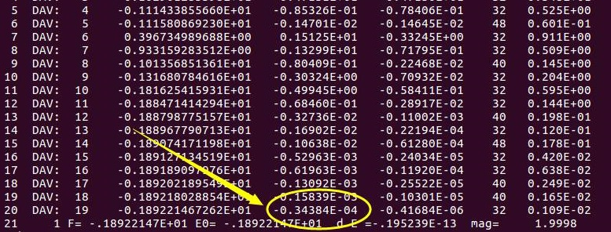
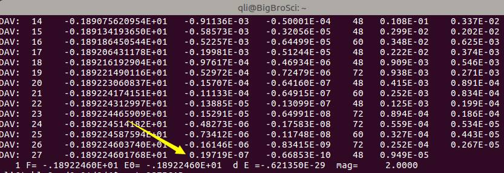
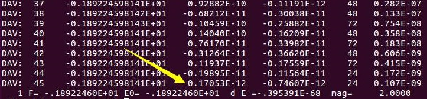
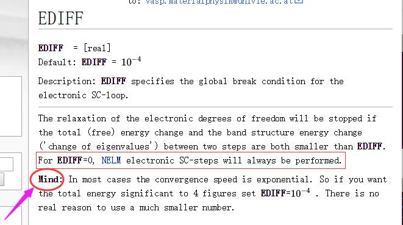

前面一节我们学会了正确计算氧原子的能量并分析电子在轨道中的占据情况，这一节稍作总结补充。

 

### 复习上节内容

在VASP计算的O原子的电子结构讨论中，来自不莱梅大学的群友，画了一幅画，大家可以看下:





VASP的结果分析完毕后如下:





看画填数，照猫画虎：


由此可见，VASP对于氧原子的描述不是很准确（不理解的请看上一节的详细描述)。而这一点，VASP官网你是找不到的。因此，在计算的时候，对于自己的体系有一个清晰的化学物理印象很重要。VASP的结果也要有针对的去判断。有的时候，即使计算收敛了，但没有体现出任何正确的物理或者化学意义，那就是单纯的数学收敛，结果是不可取的。VASP是一个计算的工具，如何正确分析和判断它的输出才是关键的。这一点我们在后面的学习中也会反复强调。


### VASP是怎么判断收敛的?

我们看一下VASP的迭代计算过程：

​                                               


* 首先，它会猜一个初始的电子密度，然后据此计算体系的势能，求解KS方程，并给出体系的总能量以及对应的电子密度，也就是我们之前说的电子步的优化。

* 将最新一步的结果与前面进行对比，当前后两者的差值达到我们预设的收敛标准时，计算结束。

* 这个预设的收敛标准在VASP中通过两个参数来描述：EDIFF 和 EDIFFG。

* EDIFF 控制电子步（自洽）的收敛标准。在O原子的计算中，由于我们不需要优化，直接进行静态计算，完全由EDIFF控制计算的收敛情况。EDIFFG后面我们再介绍。





 从图中可以看出：第19步和18步的能量差为：-0.3484 E-04，停止迭代，开始输出结果。这是因为VASP计算中EDIFF的默认值是 1 x 10-4。

 

### 鱼和熊掌的关系

**那么：**

**是不是精度越高，计算越准确呢？ 这是肯定的！**

**是不是计算都需要这么高的精度呢？ 这肯定不是的！**


精度高（鱼：<・)))><<）意味着需要更多的迭代次数，也就是需要更多的计算时间（熊掌）。下图是收敛标准从默认值的1E-4 降低到1E-7后的收敛情况：单迭代次数从19增加到了27，相当于增加了原来1/2的工作量。所以，精度太高，计算量会增加。应了那句流行语：请在wifi下观看，土豪随意。

 


我们看一下扩展阅读的内容:

 


第一点：官网说（红色方框中内容）：如果我们把收敛标准设置成0，那么迭代会永远进行下去。大师兄很感兴趣，便设置：`EDIFF = 0`测试了一番，结果如下:





可以看到，在45步迭代之后，精度收敛到1E-12，VASP便停止了，而不是所谓的always! VASP又把俺们给骗了!

骗归骗，但计算量的增加确是铁打的事实，从1E-4的19步，增加到了45步。


思考另外一个问题：既然精度从默认值1E-4提高到1E-12 (8个数量级)，那么我们算出来的氧原子能量有什么变化呢？看下图:

```
iciq-lq@ln3:/THFS/home/iciq-lq/LVASPTHW/ex09$ ls
0  4  7
iciq-lq@ln3:/THFS/home/iciq-lq/LVASPTHW/ex09$ ta.sh
0        -1.89224598
4        -1.89218308
7        -1.89224603
```


图中的0， 4， 7 分别代表EDIFF为 0，  1E-4和 1E-7 的情况，我们可以看出，这三个计算结果中，能量随着EDIFF的减小变化甚微。当然，这也与我们简单的测试体系有关系。倘若计算N多个原子的体系时，不同的精度间的差值会有所增大。上面图中使用了一个小脚本：`ta.sh`，内容如下：

```bash
#!/usr/bin/env bash
for i in *; do
if [ -e $i/OUTCAR ]; then
echo -e  $i "\t" $(grep '  without' $i/OUTCAR |tail -n 1 | awk '{print $7}')
fi
done
```


### 如何看VASP的说明书

那么我们再看一遍VASP官网的说明，注意底部的Mind部分:





大家在浏览VASP官网的时候，凡是带有`Mind`，`Important`字样的，它们后面的文字一定要认真阅读，把握其中的含义。因为这都是大家常见的疑难点以及易错的地方。收敛速度跟`EDIFF`的值成指数关系，在大多数的情况下，`1E-4`足以胜任，没有必要采用其他的数值，如果大伙感觉不放心，大师兄建议`1E-5`即可。

 

### 几何优化的收敛标准


目前还没有介绍几何优化，先简单介绍下EDIFFG这个参数，大家知道即可，后面学习到了再回来看。


我们优化几何结构的时候，当结构前后变化达到我们设定的要求时，便停止优化。而这个设定的要求，就是通过EDIFFG来控制。

* 对于优化，我们可以使用力作为收敛标准，此时EDIFFG为负值。一般来说取值在-0.01到-0.05之间(-0.01对于力收敛来说已经是一个很严格的要求了)。
* 当然，对于较大的体系，我们也可以使用能量作为标准：此时，EDIFFG 为正值，一般取值范围在0.0001-0.001即可。

 **注意:**

不要把正负值弄错了。大师兄见过一个群友这么设置的: EDIFFG = -0.0001。然后在群里咨询为什么他的计算不收敛。这就好比在没有WiFi的时候，装成土豪看视频，卡里的钱扣完了，视频才看到一半…..前面说到，`EDIFFG = -0.01`的时候收敛就已经够费劲了， 你再加个0，莫不是要算到天荒地老？

 

##### 小结一下

EDIFF，EDIFFG 是控制收敛标准的两个参数。前者负责电子自洽过程(单个离子步内)，取值为1E-4或者1E-5即可，没有特殊要求，不建议设置的太低。后者负责结构优化的过程(可正可负)。对于EDIFFG，默认值采用能量收敛，标准为:EDIFFx10。


### 扩展训练:


1 EDIFF: https://cms.mpi.univie.ac.at/wiki/index.php/EDIFF

2 在1的页面中，左侧框中搜索`EDIFFG`，查找相关参数;

3 继续查询之前了解的相关参数，学会使用改网址;

4  根据前面所学，进行O$_2$分子的静态计算，并分析其轨道结果，判断是否合理。


### 总结


* 重温了一下上节的结果，不要完全相信程序的结果，物理，化学意义更为重要;
* 初步了解VASP的迭代过程，
* 必须掌握EDIFF在电子步中的作用，取值大小与收敛速度的联系，也就鱼和熊掌的关系；
* 死死记住EDIFFG代表的含义，取值可正可负及其默认值;
* 经常浏览VASP官网，尤其是Mind，Note， Important等后面的部分;（眼睛要尖！）
* 建议大家浏览VASP的Wiki版网页(左下方原文链接)，搜索相关参数，里面的公式较之前模糊的形式，有了很大的改进。
* 目前VASP官网国内上不去，掌握科学上网的技巧也是做科研的必须技能。