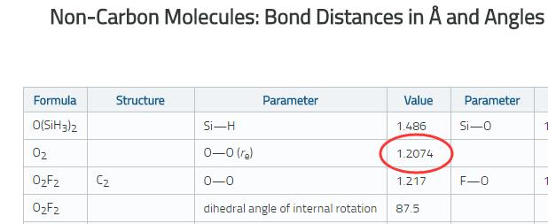
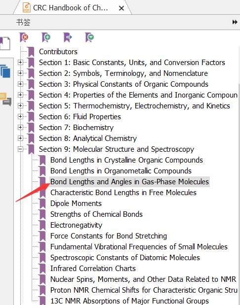
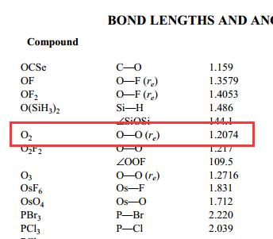
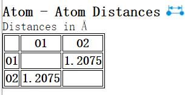
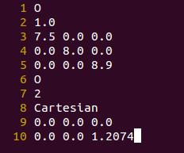
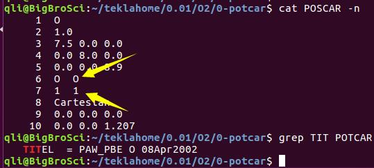
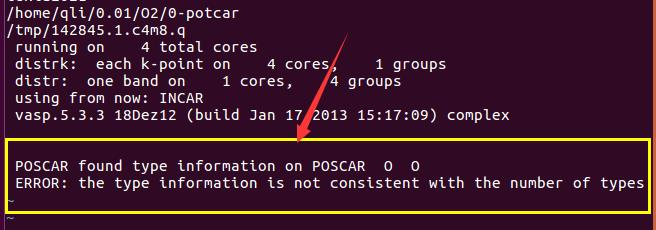

前面O原子的能量计算已经告一段落，下面我们把体系变得更加复杂些：O${_2}$分子。扩展练习已经做的同学，相信现在已经完成了O${_2}$分子的静态计算。本节我们主要介绍一下:

* O${_2}$分子模型搭建的细节;
* POTCAR和POSCAR的对应关系，注意事项。

 

### 搭建模型

O${_2}$分子模型的搭建其实很简单，将两个原子在一个直线上连起来就行了。 键长大小可以书本上查， 数据库里找，也可以去网上找些参考资料。大师兄推荐常见常用的数据库:

1）[CRC hand book](http://hbcponline.com):  

* 网页版:  http://hbcponline.com/faces/contents/ContentsSearch.xhtml  



* PDF 电子书，这个网上到处都有，大家自己搜搜就能找见。具体在1403 页(本书有2661页，建议大家查询的时候先把左侧的目录展开，要不然实在是太痛苦!)






2） NIST 数据库: http://cccbdb.nist.gov/exp2x.asp



3) Wikipedia，谷歌和百度:

在谷歌或者百度里面直接搜索O$_2$、键长这两个关键词，就可以得出很多的链接，比如下面两个。

https://zhidao.baidu.com/question/101615129.html

http://www.science.uwaterloo.ca/~cchieh/cact/c120/bondel.html 


大师兄你特么在逗我嘛？

氧气原子这么简单的分子，随便一番，当然到处都能得到结果啦!

哈哈，没有逗你。在这里，大师兄想要告诉你的是：

* 搜索的时候尽量用谷歌，而不用百度；
* 尽量搜英文，不要输汉语，这样你得到的信息会相对多一些。

师兄，你又在逗我，谷歌我们访问不了，怎么用啊？ 

没有逗你，现实是残酷的，没有google，科研会被百度严重拖后腿。虽然我也不想批评国产，谁让它不争气呢？

所以，科学上网的技巧，你要get到。


**划重点：**

前面介绍了一堆，主要目的有3个：

1) 给大家提供一个数据查询手册(CRC handbook)和数据库(NIST)。当然根据自己的研究方向，还有其他更加专业的数据库，随着学习的深入，后面会讲解。 此外，写论文的时候，如果实在不想找相关的参考文献，可以直接引用CRC hand book这本书（前提是你在这本书里面找到了相关的数据）

2) 查找数据库另一个重要的原因是：如果你的初始结构，比较理想，这会大大加速你的计算过程，还会避免一些意想不到的计算错误（后面的章节会具体介绍到）。

3）除了查找数据库，别人发的文章也是初始结构的重要或者主要来源。

 

###  模型搭建


知道了键长信息后，开始结构搭建O$_2$的模型，我们知道它是直线型分子（算大师兄没说），其中一个原子在原点的位置上了，那么我们在三个方向上随便找个坐标就可以了。修改POSCAR如下:





两点要注意：

* 第7行原子个数：把1改成2 ，表示氧元素有2个原子。

* 第10行添加第二个氧原子的坐标：

| 方向  | 坐标               |
| ----- | ------------------ |
| 沿x轴 | 1.2074   0.0   0.0 |
| 沿y轴 | 0.0   1.2074   0.0 |
| 沿z轴 | 0.0  0.0  1.2074   |

上图中为沿着z轴方向。**注意**： 

* xyz三个方向的数值之间可以有1个或者若干个空格，不要用tab分割数字；
* 在搭建模型的时候，脑子里要有一个立体的概念，原子在三维方向上的排列，移动变化等。 


### 关于POTCAR

 

大师兄，氧原子多了一个，POTCAR怎么办？是不是每个原子对应一个POTCAR啊?

不是的。POTCAR 是根据POSCAR中的元素顺序创建的(第6行)，与原子数目无关。


第6行是体系中的元素，只有O元素，所以我们的POTCAR还是用之前O原子练习的那个;

第7行是与上一行相对应的体系中元素的原子数。

 

但是！在你的POSCAR中，如果把O写了两遍，如下图：




此时，第6行中有2个O，且第7行中有两个O的原子数目分别为1。 POTCAR中就要对应的两个O原子的Potentials!


##### 主动出错： 

如果我们使用上图的POSCAR（O元素写了2次），且POTCAR中只有1个O原子的Potential。

提交任务后，瞬间完成。这么快就算完肯定不是因为你的服务器多么的牛逼! 而是因为出错了!!

那么我们需要找到错误的原因，怎么去找错误信息呢? 


1) 查看OUTCAR


VASP就这么几行，从这里看不出来是哪里错了。


2) 一般来说，VASP计算的时候，会生成两个额外的文件，一个是关于服务器集群计算error的，另一个是VASP运行的out文件。这个out和OUTCAR不太一样，记录着VASP的运行过程和出错信息。看大师兄的文件目录:

```
qli@bigbro:~/test$ ls
CHGCAR   DOSCAR   e_Single.142845   INCAR   o_Single.142845  OUTCAR  POSCAR  PROCAR  sub12    WAVECAR  CHG      CONTCAR  EIGENVAL  IBZKPT   KPOINTS  OSZICAR   PCDAT   POTCAR  REPORT  vasprun.xml  XDATCAR
qli@bigbro:~/test$ cat e_Single.142845
qli@bigbro:~/test$

```

不同的组可能命名不一样，但一般都会有这两个文件。这里的e对应的是服务器的出错信息，o对应的是VASP的out文件。 首先打开查看下服务器出错文件：(图中cat 命令) 发现什么都没有输出，说明服务器没有出错。那我们打开一下 o_Single.142845 文件，如下图




在这个文件里面最后一行，给出了错误的信息：

一般出现这个错误的时候，你就要去检查POSCAR和POTCAR中的元素是否对应了。


##### 解决问题


本例中的错误该怎么解决呢？ 既然POSCAR和POTCAR不一致，解决的话，有2个办法：要么变POSCAR，要么变POTCAR。

1）变POSCAR：

*  第六行中：把`O O`换成`O`; 
* 第七行：氧原子数目改成2，就如刚开始的POSCAR。
* POTCAR保持不变即可（POTCAR中只有1个O的Potential）:

2）变POTCAR

* 使其中的元素与POSCAR中的一致，也就是有两个氧元素的Potentials！

```
qli@bigbro:~/test2$ grep TIT POTCAR
   TITEL  = PAW_PBE O 08Apr2002
qli@bigbro:~/test2$ mv POTCAR POTCAR1
qli@bigbro:~/test2$ cat POTCAR1 POTCAR1  > POTCAR
qli@bigbro:~/test2$ grep TIT POTCAR
   TITEL  = PAW_PBE O 08Apr2002
   TITEL  = PAW_PBE O 08Apr2002
```

 这样，再运行就不会出错了。


### POTCAR 的制备

前面的演示中，大师兄教给你了POTCAR的制备方法: 使用cat 命令将2个POTCAR1 连在一起然后输出新的POTCAR。如果看不明白，继续看下面的操作：

如果你的体系中含有其他的元素，比如: Fe C H O

那么你就要先准备这四个元素的POTCAR：POTCAR-Fe、POTCAR-C、POTCAR-H、POTCAR-O，

然后运行命令:cat POTCAR-Fe POTCAR-C POTCAR-H POTCAR-O > POTCAR  就可以了。

###### 具体操作：

```
qli@bigbro:~/test2$ ls
POTCAR-C  POTCAR-Fe  POTCAR-H  POTCAR-O 
qli@bigbro:~/test2$ grep TIT POTCAR*
POTCAR-C:   TITEL  = PAW_PBE C 08Apr2002
POTCAR-Fe:   TITEL  = PAW_PBE Fe 06Sep2000
POTCAR-H:   TITEL  = PAW_PBE H 15Jun2001
POTCAR-O:   TITEL  = PAW_PBE O 08Apr2002
qli@bigbro:~/test2$ cat POTCAR-Fe POTCAR-C POTCAR-H POTCAR-O > POTCAR
qli@bigbro:~/test2$ grep TIT POTCAR
POTCAR:   TITEL  = PAW_PBE Fe 06Sep2000
POTCAR:   TITEL  = PAW_PBE C 08Apr2002
POTCAR:   TITEL  = PAW_PBE H 15Jun2001
POTCAR:   TITEL  = PAW_PBE O 08Apr2002
```


这四个元素POTCAR数据从哪里找，在哪个目录下面？

这就得问问你们组里的师兄师姐们，或者老师了，网上也有很多。

 

### 扩展练习:

1 正确运行O$_2$分子的静态计算;

2 查找相关的O$_2$分子的轨道排布，并分析结果的合理性;

3 主动制作错误的POSCAR和POTCAR文件，运行查看结果和错误。

 

### 总结

1 整理自己研究方向相关的数据库资料；知道去哪里查询信息；

2 学会怎么根据已知的结构参数搭一些简单的分子模型: CO，H$_2$O， N$_2$， H$_2$ 等;

3 知道去哪里找出错文件;

4 熟练掌握通过 cat命令制备POTCAR的方法;

5 必须掌握POSCAR和POTCAR的对应关系。