前面几节，我们讲解了O分子单点计算和O$_2$的POSCAR和POTCAR的准备。这一节我们主要讲解一下：

1）O$_2$的分子结构分析

2）如何初步进行构型优化计算。


### O$_2$ 的单点计算

首先解释下什么是单点计算：顾名思义就是不优化结构，直接算个能量，电子相关的性质。你也可能会听到很多人说静态计算，或者自冾计算。其实都一样的：几何结构计算前后不发生变化。


首先提交O$_2$ 静态计算任务，运行，等待结束。如果你的任务出错，请跟大师兄的输入文件进行对比、改正，直至计算正常结束。如下图：

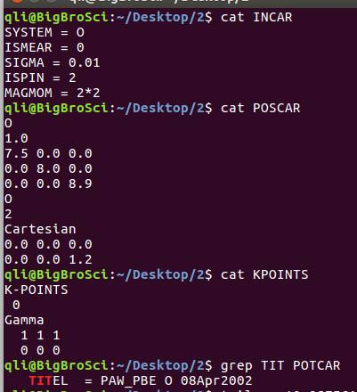


任务结束后查看OSZICAR:

从OSZICAR最后，得到体系的磁矩为2μB，你应该知道这个磁矩是怎么回事，由哪两个电子贡献。

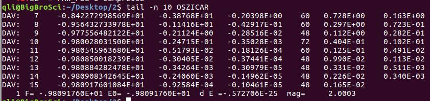


如果不知道，看下图O$_2$的分子轨道结构：


看完该图，相信大家对于O$_2$的成键方式有了一个更加深刻的印象。我们对比下VASP的输出结果。首先分析α电子的排布情况：

 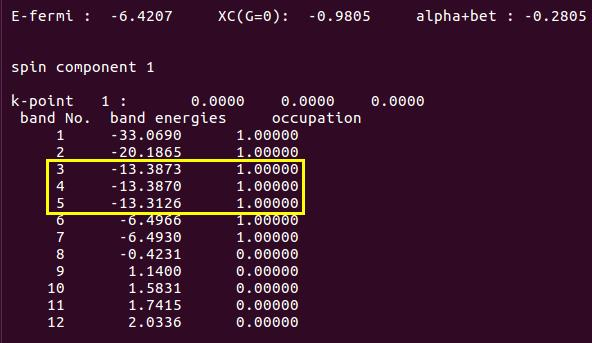


在这里，你会发现能带3和4 是简并的，应该是π(p2x）和π(p2y） 轨道中的α电子。能带 5 对应的应该是σ(2pz) 的电子。在O$_2$分子的电子构型中，两个O原子的2pz轨道以头碰头的方式形成一个σ键，其能量要比2px（2py）以肩并肩方式形成的π键能量要低。但是，能带5的能量（-13.3126）比3和4的（-13.3870）要高些，这与O$_2$的电子构型不一致，表明VASP的单点计算结果是不可靠的。


再看一下β电子的排布情况：

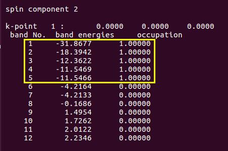

 

能带4和5对应的是应该是π（2px） 和π（2py） 轨道中的β电子。且总的轨道能量与前面图中一致，这说明VASP对β电子的描述是合理的。

 

为什么出现这样的情况呢？难道跟前面O原子的计算一样，VASP又算不准啦？

不是的，VASP怎么着也是个老牌的，响当当的计算程序，总不能让人每天指着鼻子骂算不准！

 

这里的主要原因是：来自于实验的键长值未必就是计算程序所认可的。也就是说，实验值和理论值之间存在偏差，实验的结构不能直接用来计算其性质，只可以作为一个理想的初始值。所以，O$_2$的分子结构需要优化一下。


### VASP 优化分子结构

VASP优化分子结构的时候，需要用到一个参数：`IBRION`。引用官网的话：IBRION determines how the ions are updated and moved. 也就是说IBRION 这个参数决定了结构的优化过程。当你去官网查看的时候（google 搜索VASP IBRION这两个关键词），会发现IBRION有很多值。

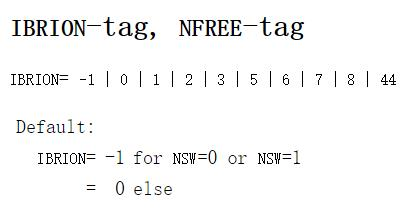


想要正确进行计算，你就需要去硬着头皮去了解各个值的含义了，这个过程必须自己去做，只听别人的建议去设置参数，而不自己去主动学习的，你的能力永远不会得到提升！！！


一般来说，优化结构的时候有3个选择：

IBRION=3：你的初始结构很差的时候；

IBRION=2：共轭梯度算法，很可靠的一个选择，一般来说用它基本没什么问题。

IBRION=1：用于小范围内稳定结构的搜索。

如果你的体系遇到结构不收敛的时候，首先检查自己的结构是否合理，也就是物理化学意义是否清晰。如果结构没问题，可以尝试下换下IBRION的参数。


 下面，我们在INCAR中加上IBRION参数（IBRION=2），其他输入文件保持不变，重新进行计算：

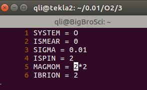


如果是用上图中的INCAR，你会发现任务很快就算完了。而且只有一步，难道输入的结构就是VASP计算出来的的稳定结构吗？有这种可能，但几率极低。

如果我们仔细查看下OUTCAR中的电子构型，发现它的信息和前面的单点计算一样。这说明，vasp并没有优化，而是又运行了一次单点计算。


为什么呢？ 这是因为另一个参数：`NSW`。

 

NSW 控制几何结构优化的步数。也就是VASP进行多少离子步。

官网查看下NSW选项，发现默认值是0，也就是没有进行优化。（默认值，也叫缺省值，英文里面是 Default。 意思是，如果你不输入这个参数，程序将默认使用XXX的数值）

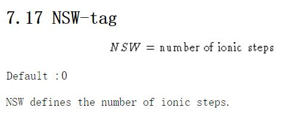

现在原因找到了，继续进行优化任务。问题来了：NSW怎么设置呢？

* 首先，它必须是大于等于0的整数。
* 其次，一般来说，简单的体系200步内就可以正常结束。
* 不知道什么时候收敛，初始结构很差，或者设置了很严格的收敛标准，那么你就要增大一下NSW的取值了，比如NSW=500或者更大。
* 我们的这个O$_2$例子很简单，设置了NSW=10（你也可以设置为100,200或者500，不会影响计算结果的。）

 

```fortran
System = O
ISMEAR = 0
SIGMA  = 0.01
ISPIN  = 2
MAGMOM = 2*2

IBRION = 2
NSW = 10
```


计算完成后，打开OSZICAR：


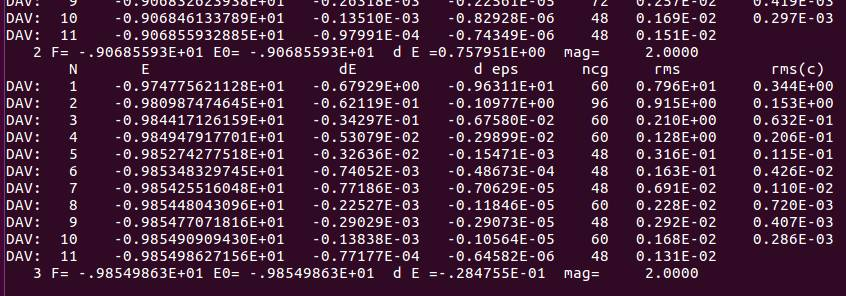

 

可以看到，结构优化进行了3步便停止了（如果你设置了NSW=1000，那么也是3步后就结束）。其中，每一步内又包含了若干电子步。此时的你应该知道是什么参数控制优化的结束，如果不知道请查看前面Ex09中关于收敛的文章。思考一下： 同样优化200步，设置EDIFF=1E-7和EDIFF=1E-4会有什么区别呢？ 

 

查看下OUTCAR： 


 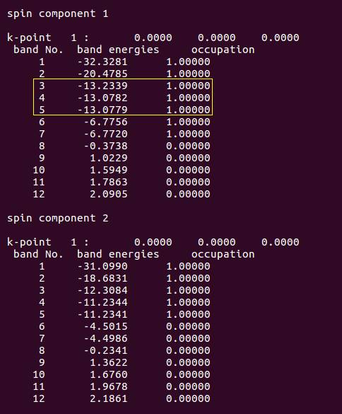


你会发现，优化过后，OUTCAR中α电子的占据状态调整过来了，β电子的保持不变。这说明计算成功了，优化起作用了。

那么优化过后的结构怎么查看呢？键长又是多少呢？

下面我们要开始真正掌握VASP的输出文件了：CONTCAR。 CONTCAR是VASP的一个输出文件，它包含了VASP计算中最后一步几何优化的结构信息，也就是优化完的结果。它也是文本格式，可以直接打开查看，如图：


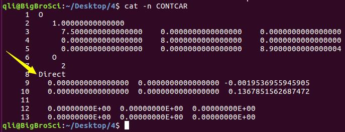


 怎么才能知道优化完的`O-O`键长是多少呢？


1）通过坐标直接算：


此时，要注意CONTCAR输出的是Direct坐标，也就是分数坐标，需要转换成笛卡尔坐标。

xy两个方向不用考虑（都是0），z方向的坐标相减即可：键长保留四位就足够了。

(0.136785-( -0.001953))*8.9 = 1.2348 （$\AA$）


2)  使用可视化软件测量：

这样手动算，简单来说还可以，等复杂了就麻烦了，幸运的是，常用的建模软件中：p4vasp，VESTA，VMD，MS，ASE-gui等，都有测量键长的办法。这里简单讲解一下p4vasp 的用法。


#### p4vasp的安装 

这个详见本书的附录2：https://www.bigbrosci.com/2017/11/18/A02/

1） Ubuntu 系统： `sudo apt-get install  p4vasp`

2） Windows系统： 下载p4vasp的安装包，解压后直接打开即可。


下面是Windows下通过p4vasp读取CONTCAR的方法。Linux的也可以这样做，但终端里面：`p4v CONTCAR` 更高效直接。打开VASP后的界面如下： 注意图中： `System：`后面的三个问号部分，后面会进行对比：


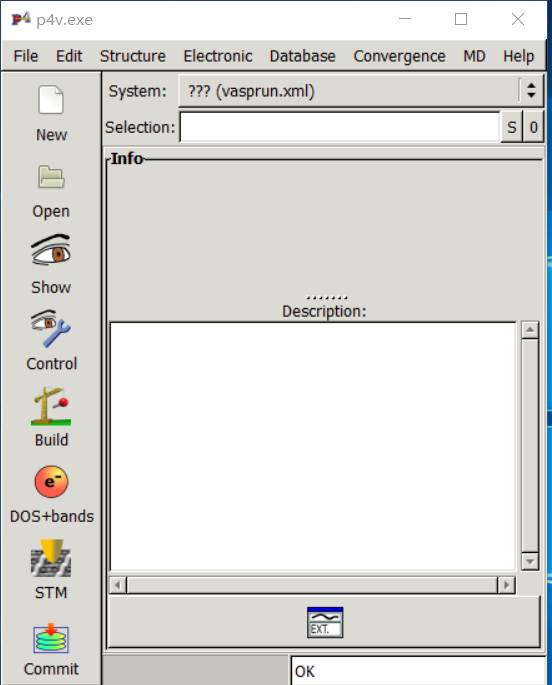


点击左侧栏中的 `Open` 选项。下图中，左侧点击进入CONTCAR所在的目录，进入后，在右侧会显示CONTCAR


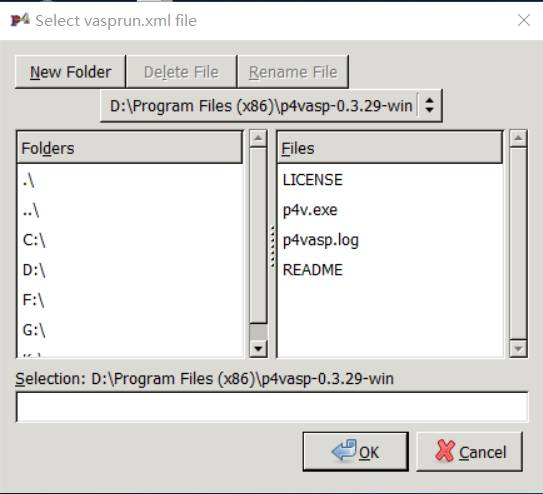


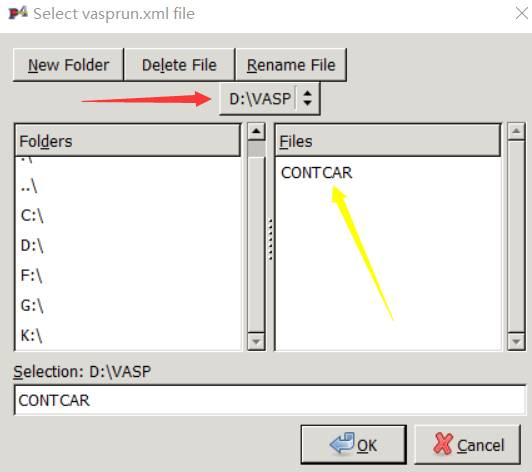


双击右侧的CONTCAR, 你会发现之前的三个问号？？？部分发生了变化：

显示的 O 表明VASP读取CONTCAR成功。


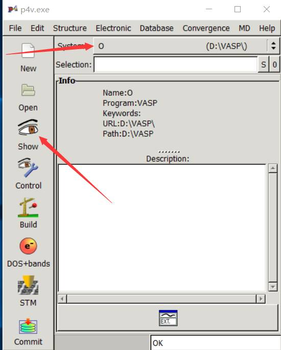


点击左侧的Show按钮，就可以查看结构了。


##### 可视化界面的基本操作


鼠标左键按住不放，可以3维空间旋转结构；

鼠标中间摁住不放，可以上下，左右移动结构：

鼠标右键摁住不敢，动动鼠标可以缩放结构；

选择合适的观察位置：

1 把鼠标移动到你要选中的原子上，

2 通过空格（键盘上最长的键）用来选择或者取消选择原子：

3 选中两个氧原子后，如下图：

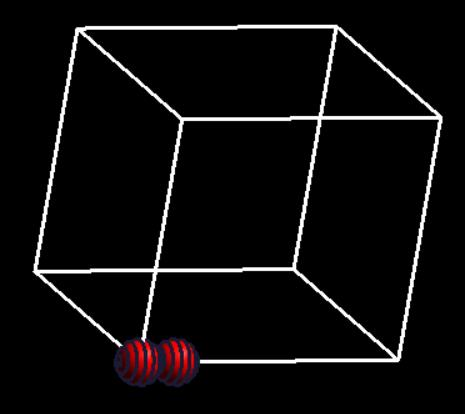


 选中之后，点`Structure` –>`Measure` 显示键长为1.234774 Å，和我们手动计算的结果一样。

 当然，也可以先点击：`Structure` –>`Measure`，然后再选择感兴趣的原子。


##### 小结一下：


实验值为1.2075 Å，VASP计算结果为1.2348 Å。两者之间的差值为： 0.0289 Å，偏差为：(1.2348-1.2075)/1.2075 = 2.26%。对于理论和实验之间的偏差，如果小于5%，我们一般可以认为吻合的很好。有时候很多同学揪着VASP的计算结果与实验值的偏差不放，误差已经千分之几了，感觉心里还是不放心，有着一种不完全匹配不罢休的冲动。这大可不必放在心上，如果你的结果偏离实验值千分之几，直接用就可以了。


 "To err is human; to describe the error properly is sublime."
-- Cliff Swartz, Physics Today 37 (1999),388.

 

对于其他的软件程序（MS，VESTA，VMD等），大家下载安装后，百度里面搜一搜教程，基本操作应该很快就能掌握。

 

### 扩展练习：

 

1 IBRION：https://cms.mpi.univie.ac.at/vasp/vasp/IBRION_tag_NFREE_tag.html

2 NSW：http://cms.mpi.univie.ac.at/vasp/guide/node108.html

3 CONTCAR：https://cms.mpi.univie.ac.at/wiki/index.php/CONTCAR

4 从头开始重现本节的所有操作；

5 尝试不同的初始键长，运行vasp，查看输出结果。

 

###  总结：


1）学会结合自己所学的化学知识，分析双原子的电子构型；

2）知道IBRION + NSW进行结构优化；

3）知道什么参数控制结构优化的停止，以及单个离子步内电子步数；

4）学会使用可视化软件查看输出的几何结构；

5）知道理论结果和实验值之间没有100%吻合。