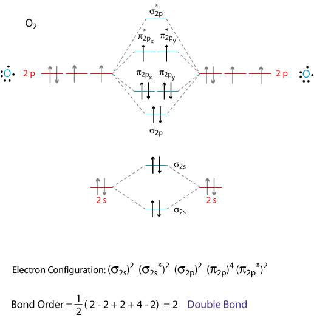
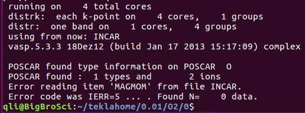
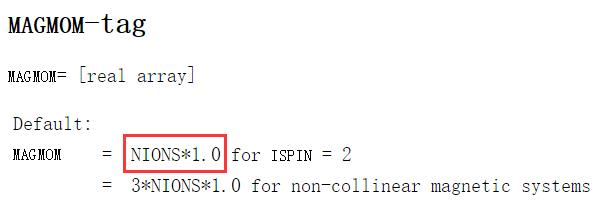
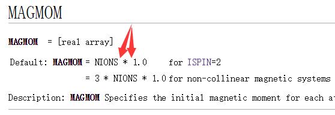
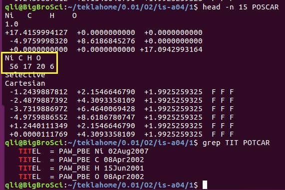
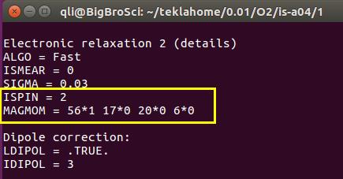

 很多师弟师妹问到："师兄， 我见上一节计算的时候打开自旋极化的时候，设置MAGMOM怎么没有讲啊？"

为了解答师弟师妹们的疑惑（主要是给师妹讲的），本节介绍一下INCAR中MAGMOM的设置以及易出错的地方。

 

### MAGMOM 的设定

 

谈到自旋极化计算，避免不了的就是MAGMOM这个参数。通过MAGMOM我们可以指定体系中原子的初始磁矩。通俗点说，就是给VASP指条计算的明路。对于复杂体系来说，合理的初始值可以加快计算速度，并保持计算结果的正确性。但是对于一些简单的磁性体系，我们可以直接使用`ISPIN=2`, MAGMOM不必进行设置。



我们通过上图可以知道：O$_2$ 分子的基态是三重态，也就是每个原子都有一点单电子，所以每个氧原子的初始的磁矩可以设置为1。但VASP对MAGMOM的要求不一定非得是1，也就是初始值是一个可以模糊也可以精确的数值。因为很多时候，我们不知道确切的磁矩是多少。如果我们已经知道磁矩是多少（比如O$_2$），可以直接写上去，也可以差不多写一个； 但如果不知道的话，就需要根据自己的假设，猜一个初始值了。

 

下面通过一个问题，先简单看下MAGMOM 应该怎么设置。 对于O$_2$分子的计算，以下几行中，MAGMOM设置错误的是第几行？

```
MAGMOM = 2 * 1 
MAGMOM = 1 * 2 
MAGMOM = 1  1 
MAGMOM = 2  2
MAGMOM = 3  3 
MAGMOM = 2*1
MAGMOM = 1*2
MAGMOM = 1.5*2
MAGMOM = 2*1.5
```

 

有兴趣的可以尝试一下前面中的各个选项。**答案**是：1，2，7，8 行。当你用了1，2，7，8行中任何一个时，会得到这样的错误信息： 



（此时的你，应该知道从哪里找到的这个错误信息，不知道的请查看前面几节的内容）

 

显示的错误告诉我们MAGMOM设置的不合理。为什么会出错呢？ 我们看下官网MAGMOM的说明：



**敲黑板：**

* 首先：MAGMOM是一个实数的排列（real array）

* 其次：注意红色框框中的部分。默认值是，原子的个数乘以1.0，也就是原子个数在前面，MAGMOM的值在后面。

* 最后： *  前后没有空格，没有空格，没有空格！！！

 

因此前面的问题中：

第1行存在1个错误：* 前后有空格

第2行存在2个错误：* 前后有空格，原子数目和MAGMOM值颠倒了

第7和8行存在1个错误：原子数目和MAGMOM值颠倒了

 

有的人会问，那其他行中，比如第5行设置的 3 3 难道也正确吗？ 正确的磁矩不应该是1 1 吗？

是的，这是正确的，看官网的话：

 

If one is searching for a spin polarised (ferro- or antiferromagnetic) solution, it is usually safest to start from larger local magnetic moments, because in some cases, the default values might not be sufficiently big. A safe default is usually the experimental magnetic moment multiplied by 1.2 or 1.5.

 

* MAGMOM并不要求严格按照我们已知的数据去输入

* 如果你知道体系的磁矩是多少，初始的时候可以设置的更大些，1.2或者1.5倍。

* 如果你设置的很大，通常情况下（MAGMOM = 5 5 或者MAGMOM = 2\*5，或者更疯狂：MAGMOM = 2\*10） ，VASP会自动矫正回来。但是大师兄建议1.5倍足够了。
* 如果你不知道体系的磁矩是多少，可以根据原子所处的化学环境， 根据成键情况，大体推测有多少个未成对电子，然后将未成对电子数目*1.5即可。

*  VASP的wiki版中：* 前面有空格，这是不对的。

 

当我们正确解决了POSCAR的结构搭建，懂得了POTCAR和POSCAR的关系，以及如何设置MAGMOM时，就可以计算O$_2$的单点能量了。当然，本例中MAGMOM不用设置，因为默认值就是1，如果你的体系很简单，那么直接ISPIN = 2 就可以了，MAGMOM可以不管。

 

##### 示例：

大师兄计算了一个复杂大分子在Ni(111)表面上的吸附情况。有56个Ni，17个C，20个H，以及6个O原子。前面已经学到，当体系中含有Ni的时候，要考虑自旋的情况。 Ni(111)表面是一个简单的自旋体系，完全可以使用默认值。因为体相的Ni磁矩为0.56 μB左右。默认值为1.0，已经足够大。为了让大家有一个更加清晰的印象。大师兄专门设置了一个MAGMOM。 如下图：



  

INCAR 中MAGMOM的设置：




 

通过该例子，相比大家对MAGMOM的设置以及该注意的地方已经熟练掌握了，当然还有非线性的MAGMOM设置，这个在后面详细描述。


### 总结

1） 对于简单体系来说，MAGMOM可以采用默认值；

2） MAGMOM设置的时候，初始值不要求与实验值完全一致，一般取大些（1.5倍）比较好。

3） MAGMOM磁矩中*前后没有空格。