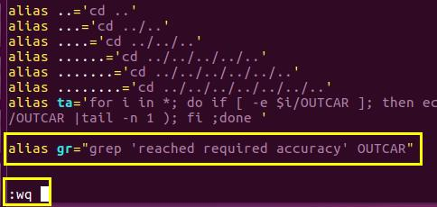

 

前面我们学会了O$_2$分子的优化，分析了其电子构型，并且知道了理论结果和实验结果间存在的偏差。这一节我们依然研究O$_2$分子的结构优化，虽然模型简单，但熟练掌握其中的技巧，对今后的计算工作，意义重大。


### 测试Bad 结构

首先，我们将O$_2$的初始键长设置为：1.5 Å。其他文件与Ex11中的保持不变。 

```
O
1.0
7.5 0.0 0.0
0.0 8.0 0.0
0.0 0.0 8.9
O
2
Cartesian
0.0 0.0 0.0
0.0 0.0 1.5
```


然后提交命令进行计算，等待结束后。查看结果，并对比前面Ex11练习的结果。

```
iciq-lq@ln3:/THFS/home/iciq-lq/LVASPTHW/ex13$ tail OSZICAR
DAV:   1    -0.985412177027E+01   -0.57432E-02   -0.12528E+00   144   0.457E+00    0.433E-01
DAV:   2    -0.985315825637E+01    0.96351E-03   -0.76431E-03   144   0.367E-01    0.166E-01
DAV:   3    -0.985344344928E+01   -0.28519E-03   -0.78039E-04   120   0.129E-01    0.707E-02
DAV:   4    -0.985368960614E+01   -0.24616E-03   -0.14892E-04   144   0.510E-02    0.268E-02
DAV:   5    -0.985378634076E+01   -0.96735E-04   -0.12727E-05    96   0.167E-02
   8 F= -.98537863E+01 E0= -.98537863E+01  d E =-.142913E+01  mag=     2.0000
       N       E                     dE             d eps       ncg     rms          rms(c)
DAV:   1    -0.985528191871E+01   -0.15923E-02   -0.11782E-01   168   0.140E+00    0.130E-01
DAV:   2    -0.985521232023E+01    0.69598E-04   -0.82384E-04   120   0.126E-01
   9 F= -.98552123E+01 E0= -.98552123E+01  d E =-.143055E+01  mag=     2.0000
iciq-lq@ln3:/THFS/home/iciq-lq/LVASPTHW/ex13$ tail ../ex11/opt/OSZICAR
DAV:   8    -0.985382407600E+01   -0.31391E-03   -0.20867E-05   120   0.151E-02    0.891E-03
DAV:   9    -0.985418412704E+01   -0.36005E-03   -0.33607E-05   120   0.162E-02    0.520E-03
DAV:  10    -0.985440719048E+01   -0.22306E-03   -0.20675E-05   120   0.115E-02    0.367E-03
DAV:  11    -0.985450935523E+01   -0.10216E-03   -0.85511E-06   120   0.750E-03    0.174E-03
DAV:  12    -0.985454505708E+01   -0.35702E-04   -0.14739E-06   120   0.339E-03
   3 F= -.98545451E+01 E0= -.98545451E+01  d E =-.451963E-01  mag=     2.0000
       N       E                     dE             d eps       ncg     rms          rms(c)
DAV:   1    -0.985517058251E+01   -0.66123E-03   -0.43217E-02    96   0.851E-01    0.792E-02
DAV:   2    -0.985515527518E+01    0.15307E-04   -0.49070E-04   168   0.969E-02
   4 F= -.98551553E+01 E0= -.98551553E+01  d E =-.458065E-01  mag=     2.0000

```

 

在本练习中，我们设置了键长为：1.5 $\AA$，距离稳定结构较大，用了9个离子步才收敛。在Ex11练习中，我们使用的是数据库中O$_2$的键长，只优化了4步就收敛了。由此可见，一个好的初始结构可以加快我们的计算。那么有多快呢？ 我们看一下OUTCAR中的时间信息，对比看下一目了然。

```fortran
iciq-lq@ln3:/THFS/home/iciq-lq/LVASPTHW/ex13$ tail OUTCAR
                            User time (sec):       20.196
                          System time (sec):        7.877
                         Elapsed time (sec):      144.523

                   Maximum memory used (kb):      116704.
                   Average memory used (kb):           0.

                          Minor page faults:        72067
                          Major page faults:            0
                 Voluntary context switches:         3191
iciq-lq@ln3:/THFS/home/iciq-lq/LVASPTHW/ex13$ tail ../ex11/opt/OUTCAR
                            User time (sec):        8.387
                          System time (sec):        7.789
                         Elapsed time (sec):       17.433

                   Maximum memory used (kb):      114276.
                   Average memory used (kb):           0.

                          Minor page faults:        26287
                          Major page faults:            3
                 Voluntary context switches:         3202
iciq-lq@ln3:/THFS/home/iciq-lq/LVASPTHW/ex13$

```

 

判断计算是否结束以及结构是否收敛：上面大师兄用了2个命令：

1） tail OSZICAR

左下角显示了结构优化进行了多少步，这里是9步！注意，我们的INCAR 里面设置的NSW = 10。如果优化的步数小于我们设置的，说明结构已经收敛到了我们所期望的标准。

2） tail OUTCAR

会显示：VASP结束后计算的内存，时间等信息，如果你看到与上图中类似的信息，说明计算结束了。


### 优化的小思考

##### 思考1：

上面的计算中，我们在INCAR中设置的`NSW =10`，实际计算用了9步，说明计算刚刚收敛了。但是：如果结构优化的步数等于NSW设置的步数，说明了什么，是什么原因？又该怎么办？

 

出现这种情况，说明可能还没有达到我们的收敛标准，可能是以下几个原因造成的： 

1) NSW设置的偏小； 如果我们在本节例子中设置了`NSW=8`;

2) 初始结构不合理，计算需要更多的离子驰豫过程； 

3) 设置的收敛标准太严格， 比如：-0.01 或者 -0.001； 

4) 结构很复杂，每一离子步中的电子步骤收敛很困难。


除此之外，还有一种可能，即刚刚进行到NSW设置的步数时，计算恰好收敛了。比如本例中，我们设置了`NSW = 9`。但这种可能几率很低，但如果你计算的足够多，还是有机会碰到的。（碰到这种情况时，一定不要慌张，要立马出门去买彩票，中了奖后要记得和大师兄平分！）

 

##### 思考2：

怎么判断上述这种特殊情况呢？

首先，我们要知道计算收敛结束后VASP所输出的内容，也要知道未收敛时VASP结束后输出的内容。目前，现在我们知道进行了9步的时候，该计算正常结束。那我们就可以设置NSW为一个较小的值（比如 NSW=5），然后查看下未收敛时候的结果，并进行对比分析！

 

结构收敛OUTCAR （NSW=10）：


结构未收敛OUTCAR （NSW=2）：

 


通过对比，我们可以发现，结构收敛的结果里面多了这一行：　 

```fortran
reached required accuracy - stopping structural energy minimisation
```

 

因此我们在今后的计算中，可以通过这一行来判断计算是否收敛结束。怎么判断呢？前面我们讲到了通过分析OUTCAR并结合grep命令来提取信息的方法，这里我们稍微复习一遍。下图中大师兄尝试了几个grep命令： 

看下输出结果:

 

```bash
iciq-lq@ln3:/THFS/home/iciq-lq/LVASPTHW/ex13/nsw10$ grep accuracy   OUTCAR
 reached required accuracy - stopping structural energy minimisation
 iciq-lq@ln3:/THFS/home/iciq-lq/LVASPTHW/ex13/nsw10$
iciq-lq@ln3:/THFS/home/iciq-lq/LVASPTHW/ex13/nsw10$ grep stopping OUTCAR
   EDIFF  = 0.1E-03   stopping-criterion for ELM
   EDIFFG = 0.1E-02   stopping-criterion for IOM
 reached required accuracy - stopping structural energy minimisation
iciq-lq@ln3:/THFS/home/iciq-lq/LVASPTHW/ex13/nsw10$
iciq-lq@ln3:/THFS/home/iciq-lq/LVASPTHW/ex13/nsw10$ grep structural OUTCAR
Analysis of structural, dynamic, and magnetic symmetry:
 reached required accuracy - stopping structural energy minimisation
iciq-lq@ln3:/THFS/home/iciq-lq/LVASPTHW/ex13/nsw10$
iciq-lq@ln3:/THFS/home/iciq-lq/LVASPTHW/ex13/nsw10$ grep 'reached required accuracy' OUTCAR
 reached required accuracy - stopping structural energy minimisation
iciq-lq@ln3:/THFS/home/iciq-lq/LVASPTHW/ex13/nsw10$
iciq-lq@ln3:/THFS/home/iciq-lq/LVASPTHW/ex13/nsw10$ grep 'reached required accuracy - stopping structural energy minimisation' OUTCAR
 reached required accuracy - stopping structural energy minimisation
iciq-lq@ln3:/THFS/home/iciq-lq/LVASPTHW/ex13/nsw10$
iciq-lq@ln3:/THFS/home/iciq-lq/LVASPTHW/ex13/nsw10$ grep reached OUTCAR
------------------------ aborting loop because EDIFF is reached ----------------------------------------
------------------------ aborting loop because EDIFF is reached ----------------------------------------
------------------------ aborting loop because EDIFF is reached ----------------------------------------
------------------------ aborting loop because EDIFF is reached ----------------------------------------
------------------------ aborting loop because EDIFF is reached ----------------------------------------
------------------------ aborting loop because EDIFF is reached ----------------------------------------
------------------------ aborting loop because EDIFF is reached ----------------------------------------
------------------------ aborting loop because EDIFF is reached ----------------------------------------
------------------------ aborting loop because EDIFF is reached ----------------------------------------
 reached required accuracy - stopping structural energy minimisation

```

 

从图中可以看出来，选择不同的grep 参数，会得到不同的输出结果。一般来说，grep后面的内容越详细，得到的输出结果也就会越匹配。我们提取信息的首要原则是：**精确匹配并提取最有价值的信息**！


其中：grep 'reached required accuracy' OUTCAR 是大师兄常用的一个命令。

（要提取的内容通过单引号扩起来了。）


### ~/.bashrc 

那么你会问道：“大师兄，你是不是傻X啊，这么长的命令，光输入就费老大劲了，不嫌麻烦么？”

 

哈哈，大师兄不仅傻，更喜欢偷懒。每次检查的时候这样子输入肯定麻烦。但在linux下面，有个小窍门，可以极大极大极大地提高你的工作效率，那就是`~/.bashrc` 文件中的 `alias`：（注意前面的点 . ）


.bashrc 文件怎么用呢？它在哪里？ 怎么打开？


答：在home目录下，

1） 终端（terminal）里面直接输入 cd 这个命令，会自动返回到home 目录下面：

然后运行命令：` vi .bashrc`

2） 当然，如果你不想跳转回去，也可以这样：vi  ~/.bashrc  波浪号代表home

 


它怎么用?


http://www.linuxidc.com/Linux/2015-02/113310.htm   （参考网址）

 

1）打开 .bashrc 文件：（大师兄的bashrc文件为例：）


2） 将前面我们用到的命令写进 .bashrc 文件：


注意的部分： 

 

A) alias 和 gr 之间有空格；

B) gr 是大师兄随便想的，你也可以用自己想的其他字母；

C) gr之间没有空格；

D) gr后面紧跟着等号 = ， 中间没有空格；

E) 等号 = 后面紧跟着双引号，且等号= 和双引号之间没有空格；

F) 双引号之间，把我们的命令放进去，一定要确保命令在引号里面；

G)等号 = 后面可以用单引号，也可以用双引号，因为我们的命令中已经有单引号了，这里我们用的双引号，下面两者效果是一样的；

```
alias gr="grep 'reached required accuracy' OUTCAR"
alias gr='grep "reached required accuracy" OUTCAR'
```


注意：上图中两者任选一个即可，不要都放进去，否则会乱套。保存后退出。




3)  source 一下 .bashrc 文件。下图中的几个命令效果是一样的！ 


在这里点 `.` 和 `source` 命令的效果一样。


4 运行命令：（敲一下gr，回车即可）

```
iciq-lq@ln3:/THFS/home/iciq-lq/LVASPTHW/ex13/nsw10$ ls
CHG  CHGCAR  CONTCAR  DOSCAR  EIGENVAL  IBZKPT  INCAR  job_sub  KPOINTS  OSZICAR  OUTCAR  PCDAT  POSCAR  POTCAR  REPORT  slurm-1023075.out  vasprun.xml  WAVECAR  XDATCAR
iciq-lq@ln3:/THFS/home/iciq-lq/LVASPTHW/ex13/nsw10$
iciq-lq@ln3:/THFS/home/iciq-lq/LVASPTHW/ex13/nsw10$ gr
 reached required accuracy - stopping structural energy minimisation
```

当你看到这个信息的时候，说明优化任务就已经算完了。  在这里gr 命令就是前面 .bashrc 文件中alias 后面的那个命令。如果还不明白，看下面的例子。大师兄把.bashrc 文件中的 gr 替换成了bigbro , source 了一下后，运行 bigbro命令，得到了和前面一样的结果。

```
alias bigbro='grep "reached required accuracy" OUTCAR'
```

```
iciq-lq@ln3:/THFS/home/iciq-lq/LVASPTHW/ex13/nsw10$ bigbro
 reached required accuracy - stopping structural energy minimisation
```


5 ）注意：

避免你自己定义的命令名字和linux下面自带的命令重复。

```
alias  cd="grep 'reached required accuracy' OUTCAR"
```

但是可以这样设置：

```
alias  cd="cd && ls "
```


如果你极其地讨厌一个人，可以在他的服务器下面这样设置！！！ 建议大家报复的时候可以采用这样温柔点的设置，这样，他每敲一次命令就会被你骂一次。（史上最狠报复，只适用于对付那些深深伤害了你的人！）大家只可以感受下这把刀的威力，切不可自作孽!

```
alias cd='cd  ~'
alias cp='echo "You are a XXX" '
alias ls='echo "You are a XXX" '
```

 

### 扩展练习：


1 分别设置O$_2$的初始键长为1.5和 0.9 Å，运行任务；

2 查看收敛情况；

3 查看结构信息和能量信息；

4 如果有不合理的地方，自己尝试解决。

 

### 总结：

 

本节讲解了

1) 查看任务计算完成的日常做法，

2) 一个在日常计算中极为重要的处理问题的方法，以及简化日常命令的方式。

通过设置.bashrc文件中的alias 命令,我们便可以自己随心所欲地将计算中的长命令、复杂的命令转化为简单的命令,从而极大地提高了我们的工作效率,尤其是适用于那些:使用频繁的但又很复杂的命令。

3) 一个思想：如果我们已知一个结果，那么便可以通过调控不同的参数，然后再与已知结果进行对比，从而分析不同参数在计算中的作用。

这一个思想贯穿了本书的写作过程，对于大家加深对VASP的理解以及练习意义非凡。熟练运用这一种方法，你的洞察力和判断力会得到极大地提升。希望大家能认真思考下本节中提出的处理问题的思想，以及熟练运行alias简化自己的命令。

 4） 为了锻炼大家的判断力，请做下题：以最快的速度找到图中的小猫：

