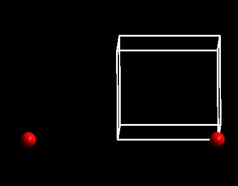
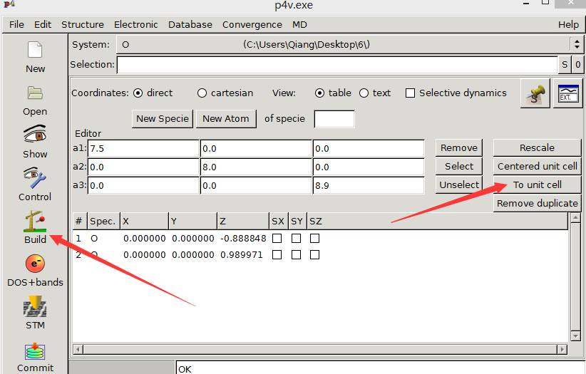
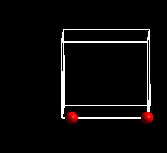
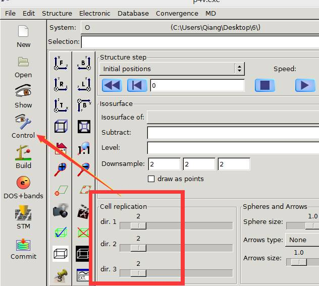
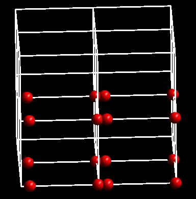
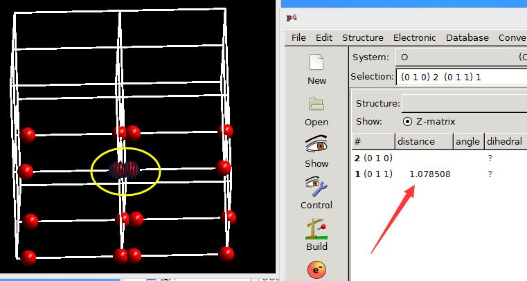
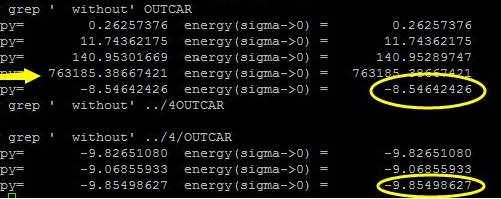
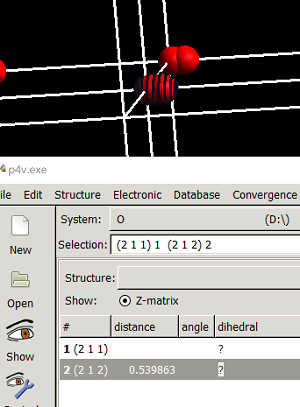
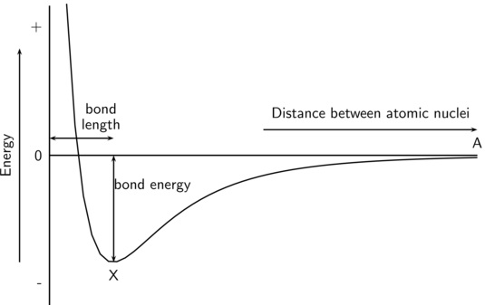

在ex13中，当初始值为1.5 $\AA$ 的时候，计算共进行了9步。对比下之前我们采用实验值（Ex11）作为初始结构计算时用了4步。从这里我们可以看出来，如果你一个合理的初始结构，可以加快优化的速度，减少机时，节约你的时间。当然，计算的具体时间可以通过OUTCAR尾部的信息查看。


### 不同初始结构对结果的影响。

那么不同的初始结构，除了在时间上，对计算的结构还有影响吗？ 首先我们对比下Ex11和Ex13的结果。 

```
iciq-lq@ln3:/THFS/home/iciq-lq/LVASPTHW$ tail ex13/nsw10/CONTCAR
     0.0000000000000000    8.0000000000000000    0.0000000000000000
     0.0000000000000000    0.0000000000000000    8.9000000000000004
   O
     2
Direct
  0.0000000000000000  0.0000000000000000  0.0149145061380336
  0.0000000000000000  0.0000000000000000  0.1536248197046605

  0.00000000E+00  0.00000000E+00  0.00000000E+00
  0.00000000E+00  0.00000000E+00  0.00000000E+00
iciq-lq@ln3:/THFS/home/iciq-lq/LVASPTHW$ tail ex11/opt/CONTCAR
     0.0000000000000000    8.0000000000000000    0.0000000000000000
     0.0000000000000000    0.0000000000000000    8.9000000000000004
   O
     2
Direct
  0.0000000000000000  0.0000000000000000 -0.0019537557431563
  0.0000000000000000  0.0000000000000000  0.1367852164173130

  0.00000000E+00  0.00000000E+00  0.00000000E+00
  0.00000000E+00  0.00000000E+00  0.00000000E+00
iciq-lq@ln3:/THFS/home/iciq-lq/LVASPTHW$

```

在Ex11和Ex13中，两个计算的能量和CONTCAR中的键长值也几乎相等，看下面的结果。

```
iciq-lq@ln3:/THFS/home/iciq-lq/LVASPTHW$ python
Python 2.6.6 (r266:84292, Sep  4 2013, 07:46:00)
[GCC 4.4.7 20120313 (Red Hat 4.4.7-3)] on linux2
Type "help", "copyright", "credits" or "license" for more information.
>>> 0.1536248197046605-0.0149145061380336
0.13871031356662689
>>> 0.1367852164173130--0.0019537557431563
0.13873897216046929
>>>

```


### 另一个bad结构的计算

上次我们用了一个大于实验值的初始结构1.5$\AA$。下面我们看下小于实验值的初始情况：0.9 $\AA$ 。

```fortran
iciq-lq@ln3:/THFS/home/iciq-lq/LVASPTHW/ex14$ cat POSCAR
O
1.0
7.5 0.0 0.0
0.0 8.0 0.0
0.0 0.0 8.9
O
2
Cartesian
0.0 0.0 0.0
0.0 0.0 0.9
```

INCAR，KPOINTS，POTCAR等不变，提交任务，等待计算结束，查看结果。

```
iciq-lq@ln3:/THFS/home/iciq-lq/LVASPTHW/ex14$ tail OSZICAR
DAV:  18     0.141396114006E+03    0.20879E-02   -0.88760E-04   144   0.130E-01    0.579E-01
DAV:  19     0.141397297948E+03    0.11839E-02   -0.52751E-04    96   0.893E-02    0.455E-01
DAV:  20     0.141388687914E+03   -0.86100E-02   -0.28657E-03   144   0.231E-01    0.206E+00
DAV:  21     0.141395321236E+03    0.66333E-02   -0.62073E-03    96   0.361E-01    0.112E+00
DAV:  22     0.141389669824E+03   -0.56514E-02   -0.95109E-03    96   0.429E-01    0.161E-01
DAV:  23     0.141382943017E+03   -0.67268E-02   -0.22808E-03    96   0.216E-01    0.118E+00
DAV:  24     0.141390086243E+03    0.71432E-02   -0.39635E-03    96   0.307E-01    0.825E-01
DAV:  25     0.141385767811E+03   -0.43184E-02   -0.44984E-03    96   0.305E-01    0.480E-01
DAV:  26     0.141385726226E+03   -0.41585E-04   -0.10329E-04    96   0.429E-02
   5 F= 0.14138573E+03 E0= 0.14138680E+03  d E =0.141123E+03  mag=    -2.0000

```

计算共进行了5步，且最后的磁矩看起来是正确的。**思考**： 从这里得出的信息，能确定我们的计算结果是正确的吗？ 

答： 不知道。因为我们还要要去查看一下结构。判断结构是否合理。如果结构不合理，则收敛的计算也是失败了。

 

用p4vasp打开CONTCAR后，如下图：





师兄，这是神马情况，两个原子怎么跑这么远？

 

不用担心，这是因为周期性的原因。p4vasp中可以进行如下的操作：




首先，点击左侧的Build按钮，然后再点击右侧的 To unit cell。这样你会发现结构调整到下图的样子：




两个原子之间的距离还是很长（7.821 $\AA$），但实际键长不是这么长的。

而是8.9-7.821 = 1.079 $\AA$。

师兄你为什么这么算?

 

因为我们的体系是周期性的，也就是图中的格子在三维方向上可以无限重复，如果我们向左重复一个单元，那么在新的单元中右侧的氧原子与原来左侧的氧原子距离很短。已知格子在z方向的长度为8.9 $\AA$，减去7.821就是剩下的两个氧原子之间的键长了。

 

如果，你还不明白，进行下图的操作：





点击左侧的Control 选项，然后在下面红色框中，将格子在三维方向上重复，效果如下：




注意，该操作只是展示三维方向的结构，如果此时你保存结构，不管你在三维方向上重复了多少次，保存的结构则还是原来的尺寸大小。




 

键长为1.0785 $\AA$。


##### 周期性的显示问题

暂且抛开对错不说，由于周期性导致的原子不在一个格子里面的情况，在今后的计算中你会经常碰到。如果你遇到这种情况，不要立即在群里问：师兄，为什么优化之后，体系中的原子不见了？为什么之前左面原子不见了，右侧本来没有原子，优化完多了？

 归根结底都是周期性导致的显示问题。你需要做的就是把结构在三维方向上重复一下，查看结构是对还是错。

 ##### 结果对还是错？

现在我们分析下对错，已知O$_2$分子的键长为1.2075 $\AA$，因此该计算与实验值偏差为：（1.0785-1.2075）/1.2075 =10.68 %，这么大的偏差，是不可以忍受的。

检查一下能量： 为 -8.54642426 eV。 之前正确的能量为： -9.85498627eV。




在第二版的改进中，大师兄又计算了这个任务一次，得到了另外一个结果：2个O原子距离很短。




查看能量：

```
iciq-lq@ln3:/THFS/home/iciq-lq/LVASPTHW/ex14$ grep '  without' OUTCAR
  energy  without entropy=        0.26254047  energy(sigma->0) =        0.26254047
  energy  without entropy=       11.76187113  energy(sigma->0) =       11.76187113
  energy  without entropy=      142.97353506  energy(sigma->0) =      142.97353506
  energy  without entropy=  1359169.21650280  energy(sigma->0) =  1359169.21650280
  energy  without entropy=      141.38788142  energy(sigma->0) =      141.38680382
iciq-lq@ln3:/THFS/home/iciq-lq/LVASPTHW/ex14$

```


思考： 能量为什么会差这么多呢（1.11 eV 或者最新结果140多eV）？ 


答： 我们需要知道体系的能量随键长的变化关系：如下图：


 


图中X 处是O$_2$的稳定结构，两个原子间距离小于X处的键长时，它们之间的排斥力导致了体系的能量快速升高。


由于我们已经知道了正确的计算结果，通过分析后，这次的计算失败！但对于不知道结果的时候，怎么判断计算是否成功失败呢？首先根据VASP计算的收敛情况，也就是计算至少应该正常结束，其次，这是远远不够的，我们还要查看输出结构的几何构型，判断是否具有物理或者化学的意义，还要看每一步收敛的能量信息。这些就需要我们化学基础知识了。

 

### 扩展练习及思考

 

1 计算为什么会失败?

2 分析该计算中每一步收敛的情况，以及能量的变化。

 

### 总结：

 

1 不合理的结构会增加计算时间；

2 不合理的结构会导致计算结果没意义；

3 知道怎么处理周期性结构中，原子不在一个晶格里面的情况；

4 学会判断计算结果的物理或者化学意义。