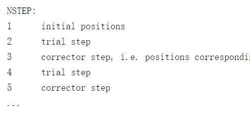

继续前面一节，我们分析一下结构优化过程的细节问题，以及合理结构的重要性。


### 哪里出错了？

查看每一离子步后的能量结果，注意命令中的单引号里面有两个空格！如果你看到这样的结果时，意味着大事不妙，结构优化失败了，Scf 也失败了！！！也就是结构没有优化好，离子步中电子步收敛也同样失败。


查看一下OSZICAR:

```bash
DAV:  52     0.142641482694E+03   -0.87447E-01   -0.50432E-03   120   0.175E-01    0.188E+00
DAV:  53     0.142675598279E+03    0.34116E-01   -0.20261E-03   120   0.869E-02    0.185E+00
DAV:  54     0.142703773182E+03    0.28175E-01   -0.26393E-03   144   0.121E-01    0.190E+00
DAV:  55     0.142724228087E+03    0.20455E-01   -0.11280E-03   120   0.795E-02    0.193E+00
DAV:  56     0.142809666479E+03    0.85438E-01   -0.29739E-02   120   0.433E-01    0.211E+00
DAV:  57     0.142939449864E+03    0.12978E+00   -0.29353E-02   192   0.367E-01    0.196E+00
DAV:  58     0.142943989012E+03    0.45391E-02   -0.90264E-04    96   0.810E-02    0.193E+00
DAV:  59     0.142966025527E+03    0.22037E-01   -0.43114E-04   120   0.704E-02    0.196E+00
DAV:  60     0.142973535062E+03    0.75095E-02   -0.53590E-05   144   0.234E-02
   3 F= 0.14297354E+03 E0= 0.14297354E+03  d E =0.142711E+03  mag=     0.0441
```


这里说明，第三步中电子收敛的步数达到了默认值，被强制停止了。每一个离子步中电子步数的最大值是由NELM这个参数控制的，VASP中默认值为60，也就是最大的电子收敛为60步，过了60步还不收敛就必须停止。自己VASP官网查看下相关的NELM参数。

下面两行如果你能看懂，说明优化的基本情况已经摸清了。

 

电子步（SCF）: EDIFF <====> NELM 

离子步（结构优化）：EDIFFG <====> NSW

 

### 电子步不收敛怎么办？

遇到图中这种情况，大师兄分享一下自己的经验：

1） 首先检查自己的初始结构是不是合理的。这是关键点之一。如果合理，那么再进行下面的步骤：

2）如果第一个离子步中：SCF（也就是电子步）的计算不收敛，尝试下增加NELM的值；

* 对于一般普通的体系可以设置`NELM = 100`
* 对于一些电子结构比较难收敛的体系，可以设置更大一些：`NELM = 200`
* 增加NELM后依然不收敛，尝试下改变AMIX，BMIX，官网推荐的参数如下：不过个人的感觉，调这些参数好像没什么用，效果甚微。

```fortran
AMIX = 0.2
BMIX = 0.00001
AMIX_MAG = 0.8
BMIX_MAG = 0.00001
```

3) 第一个离子步中的电子步收敛了，后面的不收敛，能量变的极大（本例），首先应该想到的是去检查结构，一般在结构不合理的时候会出现类似的情况；调整结构再提交任务。

4）如果前面几个离子步中电子步都不收敛，且能量变化正常，可以尝试着让任务再多算几步，后面跑着跑着可能就收敛了。

5）如果跑了很长时间，每一个离子步中的电子步都不收敛，可以尝试着换一个更加稳定的电子步迭代算法（ALGO参数）。这种情况：`ALGO = ALL`  结合 `NELM = 200` 可以解决大部分的问题。

6）但需要注意的是：`ALGO= ALL` 这个算法虽然稳定，但比较耗时。自己要权衡一下。可以尝试着两步走的战略：step1）先用`ALGO =ALL`的办法算一个单点，保存WAVECAR。step2）然后将ALGO改回原来的，读WAVECAR继续优化。


大师兄尝试了很多种办法，意图把初始结构从0.9 $\AA$一步直接计算正确，但是大部分时候都失败了！而且出现了各种各样的问题和错误的结果，因此，出现这种情况，第一直觉是去看结构而不是想着调节参数去怎么解决这个错误！！！从这里可以看到，如果你的初始结构不合理，会出现各种各样的问题，这也是大师兄们解决不了的。

 

### 为什么会这样子

这是因为：两个氧原子之间距离在初始结构中很小，导致第一步估算之间的作用力过大，以至于后面没有办法再矫正过来。这里我们看一下IBRION=2时的计算步骤。

 


第一步，从初始结构出发，计算体系中离子间的作用力，

第二步，VASP尝试着把离子沿着前面估算的方向移动，尝试移动的大小由[`POTIM`](https://cms.mpi.univie.ac.at/wiki/index.php/POTIM)这一项决定，

第三步，计算尝试移动后能量和力的大小，据此加入一个矫正项来控制真实移动的大小；

第四部， 移动后，重新计算能量和力，重复前三步直至能量或者力收敛到我们设置的EDIFFG值。

 

IBRION = 2 时，对POTIM的依赖性很强，因此我们计算的时候要设置一个合理值。在我们的计算中，由于初始的原子间距离很小，第一步计算时，得到的原子间的初始排斥力很强，第二步中，VASP默认的POTIM值是0.50，前面两步导致了尝试步中离子的移动过大，以至于后面没有办法矫正回来，最后导致O$_2$分子计算出错。


### POTIM 显神威

大师兄，用0.9 Å的时候可以调节POTIM来获得正确的结果吗？答案是肯定的。

如果想要正确计算的话，可以设置POTIM一个更小的值。`POTIM=0.1`，虽然从初始值算出来的力很大，我们通过POTIM强制VASP一点一点调节，来保证计算的准确。

```
SYSTEM = O atom
ISMEAR = 0
SIGMA = 0.01
ISPIN = 2
MAGMOM = 2*2
IBRION = 2
POTIM = 0.1
NSW = 10
```

提交任务，查看结果：

```bash
iciq-lq@ln3:/THFS/home/iciq-lq/LVASPTHW/ex15$ tail OSZICAR
DAV:   3    -0.984191032147E+01   -0.12318E-01   -0.38005E-02    96   0.891E-01    0.516E-01
DAV:   4    -0.984475378528E+01   -0.28435E-02   -0.74281E-03   144   0.367E-01    0.198E-01
DAV:   5    -0.984632399820E+01   -0.15702E-02   -0.51626E-04    96   0.101E-01    0.914E-02
DAV:   6    -0.984676440618E+01   -0.44041E-03   -0.15294E-04   144   0.511E-02    0.169E-02
DAV:   7    -0.984690803808E+01   -0.14363E-03   -0.99478E-06   144   0.122E-02    0.829E-03
DAV:   8    -0.984706391665E+01   -0.15588E-03   -0.95528E-06   120   0.898E-03    0.489E-03
DAV:   9    -0.984722304729E+01   -0.15913E-03   -0.99988E-06   120   0.862E-03    0.292E-03
DAV:  10    -0.984733039102E+01   -0.10734E-03   -0.63466E-06    96   0.690E-03    0.215E-03
DAV:  11    -0.984738716468E+01   -0.56774E-04   -0.27665E-06    96   0.463E-03
   7 F= -.98473872E+01 E0= -.98473872E+01  d E =-.101099E+02  mag=    -2.0000
iciq-lq@ln3:/THFS/home/iciq-lq/LVASPTHW/ex15$ cat CONTCAR
O
   1.00000000000000
     7.5000000000000000    0.0000000000000000    0.0000000000000000
     0.0000000000000000    8.0000000000000000    0.0000000000000000
     0.0000000000000000    0.0000000000000000    8.9000000000000004
   O
     2
Direct
  0.0000000000000000  0.0000000000000000 -0.0196261760084087
  0.0000000000000000  0.0000000000000000  0.1207497715140281

  0.00000000E+00  0.00000000E+00  0.00000000E+00
  0.00000000E+00  0.00000000E+00  0.00000000E+00
iciq-lq@ln3:/THFS/home/iciq-lq/LVASPTHW/ex15$ python
Python 2.6.6 (r266:84292， Sep  4 2013， 07:46:00)
[GCC 4.4.7 20120313 (Red Hat 4.4.7-3)] on linux2
Type "help"， "copyright"， "credits" or "license" for more information.
>>>(0.1207497715140281--0.0196261760084087)*8.9
1.2493459329496877
>>>

```


算出来的能量和磁矩等信息与之前正确计算的结果一致，键长也对上了。 说明我们修改POTIM生效了。这里POTIM的作用相信大家有了一个大体的了解。在IBRION=2 时（这是前提！！），如果初始结构很差，设置较小的POTIM可以有效的避免过度矫正。初始结构越好，POTIM的选择也就越随意。


### Python计算器

在上面的演示中，大师兄还教给你了一个终端里面的计算器，python！加减乘除非常好用，注意，使用python计算时，>>> 和数字之间不能有空格，否则python会提示出错！

```python
Python 2.6.6 (r266:84292， Sep  4 2013， 07:46:00)
[GCC 4.4.7 20120313 (Red Hat 4.4.7-3)] on linux2
Type "help"， "copyright"， "credits" or "license" for more information.
>>>  5 + 2
  File "<stdin>"， line 1
    5 + 2
    ^
IndentationError: unexpected indent
>>>  (0.1207497715140281--0.0196261760084087)*8.9
  File "<stdin>"， line 1
    (0.1207497715140281--0.0196261760084087)*8.9
    ^
IndentationError: unexpected indent
```


### 扩展练习

 

1 阅读IBRION 参数说明：https://cms.mpi.univie.ac.at/vasp/vasp/IBRION_2.html 知道优化过程的具体细节；

2 尝试不同的初始结构配合POTIM值，完成O$_2$的正确计算；

3 使用0.9 Å作为初始结构，改变POTIM的参数值，直至计算正确；

4 尝试用0.9 Å作为初始结构，POTIM采用默认值，调节其他自己认为会影响计算的参数，查看相关输出，如有错误，复制到google里面查找相关的原因。 

 

### 总结：

 

体系的初始结构越合理，不仅仅是节约我们的时间，还会我们的计算过程越省心。从前面出现的问题可以看出来，结构不合理，对应出错的地方越多，我们也要绞尽脑汁去纠正。O$_2$分子的例子比较简单，我们简单通过`POTIM`实现了正确的计算。但是大家计算的体系比O$_2$ 分子复杂的多，处理起来也会更加棘手。所以需要在初始结构上下功夫。更严肃的说：初始结构就是我们的计算模型，如果模型不合理，后续的计算都会出错，甚至失败。

如果初始结构不合理，用`IBRION=2`的时候，`POTIM`可以很好的控制收敛，还是建议初始结构搭建的合理些，省时省力。认真学习化学基础知识，搭建好合理的初始模型才是王道，正应了那句古话：磨刀不误砍柴工！