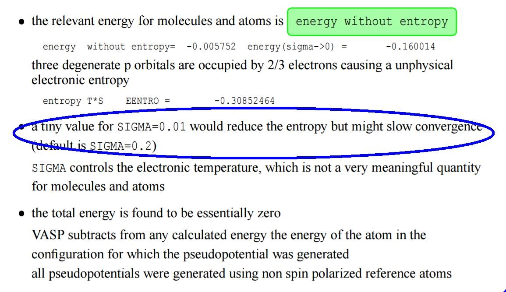

前面O$_2$初始结构为0.9 $\AA$时，如果使用`BRION=2`，相对于初始结构为1.07$\AA$的时候，为避免过度矫正，我们需要设置一个更小的POTIM，大师兄尝试过了，`POTIM = 0.01` 的时候得到了正确的计算结果。到此，O$_2$分子的计算我们暂且告一段落。做计算，机时很重要，尤其是缺钱，捉襟见肘的时候，我们就更加需要珍惜，保证并提高自己的计算成功率，避免重复计算。这一节我们总结下前面讲到的影响计算时间的一些细节。大家在计算的时候知道如何把握时间，在有限的机时内获取更多的有效的计算结果。

---

### 1 体系的磁性 (EX8)

考虑自旋后（`ISPIN=2`），VASP计算时会将电子分为两部分处理，一部分是$\alpha$电子，另一部分是$\beta$电子，我们在氧原子的自旋极化计算中提到过了，忘了的可以查看Ex8，Ex11中的内容。

补充一下：如果原子的`MAGMOM`为负值：应该这么写：

```
MAGMOM = 10*-2 # 有10个原子，每个原子的初始磁矩为 -2
```

注意： -2 不用括号（）括起来

---

### 2 对称性 (EX8)

体系的对称性降低，会增加相应的计算量。查看O原子计算时，改变晶胞大小，取消对称性前后的计算时间。

---

### 3  SIGMA的取值 (EX1)

我们看一下VASP练习手册：handonsession-I 里面的一句话说明：



因此，设置一个较小的SIGMA值会使收敛变慢。大家对于ISMEAR的选择，一定要多看官网的说明！

---

#### 3.1 半导体和绝缘体：

1） K点小于4 的时候，用`ISMEAR=0`, `SIGMA`取值小一些；比如SIGMA=0.05; 此时用ISMEAR = -5 会出错；

2）K点数目大于4的时候，可以使用`ISMEAR= -5`；

3） 注意： 我们算的气体分子，是绝缘体，且只用了gamma点，所以我们参数的设置如下： 

------

```fortran
ISMEAR=0 
SIGMA=0.01 
```


---

#### 3.2 金属体系：

ISMEAR一般用`ISMEAR=0` 或者整数1，2即可。

`SIGMA =0.1` 足够。

---

### 4 合理的初始结构 （Ex13-15）

前面我们刚讲到，一个合理的初始结构，可以避免很多意外的错误以及快速得到正确的结果。

如果你的初始结构不合理导致的计算出错，首先应该去调整结构，最后才是去调节参数，比如上一节中`IBRION=2 `时的POTIM值。

---

### 5 EDIFF （Ex9）

EDIFF 控制了电子迭代的收敛标准，如果你设置的标准比较严格，则每一个离子步需要更多的电子步数，需要的时间也会随着离子步的增加成线性关系增长。

---

### 6 EDIFFG （Ex9）

EDIFFG控制了结构收敛的标准，同样严格的标准需要更多的结构优化步骤来实现。

---

### 扩展练习：


1 本文所提到的内容，必须去官网查看，并认真阅读，如有不懂的，请在群里自由提问；

2 思考一下，还有其他因素影响我们的机时吗？