这一节和后面几节，我们会复习一下前面学到的Linux批量操作知识，然后对一些影响计算时间的参数进行测试。 本节主要考虑`ENCUT`的影响。前面我们一直在说`EDIFF`和`EDIFFG`对计算时间的影响。为了给大家一个感性的认识，现在我们用O$_2$分子的计算作为测试例子，将结果展示出来。这两个参数主要是在计算精度上影响计算时间，很容易想到，精度越高，收敛的越慢，需要的时间对应的也会更长。

---

### 1 调节EDIFF和EDIFFG

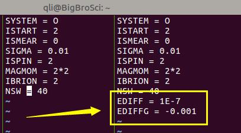

左侧为之前计算的INCAR，右侧为提高精度后的INCAR。O$_2$的初始距离设置的为1.207$\AA$。提交计算，等待任务结束。前面我们知道VASP计算完成后，OUTCAR最后输出的是计算时间，内存等信息。我们现在查看一下：文件夹 0 对应的是之前的O$_2$计算，文件夹1 中是提高精度后的计算。

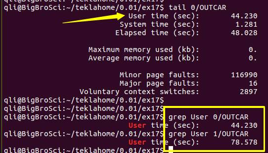

**注意：**grep User OUTCAR 后得出的结果被空格分成了4部分，时间信息在第4部分里面。User（1） time（2） （sec：）（3） 44.20 （4）

---

讲解：

1.1）通过`tail OUTCAR` 这个命令，可以找到用grep命令查看时间的关键词：User 或者 Elapsed，这里我们采用User 后面的时间作为参考；

1.2）右下方黄色图框中的时间表面：提高了精度后，计算时间从44秒增加到78秒。

1.3）我们看一下，改变精度后体系的能量变化：

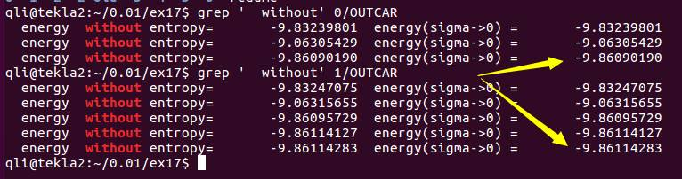

从-9.8609降低到-9.8611，变化大小为： -0.0002 eV。 这么小的能量变化，我们可以认为忽略不计。

在这里，我们要认真思考收敛标准对于我们计算体系能量的影响，选取一个合适的标准而又不会浪费太多的机时。一般来说，结构优化的时候，`EDIFF=1E-5`, `EDIFFG =-0.01 `至 `-0.03` 都是被认可的。

---

### 2 ENCUT 测试：

#### 2.1 制备ENCUT测试模板

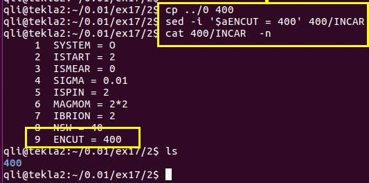

解释：  

2.1.1）新建测试目录 2 ，进入后，将前面的文件夹0复制过来，文件夹名为 400

2.1.2）使用sed命令，在INCAR中最后一行加入ENCUT参数，值设置为400

---

#### 2.2 快速制作测试任务

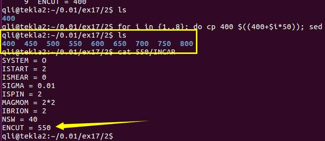

图中的命令行为：

```
for i in {1..8}; do cp 400 $((400+$i*50)); sed -i "s/400/$((400+$i*50))/g"  $((400+$i*50))/INCAR ; done
```

复习前面学到的linux操作：

2.2.1）明白`{1..8}` 是怎么回事；

2.2.2） `$i` 变量的调用；

2.2.3）新学：`$((加减乘除))`，注意数学运算用2个括号 括起来；

2.2.4）sed 命令进行文本中某一项的替换；

2.2.5）运行完毕后，会获得一系列`ENCUT`值的文件夹，且每个里面INCAR已经对应地设置完毕。

---

#### 2.3 批量提交任务

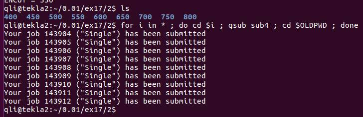
命令： 
`for i in *; do cd $i ; qsub sub4; cd $OLDPWD; done`

讲解：

2.3.1）do后面执行的是，进入for循环中的文件夹，然后提交任务，（大师兄提交任务的命令是 qsub sub4， qsub 是命令，sub4是脚本名），任务提交后，返回原来的目录下（`cd $OLDPWD`），然后再进入下一个for循环中的文件夹，重复之前的操作，直至遍历所有for循环的变量文件夹；

2.3.2）图中的Single是任务的说明，这个在提交任务的脚本里面自己随意设置：
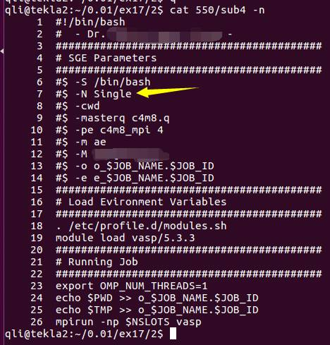

---

#### 2.4 批量查看结果的命令：

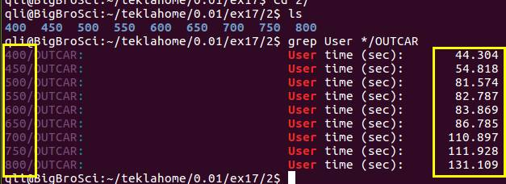

此处需要注意 * 的用法

我们只需要图中方框标出来的信息，其他的结果可以直接扔掉。为简化输出结果，这里大师兄用了另外一个强大的命令： awk

`for i in *0; do echo -e  $i "\t" $(grep User $i/OUTCAR | awk '{print $4}'); done`


2.4.1）  学会echo 命令：

2.4.2）  echo –e 后面加上"\t"后（双引号），可以直接输出 tab，方便导入excel；

2.4.3）  本例中，awk 后面用`{}`将打印的内容括起来；

2.4.4）  `print $4` 意思是输出前面结果的第4项；

2.4.5）  awk命令极其强大，强烈建议大家尝试着去网上查找资料，主动去学习；

2.4.6）将结果复制到excel里面作图。

#### 2.5 计算时间随着ENCUT增加的变化曲线

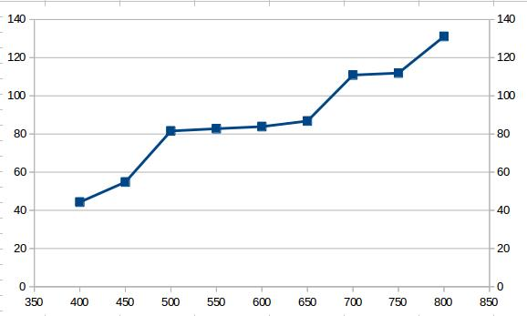

从图中可以看出，**计算时间随着ENCUT的增加也相应地增加了**。因此，在保证计算准确度和ENCUT的值的选取，你要学会合理取值，加快自己的计算速度。此外，图表的比较形象直观，大家在今后的学习中，多多思考将自己的数据转化为图表的形式！可以很好的表达自己的计算结果。

设想一下，同学A和B把同样的数据结果给老师看，A单纯把数据列到表格里面，B做成了上图的形式，老师会喜欢谁？此外，我们也可以通过写一个简单的python脚本来实现作图的功能。

---

#### 2.6 作图的 Python 脚本：

##### 2.6.1 获取数据，并保存成文件

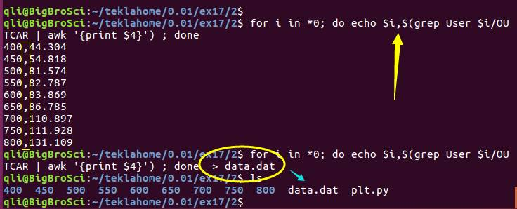

注意echo $i 后面的逗号，输出的文件 data.dat 中，逗号用于将两列数据分开。

2.6.1.1）图中圈出来的部分中， > 代表将前面命令的输出保存到 data.dat 文件中；

2.6.1.2） data.dat 后缀可以随便写，`data.txt`， `data.out`, `data.export`, 也可以不写：`data` 。 因为输出后的都是文本格式，直接可以编辑打开。

2.6.1.3） 查看一下保存的数据结果

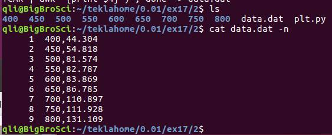

##### 2.6.2 作图 脚本， 名为 plt.py  

vim打开后，内容如下图：

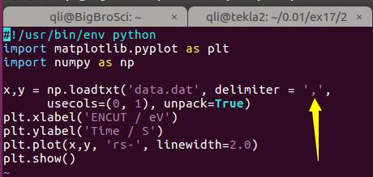

python程序学习参考书：** learn python the hard way**（免费），网上还有很多学习资料，这里就不介绍了。python读取data.dat 文件，根据 delimiter 后面的参数（此处为逗号）将数据分成若干列。

---

##### 2.6.3 运行脚本：（python plt.py）

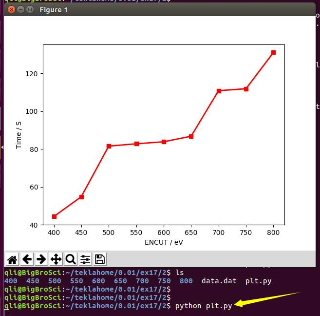


#### 2.7 体系的能量随ENCUT的变化：

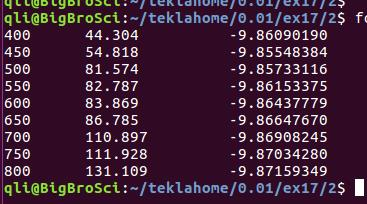

获取图上结果的命令行：

`for i in *0; do echo -e  $i "\t" $(grep User $i/OUTCAR | awk'{print $4}') "\t" $(grep ' without' $i/OUTCAR | tail -n 1 | awk '{print $4}'); done`

作图过程如下：

##### 2.7.1 生成数据：

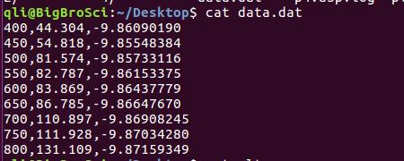

前面的命令中， "\t" 改为 逗号，  done 后面 加上 > data.dat， 重新运行一遍。 

##### 2.7.2 修改脚本如下：

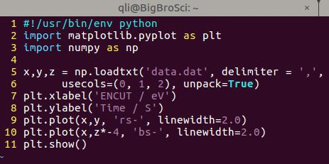

增加了 一列（z）

---

2.7.3 选择合适的画图区间：

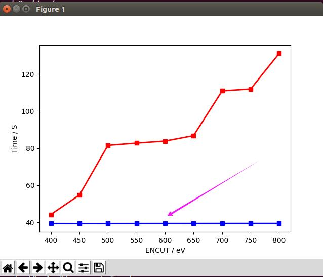

图中蓝色的O$_2$分子的能量随ENCUT值增加的变化，为一直线！

---

大师兄问：结果对不对？

答：结果是对的，但不具有任何的合理性。

因为它不能体现出能量变化的趋势：因为 y 轴的取值范围太大了，而我们能量的变化又太小。这也是很多人在做模拟的时候容易犯的错误，看到一个直线，或者平滑的曲线，就如同哥伦布发现了新大陆一番。其实则不然，很多时候，真相往往被我们的粗糙的观测范围给掩盖了。

这个称之为作图骗人的一个Trick！很多人在发文章的时候将这一技巧运用的如火纯情。所以，当你看文献的时候，如果发现别人的结果也是一条直线或者平滑曲线，第一直觉是去看坐标轴的范围，而不是感觉别人的工作是多么地牛逼。

重新作图，这次只用ENCUT和O$_2$分子的能量，如下图：

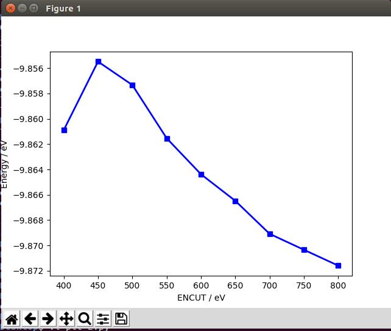

能量一直在降低， 结果对不对呢？对的，但变化却被过度放大了！

---

很多新手看到这个图以为能量降低的很快，感觉自己的计算不收敛，因此还要继续往下做或者测试。其实则不然，在这里，我们还是需要主要 y 轴的取值范围。图中整个y轴的变化为0.016 eV。每两个点之间的变化仅仅为0.002 eV。这个变化我们也是可以接受的，虽然图中感觉下降的很厉害的样子。

上面两个图中，走了两个极端，一个极大，一个极小。所以，在我们处理数据时，一定要仔细观察坐标轴的取值范围。

---

####  2.8 小结一下： 

但从数据上可以看出来，O$_2$分子的能量随着ENCUT值的增加还是会有些少许的波动。比如，从400到800 eV，能量降低了0.01 eV。大师兄，那我们该取哪个ENCUT值呢？

首先，我们要明确几个要点：

2.8.1）ENCUT值越大，计算的越精确，花费的时间也就越多；

2.8.2）ENCUT的取值仅仅通过一个例子的测试来确定，这是不对的；

- A)   在VASP的计算中，单个结构的能量所具有的意义不大，也就是说相对能量最重要！
- B)   为什么A）中说相对能量最重要：这是因为：没有对比，就没有伤害！设想一下，你把一个O$_2$的能量算的再精确或者能量再低，而不去使用它，它也就是个数字而已，不具有任何的物理化学意义。
- C)  B)中要表达的意思是，算出来的数值必须要应用到我们的物理化学概念中，也就是物理化学的概念体现在这些能量的使用过程中，也就是相对能量里面：比如，O$_2$的结合能， O$_2$的吸附能；某一化学反应的能量，反应能垒，表面能，功函数等等，无一不是多个能量的数学运算所的出来的。
- D)   O$_2$的结合能示例：

公式： EB = E(O$_2$) –2E(O)

O$_2$的结合能随着ENCUT值增加的变化情况：

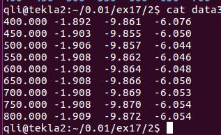

第一、二、三、四列分别为ENCUT，O原子能量，O$_2$分子能量和O$_2$分子中O的结合能。从图中，我们可以分析出来，ENCUT在450 eV时，O$_2$的结合能和ENCUT为800 eV的时候差别很小，因此我们可以选取450 eV进行计算。

注： O原子不同ENCUT的单点能，自己根据前面的过程，补充计算。

---

2.8.3）ENCUT的取值与体系中所有的元素有关；

- A）体系中含有不同元素的时候，查看这些元素POTCAR中的ENMAX值，找出最大的那个；
- B）ENCUT的最小值为所有元素中ENMAX的最大值！
- C）也就是说，找到最大的ENMAX（max）， ENCUT值大于等于ENMAX（max）。

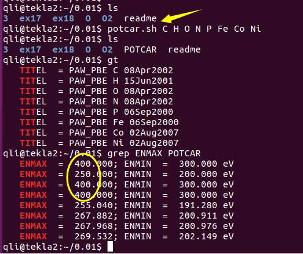

示例图中，
potcar.sh 为生成POTCAR的脚本，可在本书的附录中获取。ENCUT 的取值至少为 400 eV。

---

2.8.4） ENCUT的值，也要查阅相关的参考文献进行确定。你的计算体系大家都用400 eV，你也可以设置该值或者稍微高一些。ENCUT很多人在刚开始做计算的时候，都会测试一个数值。如果不想测试，查找参考文献其实是一个很好的办法。

---

### 3 扩展练习：

3.1 复习前面学到的批量操作方式；

3.2 熟练运用前面的操作，并理解命令的工作原理；

3.3 改变KPOINTS的大小，查看计算时间，能量的变化；

### 4 总结：

1 EDIFF和EDIFFG对计算的影响通过实例强调了一次；

2 ENCUT 测试的操作流程；

3 ENCUT对计算时间和能量的影响结果分析；

4 通过excel 和python作图的两个方法；

5 能量和计算时间随ENCUT的变化；

6 看图时坐标轴的区间范围要注意；

7 总结ENCUT取值的一些注意事项。
