### KPOINTS对计算时间的影响

---
继续前面的学习，本节讨论`KPOINTS`文件中K点的设置对计算时间的影响。本节图中的Linux命令不再详细介绍，大师兄默认大家已经基本掌握了其中的原理和窍门。VASP官网上还有其他的批量测试的脚本，大家现在也可以差不多能看懂了。比如Si计算的例子：https://cms.mpi.univie.ac.at/wiki/index.php/Fcc_Si 

---

### 1 KPOINTS测试
#### 1.1 准备测试模板

新建文件夹: 3，将之前的文件夹0复制过来后重命名为 1。

#### 1.2 批量制备测试文件：
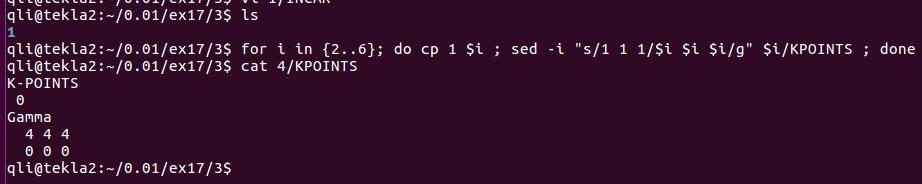

命令： `for i in {2..6}; do cp 1 $i ; sed -i"s/1 1 1/$i $i $i/g" $i/KPOINTS ; done`

文件夹1 代表KPOINTS为`1 1 1` ,6 代表KPOINTS为 `6 6 6`  其他的类推。

---

#### 1.3 批量提交任务：
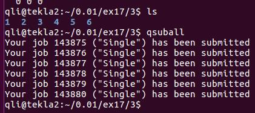

备注：这里的qsuball 命令是把前面的批量命令放到 .bashrc 文件中了。不懂的请看Ex17的批量操作命令和Ex13中.bashrc文件中alias的使用方法。

---

### 2 测试结果分析

#### 2.1 查看OUTCAR 中的K点信息
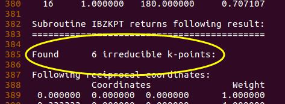

图中，我们找出可以通过grep 查询的字符：irreducible  

---

#### 2.2 批量查看所有测试的K点信息：

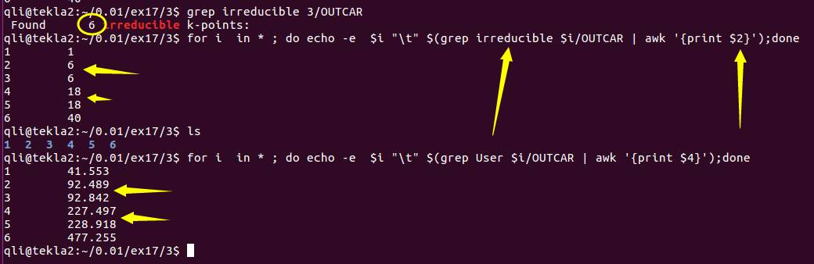

**命令 `grep irreducible 3/OUTCAR`**

从图中可以看出：

1）K点`2 2 2` 和`3 3 3` 的计算中，生成的K点数目是一样的；类似地，`4 4 4` 和`5 5 5` 具有同样地K点数目；

2）不难理解，相同的K点数目，其计算时间也是一样的；

3）计算时间随K点数目的增加也增加了。

---

师兄，为什么K点数目会存在奇数和偶数相同的关系？

原因在于K点生成的方法。当KPOINTS为偶数的时候，K点都在布里渊区的内部，而为奇数的时候，部分K点处在布里渊区的边界上。引用参考书中的一个表格和一段话：第三章第56-57页：

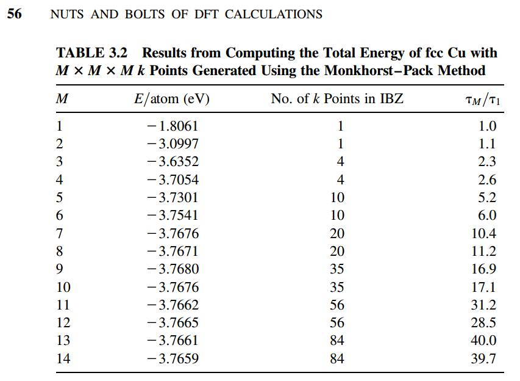

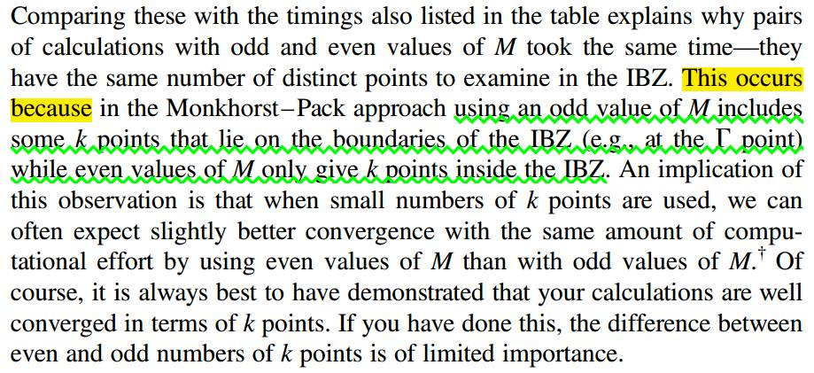

---

#### 2.3 不同K点对能量的影响：
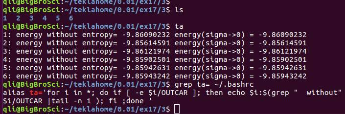
先不画图了，直接看能量吧：

当K点为 `1 1 1` 和 `6 6 6` 的时候，O$_2$分子的能量差别为： 0.0015 eV。可以忽略不计。在这里，你可以清晰地知道：为什么算气相分子的时候 gamma点（1x1x1）足够了。

对于其他slab或者体相材料的计算，K点怎么选择呢？我们看下面这一段话：
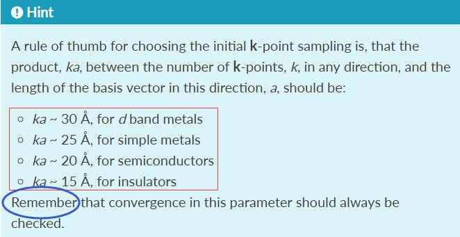

出处： https://wiki.fysik.dtu.dk/gpaw/exercises/surface/surface.html

---

再参考一下Quantumwise 网站的说明：
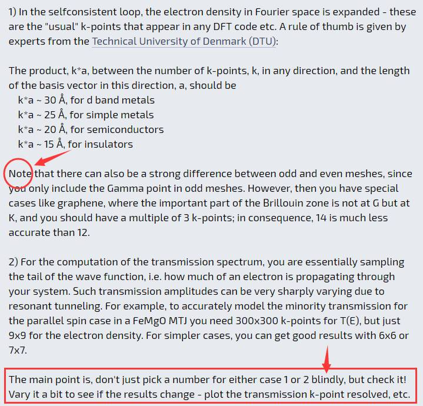
出处：http://quantumwise.com/forum/index.php?topic=2628.0

再次强调一下：浏览网站说明的时候，要养成这样的一种习惯，凡是看到Note这个单次，就要跟打了鸡血一般！前面的东西看不懂不要紧，Note后面跟的都是重点易出错的地方。

---

以上只是经验参数的说明，给我们提供一个大体的指导。这个参数在使用中，要注意我们前面提到的奇数和偶数的情况。而具体到我们的计算中，需要用什么数值，我们需要认真地测试检查一下，而不能直接就用图中的经验参数。

1）通过测试不同K点对体系能量的变化；（参考书中的例子）
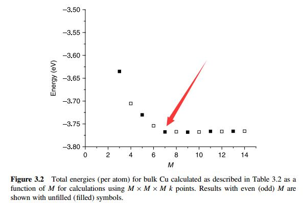

---

2）查找参考文献的取值；

---

3）此外，不同K点之间的数据不能混用。比如计算CO在一个 (3x3) Cu(111)表面上的吸附能：
$$
E_{ads} = E_{CO + slab} – E_{slab} – E_{CO^{gas}}
$$
等号后面的前两项，必须要用同一个K点下计算出来的能量，如果$E{CO+slab}$ 用`5x5x1` 的K点， E(slab) 采用 `3x3x1`的K点能量，得出的结果必然是错的。

---
### 2.4 来自VASP官方的提醒：

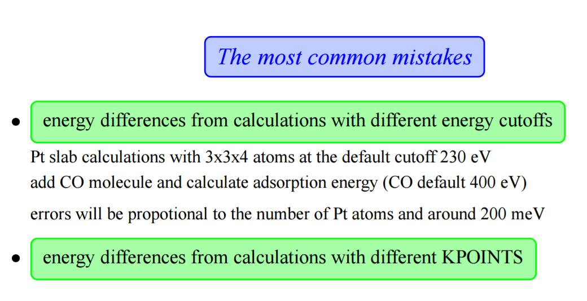

出处： https://www.vasp.at/vasp-workshop/slides/accuracy.pdf

1）常见错误（一）： 体系中ENCUT的取值不统一；

2）常见错误（二）：采用不同KPOINTS计算出来的结果。

3）在关于Accuracy的这个pdf文件中，最后一行大家要谨记：TEST，TEST，TEST ....

---

### 3 扩展练习：

1 下载大师兄分享的压缩文件： 本节中所有的pdf文件和链接；大师兄QQ群文件下载，或者百度网盘：http://pan.baidu.com/s/1eSCGWeA

2 阅读参考书中第三章的内容，掌握K点的基本概念和一些选取的注意事项；

3 浏览本节中所有的网址。

---

### 4 总结：

1 K点数目越多，计算越准确，需要的时间也会相应地越多，大家要把握好准确度和时间的关系；

2 K点的确定，需要经验和测试相结合，经验为辅，测试为主。

---

## 5 补充： 

 VASP的新版本中，可以直接在INCAR中设置K点。也就是说，没有KPOINTS文件也可以正常计算，但这可能只适用于简单的K点情况，能带结算等需要制定K点路径的计算，我们还是需要KPOINTS文件的。

