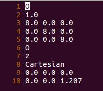
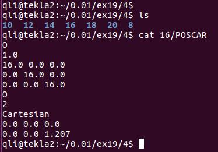
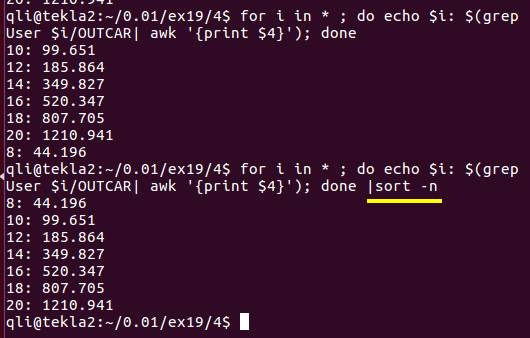
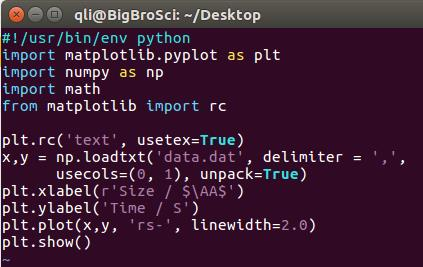
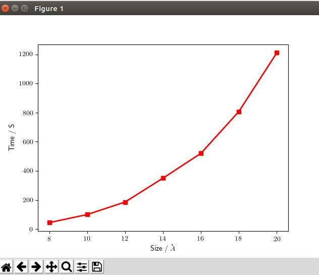
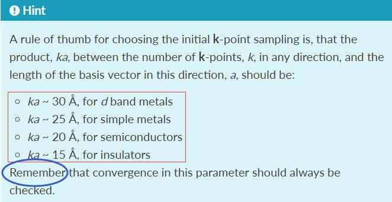
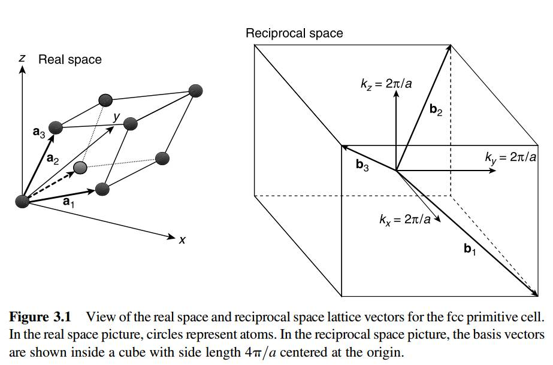
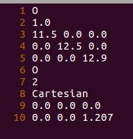
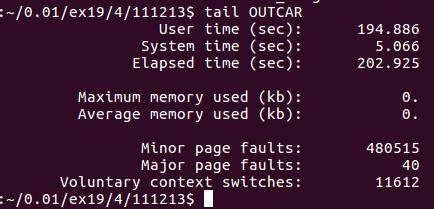
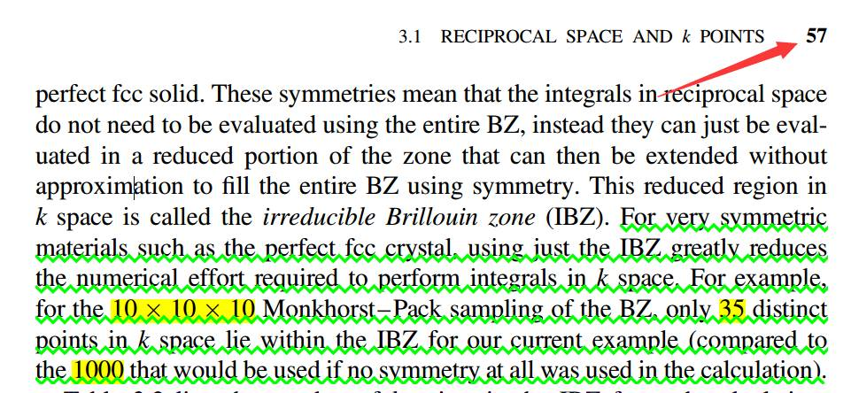

### 模型对计算时间的影响

---

上一节介绍的KPOINTS对计算的影响，相信大家已经认真阅读参考书的第三章部分了。本季我们讨论一下模型的大小对计算的影响。主要体现在晶胞的尺寸，对称性以及对K点的影响上。

---

### 1 测试工作：

 为了方便处理，我们把O$_2$计算的格子设置为长宽高均为8.0 $\AA$。

重复之前KPOINTS的批处理操作，我们可以获得一系列不同大小格子的文件夹。如下图：

命令：  `for i in $(seq 10 2 20); do cp 8 $i; sed –i "3,5s/8.0/$i/g" $i/POSCAR ;done`

---

### 2 测试结果分析
### 2.1 模型大小对计算时间的影响

注意：在后面加入 `sort –n` 后输出的变化。

---

从图中可以看出来，计算时间随着格子的大小，需要的计算时间增加的很快。

注意：在测试中，KPOINTS一直保持不变（因为只有一个Gamma点）。而在我们实际的计算操作中，使用1x1x1 KPOINTS的机会并不多。如果格子在某个方向增加了2倍，那么对应的改方向的K点就需要除以2。重复一下上节的经验指导。也就是在计算过程中，保持k*a保持不变。当然，k*a是我们提前测试好的。

举例：

一个`10x10x10` $\AA^3$的体相材料，我们计算的时候K点设置为：`6x6x6`。

当我们将材料在x方向增加1倍，变为`20x10x10`  $\AA^3$。为保持一致的精确度，那么我们的K点需要设置为：`3x6x6`。

---

这是因为倒易晶格矢量和实际的晶格矢量之间存在着倒数的关系：

注： 类似的图，不加说明，均出自我们的参考书。也就是说，我们选取的晶格越大，倒易晶格矢量越小。用同等数目的K点分布到倒易晶格中，网格的密度也会越大，从而造成计算量的增加。

---

#### 2.2 体系的对称性对计算速度的影响：

##### 2.2.1 K点保持不变：

这一点前面关于氧原子的计算就已经介绍到了，降低体系的对称性会增加额外的计算时间。如图：将`12x12x12` $\AA^3$ （计算需要186.86 s）的格子修改如下：

计算结束后，查看时间，为194.9 s, 计算时间增加了8秒。

#### 2.2.2 对称性对K点的影响：

体系的对称性不仅仅提现在前面的计算中，更可以在计算中极大地减少K点的数目，从而加快计算，节省时间。这一点我们引用参考书中的一段话：

##### 2.3.3 模型对称性与K点对称性的关系

在这里，体系的对称性与K点对称性的匹配问题，尤其是对于hexagonal的结构来说，必须要使用 gamma centered points. 也就是第三行的第一个字母必须为G或者g。我们看一下官网的原话：

>We strongly recommend to use only Gamma centered grids forhexagonal lattices. Many tests we have performed indicate that the energy convergessignificantly faster with centered grids than with standard Monkhorst Pack grids. Grids generated with the "M" setting in the third line, in fact do not have full hexagonal symmerty.

如果你不确定自己的体系，直接用G就可以了。

 >For reasons of safety it might be a good choice to use only meshes with theirorigin at (switch "G" or "g" on third line or odd divisions) if the tetrahedron method is used.

### 3 扩展练习：

 1 认真阅读： Density Functional Theory: A Practical Introduction: 第三章的前两节；

2 VASP官网查找K点相关的说明。

### 4 总结：

 学习完本节，大家应该掌握的内容有： 

4.1 晶格大小对计算时间的影响；

4.2 体系的对称性对计算时间的影响；

4.3 掌握K点和晶格大小的经验规则；

4.4 晶格对称性和K点对称性的一致性。
