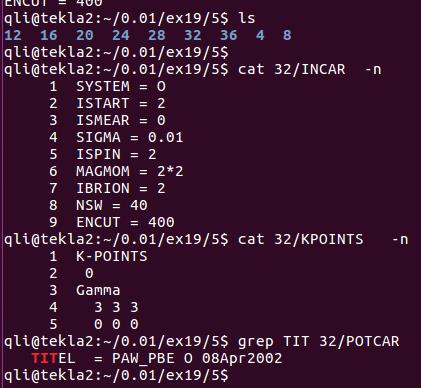

### 并行

---
前面几节讨论的都是一些涉及到模型以及计算细节对时间的影响。本节我们讨论一下服务器节点设置（并行）的影响。从字面上不难理解，并行就是多个节点同时计算同一个任务。好比之前用一匹马拉车，现在改用两匹，三匹或者更多的马拉同一辆车。一匹马拉车的时候，对马的要求是足够强壮，能拉得动还要跑得快。但你想跑的更快，就需要驾驭两匹或者多匹马，但这个时候对于驾驶马车的你就需要提出技术要求了：如何控制马儿之间的节奏。控制好了，并驾齐驱，得儿驾得儿驾，爽歪歪。控制不好结构，你跑你的，我跑我的，整体下来，马儿也累，马车行驶的反而更慢了，搞不好还会栽跟头。

---

同样的道理，如果想加快计算速度，或者在最短的时间内获取最多的计算数据，我们就需要知道并行在计算中的作用。首先我们先测试一下，不同节点同时运行O$_2$分子计算所需要的时间。注意：本练习讨论的是多个节点下的并行！

---

### 1 测试活动： 

为了观测更加明显，我们使用` 8x8x8` $\AA^3$的格子，K点使用`3x3x3`， `ENCUT = 400` 。

测试的服务器每个节点有4个核，每个核有两个进程。

文件夹用核数命名，4,8,12,16 分别代表使用了1,2,3,4个节点进行计算。

在这里，每个节点可以看成1匹马，4个核可以看作马的四条腿。每个核的两个进程可以看做每条腿的上下两部分。

---

#### 1.1 设置计算的节点数目

使用多少个节点进行计算，在提交任务的脚本里面设置。每个课题组可能不太一样，也有通过命令设置的，不过都大同小异。大师兄晒一晒自己组里提交命令的脚本，如果和你们的不一样，不要纠结：

这个任务的脚本里面，我们使用32个核（32条腿），也就是8个节点（8匹马）同时计算。提交所有的测试任务后，等待结束。

### 2  测试结果分析：
#### 2.1 提取结果

`for i in *; do echo -e $i "\t" $(grep Elapsed $i/OUTCAR  | awk '{print $4}'); done`

这里复习上一节： `sort –n` 命令的用法，将数列从小到大排列。

注意：这里我们没有用之前的`User time`提取时间, 而是用的`Elapsed time`。这一项是计算真正花费的时间。所有的时间里面：`Total CPU time = User Time + System time`，一般来说， Elapsed time 总会比 Total CPU time 多上那么几秒。

`User time` 和 `System time` 是干嘛的？怎么的出来的？大师兄也不知道具体的含义。希望知道的童鞋们给大师兄上上课。之前几节中，用`User time`的分析结果可靠吗？ 没问题的，大师兄检查了一下，前面的`System time`均为 2s左右，`Elapsed Time` 中绝大部分由`User time`来贡献。

---

#### 2.2 作图分析

核数的单位为 个 ， 对应图中的拼音 ge（个数）

1  从4核到8核，计算时间并没有减少，反而增加了15s

2  从4核到12核，计算时间也仅仅减少了20s

3  从12核以后，增加核数，计算时间反而增加了。

从12核开始，增加的核数白白占了你的任务，缺丝毫没有提高计算速度。因此，增加核数反而成了计算的负担。这是因为并行计算的时候，不同核之间的数据传输浪费了大量的计算时间。这好比是你多安排了几匹马来拉车，但马儿们却彼此交流，各跑各的，不愿意拉车了。

---

#### 2.3 既然是这样，VASP并行还有个卵用？

答：并行是有用的，只不过我们需要调教这些不听话的马儿们，让他们服从我们的命令。这里我们就会需要一些其他的参数，NCORE和NPAR。 

NCORE：控制多少个核同时计算；
NPAR：如何把计算任务分配到计算资源上面计算。

它们之间的关系是：NCORE= 计算使用的核数 / NPAR

注意：这两个参数只能选取一个来使用:

---

测试数据结果（给喜欢看表格的人准备的）

图中红色部分为前面计算的结果，

- 蓝色为NCORE=4的结果（测试的服务器每个节点有4个核，所有的计算军用NCORE=4）；
- 绿色为NPAR=4的结果（所有的计算中均用的NPAR=4）；
- 黄色为NPAR=Core/4的结果，

根据NPAR和NCORE的关系，该设置与NCORE=4等同，但是实际测试中蓝色和黄色为什么没有完全一样，我也说不清楚。

---

1）使用NCORE以后，单节点运行也加快了；（单匹马儿被你调教的更听话了）

2）加入NCORE和NPAR参数后，计算时间明显提高了。在20核以后的计算中尤为明显；

3）如果你想用多个节点计算，NCORE或者NPAR，不要忘了加（二者选其一）。

４）可以肯定的是：NPAR和NCORE的乘积就是我们计算所用的核数，这一点大家要记在心里。

5) 在本测试中（这是前提！！），增加节点个数并未实现 1+1 = 2 的效果，1+N = 2 的效果也没有实现。但在多个节点的计算中，加入NCORE或者NPAR，节点数越多，效果越明显。

手册上解释说NPAR，或者NCORE的取值可以为总核数的开方值。很多人对此会有疑虑，大师兄的建议是：

*  **测试，测试，测试!....**测试一下自己的体系这是主要的，不要完全相信本测试的结果，体系不同，结果可能会差很多！！；

* NPAR的取值可以设置为节点的数目，（默认值为计算的核数！）

* NPAR实在不懂的话，直接设置NCORE=单节点的核数，单节点的核数/2，单节点的核数/4…….

*  个人使用经验是：NCORE = 单个节点核数 / 2 的时候，运行最省时间，设置也最方便。

### 3 扩展练习：

1 阅读VASP官网关于NCORE，NPAR的内容；

2 对于自己的计算体系，测试这两个参数；

3 总结前面关于计算时间的影响因素

---

### 4 总结： 

关于VASP计算时间的影响，我们暂且告一段落了，希望大家能在前面几节的学习中熟练掌握影响计算时间的这些因素，在实际的计算过程中合理把握，提高计算效率，节约机时。浪费的机时不仅仅属于你自己，也属于组里其他人的。