前面我们终于讲完了 $\rm{O_2}$ 分子优化的例子。相信大家对 **VASP** 计算已经有了一个初步的理解。这一节我们继续学习气相分子的优化。为了让大家进一步了解计算的过程，我们选取一个稍微复杂的分子作为例子：乙醇（$\rm{CH_3CH_2OH}$）。

------

问：把大象装进冰箱需要几步？

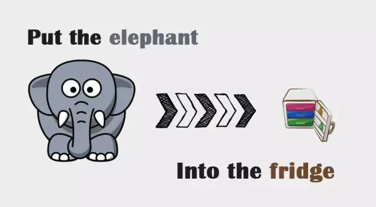

大师兄，这个问题我早就知道答案了。为啥还问这样低智商的问题？

大师兄要求的不是让你回答开冰箱门，装进去，关门的这三步。而是让你尝试回想一下：当你第一次接触这个问题的时候，你的反应是什么？

大师兄比较笨，我的第一反应是，这怎么可能？  冰箱那么点，大象那么大。

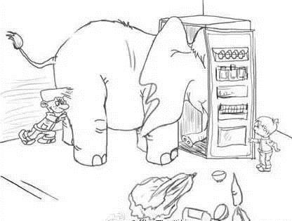

当朋友告诉我答案的时候，才恍然大悟，这跟大小没关系。

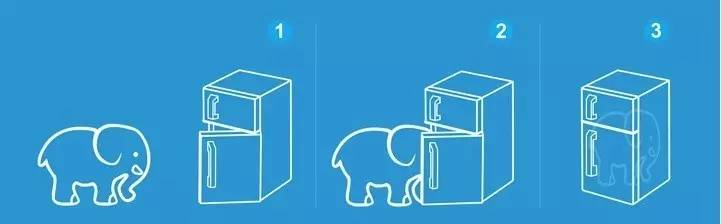

--------

同样的，怎么用 **VASP** 计算乙醇分子？很多童鞋就如同第一次被问到大象这个问题一样不知所措。答，也是三步！

1） 打开冰箱：准备 **VASP** 文件

2） 把大象塞进去：准备乙醇分子模型

3）关上冰箱：运行 **VASP**

## 1. 打开冰箱：

我们可以直接用O$_2$分子计算的输入文件，

### 1.1 复习一下前面学到的`INCAR`和`KPOINTS`的内容：

1）乙醇分子是闭壳层的分子，没有磁性，不需要`ISPIN=2`

2）气相分子计算，我们要用`ISMEAR=0`，`SIGMA`取值要小，`SIGMA=0.02`；

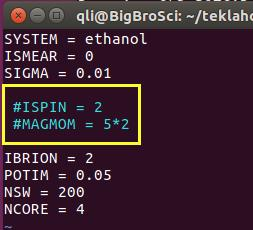

 **\#** 表示注释，这个符号后面的内容，VASP在运行的时候不考虑。

-------------

**示例 1 ：**
```bash
ENCUT = 400
# ENCUT = 500
```
和
```bash
ENCUT = 400
```
效果是一样的。

-----------

**示例 2：\# 的用法：**

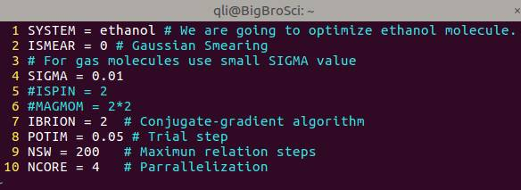

**VASP** 计算中一些常见的错误，以及注意事项，你可以通过 \# 写在`INCAR`里面，方便计算的时候进行设置。可以 \# 开头，单起一行，也可以在参数的最后面加上注释。新手们刚刚开始，可以结合 **VASP** 官网参考书，把用到的INCAR参数注释下来，时间长了慢慢就掌握了。

3）气相分子计算，`K`点使用`Gamma`点就够了；

```fortran
K-POINTS
0
Gamma
1 1 1 
0 0 0 
```


-------------

## 2 把大象塞到冰箱里面 :POSCAR的准备（本节重点）

前面我们学习到，一个好的初始结构会加快计算，获取准确的计算结果。因此我们需要去找一个合理的模型。对于气相分子的结构，一是手动搭建，大师兄推荐用 `GaussView`，另一个办法就是找数据库，大师兄推荐英国皇家学会的 **ChemScpider**。网址：http://www.chemspider.com 


下面我们把手动搭建乙醇分子的模型具体解释一下：

### 2.1 打开网站

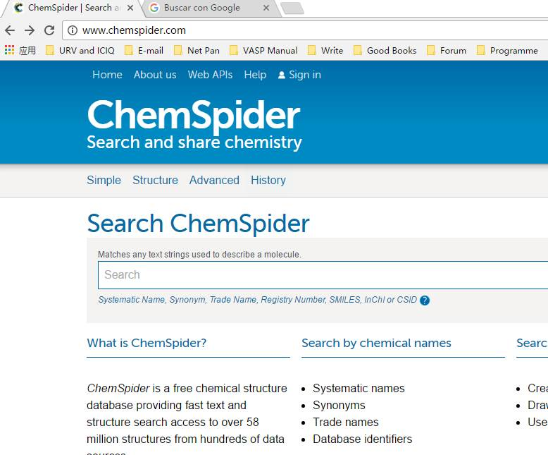


搜索框中输入： 分子名称`Ethanol` 或者 分子式`C2H6O`…. 点击搜索，等待结果：

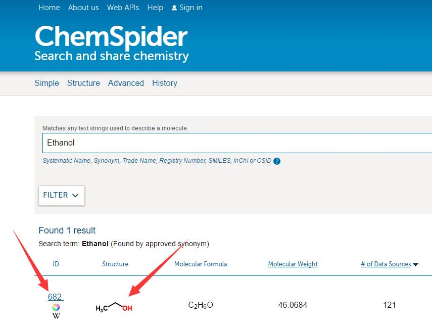

上面箭头指的两个地方随便点，效果是一样的，如下：

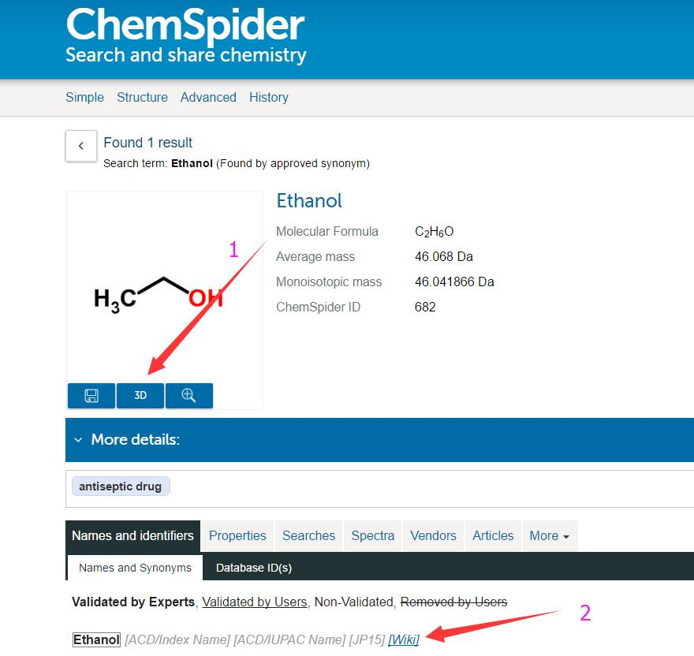

分子默认显示 `2D` 的结构，点击箭头指的 `3D`，切换。第二个箭头所指的有对应结构的维基百科链接，翻墙的筒子们可以查阅下相关结构的知识。选择`3D`后，如下：

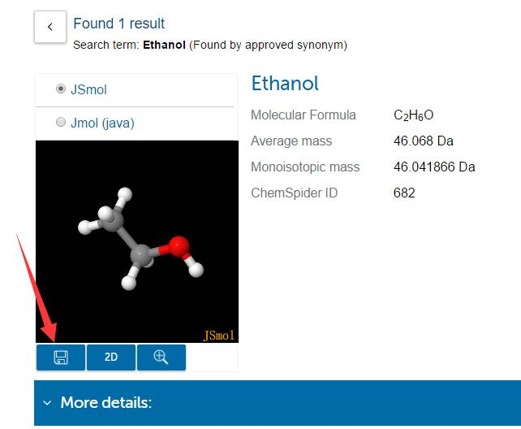

点击箭头指的地方保存，浏览器会下载对应的 .mol 文件，文件名为该结构在数据库中的编号。

------------

`.mol`文件也是纯文本，使用`Notepad++` 打开如下：看到这么多内容，不要害怕！

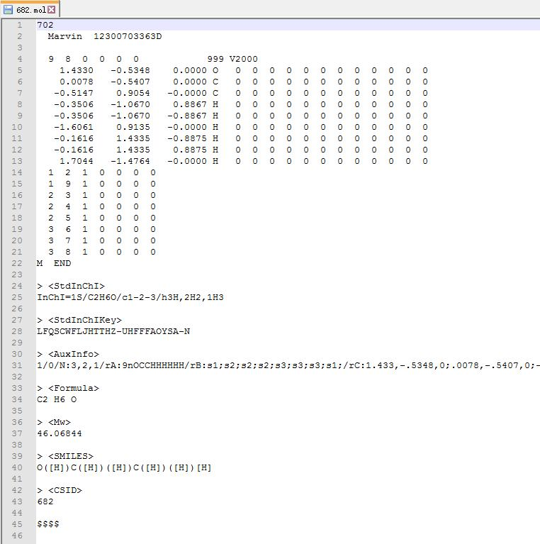

**注： 不仅仅是 `.mol` 文件，很多结构文件都是文本格式，直接打开就是。**

从里面找到乙醇结构的 $x, y, z$ 坐标信息

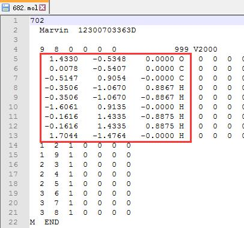

删除上图中除红色框之外的所有行，1-4行，以及 14 至最后一行，只保留 $x, y, z$ 坐标信息的那几行。

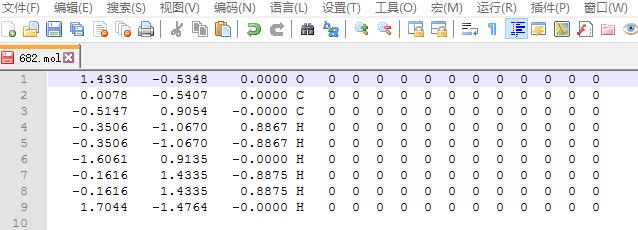

手动写`POSCAR`，首先你要熟记的格式，知道`POSCAR`从头开始，往下每一行代表的内容。

我们的模型是把乙醇分子放到一个 $ 20 \times 20 \times 20~A^3 $ 的格子里面。输入完之后，坐标后面的元素符号以及那些 $0$ $0$ $0$ 可以删掉，也可以不管。

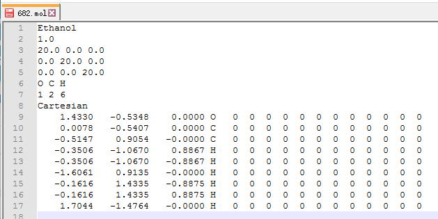

**关键点1： .mol文件中，坐标那几行中的第 4 列写到`POSCAR`中的第 6, 7行！**

**关键点2： 注意坐标为 `Cartesian` 或者是 `Direct`. `Direct` 是分数坐标，其 $x, y, z$ 值都小于 1.**

------------------

如果你想删掉图中坐标第3列后面的内容：大师兄推荐notepad++里面的列块模式：如下：

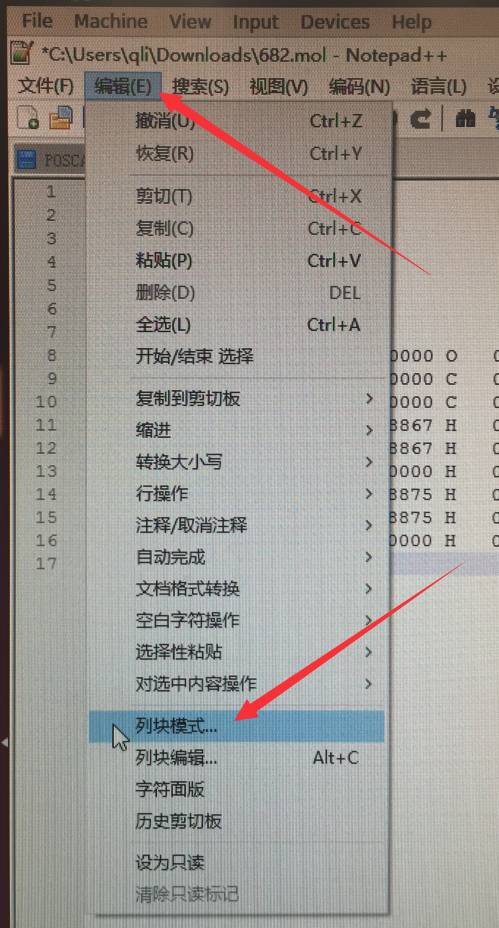

点击之后，可能会弹出对话框，告诉你如何使用，列块模式

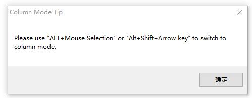

-------------------

**方法1：**

 摁住 `Alt` 键，然后用鼠标选择文本，不同电脑可能不一样，大师兄这边同时摁住 `Ctrl` 和 `Alt` 两个键，然后用鼠标选择的。

------------------

**方法2：**

同时摁住 `Alt`和`Shift`键，通过键盘上前后左右的箭头选择文本

大家可以尝试下，选中效果如图：

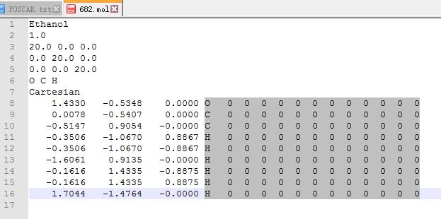

然后点键盘上的`Delete`键删除.

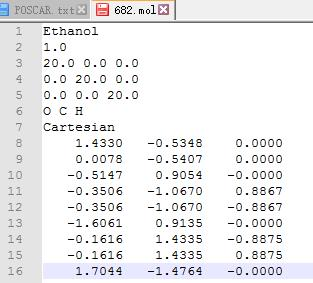

然后另存为`POSCAR`即可。

------------------

我们可以使用 **p4vasp** 来查看一下模型的结构：如下图

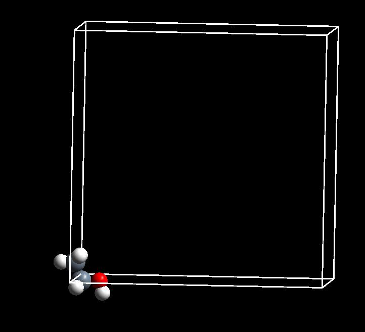

我靠，师兄，结构怎么跑到格子外面啦？前面 $\rm{O_2}$ 分子的学习中，你已经知道了这是因为周期性导致的显示问题。对计算不会产生影响。这个结构可以拿来直接用。

如果感觉不爽，想把结构放到中间，可以这么做：

数学上，把 $x, y, z$ 坐标**统统加上 $10$ 即可**；

软件使用上，我们讲一下 **p4vasp** 的操作方法：

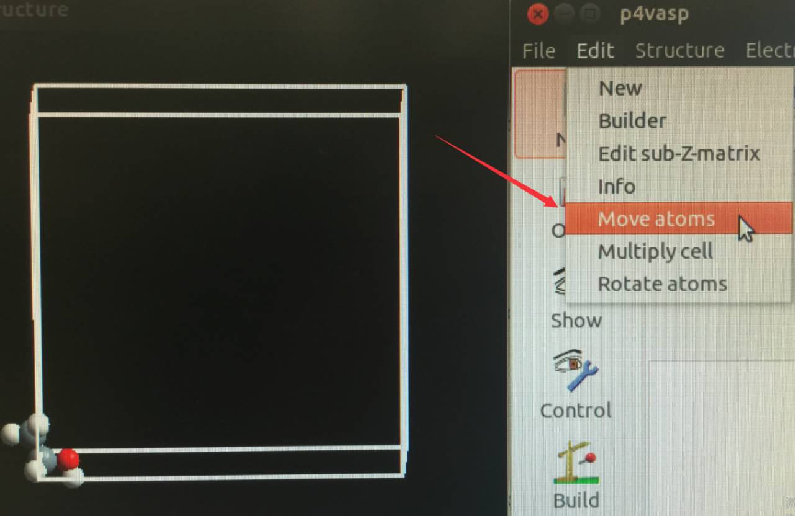

选择 `edit` –> `Move atoms`

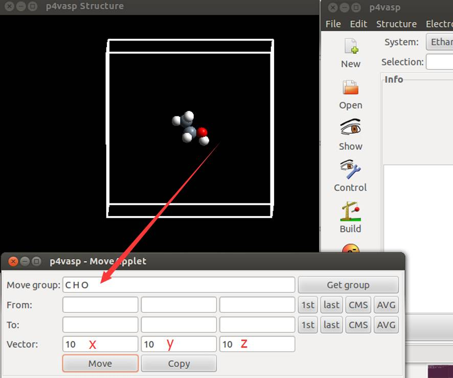

`Move group` 是你要移动的原子，这里大师兄直接输入了 C H O 三个元素符号（中间有空格）表示选择所有元素的原子。然后在 `Vector` 中选择 $x, y, z$ 三个方向上移动的大小。你也可以写 $1$ $1$ $1$，然后点击 `Move` 按钮 $10$ 次。

如果你想通过选择原子来实现移动的话(不直接在 `Move group` 里面输入 C H O)，需要按照大师兄说的步骤走：

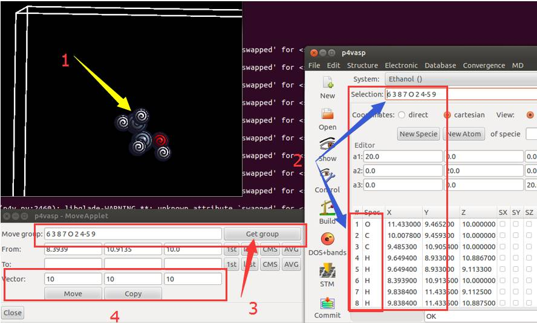

1) 空格键结合鼠标选中所有的原子；鼠标指到原子上就点一下空格键

2) 选中原子后，主界面会显示一些数字，这些数字和 `POSCAR` 中元素的顺序是一致的；

3) 所有原子选中后，左下角的框中点击 `Get group`，会显示选择的那些原子；

4) 在 `Vector` 中选择 $x, y, z$ 三个方向上移动的大小，然后点击 `Move` 按钮。

上面一堆废话就此打住，结果就是这样子的：

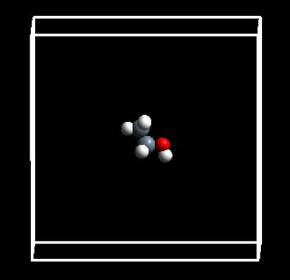

然后点击 file -> Save system as -> 选择目录 -> 保存成`POSCAR`

-------------------

#### POTCAR

**POSCAR** 讲完了，我们就要按照里面的元素顺序制备`POTCAR`了。

首先: 我们要准备 O C H 三个元素的`POTCAR`，去`POTCAR`的数据库中去找：

然后复制到当前目录下，三个元素的`POTCAR`分别命名为：`POTCAR-O`, `POTCAR-C`和 `POTCAR-H`， 把三个元素的`POTCAR`合并在一起，命令就是

```bash
cat POTCAR-O POTCAR-C POTCAR-H >> POTCAR
```

## 3 提交任务

提交任务之前，需要再次检查自己的输入文件一遍，没有问题，提交直至结束。


## 4 扩展练习：

4.1 从头到尾，认真重复本节中大师兄的操作；

4.2 记住本节讲解的内容，自己重复一遍操作，直至自己通过文本编辑器会搭建结构模型；

4.3 运行乙醇计算的例子；

4.4 尝试使用 **GaussView**，**Materials Studio (MS)**，以及其他可视化界面搭建模型；

4.5 学会使用 **VESTA** 导出`POTCAR`格式的结构数据。


## 5 总结：

本节，我们主要讨论了一下分子模型的数据库搜索和搭建工作。希望大家能够完全掌握本节的所有内容和细节。在计算中，你会遇到各种各样的结构文件，其实都是$xyz$坐标的衍生物而已。不要害怕，直接打开它们，学会提取里面有价值的信息。
