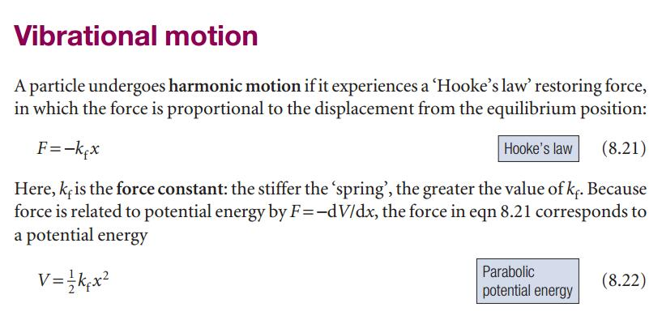
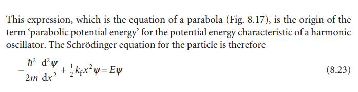
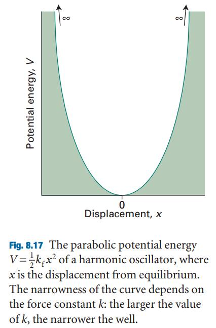
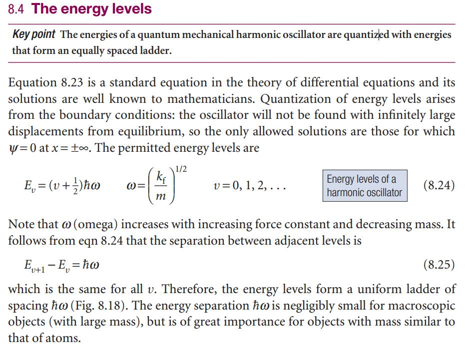
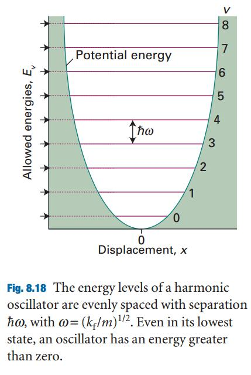
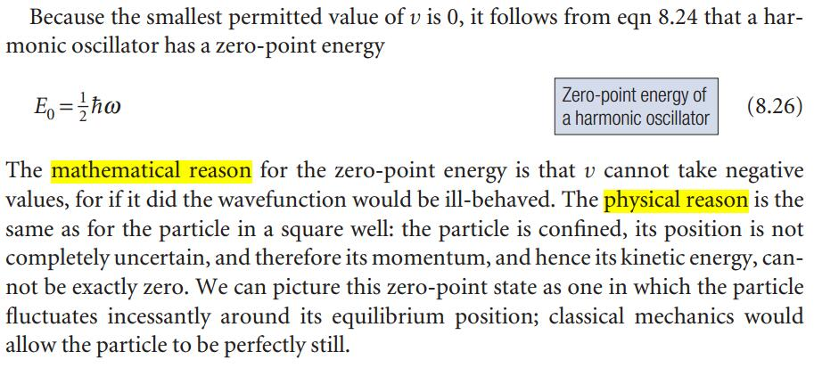
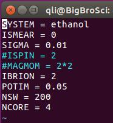
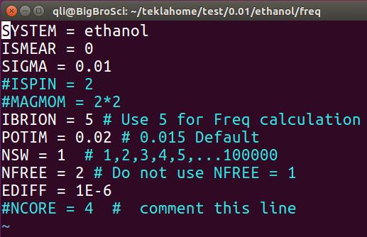

大师兄在本节开头放上这张图片的意思是，请大家再仔细体会`Rubbish in， Rubbish out`这句话，只有对我们要研究的体系有一定的理解，明白我们具体要计算什么内容，设置好输入文件的参数，才能得到我们需要的合理结果。接下来的几节会涉及到分子的振动频率计算，振动频率的可视化等内容，请大家跟着大师兄一起练习，掌握振动频率的基本计算和分析方法。

--------

## 1 分子的振动

我们首先看回顾一下振动相关的基本知识，这里大师兄不具体解释，引用 $9$ 版 $Atkins$ 的《物理化学》书中的内容，书已上传至**QQ群文件**中，也可百度网盘下载: <http://pan.baidu.com/s/1o8HlyOi>  全是英文，大家耐心阅读下。

-------------

简谐振子、胡克定律、体系势能随着振动距离 $x$ 的关系



简谐振动的薛定谔方程描述:





薛定谔方程的解：振动的量子化，振动频率





零点能的数学和物理两个方面的解释:



------------

## 2 频率计算的作用

**频率计算有什么用？为什么要算频率?** 大师兄稍微总结了一下频率计算的意义，大体有以下几个方面，没有提到的用处，烦请大家指出来，以便补充。

2.1 确定结构是否稳定;

2.2 看振动方式和大小，用来和实验对比，棋博士最新的文章就是一个非常好的例子;

2.3 反应热，反应能垒，吸附能等的零点能矫正;

2.4  确认过渡态(有一个振动的虚频)

2.5 热力学中计算`entropy`，用于计算化学势，微观动力学中的指前因子和反应能垒。

---------

## 3  怎么用VASP计算频率?

3.1首先进行结构优化，获取稳定的构型，这个我们前面已经讲过了;

3.2 将原来的`CONTCAR`复制成`POSCAR` :
```bash
cp CONTCAR  POSCAR
```

3.3 修改`INCAR`



修改后如下:  



频率计算的`INCAR`


- `IBRION`的值改成`5`

- `POTIM`用一个更小的值，我们这里用的 `0.02`，默认值是 `0.015`

- `NSW` 设置成1，这个可以直接不管，继续采用优化时的`NSW`值，因为你设置成 `1， 2， 3， 4， 5， …， 1000` 都不会影响计算；但不能不设置（因为默认值是`0`，这时算个单点后任务便停止了。）

- `NFREE=2` 添加这一个参数，表明原子在某一方向上正反两个方向移动；

- `NCORE=4`这一项要注释掉！大师兄这边的服务器，并行计算频率时 VASP 会罢工，只进行一步静态计算，注释掉就正常进行了；

- 此外，`EDIFF`也要设置一个严格的值（频率计算时，默认值为`1E-6`，足够了！下一节会讲到）


小结一下频率分析关键的参数:

```bash
IBRION=5
NFREE=2
POTIM=0.02
```
---------

## 4 扩展练习

4.1 按照本节的流程新建一个文件夹 `freq` : 该文件夹中包含乙醇分子优化后的结构 (将`CONTCAR`复制成`POSCAR`)，以及优化时的`POTCAR`，`INCAR`， `KPOINTS`以及提交命令的脚本文件;

4.2 修改乙醇分子优化的`INCAR`为频率计算的`INCAR`；需要修改哪些参数心里要清楚；

4.3 运行乙醇分子频率计算，并查看频率分析的`OUTCAR`，`OSZICAR`等输出文件；

4.4 查看 **VASP** 官网对于`IBRION=5` 的解释，搜索网上相关频率计算的文章，帖子，初步了解`NFREE`，`POTIM`所代表的含义；

<https://cms.mpi.univie.ac.at/wiki/index.php/IBRION>

4.5 查找官网中频率计算的例子:

A) <https://cms.mpi.univie.ac.at/wiki/index.php/CO_vibration>

B) <https://cms.mpi.univie.ac.at/wiki/index.php/H2O_vibration>


## 5 总结:

5.1 熟悉频率计算初始文件的准备过程；

5.2 频率计算`INCAR`中的三个重要参数；

```bash
IBRION = 5
NFREE = 2
POTIM = 0.02
```

5.3 初步了解频率计算中各个参数的含义。
