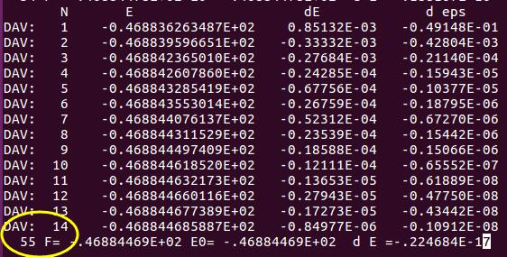
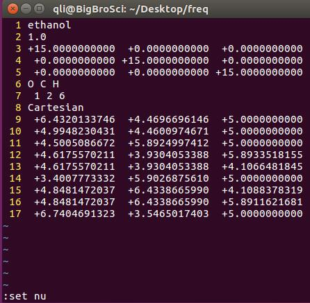
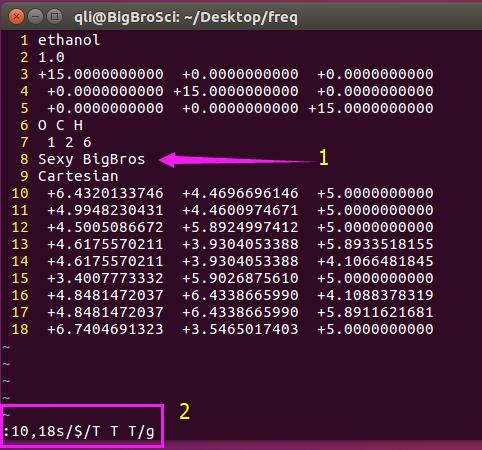
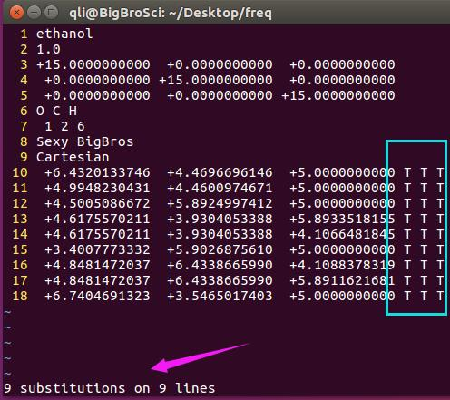
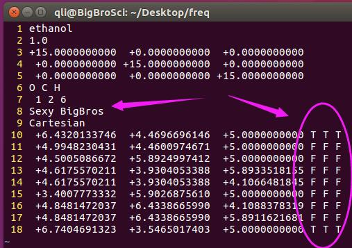
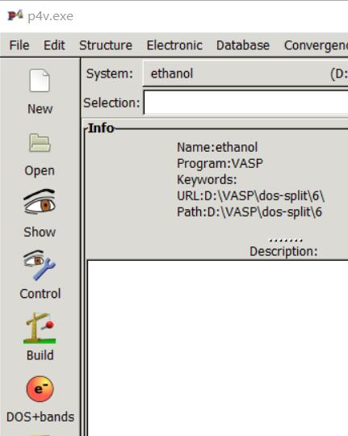
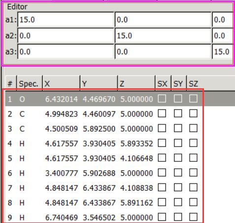
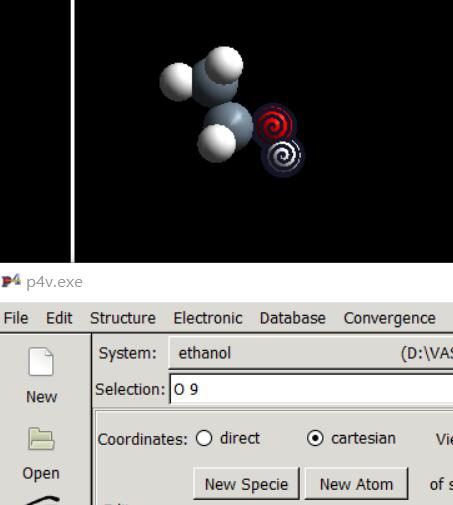
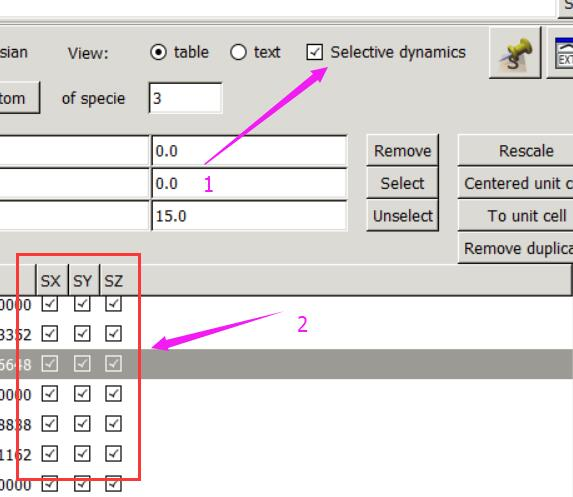
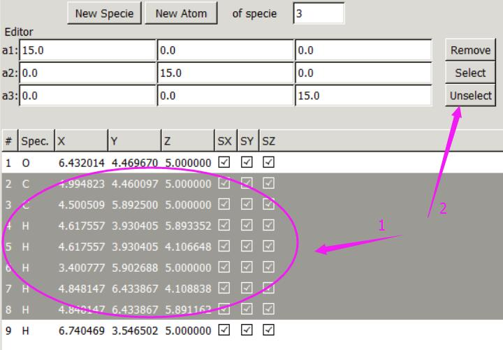

按照前面一节介绍的方法，结构优化过程完毕后，准备频率计算的输入文件，提交任务等待结束。然后我们介绍一下频率计算的输出与POSCAR原子的固定。

## 1 查看结果

### 1.1 查看OSZICAR，你会发现一共计算了55步。

下面我们分析一下这$55$步是怎么回事：

A）乙醇分子$\rm{CH_{3}CH_{2}OH}$ 含有 $9$ 个原子，每个原子在 $x, y, z$三个方向上均有一个自由度，共 $9 \times 3 = 27$ 个

B）我们设置的`NFREE=2` ，也就是在每个方向上 `+POTIM` 和 `–POTIM`都移动并算一下，这样就有了 $27 \times 2 = 54$ 步：官网原文如下：大家自己去查阅`IBRION`和`NFREE`的相关内容。

> The parameter NFREEdetermines how many displacements are used for each direction and ion, andPOTIM determines the step size. The step size is defaulted to 0.015 ? (startingfrom VASP.5.1), if too large values are supplied in the input file. Expertiseshows that this is a very reasonable compromise.`

> NFREE=2 usescentral differences, i.e., each ion is displaced by a small positive andnegative displacement, ±POTIM, along each of the cartesian directions.`

C）还有一步：$55  -54 = 1$, 这一步指的是第一个离子步，为频率计算前的单点计算。

所以当你设置了`NFREE=2`的时候，频率计算需要 $1+N \times 6$ 步。$N$ 为体系中的振动的原子数。

## 2 固定原子

默认的是所有的原子在$x, y, z$三个方向上均可移动。但很多时候，我们只需要振动感兴趣的原子或者某一特定的方向就可以了，也就是说选择性计算频率。比如我们只想算乙醇的羟基振动峰，那么其他的原子就可以固定。VASP可以通过设置POSCAR来实现这个功能？首先我们看一下当前的`POSCAR`：

左下角的`:set nu`  显示文本的行数，取消行数可以通过 `:set nonu`

----------------

如果想要选择性地固定某些原子，我们需要以下几个步骤：

1） 在第七行和第8行之间插入一行，内容为 `Selective Dynamics` ，前面讲过 **VASP** 只认第一个字母，也就是`S`是必须的，`Selective Dynamics` 和 `See`, `Sea`….等其他`S`开头的都是一个效果的。

2）  加入`Selective`之后，我们需要在每一行的坐标后面加上 `T` 或者`F`表示允许和禁止移动。这里我们需要加三个`T`或者`F`，表示在 $x, y, z$ 三个方向上选择性固定原子的移动，

三个方向都允许：`T T T`

三个方向上都不允许: `F F F`  

$x$ 移动，$y$ 和 $z$ 方向上固定为： `T F F`

$x$ 和 $y$ 方向上固定，$z$ 方向振动： `F F T`

以此类推，其他的大家根据自己的情况固定。

---------------

师兄，那么我们要做的就是在`POSCAR`中逐行写上`T T T`或者`F F F`就行了吧? 

是的，下面大师兄教给你的是通过 **Vim** 的命令或者 **p4vasp** 实现这个功能。

----------------

### 2.1 通过 **Vim** 实现原子的固定和选择

**第一步**：加入 `Select` 的关键字母`S`，并在坐标后面全部加上 `T T T`

图中`箭头1`：插入一行，告诉 **VASP** 我们要选择性的固定某些原子或者在某些方向上；

图中`方块2` `:10,18s`  中 `s` 代表替换（`substitute`）的意思，这里表示我们选中了第 $10$ 到 $18$ 行，$10$ 和 $18$ 之间有个逗号表示连续；`10,18s`后面用一个 `/` 分开，紧跟着你我们要替换的内容；

`$` 在这里是末尾的意思，`$/T T T`我们要把每一行的最后替换成 `T T T`

后面再用一个`/`分开，加上`g` 表示 global 全部替换的意思。

输入完毕后，回车，效果如下：

每一行的末尾都加入了 `T T T`  箭头指的地方告诉我们：$9$ 行中的 $9$ 个地方发生了替换。

（自己复习下`sed`的用法，比较两者的区别）

-------------------

**第二步**，下面我们要把OH之外的原子全部固定住：

通过 **p4vasp** 我们可以知道，OH 的两个原子为第一个（O）和最后一个（H），因此我们把第 $11$ 行到 $17$ 行中的所有`T`替换成`F`就可以了。我们可以使用 `:11,17s/T/F/g`来实现。最后效果如下：

C）扩展：

如果所有的原子后面为： `T T T`，这与我们之前的计算效果是一样的（第 $8$ 行没有`S`，坐标后面没有`T T T`）。此外，固定之前要先找到哪些原子我们希望固定的，以及它们在坐标中的顺序。

-----------------

### 2.2 使用p4vasp实现上述功能:

基于 **p4vasp** 的可视化特性，直接用鼠标操作是很多`linux` 小白最喜欢看到的，下面我们主要讲解一下 **p4vasp** 的操作，请务必将 **Vim** 和 **p4vasp** 的操作关联起来，这样你会就会发现可视化和命令之间的微妙关系了。

#### 1） 打开p4vasp，导入`POSCAR`；

`System` 显示 ethanol 说明数据已导入。

#### 2）   鼠标系列操作

A）点一下 `Show` 按钮，显示乙醇分子结构；

B）  点击`Build`按钮：显示分子的坐标信息：这里的坐标顺序和`POSCAR`完全一致：

C）  选择乙醇的羟基（使用空格键选择原子），下图中可以知道 O 和 H 在坐标顺序中为第一个和最后一个；

D）选中右上角的`Selective Dynamics`，效果如图中箭头2指出来的部分，这个动作和我们之前在第八行插入`Selective Dynamics` 以及在坐标每一行加入`T T T`是等效的

E）选中第二行坐标，摁住shift键，然后再点一下倒数第二行，选中整个区域后，点击右上方的 `Unselect` ， 这个动作等效于我们将 $11$ 到 $17$ 行中的`T`全部替换为`F`。

F）操作完成后，左上角： `File --> Save System As` 保存新的`POSCAR`即可。

-----------------------------

## 4 扩展练习：

4.1 掌握本节的两个`POSCAR`处理方法；

4.2 学会计算频率分析所需的步数；

4.3 浏览`OUTCAR`，查找频率输出结果

## 5 总结：

通过对比手动敲命令修改`POSCAR`和使用 **p4vasp** 进行鼠标操作，这里大师兄希望大家能掌握以下三点：

1） 学会 **Vim** 的使用技巧，当然了，**Vim** 及其强大，完全掌握基本不可能，但最基本的操作要了解；

2） **p4vasp** 的操作要熟悉，不知道怎么操作的，导入一个计算文件，随便点点，找找感觉；

3） 在使用 **p4vasp** 的操作中，你要学会思考：怎么将鼠标操作转化为命令语言来实现，为将来写脚本做好准备，毕竟很多时候，我们用不了可视化界面，就只能手动修改格式了，结合命令，比可视化操作更快，还可以批量进行。
