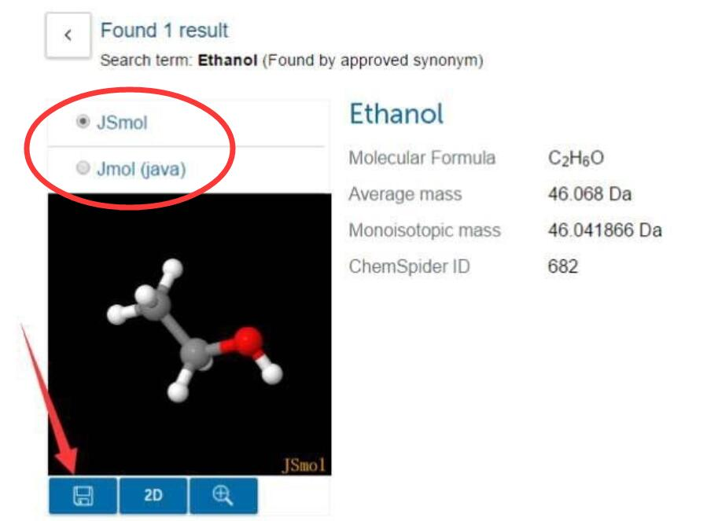
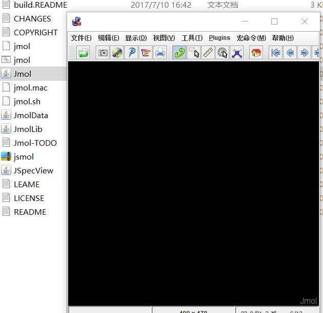
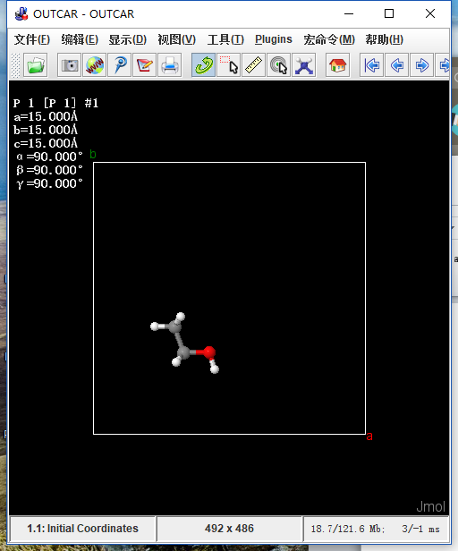

本节推荐一款可视化程序：**Jmol**，可以用来看分子结构以及振动频率。**Jmol** 是一款`Java`语言编写的，开源，`Linux`，`Windows`均可的使用的可视化软件。还记的我们从`ChemSpider`获取乙醇分子的情景吗？




对了！RSC的网页版中，乙醇分子的3D结构就是通过 **Jmol** 展示给大家的（3D图上方），并且我们下载的结构也是jmol格式的文件！可以通过 **Jmol** 直接打开。现在我们通过在电脑上运行Jmol，并查看分子的结构和振动频率。

-------

## 1. Jmol在windows和linux下的安装：
### 1.1 安装前准备（Java运行环境的安装）

`Windows`下：直接百度`Java Runtime Environment（JRE）`，安装软件。


也可以官网下载：<http://www.oracle.com/technetwork/java/javase/downloads/jre8-downloads-2133155.html>


注意两点：

1： 接受许可，

2：64位系统下载箭头所指的文件，然后安装即可。

`Linux`下`Java`运行环境安装移步下方链接：

[怎样在Ubuntu 14.04中安装Java](https://linux.cn/article-3792-1.html)： https://linux.cn/article-3792-1.html 

或者直接使用命令：
```bssh
sudo apt-get install default-jre
```

------------

### 1.2 Jmol软件的下载和安装

+ Windows：

<https://sourceforge.net/projects/jmol/files/Jmol/>

打开链接后，图中箭头指的地方下载最新版的（`Linux`其实和`Windows`下载的文件一模一样，见后面说明），也可以任选版本进行下载。


等待几秒后会弹出下载的窗口，其他浏览器也应该一样。


解压缩后就算安装好了，可以直接运行。

------------

运行 **Jmol** 程序：


上图中 `箭头1`所指为 `jmol.bat` 文件，`箭头2`所指为 `Java`的可执行文件：`jmol.jar`。在`Windows`下任选一个双击即可打开 **Jmol** 程序。建议将解压缩之后文件夹中的`jmol.bat`或者`jmol.jar` 文件右键发送到桌面快捷方式。打开后如下图：



-----------

+ `Linux`下安装 **Jmol** 的方法:

在 <https://sourceforge.net/projects/jmol/files/Jmol/>下载 **Jmol**（和前面介绍的`Windows`下载的文件一模一样），解压后的文件复制到`usr/bin`中，打开文件时在命令行输入`jmol.sh 文件名`即可（**注意**，`jmol.sh`和`文件名`之间 **有空格！**）。将解压目录加入`.bashrc`路径中也可以实现，同时需要给`jmol.sh`加上可执行权限，即`chmod u+x jmol.sh`，打开文件的方法仍用`jmol.sh 文件名`。(QQ群友：连赞提供！)


大师兄在`Linux`系统下的操作如下：

a）下载和`Windows`版的过程一样，下载完毕后，解压，

b）终端里面进入解压后的文件夹：


注意一下几点：

b.1) `jmol.sh`就是我们在`Linux`系统下面的命令（`Windows`里面我们用`jmol.bat` 和 `jmol.jar`）；

b.2) 首先赋予它可执行的权限：
```bash
chmod u+x  jmol.sh
```
相反地，取消权限：
```bash
chmod u-x jmol.sh
```

b.3) 这里大师兄电脑下，`jmol.sh`变成绿色的了（不同电脑显示会不同，不要纠结）

b.4) 尝试运行一下： `./jmol.sh  OK`

b.5) 下面设置环境变量：打开 `~/.bashrc` 文件，并加入这一行：

```bash
export PATH=$PATH:~/Downloads/jmol-14.20.2:$PATH
```

**注意：**

* 等号=前后没有空格, 后面紧跟着`$PATH`；
* 再往后是一个冒号，冒号前后也不能有空格，填上Jmol的解压目录！！！

b.6) 保存`.bashrc` 文件并`source`一下:   `.  ~/.bashrc`  （注意前面的 `.` ）或者使用命令：
```bash
source  ~/.bashrc
```

c） 进入其他目录，运行 **Jmol** 命令：下图中`~/Destkop/freq` 目录下有我们关于乙醇频率的计算结果。


大功告成！！！

此外，`sudo apt-get install jmol `这样安装的是**旧版本**，强烈不建议，原因如下：

**可能图片有些模糊，但不重要！旧版本的不支持 OUTCAR...安了也是白搞！！！**


-----------

## 2 使用Jmol可视化分子振动

### 2.1 载入振动文件到 Jmol

`Windows`：直接将频率计算得到的`OUTCAR`拖到`jmol.bat`就可以了

`Linux`：直接 `jmol 文件名`

两个系统下面均可使用左上角的 文件à打开à选择`OUTCAR`导入。

得到如下界面。但是分子并没有开始振动，只是显示了其结构。



（该结构和`ChemSpider`上的一样！）

要查看振动模型，需要以下两步，**选中振动模型**和**开启振动**。这两步有多种方法可以实现，总结如下。

---------------

### 2.2 选择振动模型

A）可以在工具-->原子库选择器中选中要查看的振动模型


**注意，先把右边的按钮拉倒底，然后双击Frequencies展开频率信息，** 如下:


B) 也可以直接右键-->模型中选中


-----------

### 2.3 开启振动

A) 原子库选择器中**最下方**: **振动-->振动开** 可实现， 点击后，原子就开始振动了。


B) 在**菜单栏-->工具-->震动** 中开启（原子库选择器选中时采用这种方式，需要先开启再选中）


C) 也可以**右键 --> 振动 --> 开启**


--------------

### 2.4 查看不同振动

A) 原子集选择器中的频率列表，双击其中的一个就显示其振动方式了。


B) 要查看下一个振动还可以通过点击向右的这个箭头就可以了。


以上就是本节关于 **Jmol** 可视化的介绍了，更多信息，请查看 **Jmol** 的`wiki`：
<http://wiki.jmol.org/index.php/Main_Page>


## 3 扩展练习：

3.1 熟练掌握 **Jmol** 的软件安装，查看频率的基本操作。

3.2 通过在`Linux`系统下面安装 **Jmol**，尝试着安装其他软件；

3.3 分析各项频率值对应的分子或者原子的移动。

## 4 总结

本节主要介绍给大家一款除了 **p4vasp** 之外的另一款 **VASP** 可视化的软件，不仅仅局限在频率振动分析方面，查看`POSCAR`，`CONTCAR`也可以直接使用 **Jmol** 打开。该软件由连赞小朋友推荐，并编辑文中大部分内容，在此表示衷心的感谢。希望大家都可以熟练掌握这款软件。`Linux`下面可以直接用命令： `jmol 文件名`，打开查看结构，非常方便。
