前面我们学会了通过使用 **Jmol** 查看分子振动。但分子振动频率在`OUTCAR`是什么样子的呢？今天我们就分析一下`OUTCAR`文件中的频率信息，以及如何写脚本计算零点能矫正。

-------------

## 1 OUTCAR分析

### 1.1 回顾一下Jmol中的频率振动

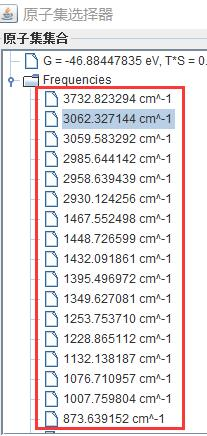

**Jmol** 提取了`OUTCAR`中的振动信息，将每个振动模式的频率列了出来。

### 1.2 OUTCAR中的信息：

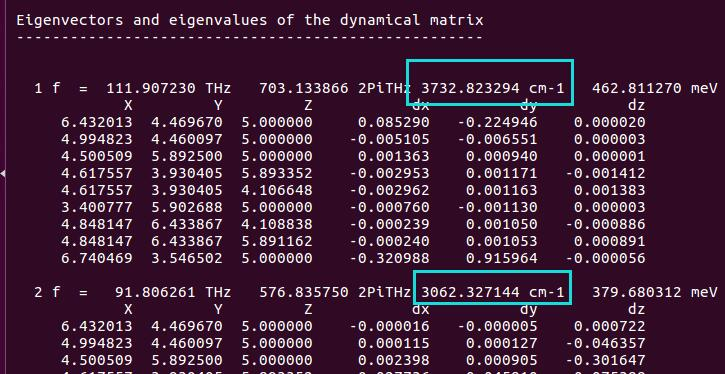

对比一下这两个振动频率和·中的前两个。

--------------

1）`1 f =` 代表第一个振动模式，细心的你仔细观察，会发现每一行有四个单位的数值：`THz`, `2PiTHz`, `cm-1`,和 `meV`，这四个是完全等同的；

2）下面一行为坐标 X Y Z和每个原子在 $x, y, z$ 方向上的振动大小；

3）X Y Z下面的数字为结构的坐标信息（Cartesian坐标系），dx dy dz 为振动的具体数值；

4)后面的振动模式的频率和第一个的格式一样。

---------------


## 2 频率单位的换算

我们先讲一下这四个单位的换算公式：

|Relevant    Formulas:  |
|:----------------------|
|$ E =   hc / \lambda $ |
|$ \nu = c / \lambda $ |
|$\tilde{\nu} = 1 / \lambda $ |
|$ T =   1 / \nu $ |
||
|**Definitions:**            |
|$E$ =   energy ($eV$)  |
|$\lambda$ =   wavelength  ($m$) |
|$\tilde{\nu}$ =   wavenumber  ($m^{-1}$) |
|$T$ =   period ($s$) |
|$\nu$  =   frequency  ($s^{-1}$ or $\textrm{Hz}$) |
|$h$ = Planck's constant = $4.135667516 \times 10^{-15}~eV \cdot s$ |
|$c$ =   speed of  light = $ 299792458~m/s$ |

以第一个振动为例：

| 1f   =  |        |
|:------  |-------:|
|111.907  | $\textrm{THz}$ |
|703.134  | 2PiTHz |
|3732.82  | $cm^{-1} $ |
|462.811  | $meV$    |


1） THz 和 2PiTHz 的换算： $2\pi$ 的关系：

$$ 111.907230~(\rm{THz})  \times 2 \pi  = 703.133866~(\rm{2PiTHz}) $$

2） THz 和 cm-1 的关系：$\nu = c / \lambda = c \tilde{\nu} $， $c$ 是光速，$\lambda$ 是波长，$\tilde{\nu}$ 是波数，单位是 $m^{-1}$。计算前先换算成标准单位： 1 THz = 1012 Hz, 1 $cm^{-1}$ = 100 $m^{-1}$，因此：

$$ 111.907230 \times 1012~(\textem{Hz}) = 299792458~(m/s) \times 3732.823294 \times 100 (m^{-1}) $$

3）THz 和能量 eV 的关系：

$ E = h\nu $， $h$ 为普朗克常数：$4.135667516 \times 10^{-15}~eV \cdot s$ **(注意此时：Plank constant 的单位！！！)**

$$ 462.811270 (meV) = 0.4628 eV = 4.135667516 \times 10^{-15} (eV*s) *  111.907230 \times 1012 (Hz) $$

4） 波数（$cm^{-1}$）和能量（$meV$）的关系：
$E = hc / \lambda = h \tilde \nu $
$ 462.811270~meV = 0.4628~eV
 = 4.135667516 \times 10^{-15}~(eV*s) \times 299792458~(m/s) \times 3732.823294 \times 100~(m^{-1}) $

大家根据上面的公式自己手动算一遍就明白了，还可以使用下面这个网址进行计算：<http://halas.rice.edu/conversions> 这里就不再多说了。

----------

## 3  OUTCAR频率信息的提取：

我们可以使用`grep`命令提取，有以下两个方式。在进行之前，首先强调一点：下面的解释**只适用于**NWRITE= 0、1或者2 的时候。因为NWRITE = 3 的时候，会额外再输出一次频率的信息。

### 3.1 使用以下几个命令：

```bash
grep THz OUTCAR
grep 2PiTHz OUTCAR
grep cm-1 OUTCAR
grep meV OUTCAR；
```

这几个命令中，我们分别以振动的不同单位作为提取对象，便可以得到所有的振动信息（这里的所有指的是包含虚频）：以大师兄常用的 `grep cm-1 OUTCAR` 为例：

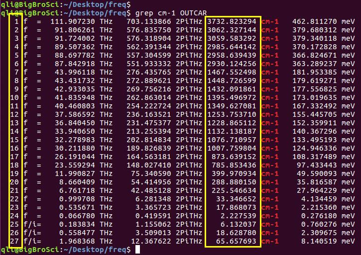

黄色标出来的第一列：$9 \times 3 = 27$ 个振动模式，第二列是以`cm-1`为单位的振动频率大小，最后三行 `f/i=` 指的是虚频。

-----

前面我们提到过，虚频可以判断结构是否稳定。那这里，我们计算出的乙醇分子结构肯定不稳定喽？不一定。

因为频率计算和软件的数值积分有关（我也不清楚数值积分怎么进行的）；

计算过程中我们的设置对频率计算影响很大，`KPOINTS`, `ENCUT`, `EDIFF`, `POTIM`等都会影响计算的精度（下一节讨论）；综合这些因素，对于分子的振动频率来说（注意：声子谱不适用）一般低于 $100~cm^{-1}$ 的频率可以忽略。严格点可以降到 $50~cm^{-1}$，也就是说：如果你在计算中发现有个 $50~cm^{-1}$ 左右的虚频，完全可以不考虑。

-----

### 3.2 `grep 'f  =' OUTCAR`

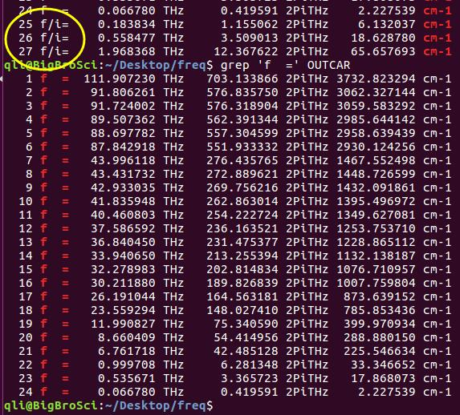

**注意：图中虚频部分没有显示出来！严格按照我用的这个命令**

使用这个命令的时候，不提取虚频部分。查看虚频的时候，可以用之前的方式，也可以用这个命令：

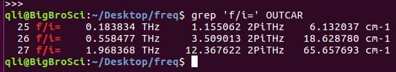

在零点能的计算时，虚频是不能考虑在内的，因为它不是分子的真实的振动模式。在我们这个例子中，虚频的出现是软件的误差所导致。在过渡态中，虚频代表的是反应方向。从另一个角度去分析：乙醇分子的零点能（下面讲到）为：$2.117~eV$，图中三个虚频对应的能量为：$0.76 + 2.31 + 8.14 = 11.11~meV = 0.01111~ eV$，所占比例为：$0.0111/2.117 = 0.5\% $ 这个可以忽略不计。

--------------

## 4 零点能校正

### 4.1 明白什么是零点能：回顾频率计算第一节的内容：

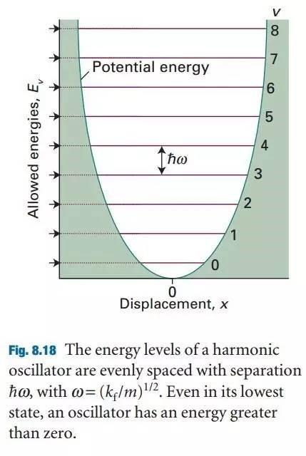

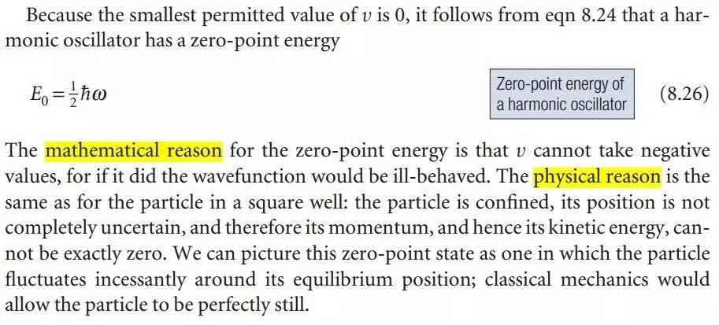

### 4.2 获取振动能量数据：

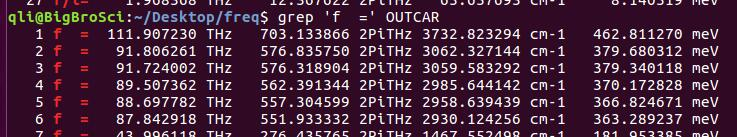

分析下结构：

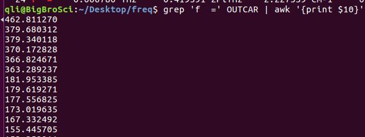

上图输出共有11列（列之间用空格分开）：我们要的零点能在第10列，使用下面的命令：
```bash
grep 'f  =' OUTCAR | awk '{print $10}'
```

如果想同时输出第 1 和 10 两列：
```bash
grep 'f  =' OUTCAR | awk'{print $1 " "$10}'
```
`$1` 和 `$10` 之间有 2个 双引号：**" "**，两个双引号里面有一个空格用来分开），否则两列会连在一起。

**注意！注意！注意！**

**这里我们提取的能量为：$h\nu$ ！！！**

**而零点能为 $1/2 h \nu$！！！**


### 4.3 将所有振动的能量求和：
```bash
qli@BigBroSci:~/Desktop/freq$ grep 'f  =' OUTCAR | awk '{print $10}' | paste -sd+ | bc
qli@BigBroSci:~/Desktop/freq$ 4233.962325
```

输出的4233.96就是所有的 hv 之和。

1）不要忘记除以 $2$

2）此时单位是 $meV$，换算成 $eV$ 还需要除以 $1000$。

3）所以，我们的零点能是 $4233.962325/2/1000~ eV= 2.117~eV$


### 4.4 写脚本

将前面的命令写到一个文件里面就成为了脚本：怎么写呢？本人平时喜欢使用类似 $4233.962325$ 这个数字，除以 $2000$ 这一步在后面的工作中进行。因此只用到了
```bash
grep 'f =' OUTCAR | awk '{print $10}' | paste -sd+ | bc
```
这个命令。写脚本的具体操作：

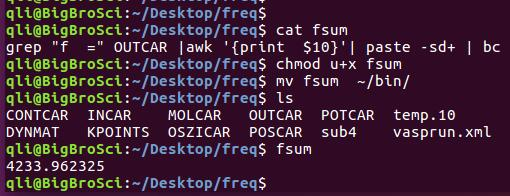

1）把这行命令写到一个文件中，文件名为 `fsum` （本人不喜欢 `.sh` 尾缀，加不加都一样）；

2）赋予可执行权限
```bash
chmod u+x ~/bin/fsum
```

3）移到 `~/bin` 文件夹
```bash
mv fsum ~/bin
```

4）在任何一个频率计算的目录下运行：敲命令 `fsum` 即可；

5）不喜欢 `fsum` 这个命令，将文件名改成你自己喜欢的名字：

如果想在脚本里面直接完成除以 $2000$ 的任务，可以这么写：

```bash
hv_sum=$(grep"f  =" OUTCAR | awk '{print  $10}'| paste -sd+ | bc)
echo "scale =6; $hv_sum/2000" | bc
```
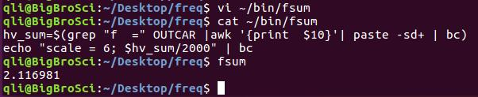

此时结果的单位为：$eV$。

-------

## 5 扩展练习：

5.1 `OUTCAR`中的频率输出要看明白是怎么回事；

5.2 频率的各个单位的换算要搞明白；

5.3 怎么提取信息，计算零点能要掌握；

5.4 怎么写脚本，从现在开始要练习了！

## 6 总结：

本节我们主要讨论了一下`OUTCAR`中的频率结果，能量换算，如何提取振动能量，以及如何计算零点能，最后简单介绍了一下脚本的写法，打消大家对脚本的崇拜心理，自己稍加琢磨也会写出实用的脚本！
