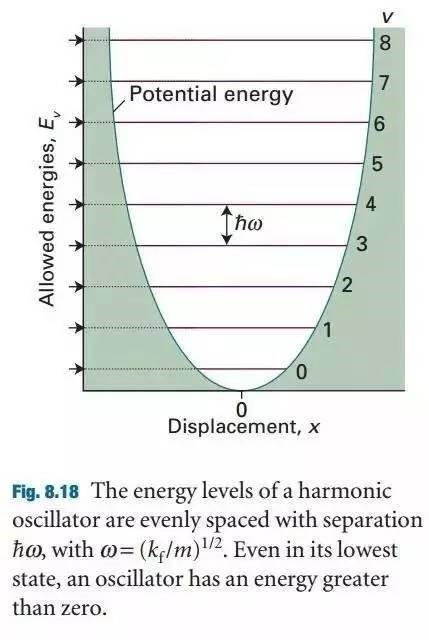

通过前面读者的反馈，本节前面主要讲述一下零点能相关的注意事项以及频率计算的时间成本相关的知识。

## 1 参考书籍：

以下所提到的书籍都可以在**QQ群文件**和**百度网盘**里面下载：<http://pan.baidu.com/s/1bKHMjG>

### 1.1 Density Functional Theory：A Practical Introduction 

大师兄极力推荐的菜鸟入门书！！！

1）不要网上随便下载（很多都是野鸡版，公式符号不全）

2）不要看中文版的；去看原汁原味的，困了就歇会，慢慢坚持看；

3）大师兄QQ群下载或者点击百度网盘链接；

4）第5章专门讨论的频率相关的问题！！！


### 1.2  Atkins的物理化学第9版

前面几节我们都是用的这一部分作为参考，忘了的童鞋们返回继续重修；这本书网上已经可以下载第十版的pdf文件了。



### 1.3 Jens. K. Norskov 的 Fundamental Concepts in Heterogeneous Catalysis


## 2 频率计算的细节问题

当你阅读完前面推荐书中的频率部分后，应该会明白很多。本节的第二部分我们主要讨论下频率计算的一些大家有顾虑的细节问题：

### 2.1 怎么进行零点能校正？

以乙醇的计算为例：

A）首先结构优化完毕后我们会得到分子的能量：$E_{0}$  （OSZICAR中的E0）

B）频率计算后我们会得到分子的零点能：$ZPE$

C）零点能校正之后的乙醇分子能量为： $E_{ZPE} =  E_0 + ZPE$

D）A 和 B 得出的结果直接相加即可，不要想太多。

### 2.2 怎么计算过渡态和反应热的零点能校正？（菜鸟暂且跳过）

对一个反应：IS --> TS --> FS

IS: Initial State 反应物

TS: Transition State 过渡态

FS: Final State 产物

记住这几个定义，本书后面 IS, TS, FS 用的时候多着呢！

1）优化反应物 IS 和产物 FS 的结构，获得能量：$E(\textrm{IS})$, $E(\textrm{FS})$;

2）对反应物和产物进行频率计算，获得各自的零点能：$\textrm{ZPE(IS)}, \textrm{ZPE(FS)}$。

3）搜索过渡态，获得结构和能量 $E(\textrm{TS})$;

4）过渡态频率分析，获得零点能 $\textrm{ZPE(TS)}$

**不考虑零点能的反应能垒 ($E_a$) 和反应热 ($\Delta E$)：**

$$ E_a = E(\textrm{TS}) – E(\textrm{IS}) \\
 \Delta E = E(\textrm{FS}) –  E(\textrm{IS}) $$

考虑零点能校正：

$$
\begin{align}
E{a(\textrm{ZPE})} &= E_{\textrm{ZPE}}(\textrm{TS}) – E_{\textrm{ZPE}}(\textrm{IS}) \\     
     &= E(\textrm{TS}) + \textrm{ZPE(TS}) – E(\textrm{IS}) – \textrm{ZPE(IS}) \\
     &= E_a + \textrm{ZPE(TS)} – \textrm{ZPE(IS)}
\end{align}
$$

同理:

$ \Delta E(\textrm{ZPE}) = \Delta E + \textrm{ZPE(FS)} – \textrm{ZPE(IS)} $

两个处理方式：

a. 先获取未校正的结果，然后把零点能各自相减；

b. 先将各个物种进行零点能校正，然后在计算反应能垒或者反应热

效果是一样的


2.2 频率计算的时候，是不是体系中所有的原子都放开？


不一定；这取决于你的体系，以及你想要关注的部分:

------------

**例子A:**

乙醇在Cu(111)表面上的吸附，计算吸附热的零点能校正

$$
\ce{CH_3CH_2OH + Cu(111) -> Cu(111)-CH_3CH_2OH}
$$
此时，Cu(111)表面我们在计算频率的时候是要固定住的！只振动乙醇分子即可。

---------------

**例子B:**

计算CO在Cu(111)表面上的吸附：

同A，固定Cu(111) 表面，如果你只关心 CO 在垂直表面上的振动，那么CO的 $x, y$ 方向便可以固定住，在坐标后面为：`F F T`

----------------

**例子C:**

苯酚在Cu(111)表面上 O—H 键断裂活化能的零点能校正：

在这里我们拿苯酚作为例子，很多时候，计算的对象比较大，全部频率优化非常耗时，那我们就得选择性地固定住一部分，只关心关键的局域部分。这个例子中我们主要讨论零点能对 O—H 键断裂活化能的影响，因此我们可以把苯环的部分固定住，只放开 O 和 H 原子进行振动。

当然啦，这是一个简化的计算，肯定不如全部振动的结果好，但迫于计算时间的压力，这是一个折中的好办法。此外，由于在反应中苯环部分变化不大，所以即使我们全部放开，它对反应热和反应能垒的影响也很小，零点能部分相减的时候抵消了。在这里你要深刻体会到，意识到，**把握到相对这两个字在理论计算中的巨大作用！！！**

-------------------

还有一点要注意的是：`IS`，`TS`和`FS`中，所固定和放开的原子必须一致！！！

**不要在`IS`中固定苯环，而在`TS`或者`FS`中放开，** 这样计算出来的结果只能用脑残来形容了。(*ps. 本人犯的这种错误太多啦，已经不能用脑残来形容了！*)

-------------------

## 3 影响频率计算的因素测试:

前面提到过：`ENCUT`, `KPOINTS`, `POTIM`, `EDIFF`都会对频率计算产生影响。频率计算很多时候会有小的虚频出现，通俗点说就是数值噪音。我们可能会想到，凡是可以提高精度的办法是不是就可以降低噪音了呢？写到这里，大师兄突然想起初中的一个老师说过一句话：好记性不如烂笔头，意思是让我们多写，这样记得会比较快。还有一句名言：**纸上学来终觉浅，绝知此事要躬行！学习 **VASP**，亲自上手实践及其重要，看遍官网，翻烂本书不去行动也是白搭，好听点说只能是纸上谈兵。**

下面的测试主要从零点能和虚频，和时间三个方面来判断：测试的命令为：

获取虚频命令：
```bash
grep 'f/i'  */OUTCAR | awk '{print $1 "\t " $2 "\t" $8 "\t " $9 "\t" $10 "\t" $11}'
```

获取时间命令：
```bashn
grep Elapsed */OUTCAR | sort -n
```

获取零点能：  
```bash
for i in * ; do echo $i $(cd $i ; fsum ; cd $OLDPWD);done  | sort –n
```

### 3.1  EDIFFG测试

#### 3.1.1测试

$4, 5, 6, 7, 8$ 分别代表 `EDIFF=1E-4` 到 `-8` 的测试任务；


```bash
for i in * ; do echo $i $(cd $i ; fsum ; cd $OLDPWD); done
```

零点能的计算结果：

|EDIFF   |  ZPE   |  Unit   |
|:-------|:-------|:--------|
| 4      |2.14344 |    eV   |
| 5      |2.12494 |    eV   |
|6       |2.11698 |    eV   |
|7       |2.11696 |    eV   |
|8       |2.11696 |    eV   |

a. 可以看出来在`1E=-6`以后，零点能变化基本为 `0`了；我们可以用这个设置；

b. 虽然你测出来一个很好的参数值，很不幸，这是默认的。

c. 从时间上考虑，本人会选择 `EDIFF= 1E-5`，这比 `1E=-6` 快了将近一倍；

d. $5$ 和 $6$ 之间的误差为：$ 0.008/2.117 = 0.38\% $；

e. 此外，单个的零点能貌似没有什么用处，一般都是两个结构的零点能相减。这个操作也会抵消一部分的计算误差。

---------------------------

#### 3.1.2 虚频


**（这个命令只展示一次，后面测试结果全部用下面的表格）**

<table><tr><th>EDIFF</th><th>Nth</th><th>WN</th><th>Unit</th><th>Energy</th><th>Unit</th></tr><tr><td rowspan="3">4</td><td>25</td><td>10.183435</td><td> cm<sup>-1</sup></td><td>1.262585</td><td>meV</td></tr><tr><td>26</td><td>43.891375</td><td> cm<sup>-1</sup></td><td>5.441839</td><td>meV</td></tr><tr><td>27</td><td>61.646745</td><td> cm<sup>-1</sup></td><td>7.643225</td><td>meV</td></tr><tr><td rowspan="3">5</td><td>25</td><td>6.773094</td><td> cm<sup>-1</sup></td><td>0.839757</td><td>meV</td></tr><tr><td>26</td><td>28.045092</td><td> cm<sup>-1</sup></td><td>3.477149</td><td>meV</td></tr><tr><td>27</td><td>52.28955</td><td> cm<sup>-1</sup></td><td>6.48308</td><td>meV</td></tr><tr><td rowspan="3">6</td><td>25</td><td>6.132037</td><td> cm<sup>-1</sup></td><td>0.760276</td><td>meV</td></tr><tr><td>26</td><td>18.62878</td><td> cm<sup>-1</sup></td><td>2.309675</td><td>meV</td></tr><tr><td>27</td><td>65.657693</td><td> cm<sup>-1</sup></td><td>8.140519</td><td>meV</td></tr><tr><td rowspan="3">7</td><td>25</td><td>6.03848</td><td> cm<sup>-1</sup></td><td>0.748676</td><td>meV</td></tr><tr><td>26</td><td>19.115009</td><td> cm<sup>-1</sup></td><td>2.36996</td><td>meV</td></tr><tr><td>27</td><td>65.726299</td><td> cm<sup>-1</sup></td><td>8.149025</td><td>meV</td></tr><tr><td rowspan="3">8</td><td>25</td><td>6.036457</td><td> cm<sup>-1</sup></td><td>0.748425</td><td>meV</td></tr><tr><td>26</td><td>19.156334</td><td> cm<sup>-1</sup></td><td>2.375084</td><td>meV</td></tr><tr><td>27</td><td>65.711053</td><td> cm<sup>-1</sup></td><td>8.147135</td><td>meV</td></tr></table>

a. 改变收敛标准，并没有消除虚频，测试 $5$ 中，稍微降低了些，其他情况下，最大的仍然都再 `1500 px-1` 左右

b. $6$, $7$, $8$ 中的虚频基本一致，说明增加收敛标准，并没起到什么好的效果。


#### 3.1.3 时间

|EDIFF | Time  | Unit |
|:-----|:------|:-----|
|4     | 1702.463 | s |
|5     | 2295.233 | s |
|6     | 4298.571 | s |
|7     |5481.423  | s |
|8     | 5998.518 | s |

复习下谁偷走了我的机时中`EDIFF`的因素；增加`EDIFF`，计算时间变长了。（离子步数一致，每个离子步的收敛步数增多了） 一般来说`EDIFF`采用默认值或者`1E-5`都可以满足情况，任务比较繁重的时候议用`1E-5`。本节在后面的测试中，都采用 **VASP** 的默认`EDIFF`值进行（`1E-6`）

-------

### 3.2 ENCUT测试

#### 3.2.1 零点能

|ENCU |   ZPE  | Unit |
|:----|:-------|:-----|
|400  |2.11698 | eV   |
|500  |2.11448 | eV   |
|600  |2.11880 | eV   |
|700  |2.11971 | eV   |
|800  |2.11928 | eV   |

从表中可以得出结论：增加`ENCUT`,对零点能的影响很小；

在计算的过程中，`ENCUT`要保持一致，一但选定后就不要再轻易改动，这个表的数据告诉我们，即使改动了`ENCUT`，对零点能的影响也很小，所以`ENCUT`的影响可以忽略。

#### 3.2.2 虚频：

<table><tr><th>ENCUT</th><th>Nth</th><th>WN</th><th>Unit</th><th>energy</th><th>unit</th></tr><tr><td rowspan="3">400</td><td>25</td><td>6.132038</td><td> cm<sup>-1</sup></td><td>0.760276</td><td>meV</td></tr><tr><td>26</td><td>18.62878</td><td> cm<sup>-1</sup></td><td>2.309675</td><td>meV</td></tr><tr><td>27</td><td>65.65769</td><td> cm<sup>-1</sup></td><td>8.140519</td><td>meV</td></tr><tr><td rowspan="4">500</td><td>24</td><td>0.489004</td><td> cm<sup>-1</sup></td><td>0.060629</td><td>meV</td></tr><tr><td>25</td><td>16.7313</td><td> cm<sup>-1</sup></td><td>2.074418</td><td>meV</td></tr><tr><td>26</td><td>23.491849</td><td> cm<sup>-1</sup></td><td>2.912619</td><td>meV</td></tr><tr><td>27</td><td>66.062971</td><td> cm<sup>-1</sup></td><td>8.190767</td><td>meV</td></tr><tr><td rowspan="4">600</td><td>24</td><td>0.288462</td><td> cm<sup>-1</sup></td><td>0.035765</td><td>meV</td></tr><tr><td>25</td><td>4.853849</td><td> cm<sup>-1</sup></td><td>0.601801</td><td>meV</td></tr><tr><td>26</td><td>6.324527</td><td> cm<sup>-1</sup></td><td>0.784142</td><td>meV</td></tr><tr><td>27</td><td>52.075614</td><td> cm<sup>-1</sup></td><td>6.456556</td><td>meV</td></tr><tr><td rowspan="3">700</td><td>25</td><td>0.747158</td><td> cm<sup>-1</sup></td><td>0.092636</td><td>meV</td></tr><tr><td>26</td><td>6.175845</td><td> cm<sup>-1</sup></td><td>0.765708</td><td>meV</td></tr><tr><td>27</td><td>32.540704</td><td> cm<sup>-1</sup></td><td>4.034535</td><td>meV</td></tr><tr><td rowspan="3">800</td><td>25</td><td>0.289332</td><td> cm<sup>-1</sup></td><td>0.035873</td><td>meV</td></tr><tr><td>26</td><td>7.356367</td><td> cm<sup>-1</sup></td><td>0.912074</td><td>meV</td></tr><tr><td>27</td><td>26.44812</td><td> cm<sup>-1</sup></td><td>3.27915</td><td>meV</td></tr></table>

增加`ENCUT`可以减小虚频；从 $400$ 增加到 $800$ 后，最大的虚频波数从 $65~cm^{-1}$ 减小到 $26~cm^{-1}$， 但 A 中的结果是不是要求我们算频率的时候，必须要把 `ENCUT`增大呢？ 答：**没必要！！**

因为前面零点能变化甚微，且虚频从 $65~cm^{-1}$ 减小到 $26~cm^{-1}$, 只能说是在误差范围内变化，我们是可以承受的，此时`ENCUT`在减小虚频中的作用，大家记住这一点就可以了。此外，增加`ENCUT`也会使得计算时间变长（见下图）。但是如果虚频大于$100~cm^{-1}$，且不是反应路径的时候，你就得小心了。


#### 3.2.3 时间

命令：
```bash
grep Elapsed */OUTCAR | sort –n
```

| ENCUT  | Time  | Unit |
|:-----|:-----|:------|
|400  | 1832.405 | s |
|500  | 2389.045 | s |
|600  | 3019.433 | s |
|700  | 4285.491 | s |
|800  | 11943.02 | s |

-------------------------

### 3.3 PREC  

这里我们设置了三个参数：`Normal`, `Accurate`和`High`

#### 3.3.1 零点能变化甚微

|PREC  | ZPE  | Unit |
|:-----|:--------|:-----|
|N     | 2.11698 | eV   |
|A     | 2.1147  | eV   |
|H     | 2.11363 | eV   |

#### 3.3.2 虚频

<table><tr><th>PREC</th><th>Nth</th><th>Wavenumber</th><th>Unit</th><th>Energy</th><th>Unit</th></tr><tr><td rowspan="3">N</td><td>25</td><td>6.132037</td><td> cm<sup>-1</sup></td><td>0.760276</td><td>meV</td></tr><tr><td>26</td><td>18.62878</td><td> cm<sup>-1</sup></td><td>2.309675</td><td>meV</td></tr><tr><td>27</td><td>65.657693</td><td> cm<sup>-1</sup></td><td>8.140519</td><td>meV</td></tr><tr><td rowspan="3">A</td><td>25</td><td>5.493108</td><td> cm<sup>-1</sup></td><td>0.681059</td><td>meV</td></tr><tr><td>26</td><td>10.478293</td><td> cm<sup>-1</sup></td><td>1.299143</td><td>meV</td></tr><tr><td>27</td><td>65.861524</td><td> cm<sup>-1</sup></td><td>8.165791</td><td>meV</td></tr><tr><td rowspan="4">H</td><td>24</td><td>0.552665</td><td> cm<sup>-1</sup></td><td>0.068522</td><td>meV</td></tr><tr><td>25</td><td>16.954329</td><td> cm<sup>-1</sup></td><td>2.10207</td><td>meV</td></tr><tr><td>26</td><td>29.95621</td><td> cm<sup>-1</sup></td><td>3.714098</td><td>meV</td></tr><tr><td>27</td><td>68.287802</td><td> cm<sup>-1</sup></td><td>8.466611</td><td>meV</td></tr></table>

`PREC`同样对消除虚频不管用！！！！

#### 3.3.3 时间

|Prec | Time  | Unit |
|:----|:---------|:-----|
|N    | 4298.571 | s    |
|A    | 7596.994 | s    |
|H    | 7962.539 | s    |

通过前面的虚频和零点能，结合此时的时间，我们可以得出结论：

`PREC = Normal` 完全够用了。

------------------------

### 3.4  POTIM 参数


#### 3.4.1 零点能：

|POTIM   | ZPE  | eV  |
|:-------|:--------|:-----|
|0.001   | 2.17125 | eV   |
|0.005   | 2.12616 | eV   |
|0.015   | 2.11769 | eV   |
|0.020   | 2.11698 | eV   |
|0.050   | 2.11671 | eV   |
|0.100   | 2.12481 | eV   |

`POTIM`太小的时候，对零点能影响很大。（$0.001$ 和 $0.005$，$0.015$ 对比）


#### 3.4.2虚频

<table><tr><th>POTIM</th><th>Nth</th><th>Wavenumber</th><th>Unit</th><th>Energy</th><th>Unit</th></tr><tr><td rowspan="3">0.001</td><td>25</td><td>21.746998</td><td> cm<sup>-1</sup></td><td>2.696285</td><td>meV</td></tr><tr><td>26</td><td>39.656607</td><td> cm<sup>-1</sup></td><td>4.916794</td><td>meV</td></tr><tr><td>27</td><td>56.54809</td><td> cm<sup>-1</sup></td><td>7.011072</td><td>meV</td></tr><tr><td rowspan="4">0.005</td><td>24</td><td>0.675194</td><td> cm<sup>-1</sup></td><td>0.083713</td><td>meV</td></tr><tr><td>25</td><td>12.785399</td><td> cm<sup>-1</sup></td><td>1.585188</td><td>meV</td></tr><tr><td>26</td><td>36.264179</td><td> cm<sup>-1</sup></td><td>4.496187</td><td>meV</td></tr><tr><td>27</td><td>61.287932</td><td> cm<sup>-1</sup></td><td>7.598738</td><td>meV</td></tr><tr><td rowspan="3">0.015</td><td>25</td><td>5.626635</td><td> cm<sup>-1</sup></td><td>0.697614</td><td>meV</td></tr><tr><td>26</td><td>23.117605</td><td> cm<sup>-1</sup></td><td>2.866219</td><td>meV</td></tr><tr><td>27</td><td>59.01173</td><td> cm<sup>-1</sup></td><td>7.316525</td><td>meV</td></tr><tr><td rowspan="3">0.020</td><td>25</td><td>6.132037</td><td> cm<sup>-1</sup></td><td>0.760276</td><td>meV</td></tr><tr><td>26</td><td>18.62878</td><td> cm<sup>-1</sup></td><td>2.309675</td><td>meV</td></tr><tr><td>27</td><td>65.657693</td><td> cm<sup>-1</sup></td><td>8.140519</td><td>meV</td></tr><tr><td rowspan="4">0.050</td><td>24</td><td>0.327964</td><td> cm<sup>-1</sup></td><td>0.040662</td><td>meV</td></tr><tr><td>25</td><td>23.575077</td><td> cm<sup>-1</sup></td><td>2.922938</td><td>meV</td></tr><tr><td>26</td><td>24.337978</td><td> cm<sup>-1</sup></td><td>3.017526</td><td>meV</td></tr><tr><td>27</td><td>95.239085</td><td> cm<sup>-1</sup></td><td>11.80815</td><td>meV</td></tr><tr><td rowspan="5">0.100</td><td>23</td><td>1.574379</td><td> cm<sup>-1</sup></td><td>0.195198</td><td>meV</td></tr><tr><td>24</td><td>5.865037</td><td> cm<sup>-1</sup></td><td>0.727172</td><td>meV</td></tr><tr><td>25</td><td>20.89784</td><td> cm<sup>-1</sup></td><td>2.591003</td><td>meV</td></tr><tr><td>26</td><td>45.241296</td><td> cm<sup>-1</sup></td><td>5.609208</td><td>meV</td></tr><tr><td>27</td><td>168.238904</td><td> cm<sup>-1</sup></td><td>20.85897</td><td>meV</td></tr></table>

`POTIM`太大的时候，会搞出来超大号的虚频（$0.050$ 和 $0.100$）！

#### 3.4.3 时间

|POTIM  | Time   | Unit |
|:------|:---------|:-----|
|1      | 1530.591 | s    |
|5      | 2065.911 | s    |
|15     | 3845.977 | s    |
|20     | 4298.571 | s    |
|50     | 4829.897 | s    |
|100    | 5191.23  | s    |

`POTIM` 越小，单个离子步收敛的越快，也就是需要更少的电子步！

综合前面的三个因素：`POTIM`太小或者太大都不好， `POTIM = 0.015`或者`0.020` 是很好的选择。 `0.015`是默认值。

-------------

### 3.5 POINTS

这里用 $1$, $2$, $3$ 来分别代表 $1 \times 1 \times 1$， $2 \times 2 \times 2$ 和 $3 \times 3  \times 3$ 的 K 点。

#### 3.5.1 零点能：

|KPOINTS  | ZPE     |  Unit |
|:--------|:--------|:------|
| 1       | 2.11698 |  eV   |
| 2       | 2.11678 |  eV   |
| 3       | 2.11689 |  eV   |

#### 3.5.2 虚频：

<table><tr><th>KPOINTS</th><th>Nth</th><th>Wavenumber</th><th>Unit</th><th>Energy</th><th>Unit</th></tr><tr><td rowspan="3">1</td><td>25</td><td>6.132037</td><td> cm<sup>-1</sup></td><td>0.76028</td><td>meV</td></tr><tr><td>26</td><td>18.62878</td><td> cm<sup>-1</sup></td><td>2.30968</td><td>meV</td></tr><tr><td>27</td><td>65.657693</td><td> cm<sup>-1</sup></td><td>8.14052</td><td>meV</td></tr><tr><td rowspan="3">2</td><td>25</td><td>5.726298</td><td> cm<sup>-1</sup></td><td>0.70997</td><td>meV</td></tr><tr><td>26</td><td>19.193163</td><td> cm<sup>-1</sup></td><td>2.37965</td><td>meV</td></tr><tr><td>27</td><td>64.645347</td><td> cm<sup>-1</sup></td><td>8.015</td><td>meV</td></tr><tr><td rowspan="3">3</td><td>25</td><td>4.826986</td><td> cm<sup>-1</sup></td><td>0.59847</td><td>meV</td></tr><tr><td>26</td><td>19.138554</td><td> cm<sup>-1</sup></td><td>2.37288</td><td>meV</td></tr><tr><td>27</td><td>64.83042</td><td> cm<sup>-1</sup></td><td>8.03795</td><td>meV</td></tr></table>

#### 3.5.3 时间

|KPOINTS  | Time   | Unit |
|:--------|:----------|:--|
| 1       | 4298.571  | s |
| 2       | 8997.709  | s |
| 3       | 13480.847 | s |

综合前面三点： `Gamma`点足矣！

------------------


## 4      扩展阅读：

4.1 下载本节的练习，按照本节的顺序操作分析；

4.2 阅读 **VASP** 官网中关于原子和分子的例子，去尝试回答里面的问题；

https://cms.mpi.univie.ac.at/wiki/index.php/Atoms_and_Molecules


## 5. 总结：

分析完前面的测试，我们总结一下高效频率计算的关键点：

5.1 `IBRION = 5`  （告诉 **VASP** 我们要算频率）

5.2 `POTIM = 0.015`

5.3 `NFREE = 2`

5.4 `ENCUT`和原来一样

5.5 `PREC = Normal`

5.6 `EDIFF = 1E-5` 或者 `1E-6`

5.7 `KPOINTS`  `Gamma`点即可。

本节内容太多了，原因在于，这是菜鸟篇的最后一节！！！

大师兄本人亲自做了很多测试，原因只有一个，告诉大家如何把握计算结果与时间的关系。在最短的时间获取最多的有价值的结果，这是计算化学的一个精髓所在。体现了你对时间和生命的尊重，也体现了你对高效率生活的追求。在菜鸟的时候，可以尽情地去测试。

大师兄之所以用乙醇这个大分子去给大家展示，很多人直接用 $\rm{O_2}$，$\rm{CO}$ 或者水分子的计算作为例子。那样的简单例子不具有很强的代表性，当你把一个相对复杂的东西搞明白了，这些小分子的计算，就如同小儿科一般了。
