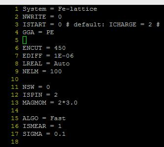

我们学习完了气相分子的相关计算后，下一步就是块体计算了，这也是VASP的强项所在，但块体的计算与气体分子的非常类似，如果前面掌握好了，后面的计算对你来说也就是轻而易举的事情了。

本着从简入繁的原则，我们先学习Bulk的单点计算（以Fe的单胞为例），姑且称之为本书中级篇的开始。大家需要学习并初步了解Material Studio和VESTA这两款软件。

* Material Studio下载链接：http://pan.baidu.com/s/1i5or3ZR   对于这款软件怎么安装，大师兄就不指导了，网上全是相关的资料。本节默认大家已经安装好MS软件，并且可以打开界面。

* VESTA下载官网：http://jp-minerals.org/vesta/en/download.html 只在官网下载，网上乱七八糟的版本不要去管！VESTA 下载后解压，直接打开就可以用了。注意：很多人问VESTA的使用说明，官网有，网上也有很多相关资料！大家耐着性子多练一天就能摸索个差不多了。


## 1 模型

 1.1 课题的第一个难点

模型的选择，计算的准确性，以及结果分析的合理性，是一个课题是否成功的三个最主要的因素。Bulk的计算很简单，难点在于Bulk模型的获取。这也是一个课题最难的部分之一。很多人在计算的时候，模型不对，基本上这个课题就被一棍子打死了。这里大师兄提醒大家的是：模型，模型，模型！！！在进入计算的时候，一定要确保模型的合理性与正确性。这是计算中的第一个坎！


1.2 MS搭建Fe单胞的模型

A) 左上角`file`—> `newproject`，输入Fe，点OK;

B) `file`—> `import`—> `Structures`—>`metals`—>`pure-metals`—>找到Fe，选择打开即可;

C) `file`—>`export`—>选择cif格式 （此时导出的是Fe的单胞，conventional cell）

 

1.3 MS导出Fe原胞的模型：

A)和B)步骤与前面一样，

C) `Build` —> `Symmetry`—> `选择primitive cell`

D) `file`—>`export`—>选择cif格式 （此时导出的是Fe的原胞，primitive cell）

 

1.4 VESTA 转换成VASP的格式

a) 打开VESTA软件，`file`—>`open`—>选择之前保存的cif文件

b) `file`—> `export data` —>保存类型选择VASP

c) 将保存的文件重新命名成`POSCAR`即可

 

1.5 需要掌握的知识：

a) 晶体学相关的基本知识，什么是primitive cell，什么是conventional cell?

b) MS和VESTA的基本操作

 

1.6 需要注意的部分（其他转换方法）：

a）可以使用`openbabel`转换：http://openbabel.org/wiki/Main_Page

b）可以使用MS生成的.cell文件转化，可以根据POSCAR的格式手动复制，也可以通过脚本。

c）或者通过其他脚本进行转化,例如：[VTST](http://theory.cm.utexas.edu/vasp/scripts.html)中的cif2pos.pl。http://theory.cm.utexas.edu/vasp/scripts.html

d) 使用[ASE](https://wiki.fysik.dtu.dk/ase/): Atomic Simulation Environment的缩写。


## 2 VASP计算文件的准备

 **2.1 准备好INCAR文件：**

A）Fe带有磁性，ISPIN和MAGMOM需要设置

B）Fe是金属， ISMEAR=1， SIGMA=0.1

C）ENCUT=450， 统一起来，后面可能还需要计算其他元素，450是一个很安全的选择。

D）EDIFF控制电子步收敛的精度





**2.2 准备KPOINTS文件：**

以单胞为例： a=b=c=2.8664 $\AA$，根据前面的经验，我们可以设置$11\times11\times11$的KPOINTS（Gamma）

```
K-POINTS
 0
Gamma
  11 11 11
  0 0 0
```

 


2.3 准备好与POSCAR对应的POTCAR文件，提交任务的脚本


## 3 提交任务

 

3.1 提交任务之前，再次检查一遍我们的所有输入文件，确保无误；

3.2 提交任务进行计算；

3.3 大师兄的计算已经压缩放到百度网盘了，大家计算完毕后，与大师兄的进行对比。

链接：http://pan.baidu.com/s/1eRQHaX8


## 4 扩展练习

 

4.1 分析Fe体相的磁矩，并查找实验值；

4.2 复习之前O$_2$分子的相关计算，分析实验结果；

4.3 怎么在OUTCAR中查看磁矩等相关信息； （VASP 哪一个参数？）

4.4 复习晶体学的相关知识；

4.5 学会MS，VESTA的基本练习；

4.6 掌握2种以上通过MS获取POSCAR的方法。

 


## 5 总结

 

本节的计算我们需要掌握一定的晶体学基础知识，基本的MS和VESTA操作，计算过程和O$_2$分子的例子极为相似，大家在学习的时候，可以将这两部分相互结合。本节我们采用的Fe单胞的例子，计算本身不难。难点在于自己课题中模型的选取。