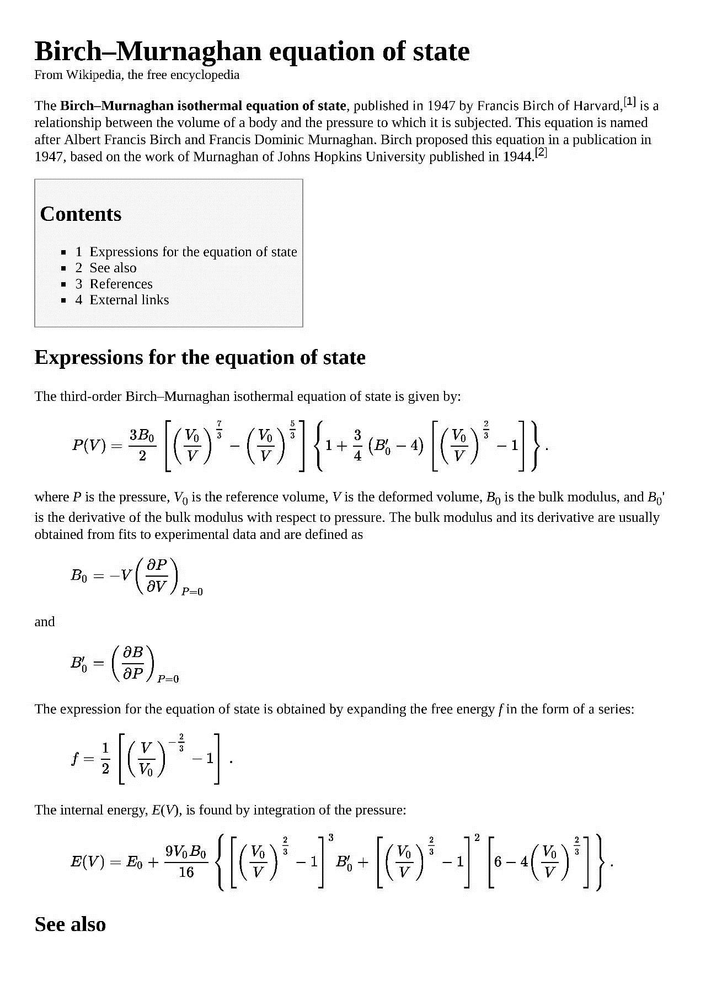
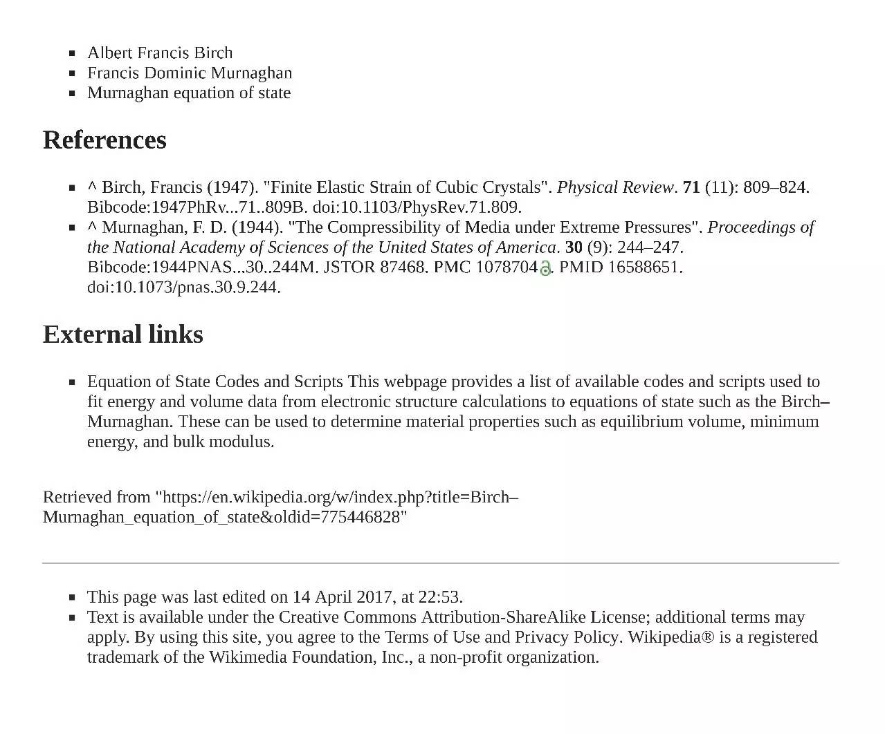
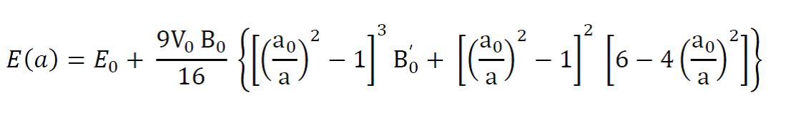
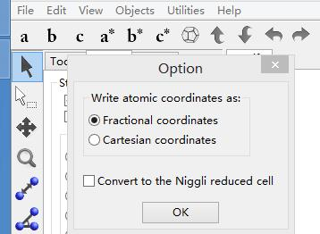
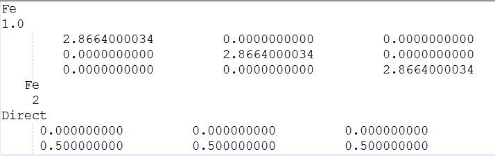
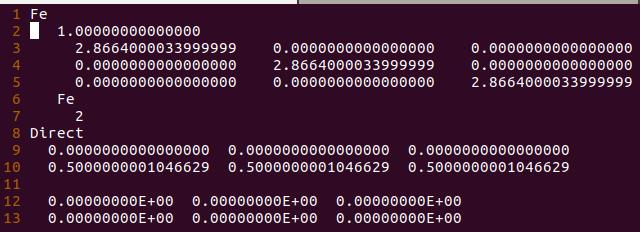
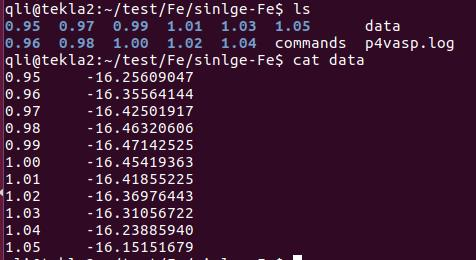

O$_2$分子的计算中，我们知道了，单纯从数据库中获取的结构，只能作为一个合理的初始值，与计算所得到的理论结构还有一定的差距，因此我们需要对该结构进行优化才可以获取稳定的晶格参数信息。有两个方法可以实现：

* 1 Birch-Murnaghan状态方程拟合, 
* 2 VASP计算中通过调节ISIF参数直接优化Bulk。

下面两节我们先讨论一下第一个方法：BM方程拟合。

 


## 1 什么是Birch-Murnaghan方程？

 

BM方程为块体材料的体积随着外压变化的状态方程。大师兄参考了维基百科的说明，大家下载维基百科导出的PDF文件参考。在学习下面的内容前，请务必阅读这个文件，了解什么是Birch-Murnaghan方程。下载：http://pan.baidu.com/s/1bUSYbs 






## 2 如何通过BM方程获取晶格参数？

 

首先，我们将BM方程中的体积转化为晶格参数（a）的函数：



 

其中E(a)和E$_0$是晶格参数为a和a$_0$时bulk的能量，B$_0$，B$_0$’和V$_0$这些见BM方程的维基百科介绍。令$(1/a)^2 = x$，上图中的BM方程可以写成：

 $y(x) = c_0 + c_1x + c_2x^2+c_3x^3 $ 的形式，

E$_0$, B$_0$,B$_0$’和V$_0$等写进c$_0$,c$_1$,c$_2$,和c$_3$这些常数里面，它们的具体形式此时并不重要，我们需要做的就是拟合这样的曲线去寻找使y(x)为最小值时的x取值。对y(x)这个方程求导数，dy(x)/dx = 0 的时候，便可以获取能量最低时的x值了，再由$(1/a)^2 = x$ 获得晶格参数。

 dy(x)/dx = c$_1$+ 2c$_2$x + 3c$_3$x$^2$

 

令：dy(x)/dx = 0，即 c$_1$+ 2c$_2$x + 3c$_3$x$^2$ = 0

 

这是一个典型的二项式方程，求解很容易。

$$
x = \frac{-2c_2\pm\sqrt{(2c_2)^2 - 4\times3C_3\times C_1}}{2\times3C_3}
$$
x有两个值，其中负值被舍弃掉，最终：

$$
x = \frac{-2c_2 + \sqrt{(2c_2)^2 - 4\times3C_3\times C_1}}{2\times3C_3}
$$


## 3 获取拟合的数据：

 

经过前面的分析，我们需要的就是获得的c$_1$，c$_2$ 和c$_3$值。可以设置一系列不同的晶格常数进行计算，得到对应的能量，然后将这些数据带入下面的方程中：$y(x) = c_0 + c_1x + c_2x^2+c_3x^3 $进行拟合。本节我们主要讨论一下如何进行该计算。看到这里，你第一反应是我们之前测试K点或者SIGMA值时的那些Linux批量操作。是的，我们也需要进行一个批量操作的计算。

 

3.1 分数坐标

如果我们改变了晶格常数，那么Fe原子的坐标也要发生相应的变化。此时，用分数坐标更加方便，VESTA中在cif转VASP格式的时候，会提醒你选择哪个形式的坐标，我们选择分数坐标：





POSCAR如下图：





注意：

 如果前面练习中，导出的为笛卡尔坐标形式的，你有两个选择：

A）重新按照前面的步骤，用VESTA导出为分数坐标形式；

B）将单点计算的结果直接复制过来（`cp  CONTCAR  POSCAR`），因为VASP的输出坐标为分数坐标形式，单点计算中，晶胞原子都没有动，CONTCAR可以直接使用。复制过来的POSCAR如下：





3.2 获得分数坐标的POSCAR后，我们可以批量对晶格常数a,b,c进行批量操作，也可以对缩放系数进行批量操作，而原子的坐标不用去管。

 

3.3 本练习对缩放系数进行批量操作

我们取10个点，将1.0 替换成0.95, 0.96, 0.97, 0.98, 0.99, 1.01, 1.02, 1.03, 1.04, 1.05。此时，晶格常数为：`缩放系数`*`2.8664`.（记住，下一节用得到）

a) 准备缩放系数为1.0 的计算文件夹，命名为1.00，里面包含我们前面一节已经讲过的Bulk单点计算相关文件；

b) 

```bash
for i in 0.95 0.96 0.97 0.98 0.99 1.01 1.02 1.03 1.04 1.05; do cp 1.00 $i ; sed -i "2s/1.0/$i/g" $i/POSCAR ; done
```

注意：这里大师兄在自己电脑的`~/.bashrc`文件里面设置了：` alias cp='cp -r'`

思考： sed 命令后面用的是双引号（为什么？）如果这里看不懂的话，建议从Ex00开始学习。


d.) 批量提交命令： 

```bash
for i in *; do cd $i; qsub sub4; cd $OLDPWD; done
```

其中，qsub sub4 是大师兄提交单个任务的命令。


3.4 数据提取：

```bash
for i in *; do echo -e $i "\t" $(grep '  without' $i/OUTCAR | tail -n 1| awk '{print $7}');  done > data
```




3.5 以上计算文件以及相关的命令已经上传到QQ群文件和百度网盘了，大家对比下计算结果。 http://pan.baidu.com/s/1dEJr9rb 


## 4 扩展练习

 

4.1 完成本练习中的相关操作，并学习VASP官网批量操作的例子：

https://cms.mpi.univie.ac.at/wiki/index.php/Fcc_Si

注意：FCC Si的例子用的原胞，并且该网址最后图中曲线不是二次方程！！！虽然用二次方程拟合出来的结果差不多。

4.2 探索学习曲线拟合的方法；

4.3 学习并了解BM方程以及如何拟合，如何通过BM方程获取稳定的晶格参数；

4.4 对晶格参数进行批量操作，并计算。

 


## 5 总结

 

本节从BM方程开始，简单介绍了什么是BM方程，如何通过BM方程获取稳定晶胞对应的晶格参数，最后，又复习了一下本书前面几节的批量操作，下一节我们讲解一下如何通过python脚本对BM方程拟合。