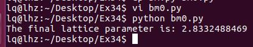
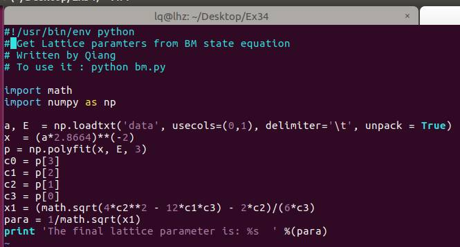
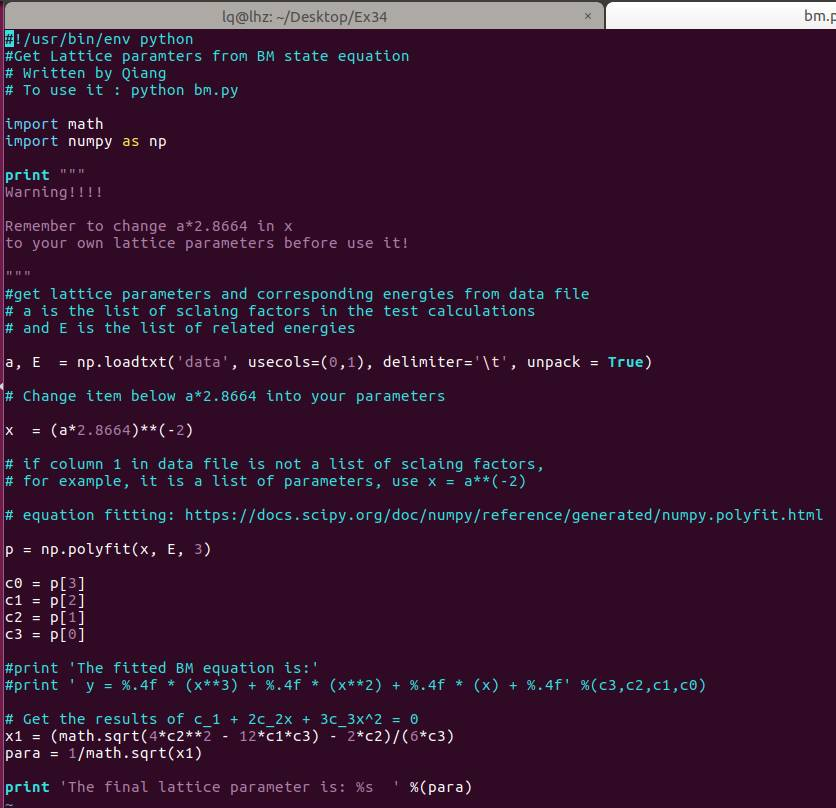
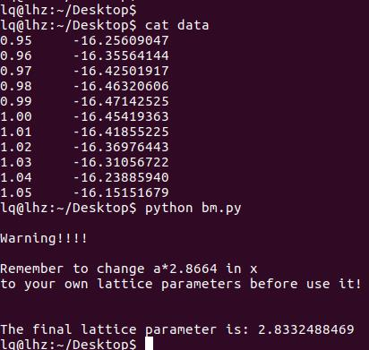

前面一节，我们通过批量操作，获得了拟合BM方程的数据。这一节，我们通过这些数据，使用脚本进行拟合并获取Fe单胞的晶格参数。 本节的脚本和读取的数据文件，可在QQ群文件和百度网盘中下载，见底部。 

## 1 脚本使用方法：

 

在介绍脚本之前，先介绍一下脚本的使用方法：

首先：将前面一节得到的 data 文件和脚本放在一个目录下

其次：进入该目录，运行脚本的命令为（见下图）： 

python   bm0.py 

注意： bm0.py 为脚本名，你也可以随意写成 birch,  birch.py等。

通过脚本，我们可以得到Fe单胞的晶格参数为： 2.8332 Å

## 2 脚本的内容-1：

 

我们看一下bm0.py 这个脚本的内容：只有几行而已。大家先自己根据前面介绍的通过BM方程获得晶格参数的原理，阅读以下该脚本，看不懂不要紧，多看几遍。大体上了解是怎么回事。

## 3 脚本的内容-2：

 

前面的脚本没有任何的说明，阅读起来很是费力，大师兄把注释加上去了，并命名为: bm.py。大家再阅读一遍，看看有没有新的收获。

图中的链接为：(左下角查看原文)

https://docs.scipy.org/doc/numpy/reference/generated/numpy.polyfit.html

 

该脚本运行效果如下图：

脚本的工作原理下一节介绍，本节中大家只看脚本，分析里面的内容，自己结合前面一节琢磨是怎么回事。脚本和读取的data文件可以在QQ群中下载，也可以通过百度网盘，链接： http://pan.baidu.com/s/1o8cCdBG 

## 4 扩展练习

 

4.1 查找文献，获取Fe的晶格常数的实验数据，与脚本获取的结果进行对比；

4.2 Windows用户使用notepad++或者其他文本编辑软件，自己将bm0.py脚本重新写一遍，然后运行，如果出错了，请与图中对比并修改，直至完美匹配为止！！！

4.3 Linux用户，使用vim或者其他文本编辑软件，进行4.2中的操作；

4.4 结合Ex33的介绍，初步了解本脚本的运行原理。