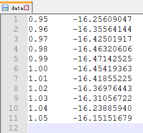
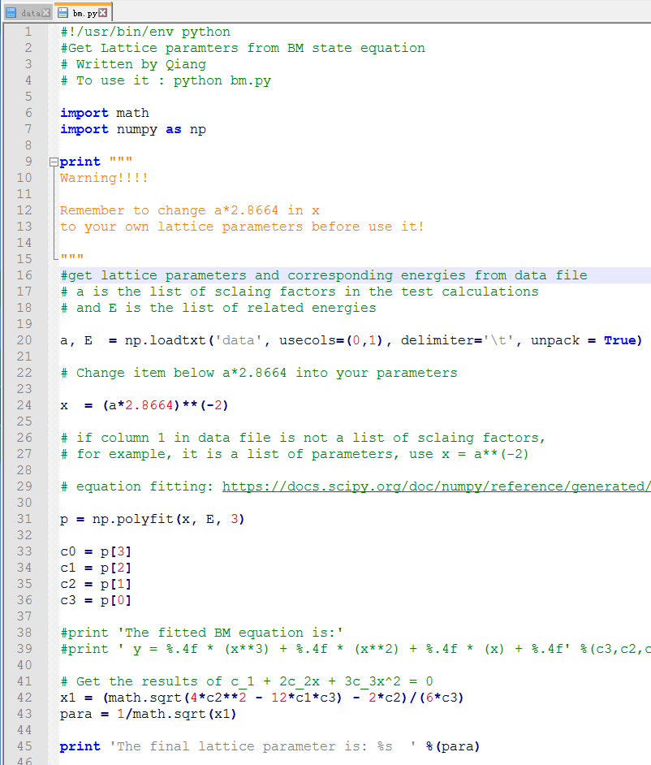
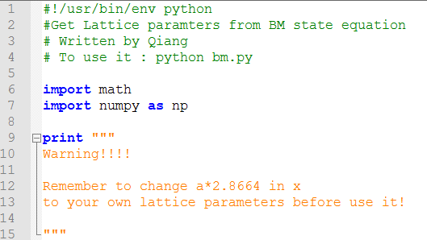
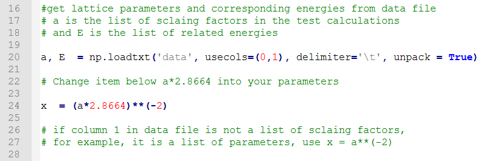
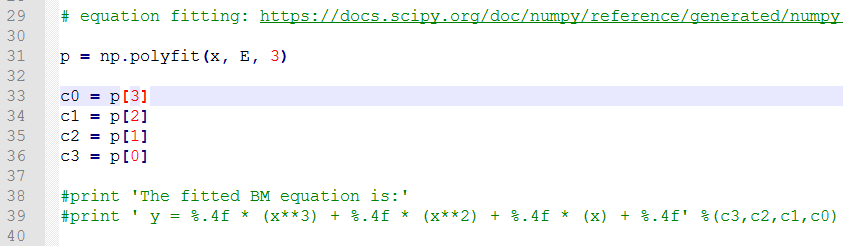
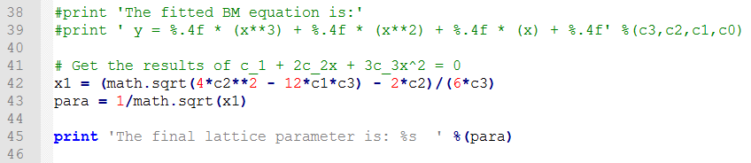

通过上一节（Ex34）的脚本，我们可以拟合出稳定晶体结构的晶格参数，但是，这个脚本是怎么运行的呢？大家在浏览之后，有没有什么疑问？本节我们重点介绍一下：这个脚本的运行原理。

 

## 1  数据

 

首先我们看下读取的data文件：

A) 共两列，两列之间用`tab`分开；

B) 第一列为缩放系数，第二列为对应结构的能量。

C) 在本文例子中，晶格参数等于= `缩放系数` * `2.8664` $\AA$ （记住这个公式）

2  脚本内容： 浏览一遍即可，详解在下面： 

详解：

**2.1  1-15行：准备部分**

A) 1-4 行为脚本的一些基本说明，为养成一个良好的写脚本习惯，以及避免后期不必要的麻烦，第一行必须要放进去。如果你用bash写的话，把python替换为bash即可，其他部分不用动，例如： #!/usr/bin/env bash。

B）2-3行注释，解释了一下脚本干什么用的，谁写的，怎么用。

C)  6-7 行调用python库中的math 和 numpy 模块，见下面两个链接：

https://docs.python.org/2/library/math.html

http://www.numpy.org/

D）9-15行：通过使用 print 命令输出一个警告，因为本文用的是缩放系数，很多人测试的时候保持缩放系数不变，直接采用不同的晶格参数。

 

**2.2  读取data信息，准备拟合**

A)  16-18行为脚本的注释说明，

B)  第20行中，我们使用 `np.loadtxt`读取data文件的内容，

注意：

1)  `data` 用单引号括起来，表明我们要读以`data`命名的文件。 

2)   `usecols=(0,1)` 代表我们要读取第一列和第二列的内容。Python中的第一个用0表示，所以这里我们用的（0,1）来表示读取第1和第2列的内容；

3)   `delimiter='\t'`，意思是第一列和第二列之间用tab（'\t'）分开；

4)  `unpack=True` 意思是把读取的数据生成一个数列，并分配给a 和 E，具体见链接：

https://docs.scipy.org/doc/numpy/reference/generated/numpy.loadtxt.html

  

通过第20行，我们可以获得两个数列，第一个是 a 包含了data文件中的缩放系数， 第二个是E，包含了data文件中的能量信息

C) 第22-28行，把缩放系数转换为晶格常数(a*2.8664)，然后平方取倒数（**(-2)），用来得到我们前面讲解的x。这是因为：当我们把BM方程写成： $y(x) = c_0 + c_1x + c_2x^2+c_3x^3 $ 的形式时，前提是令 (1/a)$^2$ = x。不懂的具体见Ex33中的内容。截止到现在，我们有了三个数列： a, E 和 x

**2.3 第29-40行：拟合多项式方程**： 

A) 最小二乘法拟合 $y(x) = c_0 + c_1x + c_2x^2+c_3x^3 $这个方程，得到常数系列c，这里我们调用了`numpy` 的`polyfit`这个模块来进行拟合。具体见：

https://docs.scipy.org/doc/numpy/reference/generated/numpy.polyfit.html

 

B) 第31行：本脚本的核心：` p = np.polyfit(x, E, 3)`

1) np.polyfit 读取x和 E的数值，拟合一个$y(x) = c_0 + c_1x + c_2x^2+c_3x^3 $，

注意：这里拟合的时候，用的数值是x和E，(1/a)$^2$ = x， 所以，在进行拟合之前，务必确保你已经得到了正确的x数列。具体根据data文件的内容进行修改设置第24行的公式。

2) 括号中的3代表的是多项式方程中最大的那个次数。

扩展：如果你想拟合一个$ y = c_4x^4 +c_3x^4  …$的方程，把3改成4 即可。

3)拟合的结果输出到数列 p 中，数列p中共有4个常数（p[0],  p[1]，p[2]，p[3]），按照次数从高到底的顺序排列，对应着我们Ex33中的（c3，c2, c1, 和 c0 ）

4) 33-36行, 我们将p 中的数值分别分配给c3，c2, c1, 和 c0。

 

**2.4   38-40行，获取晶格参数**：

 

到目前位置，多项式方程的常数我们已经获得了，下面就是求解问题了。

A)  第42行为下图中公式的代码描述，获取方程的解x，因为前面我们已经有了一个x变量了，这里方程的解用x1表示，
$$
x x = \frac{-2c_2 + \sqrt{(2c_2)^2 - 4\times3C_3\times C_1}}{2\times3C_3}
$$

B) 第43行获取晶格常数，公式为： (1/a)$^2$= x

C) 第45行，输出晶格常数的数值。

## 3 扩展练习：

 

3.1 根据解释，重新浏览脚本，知道每一行代表的含义。

3.2 本脚本使用的时候，需要自己根据data数列中的内容，设置更改一下获取 x 数列的公式（第24行）；

3.3 阅读Ex32-本节的所有内容，整个流程不要再存在什么疑问。

 

##  4 总结

 

本节我们详细讲解了BM方程拟合脚本，相信大家应该了解的差不多了，拟合的办法有很多，但BM方程只有一个。请务必掌握至少一个拟合的方法。后面的这句话本来想删掉，因为本人已经早就毕业了。暂且留下来吧，权当本书的一个时间证据。

---

此外，本人马上就要毕业答辩了，后面更新会有所放缓，努力争取保证每周一篇的速度。如果你有什么科研心得，欢迎分享。