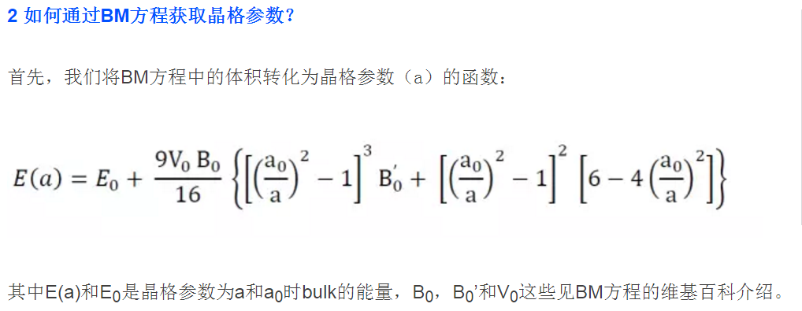
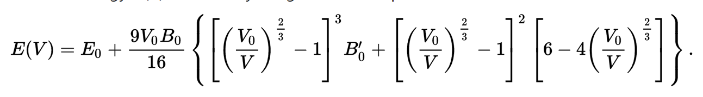
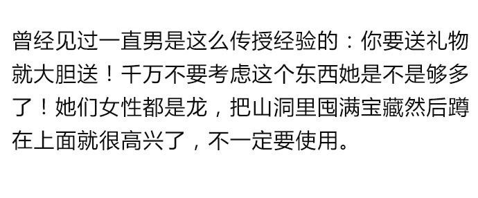

前面一节我们学习了如何通过提交一系列不同晶格常数的单点计算以及拟合BM方程获取稳定结构的方法，此外，我们还学习了BM方程拟合的一个python脚本以及分析了脚本的工作流程。

 

师兄，算个晶格常数这也太麻烦了吧？有没有简单点的，一步到位的方法？

有！！！前面我们提到说可以通过两个方法： BM方程拟合是一个，现在大家已经掌握了。今天我们学习第二个方法。

```fortran
ISIF = 3
ENCUT = XXX
```


## 1  ISIF 参数

在学习ISIF = 3 前，我们先总结一下，之前不论是单点计算，结构优化，还是频率分析，我们都没有讲过这个参数。因此使用的是默认值。


查找VASP官网说明书，默认值是ISIF= 2 。是的，前面我们都是用的 ISIF = 2 。（废话，等于白说！）你还会发现有一堆其他的ISIF参数，从1 - 7，看的眼花缭乱。


坚持一下，你会发现它们有各自的特点，原子坐标是否变化，晶胞形状是否改变，以及晶胞体系是够变化。不同的参数大家根据自己研究体系的性质进行选取。

本文主要介绍ISIF = 3 时对晶胞的优化。其他的取值比如加压计算等，为避免对大家造成误解，在这里不做进一步地说明。因为本人计算的时候，只用到过2 和 3 的情况。

ISIF = 3 的时候，晶胞中原子的坐标，晶胞形状，以及体系都随着优化的过程发生变化。 回到Fe单胞的计算，我们先看一下INCAR的输入，然后再详细解释其中的内容。


对比下，前面单点计算的INCAR，你会发现有几个不同：

1） ENCUT = 600 设置的比之前的450大。

2） EDIFFG = -0.015 结构优化的收敛标准

3） NSW = 100 结构优化，肯定不是一步！

4） ISIF = 3 （讲的就是ISF =3 ，肯定要加上）

5） 此外， ISMEAR，SIGMA, ISPIN以及 MAGMOM大家自己主动回顾一下

 

PS： 很多人在单点计算的时候，除了NSW = 0， 还画蛇添足地设置了ISIF = 0。虽然对计算结果没有影响，但我还是想问一句：大哥，脑子去哪里了？单点计算就是原子不动弹，设置NSW = 0 或者 1， 或者 IBRION = -1，其他的按照之前的即可。


POSCAR，KPOINTS，POTCAR直接将前面单点计算目录（1.00）下的复制过来。


## 2 ENCUT 取值

 

师兄，Fe的ENCUT 默认值是：ENMAX  =  267.882 eV， 前面单点计算设置的 450 eV。这里为什么设置成600 eV ？ 

如果你仔细看VASP官网的说明书，在底部有这么一段话：


红色的链接如下：

http://cms.mpi.univie.ac.at/vasp/vasp/Volume_vs_energy_volume_relaxations_Pulay_Stress.html   

最后一句，如果计算时体积发生了变化，我们需要增加ENCUT的值，比如说：ENCUT = 1.3 * max(ENMAX) ， max(ENMAX) 的意思是，如果有N个元素，取最大元素的ENMAX值。

这么做的原因是为了尽可能地消除 Pulay stress 对计算的影响。那么什么是Pulay Stress 呢？

 

### 3 Pulay Stress


通过查看红色的链接内容，字面上的理解就是，当晶胞体积发生变化时，由于计算时的平面波基组不全（设置的ENCUT不够大）使得计算时的收敛不是绝对的，进而导致应力张量不对，最终导致体系的形状，体积以及能量不正确。（这个我不是很懂，字面上直译过来的。）维基百科的描述如下，链接：https://en.wikipedia.org/wiki/Pulay_Stress


A plane wave basis set is created for thehexagonal lattice (left), using the reciprocal lattice vectors inside the redcircle. Then the lattice relaxes into a cubic symmetry (right). Keeping the redcircle basis constant results in lattice vectors taken from an ellipsoidinstead of a spherical area (compare to the blue circle).

 

深层次的俺也不懂，但是PulayStess 有2个办法可以减小： 

A)  体积不变，采用一系列的晶格常数计算，然后拟合得到准确的晶格常数；（你已经知道怎么去做了，这么做是为了避免计算时晶格体积发生变化！）；

注意： 

1） 在LVASPTHW的拟合流程中，拟合出来的是BM方程， BM方程的最高次数是3，也就是x的三次方。此时：x = (1/a$^2$)  ，具体见Ex32-35的详细说明。

2) 如果直接用晶格常数去拟合，则是6次方的关系。





3) 如果你用体积去拟合BM方程的话，最高次数是2：





B)  既然是因为ENCUT不够导致的，那么我就使劲增加ENCUT来消除（上图中unless后面的那句）。借用维基百科的一句话：Pulay stress can be reduced by increasing the energy cutoff. 所以，当有人用ISIF= 3计算，而不去设置ENCUT的时候，尽情地去嘲笑他傻X吧！！！感觉不过瘾，还可以继续吓唬他说后面的计算也有问题。


## 4 ENCUT 取值

 

官网说设置到130% * max(ENMAX)，一般来说就可以了。但很多人还是不放心，那我们就继续疯狂一些，设置到600 或者700。本人一般习惯用600。

师兄，前面你不是讲到增加ENCUT会增加计算量么？而且要保持计算中使用同一个计算的参数？

是的，这些你说的都是正确的。但是，我们使用ISIF = 3 的目的是获取稳定的晶格常数，但为了避免Pulay stress导致的误差，就必须要增加ENCUT（No Choice！！！）。一旦我们计算完成晶格常数的计算后，可以在此结果基础上，统一使用其他的ENCUT值进行计算。也就是只有确定晶格常数的这一步是个例外，其他情况还是用原来的值。


举个不恰当的例子，这就好比当初你追女朋友的时候，为讨人家欢心，疯狂地买买买，什么要求都答应。等追到手了，结婚了，新鲜劲过去了，就原形毕露，不再这么大手大脚地去疯狂了。 





讲到这里，使用ISIF = 3 时，你脑子第一反应就是疯狂地增加ENCUT，600不够，上700， 700感觉不够，上800，在计算承受的范围之内，越大越好！ 因此ISIF = 3 和 ENCUT两个参数必须同时出现。

 

## 5  计算结果

 

设置完后，提交任务：计算出来的Fe晶格参数为： 2.8318 Å，对比下前面拟合出来的结果： 2.8332 Å，两者相差：0.0014 / 2.8332 = 0.019 %， 这么点误差，完全可以忽略掉了。如果不放心，将ISIF =3 的结果，使用前面的设置，算个单点，然后跟BM拟合结果对比下，两者能量相差甚微，完全可以忽略。 

| Methods                       | Lattice Constant | Energy          |
| ----------------------------- | ---------------- | :-------------- |
| BM拟合                        | 2.8332 $\AA$     | -16.47179683 eV |
| 直接优化（ISIF=3，ENCUT=600） | 2.8318 $\AA $    | -16.47181669 eV |


## 6 总结：


学习完本节，怎么计算晶格常数的两个方法你应该都掌握了，希望大家能学到的东西有以下几个：

1 什么是BM方程？

2 BM方程拟合的方法（最小二乘法，脚本以及运行）；

3 BM方程获取晶格常数的原理；

4 ISIF = 3 和 ENCUT 必须同时设置；

5 Pulay Stress 是什么，如何避免； 

6 （ISPIN，MAGMOM）：什么时候加，怎么设置；

7 （ISMEAR，SIMGA）：什么体系用什么值，怎么设置；

8 （IBRION，POTIM，NSW）：根据初始结构好坏进行设置；

9 （EDIFF，EDIFFG）：怎么决定收敛的；

10  KPOINTS的取值：经验方法（k * a）， 以及脚本；

11  POTCAR的生成： 手动方法以及脚本。

12  以及怎么追女朋友，如何防止被追？