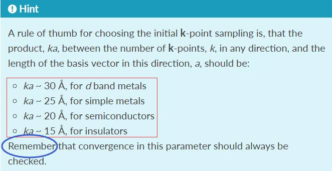
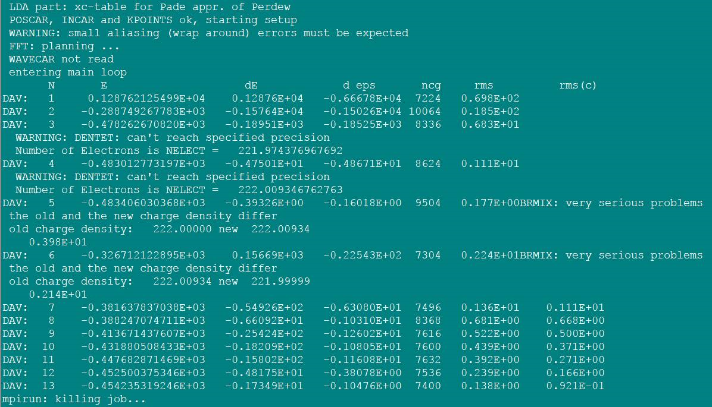
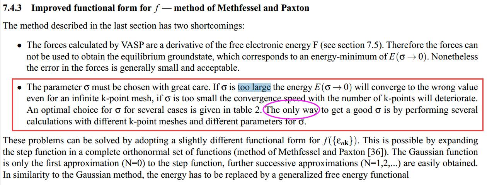
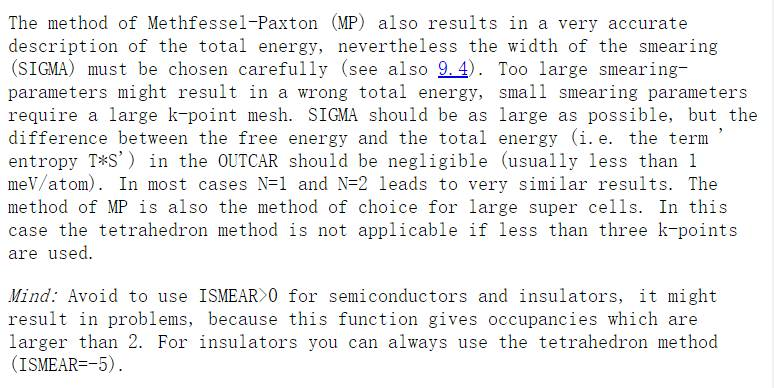
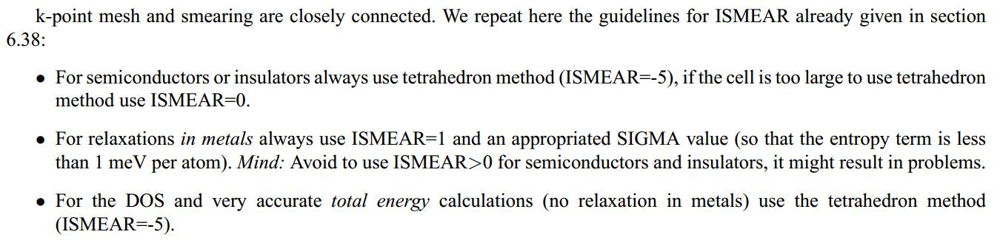

 

 

#                                                   **Ex-37** **DOS**计算(一)

 

使用VASP计算，很多时候都逃不掉DOS，能带计算的相关问题，尤其是对于计算材料的童鞋们，更是家常便饭一般。群里很多人，很多新手们都时常在讨论DOS的计算。这里我们通过VASP官网的说明，解释一下算DOS的具体步骤。前面我们学会了如何拟合或者优化稳定的晶胞结构。在此基础上，我们可以计算一下相关的DOS信息。

 

##   1 KPOINTS

 **1.1 K点数目**

 

与结构优化相比，算DOS的时候，需要用到更多的K点数目，这是因为K点越多，画出来的DOS图质量越高。

引用官网的话：

```python
A high quality DOS requires usually very fine k-meshes.
```


------

**1.2 K点数目的选取**

 K点数目越多越好，我们该如何设置K点数目呢？

还记的前面我们讲到的K点选择的经验规则吗？那一个规则可以认为是我们平时计算时K点选择的标配。对于DOS计算，我们就需要把配置提高一个档次了。

 

一般来说，`K * a = 45 `左右之间完全可以满足你的要求，大伙可以根据这个经验来选择K点。 

 

## 2 NEDOS 

NEDOS这个参数在DOS图的质量上面也有着很重要的作用。比如我们的DOS能量区间范围（DOS图的横坐标）为：[-10 eV，10eV]，VASP默认的将这个能量范围分成301点，然后作图。301也就是默认的NEDOS的取值。如果我们设置的NEDOS值够大，那么DOS区间就会被区分地越精确。NEDOS的取值一般来说：

* `NEDOS = 3000`左右就足够好了。太大也没什么意义；

* NEDOS越大，VASP输出的DOSCAR，vasprun.xml文件也就越大，占用存储空间。
* 经常有人抱怨说自己的DOS图有很多尖锐的峰，可以尝试着通过增加NEDOS这个办法来解决。

* 更多的信息，自己参考一下：https://cms.mpi.univie.ac.at/wiki/index.php/NEDOS


## 3  ISMEAR（一）  

首先我们看官网的话： https://cms.mpi.univie.ac.at/wiki/index.php/ISMEAR

```
For the calculation of the total energy in bulk materials we recommend thetetrahedron method with Blöchl corrections (ISMEAR=-5). This method also givesa smooth nice electronic density of states (DOS).
```

也就是说 ISMEAR = -5 的时候（Blöchl修正的四面体方法），我们可以得到一个非常平滑的DOS图。

**注意：**

3.1 K点数目

设置`ISMEAR = -5` 的时候，如果K点数目K点的数目小于等于4 ， 计算会出错，得到如下的错误结果：

 **VERY BAD NEWS! internal error in subroutineIBZKPT:**

 **Tetrahedron method fails for NKPT<4. NKPT=       1**

这也是很多人常见的错误。官网说的是K点数目小于三：the tetrahedron method is not applicable， if less than three k-points are used. （QQ群的`恒驰一强`发现官网的这个错误。）

K点不够，用`ISMEAR = -5`出错的解决办法：

* 既然Ｋ点不够，那么我就增加Ｋ点，然后再使用`ISMEAR= -5`　（**简单粗暴，强烈推荐使用**）

* 如果增加了K点，可能还是会出错。有时也会出现下面的错误（微信群的群友（**Cu--Ni**）提供）。我们先把解决方法列出来，错误部分大家慢慢看：

  * 直接换一下ISMEAR的取值。
  * 群友还发现：在保证K点数目大于4的时候，有时候减少K点数目或者增加K点数目都可以解决这个问题。如果你的服务器还算可以，建议增加K点数目，毕竟和K点数目越多，DOS的质量越高。这个办法大家可以参考一下。

  ```
  WARNING: DENTET:can't reach specified precision
  Number of Electronsis NELECT =
  ```

  


  **官方的解释：**

  http://cms.mpi.univie.ac.at/vasp-forum/viewtopic.php?t=416

  http://www.error.wiki/The_old_and_the_new_charge_density_differ

  

出现此警告(DENTET)的原因是因为无法通过tetrahedron方法得到足够精确的费米能级。也就是将态密度积分到费米面的电子数和体系的价电子数目不一致。


3.2 适用体系：

* `ISMEAR = -5` 适用于所有体系的**DOS计算**。非DOS计算的时候：

* 对于金属体系来说，结构优化的时候不能使用`ISMEAR= -5`（注意：是**优化结构的时候不能用**！），这是因为四面体方法不能很好地处理费米能级处的电子占据情况，导致算出来的力会有一定百分比的误差。所以，对金属体系结构优化的时候，`ISMEAR > = 0` 参考：https://cms.mpi.univie.ac.at/vasp/vasp/Partial_occupancies_different_methods.html

* 对于半导体和绝缘体的体系，`ISMEAR>0` 是不可以的。只能ISMEAR<=0。

* 四面体方法（`ISMEAR = -5`）不适合计算能带（对所有的体系来说的）。多谢wuli8老师帮忙完善！
* 使用ISMEAR= -5 的时候，SIGMA的取值没有影响，如果不放心，取`SIGMA = 0.01`。

3.3 小结：

* 算DOS，只要K点不少于3； 用ISMEAR=-5是个不错的选择。


## 4 ISMEAR（二）

如果体系很大，只能适用gamma点来算，`ISMEAR = -5`的时候，肯定会出错，但服务器不给力，不能增加Ｋ点的时候，怎么办？

* 对于所有的体系（K点数目小于4也可以）：可以使用`ISMEAR = 0`；`SIGMA = 0.01`。对于大部分的体系都能得到理想的结果。原则上来说，使用GS方法的时候(ISMEAR=0)，SIGMA的数值要测试下，保证`entropy T*S`这一项平均到每个原子上小于0.001 eV也就是1meV。不想测试的话，直接用个很小的值，比如这里我们说的：`SIGMA = 0.01`。

  

* 对于金属体系来说，也可以使用`ISMEAR = 1`；`SIGMA = 0.01`。SIGMA取值太大，计算出来的能量可能不正确；SIGMA取值越小，计算越精确，需要的时间也就越多。值得注意的是：这里我们使用的0.01已经很小，没有必要设置的再小。因为对于金属体系，使用MP方法(ISMEAR=1..N)时，SIGMA= 0.10 差不多就足够了。官网给的参考值是0.20。

<http://cms.mpi.univie.ac.at/vasp/guide/node124.html>



 

* 在KPOINTS确定之后，使用多大的SIGMA值，大家最好测试一下。**原则如下**：SIGMA取值在**保证**OUTCAR中`entropy T*S`这项的能量平均到每个原子上小于 1 meV的**前提下**：**尽可能地大**。这样可以在保证准确度的同时，也加快收敛速度。 



* **记住：** VASP学习最快的途径就是不停地看官网，然后亲自上手去测试，测试，测试！并观察分析结果。

------


------

##  **4** **扩展练习:**


4.1 阅读VASP官网关于ISMEAR和SIGMA的所有说明：

4.2 下载VASP的pdf说明书，搜索书中所有的ISMEAR和SIGMA关键词，阅读所有相关的内容；

4.3 思考SMEAR方法的意义？SIGMA的意义？

4.4 查看VASP说明书，查阅相关文献，了解MP和GS方法

4.5 测试MP和 GS方法中，SIGMA取值对计算时间，能量，收敛步数的影响。

4.6 分析下为什么算DOS的时候，要算两步： selfconsistent  和 none-selfconsistent calculations? 

 

------

## **5** **总结:**

 

看完本节：你应该知道计算DOS的时候：

* KPOINTS和NEDOS设置的一些内容。
* ISMEAR要用-5。
*  KPOINTS因计算硬件限制不能设置的很大，数目小于4的时候：
  * 对于所有体系均可以使用ISMEAR=0。
  * 金属体系还可以用ISMEAR=1..N，官网建议SIGMA为0.20，太小的SIGMA值对收敛会产生影响。使用0.01-0.10的数值都是很安全的选择。
  * SIGMA的数值需要测试一下，一般来说在0.01-0.05之间足够了。

* 非DOS计算的时候，对于金属来说ISMEAR不能等于 -5，优先使用ISMEAR= 1。非金属来说（半导体和绝缘体），不能 > 0 。对于所有的体系， ISMEAR= 0 则是一个很安全的选择，但SIGMA的数值要测试一下。说了这么多废话，还是官网简单明了：

 



 

For further considerations on the choice for the smearing method see sections 9.4， 10.6. To summarize， use the following guidelines:

- ​        For **semiconductors or insulators** use **always** tetrahedron method (ISMEAR=-5)， if the cell is too large (or if you use only 1 or two k-points) use ISMEAR=0.


- ​        For **relaxations in metals always** use ISMEAR=1 and an appropriated SIGMA value (the entropy term should **less than 1 meV per atom**). **Mind:** **Avoid** to use ISMEAR>0 for semiconductors and insulators， it might result in problems.


For metals a sensible value is usually SIGMA= 0.2 (that's the value we use for most transition metal surfaces).

- ​        For the **DOS** and very accurate *total energy* calculations (**no relaxation in metals**) use the tetrahedron method (ISMEAR=-5).
