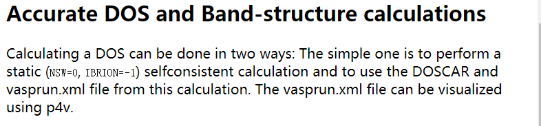
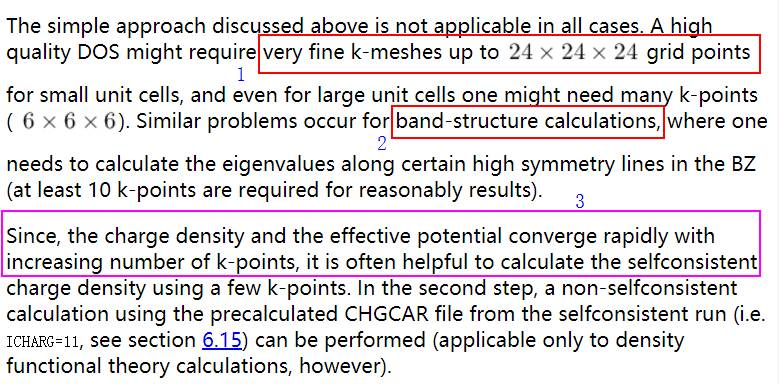
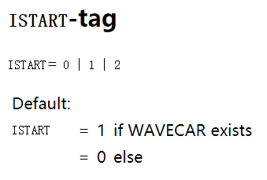
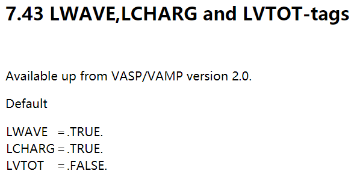

前面一节，我们留了一个问题：DOS为什么要算两步？

答：可以一步直接算！也就是前面一节的问题是瞎问的。那为什么大家总是有2步计算的疑问呢？本节，我们就解释这个。

## 为什么算两步？

官网说了，算DOS有2个方法，一个是直接进行self-consistent计算（大家常说的自洽或者静态计算。）然后处理DOSCAR和vasprun.xml文件即可，如图：

我们看一下这么做的前提：

- 1） 由于高质量的DOS需要精细的K点，如果我们设置的K点很多，就会造成计算上的负担，前面我们讲过K点与计算时间的关系；而很久很久以前，计算能力并不如现在这样快，因此可以通过分步计算来解决这一问题。

- 2） 另外一个原因就设计到能带的计算了，这里我们摘抄一下网上的解释：**由于在能带计算时k点是一些在倒空间高对称线上的点**，不能进行自洽计算。参考网址：<https://http://blog.sciencenet.cn/blog-567091-675253.html/> 也就是计算能带的时候，自洽计算是必须的一步；

- 3） 即使增加K点的数目，电荷密度和有效势能的收敛依然很快，也就是K点的变化对电荷密度的收敛影响不大。

### 分析：

- 能带计算我们暂不考虑，综合下1 和 3 ，**在结构优化完成之后**，我们可以这么算DOS：

* 第一步，用小的K点算个单点，生成CHGCAR文件；

* 第二步，读取上一步的CHGCAR文件（ICHARG=11）。

这样做就避免了直接用高K点网格所导致的计算负担。对于DOS计算的两个步骤，归根结底是节约时间的问题。因此，算2步并不是必须的！！！如果够土够豪，直接用高密度的K点，一步计算，没毛病！ **但是对于能带计算**， **则必须算**2**步**。

此外，VASP的说明书已经很古老了，以现在的计算能力，直接使用大K点一步计算，一般来说都可以承受的。所以，当你知道了为什么要算2步的时候，再去浏览网上的相关经验帖子，就很容易知道是怎么回事了。

## LDOS 和 PDOS  

参考：<http://blog.sciencenet.cn/blog-316926-493110.html/>

LORBIT = 10 把态密度分解到每个原子以及原子的spd轨道上面，称为为局域态密度，Local DOS (LDOS)

LORBIT =11 在10的基础上，还进一步分解到px，py，pz等轨道上，称为投影态密度（Projected DOS）或者分波态密度(Partial DOS)，即PDOS。 

所以LORBIT = 11可以提供我们更多的信息。

## WAVECAR

 那么，WAVECAR读不读呢？大师兄的观点是：有则读，无则不读。对于WAVECAR的读取，我们需要了解ISTART这个参数：

* 如果前面计算中保存了**WAVECAR**，且ISTART没有设置，VASP默认是读取的。

* 如果没有**WAVECAR**，即使你设置了ISTART=1或者2，VASP找不到可以读取的WAVECAR，也不会报错，而是继续算。

那么怎么控制WAVECAR的输出呢？	

- 1)通过设置LWAVE这个参数

- 2)读取WAVECAR可以极大地减少自洽的时间，但是VASP的WAVECAR非常大，上百M或者几G都是很常见的。一不留神存储空间就被占满了。所以，在读取WAVECAR的时候，一定要确定自己的存储空间。
- 3)如果前面计算步骤中（优化的过程）保存了WAVCAR，那么后面DOS计算的时候（1步计算或者2步计算均可），都可以读取，这会加快计算速度。

## 扩展阅读

4.1 阅读DOS和能带计算的VASP官方手册；

4.2 了解DOSCAR的内容以及各行各列所代表的含义；

## 总结

 结构优化完毕后：

一步计算DOS必须的参数：

- 1 ISMEAR = -5
- 2 LORBIT = 11
- 3 高密度的K点

两步计算DOS必须的参数:

第一步：

- ISMEAR = -5

- LCHARG = .TRUE.
- 稍微低密度的K点

第二步：

- ISMEAR = -5

- ICHARGE = 11
- LORBIT = 11
- 高密度的K点

如果结构优化的时候，存了WAVECAR，计算DOS的时候可以读取WAVECAR，直接一步计算搞定。