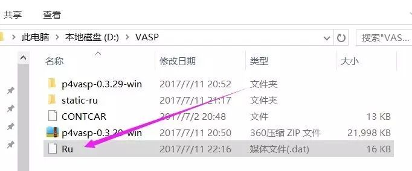

本节主要介绍如何使用p4vasp获取DOS数据。

 

------

## **1** **计算实例：**

计算的体系是一个Ru的单胞，含有2个Ru原子。结构优化完毕后进行以下操作。

1.1 `cp  CONTCAR  POSCAR `

1.2 INCAR的设置（一步计算）：

```
IBRION = -1
NSW = 0
ISMEAR = -5
LORBIT = 11 
```

1.3 KPOINTS 采用: `21 21 21` （gamma centered：Ru为六方堆积结构！！！）

1.4 提交任务等待结束。

1.5 该计算的所有文件可以通过百度网盘下载： http://pan.baidu.com/s/1kVebDWz 

------

##                                                    **2 DOS**可视化：

2.1 打开p4vasp

2.2 点击左侧`open`，导入vasprun.xml文件；

**注意：**前面的2步，Linux系统下面直接输入命令 ：

`p4v &`或者 `p4v vasprun.xm`即可。

2.3 查看DOS：**Electronic –> DOS+bands**

 


效果如下如：

 

 

------

2.4 获取d轨道的DOS: 

这里我们取d band作为例子，大家根据自己的需要选择：

`Electronic` –> `Local DOS+bands control `

 

 

 

 点击后如下图： 

  

注意：

1） 这里我们填的是Ru，表示选择所有的Ru原子，具体到大家自己的计算中，

换成自己感兴趣的原子即可，怎么选择，我们前面已经讲到过了。（通过左侧的show按钮，以及鼠标和空格选择）

2） 这里我们没有考虑自旋，如果你的体系有自旋，可以选择`up`，`down`或者`both`。`up`和`down`的数据导出来的时候通过一个空行分割（后面会讲到）。

3）选择感兴趣的轨道：

如果计算中你设置的`LORBIT=10`，点击 `dxy`的时候，则其他的d轨道也会同时被选中，

如果你设置的`LORBIT=11`，点击`dxy`时，则仅仅选择`dxy`，其他的d轨道不会选中。如下图： 

  

如果看不明白：

a）VASP官网查看 `LORBIT = 10` 和11 的含义；

b）亲自动手操作一下就明白了。

 

选择完毕后，点击 `Add New line`，效果如下：

  

图中增加了一条红色的曲线，为Ru的d轨道的DOS图， 如果你选择了s，点击Add New line，就会增加另外一条曲线。不想要某个曲线了，可以点击remove line，大家自己随意操作，直至熟练为止！！

 

------

##                                                  **3** **后处理：**

3.1  导出数据：

p4vasp导出数据通过中间的一个按钮： （注意，这里不通过左上角的File按钮！），如下图：点击 `Graph` –> `Export` 

 

弹出的窗口中，选择保存的目录和数据的文件名称 

 

注意：

1）choose 选择保存的目录；

2）我们选择的D盘下的VASP目录；

3）填上保存数据的文件名：

a）文件名处 **.dat** 记得写上，要不然后面可能会导不出数据！

b）为了保证导出数据，Export 多点几遍！！！

c）去导出的目录里面查看一下，如有了数据的文件名，说明保存成功，没有的话，继续点Export.

 

图中说明：导出数据成功。

 d）为了避免浪费时间，一定要保存成功后再关闭窗口，否则你还要重复一遍前面的步骤。 

4） 保存成功后，点击OK，关闭窗口。

 

3.2 查看数据：（Notepad++直接打开，无视**.dat**尾缀！）

 

------

**问题1： 为什么在301行后面有一个空行？ （重点是301）**

****

1) 这是因为DOS计算的点VASP默认是301个，该数目由NEDOS这个参数来确定。NEDOS决定了DOS曲线中间隔的点数，如果你想要自己的DOS曲线更加平滑，可以设置一个较大的NEDOS数值，比如：`NEDOS = 3000`

2) 如果你设置了`NEDOS = 500`， 那么会在500行以后出现一个空行。

 

问题2：为什么会有一个空行？？？(**一定要搞明白**！！！)

 

我们看一下前面DOS的图：

  

图中有2个DOS曲线，黑色的为空行前面的部分，红色为后面的部分。

 

同样，如果DOS图中有N个曲线，则导出的数据中会有N-1个空行将它们分开。

N个曲线的横坐标坐标（也就是能量）是完全一样的。知道了这一点，你就知道了自己想要的数据在哪里了！！！

 

此外，如果有**磁性**的话，你要注意了，up和down也是通过空行分开的。

------

3.3 作图：

有了数据之后，就可以随心所欲地作图了。将数据导入excel或者origin作图，也可以使用其他小脚本，程序。这里我们使用Excel简单说下：

  


左侧为空行前面的数据，Ru总的DOS， DOS曲线1 （黑色的那个）

右侧为空行后面的数据，Ru d轨道的DOS， DOS曲线2（红色的那个）

 

作出来的图跟p4vasp的结果一样。图像就不美化了。关键是有了数据，并且知道数据里面空行前后代表的内容。

 

 

------

##                                               **4** **扩展练习：**

 

4.1 下载本节的练习，可以在自己的服务器上提交，也可以直接使用结果；

4.2 通过p4vasp读取vasprun.xml文件，熟练进行本节的所有操作；

4.3 不要偷懒！！！

 

**5** **总结：**

 

本节主要手把手交给大家如何用`p4vasp`这个软件查看`DOS`计算的结果。希望大家掌握这几点：

* 1 会熟练使用改软件进行本节的操作；
* 2 了解导出数据的格式（空行是怎么分割不同曲线的）；
* 3 知道LORBIT = 10 和 11 的区别，以及在可视化操作中的不同；
* **4** **最关键的：要会分析DOS！！！**

 

------

